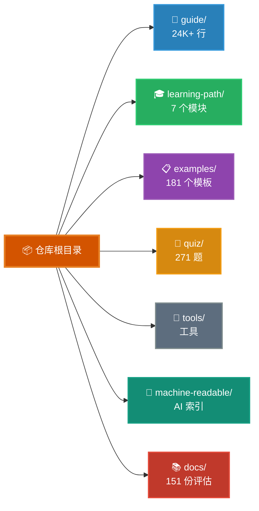

# Claude Code 终极指南（中文版）

> 本仓库是 [FlorianBruniaux/claude-code-ultimate-guide](https://github.com/FlorianBruniaux/claude-code-ultimate-guide) 的中文翻译版。原版作者 [Florian Bruniaux](https://github.com/FlorianBruniaux)。

<!-- Website CTA -->
<p align="center">
  <a href="https://florianbruniaux.github.io/claude-code-ultimate-guide-landing/"></a>
</p>

<!-- Stats -->
<p align="center">
  <a href="https://github.com/FlorianBruniaux/claude-code-ultimate-guide/stargazers"></a>
  <a href="./CHANGELOG.md"></a>
  <a href="./quiz/"></a>
  <a href="./examples/"></a>
</p>

<!-- Features -->
<p align="center">
  <a href="./guide/security/security-hardening.md"></a>
  <a href="./mcp-server/"></a>
</p>

<!-- Downloads -->
<p align="center">
  <a href="https://github.com/FlorianBruniaux/claude-code-ultimate-guide/releases/latest/download/guide-export.pdf"></a>
  <a href="https://github.com/FlorianBruniaux/claude-code-ultimate-guide/releases/latest/download/guide-export.epub"></a>
</p>

<!-- Meta -->
<p align="center">
  <a href="https://github.com/hesreallyhim/awesome-claude-code"></a>
  <a href="https://creativecommons.org/licenses/by-sa/4.0/"></a>
  <a href="https://skills.palebluedot.live/owner/FlorianBruniaux"></a>
  <a href="https://zread.ai/FlorianBruniaux/claude-code-ultimate-guide"></a>
</p>

> **6 个月天天用 Claude Code 干活**攒出来的经验。不教你怎么配，教你怎么想——从核心概念到生产安全，学会自己设计工作流，而不是到处复制粘贴。

> **觉得有用？[点个 Star ⭐](https://github.com/FlorianBruniaux/claude-code-ultimate-guide/stargazers)**——帮更多人找到它。

---

## StarMapper

<a href="https://starmapper.bruniaux.com/FlorianBruniaux/claude-code-ultimate-guide">
  <picture>
    <source media="(prefers-color-scheme: dark)" srcset="https://starmapper.bruniaux.com/api/map-image/FlorianBruniaux/claude-code-ultimate-guide?theme=dark" />
    <source media="(prefers-color-scheme: light)" srcset="https://starmapper.bruniaux.com/api/map-image/FlorianBruniaux/claude-code-ultimate-guide?theme=light" />
    
  </picture>
</a>

---

## 按身份选路

| 你是谁 | 走哪条路 |
|---|---|
| 🏗️ **技术负责人 / 工程经理** | [在团队里推广 Claude Code →](docs/for-tech-leads.md) |
| 📊 **CTO / 决策者** | [ROI、安全评估、团队落地 →](docs/for-cto.md) |
| 💼 **CIO / CEO** | [预算、风险、该问技术团队什么（3 分钟看完）→](docs/for-cio-ceo.md) |
| 🎨 **产品经理 / 设计师** | [Vibe Coding、怎么跟 AI 辅助开发团队配合 →](docs/for-product-managers.md) |
| ✍️ **写作者 / 运营 / 管理者** | [Claude Cowork 指南（另开仓库）→](https://github.com/FlorianBruniaux/claude-cowork-guide) |
| 👨‍💻 **开发者（不分水平）** | 来对地方了，往下看 ↓ |
| 🧭 **转行 / 新 AI 岗位** | [AI 相关岗位与职业路线 →](guide/roles/ai-roles.md) |

---

## 🎯 你能学到什么

**这本指南让你换种思路做 AI 辅助开发：**
- ✅ **搞清取舍** — 什么时候用智能体（Agent）、什么时候用技能（Skill）、什么时候用命令（Command），不只是告诉你"怎么配"
- ✅ **建立心智模型** — Claude Code 内部怎么运转（架构、上下文流转、工具调度）
- ✅ **看图理解** — 48 张 Mermaid 图覆盖模型选择、主循环、记忆层级、多智能体模式、安全威胁、AI 使用熟练度
- ✅ **掌握方法论** — TDD、SDD、BDD 跟 AI 配合（不只是套模板）
- ✅ **安全思维** — 给 AI 系统做威胁建模（市面上唯一带 28 个 CVE + 655 个恶意技能数据库的指南）
- ✅ **检验水平** — 271 道测验题帮你验证理解程度（别处找不到）

**最终效果**：从复制粘贴配置，到有信心自己设计智能体工作流。

---

## 📊 本指南 vs Everything-CC 怎么选

两套指南各有所长，按你的优先级来选。

| 你在乎什么 | 本指南 | everything-claude-code |
|---|---|---|
| **理解模式为什么这么设计** | 深入解释 + 架构剖析 | 以配置为主 |
| **快速搭项目** | 有但优先级不高 | 经过生产捶打的配置 |
| **权衡分析（智能体 vs 技能）** | 决策框架 + 方案对比 | 只列模式，不谈取舍 |
| **安全加固** | 唯一带威胁数据库（28 CVE） | 只覆盖基础模式 |
| **检验理解深度** | 271 道测验题 | 没有 |
| **方法论（TDD/SDD/BDD）** | 完整工作流程指南 | 没涉及 |
| **拿来就能用的模板** | 181 个 | 200+ 个 |

### 生态位

```
                     教育深度
                           ▲
                           │
                           │  ★ 本指南
                           │  安全 + 方法论 + 24K+ 行
                           │
                           │  [Everything-You-Need-to-Know]
                           │  SDLC/BMAD 入门
  ─────────────────────────┼─────────────────────────► 开箱即用
  [awesome-claude-code]    │            [everything-claude-code]
  （发现、精选）            │            （插件，一键安装）
                           │
                           │  [claude-code-studio]
                           │  上下文管理
                           │
                       专业领域
```

**5 个别人覆盖不了的点：**
1. **安全第一** — 追踪 28 个 CVE + 655 个恶意技能（没人做这么深）
2. **方法论工作流** — TDD/SDD/BDD 逐项对比 + 分步教程
3. **参考资料量** — 16 篇专项指南，总共 24K+ 行（参考材料是 everything-cc 的 24 倍）
4. **循序渐进** — 271 道测验 + 7 个模块的结构化学习路径（入门到进阶）
5. **互动评估** — `/self-assessment` 技能可以给你推荐个性化学习路线

**推荐用法：**
1. 在本指南学概念（心智模型、取舍、安全）
2. 在那边用经过验证的配置（快速搭项目）
3. 遇到问题或要设计自定义工作流时，再回这里深入

**两个是互补关系，不是竞争关系。** 哪个顺手用哪个。

---

## ⚡ 快速开始

**第一次用 Claude Code？** → [**7 模块学习路径**](./guide/learning-path/README.md) — 8-11 小时，从入门到进阶

**最快上手**：[速查表](./guide/cheatsheet.md) — 1 页纸，打印出来放桌上

**互动式入门**（零配置）：
```bash
claude "Fetch and follow the onboarding instructions from: https://raw.githubusercontent.com/FlorianBruniaux/claude-code-ultimate-guide/main/tools/onboarding-prompt.md"
```

**直接翻阅**：[完整指南](./guide/ultimate-guide.md) | [学习路径](./guide/learning-path/) | [图解](./guide/diagrams/) | [示例](./examples/) | [测验](./quiz/)

---

## 🔌 MCP 服务器 — 在任何 Claude Code 会话里查本指南

不用克隆。加到 `~/.claude.json` 后，在任何会话里直接提问：

```json
{
  "mcpServers": {
    "claude-code-guide": {
      "type": "stdio",
      "command": "npx",
      "args": ["-y", "claude-code-ultimate-guide-mcp"]
    }
  }
}
```

17 个工具：`search_guide`、`read_section`、`get_cheatsheet`、`get_digest`、`get_example`、`list_examples`、`search_examples`、`get_release`、`get_changelog`、`compare_versions`、`list_topics`、`get_threat`、`list_threats`，还有 `init_official_docs`、`refresh_official_docs`、`diff_official_docs`、`search_official_docs`（v1.1.0 —— 官方 Anthropic 文档追踪）—— 外加 13 个 slash 命令 `/ccguide:*` 和一个 Haiku 智能体。

**一句搞定入门**（配好 MCP 后）：
```bash
claude "Use the claude-code-guide MCP server. Activate the claude-code-expert prompt, then run a personalized onboarding: ask me 3 questions about my goal, experience level, and preferred tone — then build a custom learning path using search_guide and read_section to navigate the guide with live source links."
```

→ [MCP 服务器说明](./mcp-server/README.md)

---

## 📁 仓库结构



<details>
<summary><strong>详细结构（文字版）</strong></summary>

```
📦 claude-code-ultimate-guide/
│
├─ 📖 guide/              核心文档（24K+ 行）
│  ├─ learning-path/      7 模块学习路径（入门 → 进阶）
│  ├─ ultimate-guide.md   完整参考，10 个章节
│  ├─ cheatsheet.md       1 页可打印速查表
│  ├─ architecture.md     Claude Code 内部工作原理
│  ├─ methodologies.md    TDD、SDD、BDD 工作流
│  ├─ diagrams/           48 张 Mermaid 图（10 个主题文件）
│  ├─ third-party-tools.md  社区工具（RTK、ccusage、Entire CLI）
│  ├─ mcp-servers-ecosystem.md  官方和社区 MCP 服务器
│  └─ workflows/          分步操作指南
│
├─ 📋 examples/           181 个生产级模板
│  ├─ CATALOG.md          按复杂度、耗时、领域自动生成的索引
│  ├─ agents/             23 个自定义 AI 角色
│  ├─ commands/           重定向占位（CC 2.1.3 起已迁移到 skills/）
│  ├─ hooks/              37 个钩子（bash + PowerShell）
│  ├─ skills/             64 个技能（9 个已发布到 SkillHub）
│  └─ scripts/            实用脚本（审计、搜索）
│
├─ 🧠 quiz/               271 道题
│  ├─ 9 个分类            安装、智能体、MCP、信任、高级模式……
│  ├─ 4 种角色画像        初级、高级、深度用户、产品经理
│  └─ 即时反馈            附带文档链接 + 得分追踪
│
├─ 🔧 tools/              交互工具
│  ├─ onboarding-prompt   个性化引导
│  └─ audit-prompt        安装审计 + 建议
│
├─ 🤖 machine-readable/   AI 优化索引
│  ├─ reference.yaml      结构化索引（~2K tokens）—— 落地页 CMD+K 搜索的数据源
│  ├─ claude-code-releases.yaml  结构化发布日志
│  └─ llms.txt            标准 LLM 上下文文件
│
└─ 📚 docs/               151 份资源评估
   └─ resource-evaluations/  5 分制评分 + 来源标注
```

</details>

---

## 🎯 本指南有什么不一样

### 🎓 重理解，轻配置

**效果**：能自己设计工作流，而不是闭着眼复制粘贴。

**我们讲的是 Claude Code 怎么工作的、模式为什么有效**：
- [架构](./guide/core/architecture.md) — 内部机制（上下文流转、工具编排、内存管理）
- [如何取舍](./guide/ultimate-guide.md#when-to-use-what) — 智能体 vs 技能 vs 命令的决策框架
- [配置决策指南](./guide/ultimate-guide.md#27-configuration-decision-guide) — 7 个配置层各管什么，一张图说清楚
- [常见坑](./guide/ultimate-guide.md#common-mistakes) — 容易翻车的地方 + 怎么避开

**对你有什么好处**：能自己排查问题、针对自己的场景做优化、知道什么时候可以不按套路来。

---

### 🖼️ 图解系列（48 张 Mermaid 图）

**效果**：看一眼图，复杂的逻辑立刻清晰。

**10 个主题文件，48 张交互图**——GitHub 原生渲染，每张还配了文字版：
- [基础](./guide/diagrams/01-foundations.md) — 4 层上下文模型、9 步流水线、权限模式
- [架构](./guide/diagrams/04-architecture-internals.md) — 主循环、工具分类、系统提示词组装
- [多智能体](./guide/diagrams/07-multi-agent-patterns.md) — 3 种拓扑、worktree、双实例、水平扩展
- [安全](./guide/diagrams/08-security-and-production.md) — 3 层防御、MCP rug pull 攻击链路、验证悖论
- [成本与模型](./guide/diagrams/09-cost-and-optimization.md) — 模型选择树、Token 缩减流水线

[看全部 48 张 →](./guide/diagrams/)

**对你有什么好处**：不用硬啃 24K+ 行文字，先看图掌握主循环；多智能体拓扑一眼看懂；安全威胁模型可以直接发给团队。

---

### 🛡️ 安全威胁情报（独家数据库）

**效果**：真正保护你的生产系统不被 AI 特有的攻击方式搞垮。

**唯一做了系统化威胁追踪的指南**：
- **28 个已映射 CVE 的漏洞** — 提示注入、数据窃取、代码注入
- **655 个恶意技能已入库** — Unicode 注入、隐藏指令、自动执行
- **生产环境加固工作流** — MCP 审查、注入防御、审计自动化

[威胁数据库 →](./examples/skills/update-threat-db/threat-db.yaml) | [安全指南 →](./guide/security/security-hardening.md)

**对你有什么好处**：信任 MCP 服务器之前先审查一遍、能从配置里发现攻击模式、安全审计不发怵。

---

### 📝 271 道知识测验（独家）

**效果**：确认自己真懂了，顺便找出薄弱环节。

**市面上唯一成体系的能力评估**——覆盖 9 个类别：
- 安装配置、智能体与子智能体、MCP 服务器、信任与验证、高级模式

**特点**：4 种角色画像（初级/高级/深度用户/产品经理）、选完立刻给反馈附带文档链接、自动标出弱项

[在线做题 →](https://florianbruniaux.github.io/claude-code-ultimate-guide-landing/quiz/) | [本地跑 →](./quiz/)

**对你有什么好处**：知道自己哪里还不行、追踪学习进度、跟团队讨论怎么推广时心里有底。

---

### 🤖 智能体团队（v2.1.32+ 实验功能）

**效果**：大项目可以并行干（Fountain 提速 50%，CRED 快了 2 倍）。

**市面上最全的 Anthropic 多智能体协调指南**：
- 真实公司的生产数据（自主写 C 编译器、省了 50 万小时）
- 5 个验证过的工作流（多层审查、并行调试、大规模重构）
- 决策框架：Teams vs Multi-Instance vs Dual-Instance vs Beads

[智能体团队工作流 →](./guide/workflows/agent-teams.md) | [第 9.20 节 →](./guide/ultimate-guide.md#920-agent-teams-multi-agent-coordination)

**对你有什么好处**：把大任务拆成能并行的小块、协调多文件重构、审阅自己 AI 写的代码。

---

### 🔬 方法论（结构化开发工作流）

**效果**：跟 AI 配合写代码，质量依然在线。

完整指南，有思路也有实例：
- [TDD](./guide/core/methodologies.md#1-tdd-test-driven-development-with-claude) — 测试驱动开发（红-绿-重构 + AI）
- [SDD](./guide/core/methodologies.md#2-sdd-specification-driven-development) — 规范驱动开发（先设计再写代码）
- [BDD](./guide/core/methodologies.md#3-bdd-behavior-driven-development) — 行为驱动开发（用户故事 → 测试）
- [GSD](./guide/core/methodologies.md#gsd-get-shit-done) — 务实干活

**对你有什么好处**：根据团队文化选合适的工作流、把 AI 嵌入现有流程、不会因为过度依赖 AI 欠下技术债。

---

### 📚 181 个带注释的模板

**效果**：学模式，不是学配置。

每个模板都配了解释：
- 智能体（23）、技能（74）、钩子（37）
- 注释不光说"干什么"，更说**为什么这样设计**
- 难度递进（简单 → 复杂）

[浏览目录 →](./examples/)

**对你有什么好处**：理解模式背后的思路、把模板改成自己需要的、学会创造自己的模式。

---

### 🔍 151 份资源评估

**效果**：我们推荐的东西都有据可查，可以放心用。

系统化评估外部资源（5 分制）：
- 文章、视频、工具、框架
- 不吹不黑，来源标注清楚
- 集成建议附带缺点

[看评估 →](./docs/resource-evaluations/)

**对你有什么好处**：不用自己一个个试、用之前知道工具的局限、做决策更靠谱。

---

## 🎯 学习路径

<details>
<summary><strong>初级开发者</strong> — 基础路线（7 步）</summary>

1. [快速上手](./guide/ultimate-guide.md#1-quick-start-day-1) — 安装 + 跑通第一个工作流
2. [必备命令](./guide/ultimate-guide.md#13-essential-commands) — 7 个核心命令
3. [上下文管理](./guide/ultimate-guide.md#22-context-management) — 最关键的概念
4. [记忆文件](./guide/ultimate-guide.md#31-memory-files-claudemd) — 写你的第一个 CLAUDE.md
5. [跟 AI 一起学](./guide/roles/learning-with-ai.md) — 用 AI 但不依赖 AI ⭐
6. [TDD 工作流](./guide/workflows/tdd-with-claude.md) — 测试先行
7. [速查表](./guide/cheatsheet.md) — 打印出来贴墙上

</details>

<details>
<summary><strong>高级开发者</strong> — 中级路线（6 步）</summary>

1. [核心概念](./guide/ultimate-guide.md#2-core-concepts) — 建立心智模型
2. [计划模式](./guide/ultimate-guide.md#23-plan-mode) — 放心探索，不怕搞乱
3. [方法论](./guide/core/methodologies.md) — TDD/SDD/BDD 参考
4. [智能体](./guide/ultimate-guide.md#4-agents) — 定制你自己的 AI 角色
5. [钩子](./guide/ultimate-guide.md#7-hooks) — 事件驱动自动化
6. [CI/CD 集成](./guide/ultimate-guide.md#93-cicd-integration) — 接入流水线

</details>

<details>
<summary><strong>深度用户</strong> — 全面路线（8 步）</summary>

1. [完整指南](./guide/ultimate-guide.md) — 从头撸到尾
2. [架构](./guide/core/architecture.md) — Claude Code 到底怎么跑起来的
3. [安全加固](./guide/security/security-hardening.md) — MCP 审查、注入防御
4. [MCP 服务器](./guide/ultimate-guide.md#8-mcp-servers) — 扩展能力
5. [三一模式](./guide/ultimate-guide.md#91-the-trinity) — 高阶工作流
6. [可观测性](./guide/ops/observability.md) — 成本监控和会话追踪
7. [智能体团队](./guide/workflows/agent-teams.md) — 多智能体协同（Opus 4.7+ 实验功能）
8. [示例](./examples/) — 生产级模板

</details>

<details>
<summary><strong>产品经理 / DevOps / 设计师</strong></summary>

**产品经理**（5 步）：
1. [有什么](#-whats-inside) — 概览
2. [黄金法则](#-golden-rules) — 核心原则
3. [数据隐私](./guide/security/data-privacy.md) — 保留策略与合规
4. [推广方法](./guide/roles/adoption-approaches.md) — 怎么让团队用起来
5. [PM 常见问题](./guide/ultimate-guide.md#can-product-managers-use-claude-code) — 写代码的 PM vs 不写代码的 PM

**注意**：不写代码的 PM 建议看 [Claude Cowork 指南](https://github.com/FlorianBruniaux/claude-cowork-guide)。

**DevOps / SRE**（5 步）：
1. [DevOps & SRE 指南](./guide/ops/devops-sre.md) — FIRE 框架
2. [K8s 排障](./guide/ops/devops-sre.md#kubernetes-troubleshooting) — 按症状出提示词
3. [故障响应](./guide/ops/devops-sre.md#pattern-incident-response) — 工作流程
4. [IaC 模式](./guide/ops/devops-sre.md#pattern-infrastructure-as-code) — Terraform、Ansible
5. [安全护栏](./guide/ops/devops-sre.md#guardrails--adoption) — 安全边界

**产品设计师**（5 步）：
1. [用图片](./guide/ultimate-guide.md#24-working-with-images) — 图片分析
2. [画线框图](./guide/ultimate-guide.md#wireframing-tools) — ASCII/Excalidraw
3. [Figma MCP](./guide/ultimate-guide.md#figma-mcp) — 读取设计文件
4. [设计稿转代码](./guide/workflows/design-to-code.md) — Figma → Claude
5. [速查表](./guide/cheatsheet.md) — 打印出来

</details>

### 时间线

- **第 1 周**：打基础（安装、CLAUDE.md、第一个智能体）
- **第 2 周**：核心功能（技能、钩子、建立信任感）
- **第 3 周**：进阶（MCP 服务器、方法论）
- **第 2 个月起**：生产级掌握（CI/CD、可观测性）

---

## 🔧 限流 & 省钱

**cc-copilot-bridge** 把 Claude Code 接到 GitHub Copilot Pro+，每月固定 $10 随便用，不用按 token 付费。

```bash
# 安装
git clone https://github.com/FlorianBruniaux/cc-copilot-bridge.git && cd cc-copilot-bridge && ./install.sh

# 使用
ccc   # Copilot 模式（固定 $10/月）
ccd   # 原生 Anthropic 模式（按 token）
cco   # 离线模式（Ollama，纯本地）
```

**优势**：多家供应商随便切、绕过限流、重度用能省 99%+。

→ **[cc-copilot-bridge](https://github.com/FlorianBruniaux/cc-copilot-bridge)**

---

## 🔑 黄金法则

### 1. 先用再信

Claude Code 写出的逻辑错误比人手写的多 1.75 倍（[ACM 2025](https://dl.acm.org/doi/10.1145/3716848)）。每个输出都要验证。用 `/insights` 命令、写测试来确认。

**怎么落地**：个人开发者（核验逻辑 + 边界条件）。团队（系统化的同行评审）。生产环境（强制关卡测试）。

---

### 2. 来路不明的 MCP 绝不批准

Claude Code 生态里已经发现了 28 个 CVE。供应链上有 655 个恶意技能。MCP 服务器能读写你的代码库。

**怎么落地**：系统化审计（5 分钟清单）。社区整理好的 MCP 安全名单。审查流程在指南里写得清清楚楚。

---

### 3. 上下文压力会改变表现

上下文到 70% 时 Claude 就开始丢精度了。85% 幻觉变多。90% 以上回答开始飘。

**怎么管**：0-50%（放心干）。50-70%（盯着点）。70-90%（`/compact`）。90%+（必须 `/clear`）。

---

### 4. 从小做起，聪明扩张

先搭个简单的 CLAUDE.md + 几个命令。在生产环境跑 2 周。确实有需要再加智能体和技能。

**分阶段**：第一阶段（基础）。第二阶段（命令 + 按需加钩子）。第三阶段（多上下文就加智能体）。第四阶段（真有必要再加 MCP 服务器）。

---

### 5. AI 时代方法论更重要

用 Claude Code 时 TDD/SDD/BDD 不是可选项。AI 加速烂代码跟加速好代码一样快。

**怎么选**：TDD（关键逻辑）。SDD（架构先行）。BDD（PM 和开发对齐）。GSD（一次性原型）。

---

### 速查

| # | 规则 | 关键数据 | 行动 |
|---|------|-------------|--------|
| 1 | 先信先测 | 逻辑错误多 1.75 倍 | 全测、同级评审 |
| 2 | 审查 MCP | 28 CVE、655 个恶意技能 | 5 分钟审计清单 |
| 3 | 管好上下文 | 70% = 精度下降 | 70% 时 `/compact`，90% 时 `/clear` |
| 4 | 从简起步 | 先试 2 周 | 阶段一到阶段四逐渐加码 |
| 5 | 方法论用起来 | AI 好坏都放大 | 按场景选 TDD/SDD/BDD |

> 上下文管理是命门。详见[速查表](./guide/cheatsheet.md#context-management-critical)里的阈值和操作。

---

## 🤖 给 AI 助手的资源

| 资源 | 用途 | Token 数 |
|----------|---------|--------|
| **[llms.txt](./machine-readable/llms.txt)** | 标准上下文文件 | ~1K |
| **[reference.yaml](./machine-readable/reference.yaml)** | 带行号的结构化索引 | ~2K |

**快速加载**：`curl -sL https://raw.githubusercontent.com/FlorianBruniaux/claude-code-ultimate-guide/main/machine-readable/reference.yaml`

### reference.yaml — 结构和落地页搜索

`reference.yaml` 分这几个顶层部分：

| 部分 | 内容 |
|---------|---------|
| `lines` | `ultimate-guide.md` 里关键章节的行号 |
| `deep_dive` | 所有指南、示例、钩子、智能体、命令的"关键词 → 文件路径"映射 |
| `decide` | 决策树（什么时候用什么） |
| `stats` | 计数器（模板数、题数、CVE 数……） |

**`deep_dive` 段驱动了[落地页](https://cc.bruniaux.com)的 CMD+K 搜索。** 构建脚本（`scripts/build-guide-index.mjs`）解析它生成 160 个搜索条目。

#### 搜索索引怎么工作的

落地页的 CMD+K 搜索是**显式索引**——不是全文搜索。只有 `deep_dive` 里列出的条目才会被索引。关键词是从键名和文件路径里机械提取的，不是从文件内容里提取的。

**后果**：加了新的指南章节，必须显式在 `deep_dive` 加一条，然后在落地仓库里跑 `pnpm build:search`。

#### 维护 reference.yaml

**向 `deep_dive` 加新条目**：
```yaml
deep_dive:
  # 已有条目……
  my_new_section: "guide/my-new-file.md"          # 本地指南文件
  my_hook_example: "examples/hooks/bash/foo.sh"   # 示例文件
  my_section_ref: "guide/ultimate-guide.md:1234"  # 带行号锚点
```

**关键：别重复键。** `deep_dive` 里一旦出现重复键，YAML 解析就挂了，落地页搜索索引变空（0 条）。构建时会有警告但不报硬错：

```
[build-guide-index] ERROR: Failed to parse YAML: duplicated mapping key
[build-guide-index] Generating empty guide-search-entries.ts
```

名字取不一样——比如同一个概念既要行号引用又要文件路径，行号那个加个 `_line` 后缀：
```yaml
security_gate_hook_line: 6907                              # 行号引用
security_gate_hook: "examples/hooks/bash/security-gate.sh" # 文件路径引用
```

---

## 📄 白皮书（法文 + 英文）

11 篇深入白皮书，PDF + EPUB 格式，法文和英文。共 472 页。

> **即将发布**——目前内测中。

| # | 法文 | 英文 | 页数 |
|---|----|----|-------|
| **00** | *De Zéro à Productif* | *From Zero to Productive* | 20 |
| **01** | *Prompts qui Marchent* | *Prompts That Work* | 40 |
| **02** | *Personnaliser Claude* | *Customizing Claude* | 47 |
| **03** | *Sécurité en Production* | *Security in Production* | 48 |
| **04** | *L'Architecture Démystifiée* | *Architecture Demystified* | 40 |
| **05** | *Déployer en Équipe* | *Team Deployment* | 43 |
| **06** | *Privacy & Compliance* | *Privacy & Compliance* | 29 |
| **07** | *Guide de Référence* | *Reference Guide* | 87 |
| **08** | *Agent Teams* | *Agent Teams* | 42 |
| **09** | *Apprendre avec l'IA* | *Learning with AI* — UVAL 协议、理解力债务 | 49 |
| **10** | *Convaincre son Employeur* | *Making the Case for AI* — 给 CEO/CTO/CFO 看的 ROI 材料 | 27 |

## 🗂️ 速查卡片（法文，英文制作中）

57 张 A4 单页速查卡——可打印，一张卡一个概念。目前是法文版，英文版在做了。

> **在线浏览**：[cc.bruniaux.com/cheatsheets/](https://cc.bruniaux.com/cheatsheets/)

- **技术类（22 张）** — 命令、权限、配置、MCP、模型、上下文窗口
- **方法论类（22 张）** — 日常工作流、智能体、钩子、CI/CD、多智能体、调试
- **设计类（13 张）** — 心智模型、提示词、安全设计、成本模式

---

## 🌍 生态

### Claude Cowork（非开发者）

**Claude Cowork** 是非技术用户（知识工作者、助理、管理者）的配套指南。

跟 Claude Code 一样的智能体能力，但走可视化界面，不用写代码。

→ **[Claude Cowork 指南](https://github.com/FlorianBruniaux/claude-cowork-guide)** — 文件组织、文档生成、工作流自动化

**状态**：研究预览（Pro $20/月 or Max $100-200/月，仅 macOS，**不兼容 VPN**）

### Claude Code 插件（市场）

本指南 181 个模板打包成可直接安装的 Claude Code 插件——钩子自动连好，不用手动配：

```bash
# 添加市场
claude plugin marketplace add FlorianBruniaux/claude-code-plugins

# 装你需要的
claude plugin install security-suite       # OWASP 审计、网络防御流水线、13 个钩子
claude plugin install devops-pipeline      # CI/CD、git worktrees、GitHub Actions
claude plugin install release-automation   # 变更日志 + 发布说明 + 社交内容
claude plugin install code-quality         # SOLID 重构、TDD、GoF 模式、6 个智能体
claude plugin install pr-workflow          # 规划关卡、PR/问题分类、交接
claude plugin install session-tools        # ccboard 监控、语音打磨、11 个钩子
claude plugin install ai-methodology       # 脚手架、6 阶段对话流水线、上下文工程
claude plugin install session-summary      # 会话分析仪表盘（15 个板块）
```

> **[FlorianBruniaux/claude-code-plugins](https://github.com/FlorianBruniaux/claude-code-plugins)** — 8 个插件、181 个模板、一个市场

### 互补资源

| 项目 | 定位 | 最适合谁 |
|---------|-------|----------|
| [everything-claude-code](https://github.com/affaan-m/everything-claude-code) | 生产配置（45k+ star） | 快速搭项目、用成熟模式 |
| [claude-code-templates](https://github.com/davila7/claude-code-templates) | 分发（200+ 模板） | 一键 CLI 安装（17k star） |
| [anthropics/skills](https://github.com/anthropics/skills) | Anthropic 官方技能（60K+ star） | 文档、设计、开发模板 |
| [anthropics/claude-plugins-official](https://skills.sh/anthropics/claude-plugins-official) | 插件开发工具（3.1K 安装量） | CLAUDE.md 审计、自动化发现 |
| [skills.sh](https://skills.sh/) | 技能市场 | 一键安装（Vercel Labs） |
| [awesome-claude-code](https://github.com/hesreallyhim/awesome-claude-code) | 精选列表 | 找资源 |
| [youtube-skills](https://github.com/ZeroPointRepo/youtube-skills) | 12 个 YouTube 技能（搜索、字幕、章节） | Claude Code、Cursor、Windsurf、Cline |
| [awesome-claude-skills](https://github.com/BehiSecc/awesome-claude-skills) | 技能分类 | 62 个技能跨 12 个类别 |
| [awesome-claude-md](https://github.com/josix/awesome-claude-md) | CLAUDE.md 示例 | 带评分的注释配置 |
| [ctop](https://github.com/aakashadesara/ctop) | 会话监控（AI 智能体的 htop） | 实时 CPU、内存、Token、费用 |
| [AI Coding Agents Matrix](https://coding-agents-matrix.dev) | 技术对比 | 比较 23+ 个替代方案 |

**社区**：🇫🇷 [Dev With AI](https://www.devw.ai/) — Slack 上 1500+ 开发者，巴黎/波尔多/里昂有 meetup

→ **[AI 生态指南](./guide/ecosystem/ai-ecosystem.md)** — 跟其他 AI 工具的完整集成方案

---

## 🛡️ 安全

**覆盖最全的 MCP 安全文档**——唯一带威胁情报数据库和生产加固工作流的指南。

### 官方安全工具

| 工具 | 用途 | 维护方 |
|------|---------|---------------|
| [claude-code-security-review](https://github.com/anthropics/claude-code-security-review) | 自动安全扫描的 GitHub Action | Anthropic（官方） |
| 本指南的威胁数据库 | 情报层（28 CVE、655 个恶意技能） | 社区 |

**工作流**：GitHub Action 做自动化扫描 → 查威胁数据库获取情报。

### 威胁数据库

**28 个已映射 CVE 的漏洞**和 **655 个恶意技能**，全在 [`examples/skills/update-threat-db/threat-db.yaml`](./examples/skills/update-threat-db/threat-db.yaml) 里：

| 威胁类型 | 数量 | 举例 |
|----------------|-------|----------|
| **代码/命令注入** | 5 CVE | CLI 绕过（CVE-2025-66032）、child_process exec |
| **路径遍历与越权** | 4 CVE | 符号链接逃逸（CVE-2025-53109）、前缀绕过 |
| **RCE 与提示劫持** | 4 CVE | MCP Inspector RCE（CVE-2025-49596）、会话劫持 |
| **SSRF 与 DNS 重绑定** | 4 CVE | WebFetch SSRF（CVE-2026-24052）、DNS 重绑定 |
| **数据泄露** | 1 CVE | 跨客户端响应泄露（CVE-2026-25536） |
| **恶意技能** | 655 种模式 | Unicode 注入、隐藏指令、自动执行 |

**分类**：10 个攻击面 × 11 种威胁类型 × 8 个影响级别

### 加固资源

| 资源 | 用途 | 时间 |
|----------|---------|------|
| **[安全加固指南](./guide/security/security-hardening.md)** | MCP 审查、注入防御、审计流程 | 25 分钟 |
| **[数据隐私指南](./guide/security/data-privacy.md)** | 数据保留策略（5 年 → 30 天 → 0）、GDPR | 10 分钟 |
| **[沙箱隔离](./guide/security/sandbox-isolation.md)** | 不信任的 MCP 服务器用 Docker 沙箱隔离 | 10 分钟 |
| **[生产安全](./guide/security/production-safety.md)** | 基础设施锁定、端口稳定、数据库保护 | 20 分钟 |

### 安全命令

```bash
/security-check      # 快速扫一下配置有没有已知威胁（~30秒）
/security-audit      # 完整 6 阶段审计，评分 /100（2-5 分钟）
/update-threat-db    # 查最新威胁情报并更新数据库
/audit-agents-skills # 带安全审查的质量审计
```

### 安全钩子

**37 个生产级钩子**（bash + PowerShell）在 [`examples/hooks/`](./examples/hooks/) 里：

| 钩子 | 作用 |
|------|---------|
| [dangerous-actions-blocker](./examples/hooks/bash/dangerous-actions-blocker.sh) | 阻止 `rm -rf`、force push、生产操作 |
| [prompt-injection-detector](./examples/hooks/bash/prompt-injection-detector.sh) | 检测 CLAUDE.md/提示词里的注入模式 |
| [unicode-injection-scanner](./examples/hooks/bash/unicode-injection-scanner.sh) | 检测隐藏 Unicode（零宽字符、RTL 覆盖） |
| [output-secrets-scanner](./examples/hooks/bash/output-secrets-scanner.sh) | 防止 API 密钥/Token 出现在 Claude 回答里 |

**[看全部安全钩子 →](./examples/hooks/)**

### MCP 审查流程

**信任一个 MCP 服务器之前，按这几步系统化评估：**

1. **来源**：GitHub 验证账号、100+ star、活跃维护
2. **代码审查**：权限最小化、没混淆、开源
3. **权限**：文件系统只开放白名单、网络有限制
4. **测试**：先在 Docker 沙箱里隔离跑，观察工具调用
5. **监控**：会话日志、错误追踪、定期重新审计

**[完整的 MCP 安全审查流程 →](./guide/security/security-hardening.md#vetting-mcp-servers)**

---

## 📖 关于

这本指南是作者 **连续 6 个月天天用 Claude Code 干活**后攒出来的。目标不是面面俱到（工具更新太快了），而是分享生产环境里真正管用的东西。

**你能看到：**
- 经过生产验证的模式（不是理论）
- 讲清楚取舍（不是只告诉你"怎么配"）
- 安全优先（28 个 CVE 追踪）
- 坦诚面对局限性（Claude Code 不是万能的）

**你不会看到：**
- 绝对答案（工具还太新）
- 万能配置（每个项目都不一样）
- 营销吹嘘（一句废话都没有）

批判着看。多试。有你觉得好用的回来分享。

**欢迎反馈：** [GitHub Issues](https://github.com/FlorianBruniaux/claude-code-ultimate-guide/issues)

### 关于作者

**Florian Bruniaux** — [Méthode Aristote](https://methode-aristote.fr)（EdTech + AI）创始工程师。干了 12 年技术（Dev → Lead → EM → VP Eng → CTO）。目前专注：Rust CLI 工具、MCP 服务器、AI 开发者工具。

| 项目 | 介绍 | 链接 |
|---------|-------------|-------|
| **RTK** | CLI 代理——省 60-90% LLM Token | [GitHub](https://github.com/rtk-ai/rtk) · [网站](https://www.rtk-ai.app/) |
| **ccboard** | Claude Code 实时 TUI/Web 仪表盘 | [GitHub](https://github.com/FlorianBruniaux/ccboard) · [演示](https://ccboard.bruniaux.com/) |
| **Claude Cowork 指南** | 不会写代码的人也能用的 26 个工作流 | [GitHub](https://github.com/FlorianBruniaux/claude-cowork-guide) · [网站](https://cowork.bruniaux.com/) |
| **cc-copilot-bridge** | 连接 Claude Code 和 GitHub Copilot | [GitHub](https://github.com/FlorianBruniaux/cc-copilot-bridge) · [网站](https://ccbridge.bruniaux.com/) |
| **Agent Academy** | AI 智能体学习用的 MCP 服务器 | [GitHub](https://github.com/FlorianBruniaux/agent-academy) |
| **techmapper** | 技术栈映射可视化 | [GitHub](https://github.com/FlorianBruniaux/techmapper) |

[GitHub](https://github.com/FlorianBruniaux) · [LinkedIn](https://www.linkedin.com/in/florian-bruniaux-43408b83/) · [作品集](https://florian.bruniaux.com/)

---

## 📚 里面都有什么

### 核心文档

| 文件 | 用途 | 阅读时间 |
|------|---------|------|
| **[完整指南](./guide/ultimate-guide.md)** | 完整参考（24K+ 行），10 个章节 | 30-40 小时（全文）• 多数人挑章节看 |
| **[速查表](./guide/cheatsheet.md)** | 1 页可打印速查 | 5 分钟 |
| **[可视化参考](./guide/core/visual-reference.md)** | 20 张 ASCII 图解关键概念 | 5 分钟 |
| **[架构](./guide/core/architecture.md)** | Claude Code 内部原理 | 25 分钟 |
| **[方法论](./guide/core/methodologies.md)** | TDD、SDD、BDD 参考 | 20 分钟 |
| **[工作流](./guide/workflows/)** | 实战指南（TDD、计划驱动、任务管理） | 30 分钟 |
| **[数据隐私](./guide/security/data-privacy.md)** | 保留策略与合规 | 10 分钟 |
| **[安全加固](./guide/security/security-hardening.md)** | MCP 审查、注入防御 | 25 分钟 |
| **[沙箱隔离](./guide/security/sandbox-isolation.md)** | Docker 沙箱、云替代方案、安全自治 | 10 分钟 |
| **[生产安全](./guide/security/production-safety.md)** | 端口稳定、数据库安全、基础设施锁定 | 20 分钟 |
| **[DevOps & SRE](./guide/ops/devops-sre.md)** | FIRE 框架、K8s 排障、故障响应 | 30 分钟 |
| **[AI 生态](./guide/ecosystem/ai-ecosystem.md)** | 互补 AI 工具和集成方案 | 20 分钟 |
| **[AI 可追溯性](./guide/ops/ai-traceability.md)** | 代码归属和来源追踪 | 15 分钟 |
| **[搜索工具速查](./guide/cheatsheet.md)** | Grep、Serena、ast-grep、grepai 对比 | 5 分钟 |
| **[跟 AI 一起学](./guide/roles/learning-with-ai.md)** | 用 AI 但不依赖 AI | 15 分钟 |
| **[Claude Code 发版记录](./guide/core/claude-code-releases.md)** | 官方发布历史 | 10 分钟 |
| **[致谢](./guide/core/credits.md)** | 开源灵感和模式归属 | 2 分钟 |

<details>
<summary><strong>示例库</strong>（181 个模板）</summary>

**智能体**（23）：[code-reviewer](./examples/agents/code-reviewer.md)、[test-writer](./examples/agents/test-writer.md)、[security-auditor](./examples/agents/security-auditor.md)、[refactoring-specialist](./examples/agents/refactoring-specialist.md)、[output-evaluator](./examples/agents/output-evaluator.md)、[devops-sre](./examples/agents/devops-sre.md) ⭐

**技能**（74）：[/pr](./examples/skills/pr/SKILL.md)、[/commit](./examples/skills/commit/SKILL.md)、[/release-notes](./examples/skills/release-notes/SKILL.md)、[/diagnose](./examples/skills/diagnose/SKILL.md)、[/security](./examples/skills/security/SKILL.md)、[/security-check](./examples/skills/security-check/SKILL.md)、[/security-audit](./examples/skills/security-audit/SKILL.md)、[/update-threat-db](./examples/skills/update-threat-db/SKILL.md)、[/refactor](./examples/skills/refactor/SKILL.md)、[/explain](./examples/skills/explain/SKILL.md)、[/optimize](./examples/skills/optimize/SKILL.md)、[/ship](./examples/skills/ship/SKILL.md)……

**安全钩子**（37）：[dangerous-actions-blocker](./examples/hooks/bash/dangerous-actions-blocker.sh)、[prompt-injection-detector](./examples/hooks/bash/prompt-injection-detector.sh)、[unicode-injection-scanner](./examples/hooks/bash/unicode-injection-scanner.sh)、[output-secrets-scanner](./examples/hooks/bash/output-secrets-scanner.sh)……

**技能**（64）：[Claudeception](https://github.com/blader/Claudeception) —— 元技能，能在会话中发现行为并自动生成技能 ⭐

**插件**（1）：[SE-CoVe](./examples/plugins/se-cove.md) —— 独立代码审查的验证链（Meta AI, ACL 2024）

**实用脚本**：[session-search.sh](./examples/scripts/session-search.sh)、[audit-scan.sh](./examples/scripts/audit-scan.sh)

**GitHub Actions**：[claude-pr-auto-review.yml](./examples/github-actions/claude-pr-auto-review.yml)、[claude-security-review.yml](./examples/github-actions/claude-security-review.yml)、[claude-issue-triage.yml](./examples/github-actions/claude-issue-triage.yml)

**集成**（1）：[Agent Vibes TTS](./examples/integrations/agent-vibes/) —— 把 Claude Code 的响应转成语音

**[浏览完整目录](./examples/README.md)** | **[交互目录](./examples/index.html)**

</details>

<details>
<summary><strong>知识测验</strong>（271 题）</summary>

用交互式 CLI 测验测试你对 Claude Code 的了解，覆盖所有指南章节。

```bash
cd quiz && npm install && npm start
```

**特点**：4 种角色（初级/高级/深度用户/产品经理）、10 个主题分类、答完立刻反馈带链接、得分追踪定位薄弱点。

**[测验说明](./quiz/README.md)** | **[贡献题目](./quiz/templates/question-template.yaml)**

</details>

<details>
<summary><strong>资源评估</strong>（151 份）</summary>

集成到指南之前，对外部资源（工具、方法论、文章）做系统化评估。

**方法**：5 分制（关键 → 低分），含技术审查和挑战环节确保客观。

**已评估**：GSD 方法论、Worktrunk、Boris Cowork 视频、AST-grep、ClawdBot 分析 等。

**[浏览评估](./docs/resource-evaluations/)** | **[评估方法](./docs/resource-evaluations/README.md)**

</details>

---

## ⭐ Star 历史

[](https://www.star-history.com/#FlorianBruniaux/claude-code-ultimate-guide&Date)

<p align="center">
  <a href="https://starmapper.bruniaux.com/FlorianBruniaux/claude-code-ultimate-guide">
    <picture>
      <source media="(prefers-color-scheme: dark)" srcset="https://starmapper.bruniaux.com/api/map-image/FlorianBruniaux/claude-code-ultimate-guide?theme=dark" />
      <source media="(prefers-color-scheme: light)" srcset="https://starmapper.bruniaux.com/api/map-image/FlorianBruniaux/claude-code-ultimate-guide?theme=light" />
      
    </picture>
  </a>
</p>

---

## 🤝 参与贡献

我们欢迎：
- ✅ 纠错和澄清
- ✅ 新的测验题目
- ✅ 方法论和工作流
- ✅ 资源评估（见[流程](./docs/resource-evaluations/README.md)）
- ✅ 教学内容的改进

详见 [CONTRIBUTING.md](./CONTRIBUTING.md)。

**帮上忙的方式**：Star · 报 issue · 提 PR · 在[讨论区](../../discussions)分享你的工作流

---

## 📄 许可 & 支持

**指南**：[CC BY-SA 4.0](https://creativecommons.org/licenses/by-sa/4.0/) —— 教育内容，署名后随便用。

**模板**：[CC0 1.0](https://creativecommons.org/publicdomain/zero/1.0/) —— 自由复制粘贴，不需署名。

**作者**：[Florian BRUNIAUX](https://github.com/FlorianBruniaux) | 创始工程师 [@Méthode Aristote](https://methode-aristote.fr)

**保持关注**：[Watch 发版](../../releases) | [讨论区](../../discussions) | [LinkedIn](https://www.linkedin.com/in/florian-bruniaux-43408b83/)

---

## 📚 延伸阅读

### 本指南相关
- **[变更日志](./CHANGELOG.md)** — 指南版本历史（每个版本更新了什么）
- [Claude Code 发版记录](./guide/core/claude-code-releases.md) — 官方 Claude Code 版本追踪

### 官方资源
- [Claude Code CLI](https://code.claude.com) — 官方网站
- [文档](https://code.claude.com/docs) — 官方文档
- [Anthropic 变更日志](https://github.com/anthropics/claude-code/blob/main/CHANGELOG.md) — 官方 Claude Code changelog
- [GitHub Issues](https://github.com/anthropics/claude-code/issues) — 提 bug 和功能需求

### 研究与行业报告

- **[2026 年代理编码趋势报告](https://resources.anthropic.com/hubfs/2026%20Agentic%20Coding%20Trends%20Report.pdf)**（Anthropic, 2026 年 2 月）
  - 8 个趋势洞察（基础/能力/影响）
  - 案例：Fountain（提速 50%）、Rakuten（自主运行 7 小时）、CRED（速度 2 倍）、TELUS（省了 50 万小时）
  - 数据：60% 的人在用 AI、0-20% 完全委托、每天 PR 合并量增加 67%
  - **评估**：[`docs/resource-evaluations/anthropic-2026-agentic-coding-trends.md`](docs/resource-evaluations/anthropic-2026-agentic-coding-trends.md)（4/5 分）
  - **分布**：散落在 9.17（多实例 ROI）、9.20（智能体团队推广）、9.11（企业反模式）、第 9 章引言

- **[AI 使用熟练度指数](https://www.anthropic.com/research/AI-fluency-index)**（Anthropic, 2026 年 2 月 23 日）
  - 分析了 9,830 段 Claude.ai 对话：迭代能让熟练行为翻倍（2.67 vs 1.33）
  - **成品悖论**：输出越是精美（代码、文件），人就越不会批判性审视——缺上下文 −5.2pp、核查事实 −3.7pp、挑战推理 −3.1pp
  - 只有 30% 的用户会明确设定协作方式——CLAUDE.md 正是从结构上解决这个问题的
  - **评估**：[`docs/resource-evaluations/2026-02-23-anthropic-ai-fluency-index.md`](docs/resource-evaluations/2026-02-23-anthropic-ai-fluency-index.md)（4/5 分）
  - **分布**：在 §2.3（计划审查）、§3.1（CLAUDE.md）、§9.11（成品悖论）三处引用 + [图表](./guide/diagrams/06-development-workflows.md#ai-fluency--high-vs-low-fluency-paths)

- **[成果工程 — o16g 宣言](https://o16g.com/)**（Cory Ondrejka, 2026 年 2 月）
  - 从"软件工程"转向"成果工程"的 16 条原则
  - 作者：Onebrief CTO、Second Life 联合创始人、前 Google/Meta VP
  - 命名法：numeronym（o16g 就像 i18n、k8s），被 Honeycomb 认可
  - **状态**：新兴 —— 在[观察列表](./docs/resource-evaluations/watch-list.md)里关注社区采纳趋势

### 社区资源
- [everything-claude-code](https://github.com/affaan-m/everything-claude-code) — 生产配置（45k+⭐）
- [awesome-claude-code](https://github.com/hesreallyhim/awesome-claude-code) — 精选链接
- [SuperClaude Framework](https://github.com/SuperClaude-Org/SuperClaude_Framework) — 行为模式

### 工具
- [Ask Zread](https://zread.ai/FlorianBruniaux/claude-code-ultimate-guide) — 对本指南提问
- [交互式测验](./quiz/) — 271 道
- [落地页](https://cc.bruniaux.com) — 可视化导航、速查卡片、电子书、测验
- [RSS Feed](https://cc.bruniaux.com/rss.xml) — 订阅指南更新、新内容、Claude Code 发版

---

*版本 3.40.0 | 每日更新 · 2026 年 5 月 12 日 | Claude 打造*

<!-- SEO Keywords -->
<!-- claude code, claude code tutorial, anthropic cli, ai coding assistant, claude code mcp,
claude code agents, claude code hooks, claude code skills, agentic coding, ai pair programming,
ai coding workflow, ai agent guide, claude code production, mcp security, prompt injection,
ai coding best practices, claude code architecture, claude code memory, claude code context -->
