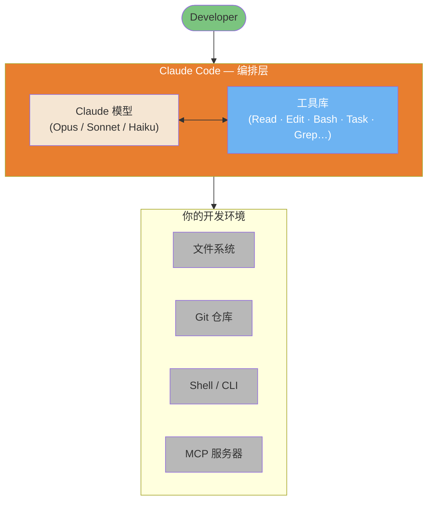

# Claude Code 架构与内部机制

> 基于官方 Anthropic 文档和经过验证的社区分析，深入解析 Claude Code 的内部机制。

**作者**：Florian BRUNIAUX | 贡献者：Claude (Anthropic)

**阅读时间**：约 25 分钟（全文）| 约 5 分钟（仅 TL;DR）

**最后验证**：2026 年 2 月（Claude Code v2.1.34）

---

## 来源透明度

本文档结合了三个层级的来源：

| 层级 | 描述 | 可信度 | 示例 |
|------|------|--------|------|
| **第一层** | 官方 Anthropic 文档 | 100% | anthropic.com/engineering/* |
| **第二层** | 经过验证的反向工程 | 70-90% | PromptLayer 分析、code.claude.com 行为 |
| **第三层** | 社区推断 | 40-70% | 观察到但未经官方确认 |

每条声明标注了其可信度。**有官方文档时，始终优先参考官方文档。**

---

## TL;DR — 5 点总结

1. **简单循环**：Claude Code 运行一个 `while(tool_call)` 循环——没有 DAG、没有分类器、没有 RAG。模型决定一切。

2. **八大核心工具**：Bash（通用适配器）、Read、Edit、Write、Grep、Glob、Task（子智能体）、TodoWrite。这就是全部工具集。

   **搜索策略演进**：早期 Claude Code 版本曾尝试使用 Voyage 嵌入进行 RAG 语义代码搜索。Anthropic 在内部基准测试后改用基于 grep（ripgrep）的智能搜索，性能更优且操作复杂度更低——无需索引同步，没有外部嵌入提供方的安全风险。这种"搜索，不索引"哲学用延迟/token 换取简洁性/安全性。社区提供了 AST 模式的 ast-grep 插件和符号分析的 Serena MCP 等专用方案。

   *来源*：[Latent Space 播客](https://www.latent.space/p/claude-code)（2025 年 5 月）、ast-grep 文档

3. **200K Token 预算**：上下文窗口在系统提示、历史记录、工具结果和响应缓冲区之间共享。在约 75-92% 容量时自动压缩。

4. **子智能体 = 隔离**：`Task` 工具生成具有自己上下文的子智能体。它们不能再生成子智能体（深度=1）。仅有摘要返回。

5. **哲学**："更少脚手架，更多模型"——信任 Claude 的推理能力，而不是在它周围构建复杂的编排系统。

---

## 视觉概览

Claude Code 不是一个新的 AI 模型。它是一个编排层，包裹 Claude（Opus/Sonnet/Haiku），使其能够读取文件、运行 shell 命令、浏览仓库和生成子智能体——全部在一个连续循环中运行，直到任务完成。



*灵感来自 [Mohamed Ali Ben Salem 的架构图](https://www.linkedin.com/posts/mohamed-ali-ben-salem-2b777b9a_en-ce-moment-je-vois-passer-des-posts-du-activity-7420592149110362112-eY5a) —— 详细分解请参见[架构内部图](../diagrams/04-architecture-internals.md)。*

---

## 目录

- [视觉概览](#视觉概览)

1. [主循环](#1-主循环)
2. [工具库](#2-工具库)
3. [上下文管理内部机制](#3-上下文管理内部机制)
4. [子智能体架构](#4-子智能体架构)
5. [权限与安全模型](#5-权限与安全模型)
6. [MCP 集成](#6-mcp-集成)
7. [高级工具使用模式（API）](#7-高级工具使用模式api)
8. [Edit 工具的实际工作原理](#8-edit-工具的实际工作原理)
9. [会话持久化](#9-会话持久化)
10. [哲学：更少脚手架，更多模型](#10-哲学更少脚手架更多模型)
11. [Claude Code vs 替代方案](#11-claude-code-vs-替代方案)
12. [来源与参考](#12-来源与参考)
13. [附录：我们不知道的](#13-附录我们不知道的)


---

## 1. 主循环

**可信度**：100%（第一层 — 官方）
**来源**：[Anthropic 工程博客](https://www.anthropic.com/engineering/claude-code-best-practices)

核心上，Claude Code 出奇地简单：

```
┌─────────────────────────────────────────────────────────────┐
│                    CLAUDE CODE 主循环                        │
├─────────────────────────────────────────────────────────────┤
│                                                             │
│   ┌──────────────┐                                          │
│   │  你的提示    │                                           │
│   └──────┬───────┘                                          │
│          │                                                  │
│          ▼                                                  │
│   ┌──────────────────────────────────────────────────────┐  │
│   │                                                      │  │
│   │                  CLAUDE 推理                          │  │
│   │        （无分类器，无路由层）                          │  │
│   │                                                      │  │
│   └────────────────────────┬─────────────────────────────┘  │
│                            │                                │
│                            ▼                                │
│                   ┌────────────────┐                        │
│                   │  工具调用？    │                        │
│                   └───────┬────────┘                        │
│                           │                                 │
│              是           │           否                     │
│         ┌─────────────────┴─────────────────┐               │
│         │                                   │               │
│         ▼                                   ▼               │
│  ┌────────────┐                      ┌────────────┐         │
│  │  执行      │                      │  文本      │         │
│  │  工具      │                      │  响应      │         │
│  │            │                      │  （完成）  │         │
│  └─────┬──────┘                      └────────────┘         │
│        │                                                    │
│        ▼                                                    │
│  ┌─────────────┐                                            │
│  │  将结果     │                                            │
│  │  给 Claude  │──────────────────┐                         │
│  └─────────────┘                  │                         │
│                                   │                         │
│                                   ▼                         │
│                          ┌────────────────┐                 │
│                          │    循环继续     │                 │
│                          │  （下一轮）    │                 │
│                          └────────────────┘                 │
│                                                             │
└─────────────────────────────────────────────────────────────┘
```

### 这意味着什么

整个架构就是一个简单的 `while` 循环：

```
while (claude_response.has_tool_call):
    result = execute_tool(tool_call)
    claude_response = send_to_claude(result)
return claude_response.text
```

**没有：**
- 意图分类器
- 任务路由器
- RAG/嵌入管道
- DAG 编排器
- 规划器/执行器分离

模型自行决定何时调用工具、调用哪个工具以及何时完成。这就是 Anthropic 工程博客中描述的"智能体循环"模式。

### 为什么这样设计

1. **简洁性**：组件越少 = 故障模式越少
2. **模型驱动**：Claude 的推理优于硬编码的启发式规则
3. **灵活性**：没有僵化的管道限制 Claude 的能力
4. **可调试性**：容易理解发生了什么以及为什么

### 智能体循环 API 词汇表

上面的主循环图展示了概念流程，但 Anthropic API 通过具体的 `stop_reason` 值暴露了它。每个 API 响应都包含一个 `stop_reason` 字段——这是 Claude 指示下一步应该做什么的方式。理解这三个值对于在 Anthropic SDK 之上构建自定义智能体至关重要。

| `stop_reason` | 含义 | 循环操作 |
|--------------|------|---------|
| `tool_use` | Claude 想要调用一个或多个工具 | 执行工具，将结果返回，继续循环 |
| `end_turn` | Claude 认为已全部完成 | 退出循环，返回文本响应 |
| `max_tokens` | 上下文限制在完成前已达 | 重新思考上下文策略，可能需要摘要 |

有了这些名称，伪代码就精确了：

```python
messages = [{"role": "user", "content": user_prompt}]

while True:
    response = client.messages.create(model=model, messages=messages, tools=tools)

    if response.stop_reason == "end_turn":
        return response.content[0].text  # 完成

    if response.stop_reason == "tool_use":
        # 处理响应中的每个 tool_use 块
        tool_results = []
        for block in response.content:
            if block.type == "tool_use":
                result = execute_tool(block.name, block.input)
                tool_results.append({
                    "type": "tool_result",
                    "tool_use_id": block.id,
                    "content": result
                })
        messages.append({"role": "assistant", "content": response.content})
        messages.append({"role": "user", "content": tool_results})
        # 循环继续
```

`response.content` 中的 `tool_use` 块有三个你需要处理的字段：`id`（用于将结果匹配回去）、`name`（要调用的函数）和 `input`（参数字典）。你发送回去的结果必须引用 `tool_use_id`，以便模型关联调用和响应。

**`fork_session`** 是一个构建在此循环之上的更高层次概念：它创建当前对话的独立分支，共享直到分支点为止相同的消息历史。两个分支可以同时探索不同的方法或配置，就像 `git branch` 但用于智能体会话。每个分支独立运行自己的智能体循环——适用于比较不同工具配置或提示变体下的响应，而无需从头重新运行完整对话。

### 原生能力审计

使用此清单确认你已了解 Claude Code 的全部能力范围。每种能力在本文档其他部分有详细说明。

**11 项原生能力**：

- [ ] **事件钩子** — 工具执行时触发的 Bash/PowerShell 脚本
  - PreToolUse、PostToolUse、UserPromptSubmit、Notification
  - 参见：[第 5 节 钩子](#5-权限与安全模型)

- [ ] **技能范围钩子** — 特定于技能执行上下文的事件钩子
  - 每个技能的生命周期管理
  - 参见：[终极指南第 5.11 节](#51-理解技能)

- [ ] **后台智能体** — 异步任务执行（测试套件、长时间操作）
  - 非阻塞智能体生成
  - 参见：[第 4.2 节 子智能体架构](#4-子智能体架构)

- [ ] **探索子智能体** — `/explore` 用于代码库分析
  - 只读代码库探索
  - 参见：[第 4.2 节 子智能体](#4-子智能体架构)

- [ ] **计划子智能体** — `/plan` 用于只读规划模式
  - 安全的架构探索
  - 参见：[终极指南第 2.3 节](#23-计划模式)

- [ ] **Task 工具** — 向专业智能体进行层级任务委派
  - 并行任务执行，深度=1 的子智能体
  - 参见：[第 4.2 节 子智能体架构](#4-子智能体架构)

- [ ] **智能体团队** — 多智能体并行协作（实验性 v2.1.32+）
  - 基于 Git 的协调，自主任务认领
  - 参见：[终极指南第 9.20 节](#920-智能体团队多智能体协调)

- [ ] **按任务选择模型** — 在会话中进行动态模型切换
  - `/model opus|sonnet|haiku` 在任务边界
  - 参见：[第 10 节 成本优化](#11-claude-code-vs-替代方案)

- [ ] **MCP 协议集成** — 用于工具扩展的模型上下文协议
  - Context7、Sequential、Serena、Playwright 等
  - 参见：[第 6 节 MCP 集成](#6-mcp-集成)

- [ ] **权限模式** — 对工具执行的细粒度控制
  - 默认、自动接受、计划模式、自定义规则
  - 参见：[第 5 节 权限与安全模型](#5-权限与安全模型)

- [ ] **会话记忆** — 跨会话的持久上下文
  - CLAUDE.md、记忆文件、项目状态
  - 参见：[第 8 节 会话持久化](#9-会话持久化)

**入门提示**：如果你还没有探索全部 11 项能力，你可能错过了生产力机会。关注上面未选中的条目。

**来源**：综合自 [Gur Sannikov 的分析](https://www.linkedin.com/posts/gursannikov_claudecode-embeddedengineering-aiagents-activity-7423851983331328001-DrFb)

---

## 2. 工具库

**可信度**：100%（第一层 — 官方）
**来源**：[code.claude.com/docs](https://code.claude.com/docs/en/setup)

Claude Code 恰好有 8 个核心工具：

| 工具 | 用途 | 关键行为 | Token 成本 |
|------|------|---------|-----------|
| `Bash` | 执行 shell 命令 | 通用适配器，功能最强大 | 低（命令）+ 可变（输出） |
| `Read` | 读取文件内容 | 最多 2000 行，处理截断 | 大文件时高 |
| `Edit` | 修改现有文件 | 基于 diff，需要精确匹配 | 中 |
| `Grep` | 搜索文件内容 | 基于 ripgrep（正则），取代了 RAG/嵌入方案。对于基于 AST 的结构化代码搜索，请使用 ast-grep 插件。取舍：Grep（快速、简单）vs ast-grep（精确、需设置）vs Serena MCP（语义、符号感知） | 低 |
| `Glob` | 按模式查找文件 | 路径匹配，按修改时间排序 | 低 |
| `Task` | 生成子智能体 | 隔离上下文，深度=1 限制 | 高（新上下文） |
| `TodoWrite` | 跟踪进度 | 结构化任务管理 | 低 |

### Bash 通用适配器

**关键洞察**：Bash 是 Claude 的瑞士军刀。它可以：

- 运行任何 CLI 工具（git、npm、docker、curl...）
- 执行脚本
- 用管道链接命令
- 访问系统状态

模型训练过程中接触了大量 shell 数据，使其在专用工具不足时，能高效使用 Bash 作为通用适配器。

### 工具选择逻辑

Claude 根据任务决定使用哪个工具。没有硬编码的路由：

```
┌─────────────────────────────────────────────────────┐
│              工具选择（模型驱动）                     │
├─────────────────────────────────────────────────────┤
│                                                     │
│  "读取 auth.ts"           → Read 工具               │
│  "查找所有测试文件"        → Glob 工具                │
│  "搜索 TODO"              → Grep 工具               │
│  "运行 npm test"           → Bash 工具               │
│  "探索代码库"              → Task 工具（子智能体）     │
│  "跟踪我的进度"            → TodoWrite 工具           │
│                                                     │
│  模型在训练过程中学习这些模式，                         │
│  而非通过显式规则。                                   │
│                                                     │
└─────────────────────────────────────────────────────┘
```

### 扩展工具生态

除了 8 个核心工具，Claude Code 还可以利用：

**MCP 服务器（模型上下文协议）**：
- **Serena**：符号感知代码导航 + 会话记忆
- **grepai**：语义搜索 + 调用图分析（基于 Ollama）
- **Context7**：官方库文档查询
- **Sequential**：结构化多步推理
- **Playwright**：浏览器自动化和 E2E 测试
- **claude-code-ultimate-guide**：12 个工具——指南搜索、发布跟踪、`compare_versions`、安全威胁查询（`get_threat`、`list_threats`，覆盖 28 个 CVE + 655 个恶意技能）、模板搜索（`search_examples`）——`npx -y claude-code-ultimate-guide-mcp`

**社区插件**：
- **ast-grep**：基于 AST 的结构化代码搜索（显式调用）

### 搜索工具选择矩阵

Claude Code 提供多种代码搜索方式，各有优势：

| 搜索需求 | 原生工具 | MCP/插件替代 | 何时升级 |
|---------|---------|-------------|---------|
| 精确文本 | `Grep`（ripgrep） | - | 不需要（最快） |
| 函数名 | `Grep` | Serena `find_symbol` | 多文件重构 |
| 按含义 | - | grepai `search` | 不知道确切文本 |
| 调用图 | - | grepai `trace_callers` | 依赖分析 |
| 结构模式 | - | ast-grep | 大型迁移（>5 万行） |
| 文件结构 | - | Serena `get_symbols_overview` | 需要符号上下文 |

**性能对比**：

| 工具 | 速度 | 设置 | 使用场景 |
|------|------|------|---------|
| Grep（ripgrep） | ⚡ 约 20ms | ✅ 无需 | 90% 的搜索 |
| Serena | ⚡ 约 100ms | ⚠️ MCP | 重构、符号 |
| grepai | 🐢 约 500ms | ⚠️ Ollama + MCP | 语义、调用图 |
| ast-grep | 🕐 约 200ms | ⚠️ 插件 | AST 模式、迁移 |

**决策原则**：从 Grep 开始（最快），只在需要时升级到专用工具。

> **📖 深入阅读**：参见[搜索工具掌握](../workflows/search-tools-mastery.md)了解结合所有搜索工具的完整工作流。

---

## 3. 上下文管理内部机制

**可信度**：80%（第二层 — 部分官方）
**来源**：
- [platform.claude.com/docs](https://platform.claude.com/docs/en/build-with-claude/context-windows)（第一层）
- 观察到的行为（第二层）

Claude Code 在固定的上下文窗口内运行（约 200K token，因模型而异）。

### 上下文预算明细

```
┌─────────────────────────────────────────────────────────────┐
│                上下文预算（约 200K token）                    │
├─────────────────────────────────────────────────────────────┤
│                                                             │
│  ┌──────────────────────────────────────────────────────┐   │
│  │ 系统提示                                  （约 5-15K） │   │
│  │ • 工具定义                                            │   │
│  │ • 安全指令                                            │   │
│  │ • 行为指南                                            │   │
│  │ • 详见下方详细分解 ↓                                  │   │
│  ├──────────────────────────────────────────────────────┤   │
│  │ CLAUDE.md 文件                             （约 1-10K）│   │
│  │ • 全局 ~/.claude/CLAUDE.md                          │   │
│  │ • 项目 /CLAUDE.md                                    │   │
│  │ • 本地 /.claude/CLAUDE.md                            │   │
│  ├──────────────────────────────────────────────────────┤   │
│  │ 对话历史                                  （可变）     │   │
│  │ • 你的提示                                           │   │
│  │ • Claude 的响应                                      │   │
│  │ • 工具调用记录                                       │   │
│  ├──────────────────────────────────────────────────────┤   │
│  │ 工具结果                                  （可变）     │   │
│  │ • Read 读取的文件内容                                 │   │
│  │ • Bash 输出的命令结果                                 │   │
│  │ • Grep 搜索的结果                                    │   │
│  ├──────────────────────────────────────────────────────┤   │
│  │ 预留响应空间                             （约 40-45K） │   │
│  │ • Claude 的思考                                       │   │
│  │ • 生成的代码/文本                                    │   │
│  └──────────────────────────────────────────────────────┘   │
│                                                             │
│  可用 = 总计 - 系统 - 预留 ≈ 140-150K token                 │
│                                                             │
└─────────────────────────────────────────────────────────────┘
```

### 系统提示内容

**可信度**：100%（第一层 — 官方 Anthropic 文档）
**来源**：
- [Anthropic 系统提示发布说明](https://platform.claude.com/docs/en/release-notes/system-prompts)
- [Anthropic 工程博客：Claude Code 最佳实践](https://www.anthropic.com/engineering/claude-code-best-practices)

Claude 系统提示（约 5-15K token）作为其透明度承诺的一部分，由 Anthropic **公开发布**。这些提示定义了：

**核心组件**：
- **工具定义**：Bash、Read、Edit、Write、Grep、Glob、Task、TodoWrite
- **安全指令**：内容策略、拒绝模式（参见[安全加固](../security/security-hardening.md)）
- **行为指南**：任务优先、MVP 优先、不过度工程化
- **上下文指令**：如何收集和使用项目上下文

**重要区别**：
- **Claude.ai/移动端**：提示词已公开发布
- **Anthropic API**：不同的默认指令，可由开发者配置
- **Claude Code CLI**：具有上下文收集行为的智能编码助手

**社区分析**（用于深入理解）：
- **Simon Willison 的 Claude 4 分析**（2025 年 5 月）：[深入探讨思考块、搜索规则、安全护栏](https://simonwillison.net/2025/May/25/claude-4-system-prompt/)
- **PromptHub 技术解析**（2025 年 6 月）：[提示工程模式的详细分析](https://www.prompthub.us/blog/an-analysis-of-the-claude-4-system-prompt)

→ **交叉引用**：关于安全影响，请参见[第 5 节：权限与安全模型](#5-权限与安全模型)

**注意**：Claude Code 系统提示可能与 Claude.ai/移动端版本不同。以上来源涵盖 Claude 系列；Code 特定的提示集成在 CLI 工具的行为中。

---

### 自动压缩

**可信度**：75%（第二层 — 社区验证，有研究支撑）

当上下文使用超过阈值时，Claude Code 会自动摘要较旧的对话轮次：

| 来源 | 报告阈值 | 备注 |
|------|---------|------|
| VS Code 扩展 | 约 75% 使用量（剩余 25%） | [GitHub #11819](https://github.com/anthropics/claude-code/issues/11819)（2025 年 11 月） |
| CLI 版本 | 剩余 1-5% | 比 VS Code 更保守 |
| PromptLayer 分析 | 92% | 历史观测 |
| Steve Kinney | 95% | [会话管理指南](https://stevekinney.com/courses/ai-development/claude-code-session-management)（2025 年 7 月） |
| 用户触发的 `/compact` | 随时 | 手动控制 |

**压缩期间发生的事情：**

1. 较旧的对话轮次被摘要
2. 工具结果被压缩
3. 近期上下文完整保留
4. 模型收到"上下文已被压缩"的信号

**性能影响**（有研究支撑）：

近期研究和实践者观察确认了自动压缩的质量退化：

- **复杂任务上 LLM 性能下降 50-70%**，上下文从 1K 增长到 32K token（[上下文腐烂研究](https://research.trychroma.com/context-rot)，2025 年 7 月）
- **12 个模型中有 11 个在 32K token 时不足短上下文性能的 50%**（NoLiMa 基准测试）
- **自动压缩丢失细节，破坏引用**，通过重复压缩循环（[Claude 节省 Token，忘记一切](https://golev.com/post/claude-saves-tokens-forgets-everything/)，2026 年 1 月）
- **注意力机制**在高上下文场景中因检索负担而挣扎

**社区共识**：在逻辑断点处手动 `/compact` > 等待自动压缩触发。

**推荐策略** ([Lorenz, 2026](https://www.linkedin.com/posts/robin-lorenz-54055412a_claudecode-contextengineering-aiengineering-activity-7425136701515251713))：

| 上下文比例 | 操作 | 理由 |
|-----------|------|------|
| **70%** | 警告 - 计划清理 | 提前知晓 |
| **85%** | 建议手动交接 | 防止自动压缩质量退化 |
| **95%** | 强制交接 | 严重质量下降 |

**用户控制**：在逻辑断点处手动使用 `/compact` 触发摘要，或使用**会话交接**（参见[会话交接](#会话交接)）在压缩的历史记录上保留意图。

### 上下文保持策略

| 策略 | 何时使用 | 方法 |
|------|---------|------|
| 子智能体 | 探索性任务 | `Task` 工具进行隔离搜索 |
| 手动压缩 | 主动清理 | `/compact` 命令 |
| 清除会话 | 需要全新开始 | `/clear` 命令 |
| 精确读取 | 知道需要什么 | 读取具体文件，不是目录 |
| CLAUDE.md | 持久上下文 | 在记忆文件中存储约定 |

### 会话退化限制

**可信度**：70%（第二层 — 实践者研究、arXiv 研究）

Claude Code 的有效性在特定条件下可预测地退化：

| 条件 | 观察阈值 | 症状 |
|------|---------|------|
| 对话轮次 | **15-25 轮** | 丢失较早的约束 |
| Token 积累 | **80-100K token** | 忽略会话早期陈述的需求 |
| 问题范围 | **同时 >5 个文件** | 变更不一致、文件遗漏 |

**按范围的成功率**（来自实践者研究）：

| 范围 | 成功率 | 示例 |
|------|--------|------|
| 1-3 个文件 | 约 85% | 修复单个模块中的 bug |
| 4-7 个文件 | 约 60% | 跨组件重构功能 |
| 8 个以上文件 | 约 40% | 代码库范围的更改 |

**缓解策略**：

1. **检查点提示**："在继续之前，回顾当前的需求和约束。"
2. **会话重置**：为新任务重新开始（`/clear`）
3. **严格限定范围**：将大任务拆分为聚焦的子任务
4. **使用子智能体**：将探索委托给 `Task` 工具以保护主上下文

### 失败触发的上下文漂移

一种不依赖于上下文大小的独立退化模式：重复的工具失败。当工具调用失败且 Claude 重试时，错误输出在上下文窗口中积累。堆栈跟踪、重试噪音和错误消息稀释了原始意图——后续尝试遵循错误的叙事而非任务目标。上下文窗口并未满，但信噪比已经退化。

这与压缩漂移不同。压缩处理上下文*大小*；失败注入处理有限窗口内的上下文*质量*。

**模式**：每次命令失败时重新注入核心任务指令，而不仅仅是在 `/compact` 之后。一个 `PostToolUse` 钩子可以用原始任务和约束的压缩版本前缀重试的提示：

```bash
# PostToolUse 钩子：失败后重新注入意图
if [[ "$CLAUDE_TOOL_EXIT_CODE" != "0" ]]; then
  echo "提醒：当前任务是：$ORIGINAL_TASK_SUMMARY。如果非阻塞，请忽略以上错误并继续朝着目标前进。"
fi
```

来源：[Nick Tune — 工作流 DSL：领域驱动 Claude Code 工作流](https://nick-tune.me/blog/2026-03-01-workflow-dsl-domain-driven-claude-code-workflows/)（2026-03-01）

---

## 4. 子智能体架构

**可信度**：100%（第一层 — 有记录的行为）
**来源**：[code.claude.com/docs](https://code.claude.com/docs/en/setup) + 系统提示（在工具定义中可见）

`Task` 工具生成子智能体用于并行或隔离的工作。

### 隔离模型

```
┌─────────────────────────────────────────────────────────────┐
│                        主智能体                               │
│                                                             │
│  ┌───────────────────────────────────────────────────────┐  │
│  │ 上下文：完整对话 + 所有文件读取                       │  │
│  │                                                       │  │
│  │         Task("探索认证模式")                          │  │
│  │                        │                              │  │
│  │                        ▼                              │  │
│  │  ┌─────────────────────────────────────────────────┐  │  │
│  │  │            子智能体（生成）                       │  │  │
│  │  │                                                 │  │  │
│  │  │  • 拥有自己的全新上下文窗口                      │  │  │
│  │  │  • 接收：仅任务描述                             │  │  │
│  │  │  • 可访问：相同工具（Task 除外）                │  │  │
│  │  │  • 不能生成子-子智能体（深度 = 1）              │  │  │
│  │  │  • 返回：仅摘要文本                            │  │  │
│  │  │                                                 │  │  │
│  │  └─────────────────────────────────────────────────┘  │  │
│  │                        │                              │  │
│  │                        ▼                              │  │
│  │         结果："找到 3 种认证模式：JWT 在..."          │  │
│  │         （只有这段文本进入主上下文）                  │  │
│  │                                                       │  │
│  └───────────────────────────────────────────────────────┘  │
│                                                             │
└─────────────────────────────────────────────────────────────┘
```

### 为什么深度 = 1？

将子智能体限制在一层可以防止：

1. **递归爆炸**：智能体嵌套会消耗无限资源
2. **上下文污染**：每一层都会积累上下文
3. **调试噩梦**：追踪多层智能体链很困难
4. **不可预测的成本**：嵌套智能体意味着不可预测的 token 使用量

### 子智能体类型

Claude Code 通过 `subagent_type` 参数提供专用子智能体类型：

| 类型 | 用途 | 可用工具 |
|------|------|---------|
| `Explore` | 代码库探索 | 所有只读工具 |
| `Plan` | 架构规划 | 除 Edit/Write 外的所有工具 |
| `Bash` | 命令执行 | 仅 Bash |
| `general-purpose` | 复杂多步 | 所有工具 |

### 何时使用子智能体

| 使用场景 | 子智能体为何有帮助 |
|----------|------------------|
| 搜索大型代码库 | 保持主上下文清洁 |
| 并行探索 | 同时进行多次搜索 |
| 有风险的探索 | 错误不污染主上下文 |
| 专业分析 | 不同任务使用不同"思维方式" |

### 中心辐射式编排

生产中占主导地位的多智能体模式是**中心辐射式**：一个协调智能体位于中心，管理 N 个工作子智能体，并且是唯一掌握全局的实体。

```
                     ┌─────────────────────┐
                     │     协调智能体        │
                     │   （中心 / 编排器）   │
                     │                     │
                     │  • 分解目标         │
                     │  • 传递上下文       │
                     │  • 汇总结果         │
                     │  • 解决冲突         │
                     └──┬──────┬──────┬───┘
                        │      │      │
             ┌──────────┘      │      └──────────┐
             │                 │                 │
      ┌──────▼──────┐  ┌───────▼─────┐  ┌───────▼─────┐
      │  工作智能体A  │  │  工作智能体B │  │  工作智能体C │
      │              │  │             │  │             │
      │  仅执行特定   │  │  仅执行特定  │  │  仅执行特定  │
      │  任务       │  │  任务       │  │  任务       │
      └─────────────┘  └─────────────┘  └─────────────┘
            │                 │                 │
            └────────────────►│◄────────────────┘
                      （结果仅流回协调智能体）
```

**关键规则：上下文从不自动继承。** 当协调智能体生成工作智能体 A 分析文件 X 时，工作智能体 B 不会知道该分析的结果——除非协调智能体显式地在任务描述中传递它。工作智能体按设计是隔离的——它们只接收任务字符串，没有其他内容。

这是多智能体设计中最常见的错误：假设子智能体会共享上下文。它们不会。

**显式上下文传递模式：**

```python
# 错误 — 工作智能体 B 不会知道工作智能体 A 的发现
task_a = Task("分析 auth.py 并找到会话 token 逻辑")
task_b = Task("查找会话 token 逻辑的所有调用者")  # 不知道它在哪

# 正确 — 协调智能体显式传递发现
result_a = run_task("分析 auth.py 并返回处理会话 token 的确切函数名")
task_b = Task(f"在代码库中查找 {result_a} 的所有调用者")  # 显式上下文
```

**协调智能体职责：**

1. **分解**：将目标拆分为具有清晰边界的独立子任务
2. **显式传递上下文**：每个工作智能体的任务描述必须自包含
3. **汇总**：收集所有工作智能体的文本结果，组合为连贯的输出
4. **决策跨领域问题**：只有协调智能体可以做出跨工作智能体的决策

工作智能体绝不应相互通信。如果它们需要通信，说明分解有问题，该任务应属于协调智能体。

---

## 5. 权限与安全模型

**可信度**：100%（第一层 — 官方）
**来源**：
- [code.claude.com/docs/en/hooks](https://code.claude.com/docs/en/hooks)
- [code.claude.com/docs/en/sandboxing](https://code.claude.com/docs/en/sandboxing)

Claude Code 具有分层安全模型：

```
┌─────────────────────────────────────────────────────────────┐
│                      权限层级                                │
├─────────────────────────────────────────────────────────────┤
│                                                             │
│  第 1 层：交互式提示                                         │
│  ┌────────────────────────────────────────────────────────┐ │
│  │ Claude 想要运行：rm -rf node_modules                   │ │
│  │ [允许一次] [始终允许] [拒绝] [编辑命令]                  │ │
│  └────────────────────────────────────────────────────────┘ │
│                          │                                  │
│                          ▼                                  │
│  第 2 层：允许/拒绝规则（settings.json）                     │
│  ┌────────────────────────────────────────────────────────┐ │
│  │ {                                                      │ │
│  │   "permissions": {                                     │ │
│  │     "allow": ["Bash(npm *)", "Read"],              │ │
│  │     "deny": ["Bash(rm -rf *)"]                         │ │
│  │   }                                                    │ │
│  │ }                                                      │ │
│  └────────────────────────────────────────────────────────┘ │
│                          │                                  │
│                          ▼                                  │
│  第 3 层：钩子（执行前/后）                                  │
│  ┌────────────────────────────────────────────────────────┐ │
│  │ PreToolUse：执行前验证                                 │ │
│  │ PostToolUse：执行后审计                                │ │
│  │ PermissionRequest：覆盖权限提示                        │ │
│  └────────────────────────────────────────────────────────┘ │
│                          │                                  │
│                          ▼                                  │
│  第 4 层：沙箱模式（可选的隔离）                             │
│  ┌────────────────────────────────────────────────────────┐ │
│  │ 文件系统隔离 + 网络限制                                │ │
│  └────────────────────────────────────────────────────────┘ │
│                                                             │
└─────────────────────────────────────────────────────────────┘
```

### 危险模式检测

**可信度**：80%（第二层 — 观察到但未穷举）

Claude Code 似乎会对某些模式进行额外审查：

| 模式 | 风险 | 行为 |
|------|------|------|
| `rm -rf` | 破坏性删除 | 始终提示 |
| `sudo` | 提权 | 始终提示 |
| `curl \| sh` | 远程代码执行 | 始终提示 |
| `chmod 777` | 不安全的权限 | 始终提示 |
| `git push --force` | 历史破坏 | 始终提示 |
| `DROP TABLE` | 数据破坏 | 始终提示 |

这不是一个完整的阻止列表——这些模式可能通过模型训练而非显式规则检测到。

### 原生沙箱（v2.1.0+）

**可信度**：100%（第一层 — 官方）
**来源**：[code.claude.com/docs/en/sandboxing](https://code.claude.com/docs/en/sandboxing)

Claude Code 包含内置的**原生沙箱**，使用 OS 级原语进行进程级隔离：

```
┌──────────────────────────────────────────────────────┐
│                 原生沙箱架构                           │
├──────────────────────────────────────────────────────┤
│                                                      │
│  Bash 命令请求                                       │
│       │                                              │
│       ▼                                              │
│  沙箱包装器（Seatbelt/bubblewrap）                    │
│       │                                              │
│       ├─ 文件系统：全部可读，仅 CWD 可写              │
│       ├─ 网络：SOCKS5 代理 + 域名过滤                 │
│       ├─ 进程：隔离环境                               │
│       │                                              │
│       ▼                                              │
│  OS 内核执行                                         │
│       │                                              │
│       ├─ 允许：边界内的操作                           │
│       ├─ 阻止：系统调用级别的违规                      │
│       └─ 通知：用户收到违规警报                       │
│                                                      │
└──────────────────────────────────────────────────────┘
```

**OS 原语**：

| 平台 | 机制 | 备注 |
|------|------|------|
| **macOS** | Seatbelt（TrustedBSD MAC） | 内置，内核级系统调用过滤 |
| **Linux/WSL2** | bubblewrap（命名空间 + seccomp） | 需要：`sudo apt-get install bubblewrap socat` |
| **WSL1** | ❌ 不支持 | bubblewrap 需要不可用的内核功能 |
| **Windows** | ⏳ 计划中 | 尚未可用 |

**隔离模型**：

1. **文件系统**：
   - **读取**：整个电脑（除拒绝路径外）
   - **写入**：仅当前工作目录（可配置）
   - **阻止**：CWD 外的修改、凭据目录（`~/.ssh`、`~/.aws`）

2. **网络**：
   - **代理**：所有连接通过 SOCKS5 代理路由
   - **域名过滤**：白名单/黑名单模式
   - **默认阻止**：私有 CIDR、localhost 范围

3. **进程**：
   - **共享内核**：易受内核漏洞攻击（与 Docker microVM 不同）
   - **子进程**：继承相同的沙箱限制
   - **逃生舱口**：`dangerouslyDisableSandbox` 参数用于不兼容的工具

**沙箱模式**：

- **自动允许模式**：如已沙箱化，Bash 命令自动批准（推荐日常开发）
- **常规权限模式**：所有命令需要显式批准（高安全性）

**安全权衡**：

| 方面 | 原生沙箱 | Docker 沙箱（microVM） |
|------|---------|---------------------|
| **内核隔离** | ❌ 共享内核 | ✅ 每个 VM 独立内核 |
| **设置** | 0 依赖（macOS），2 包（Linux） | Docker Desktop 4.58+ |
| **开销** | 极小（约 1-3% CPU） | 中等（约 5-10% CPU） |
| **使用场景** | 日常开发、受信任代码 | 不受信任的代码、最高安全性 |

**安全限制**：

⚠️ **域名前端**：CDN（Cloudflare、Akamai）可以绕过域名过滤
⚠️ **Unix 套接字**：配置不当的 `allowUnixSockets` 可导致提权
⚠️ **文件系统**：过于宽泛的写入权限可能对 `$PATH` 目录发起攻击

**何时使用**：

- ✅ **原生沙箱**：日常开发、受信任的团队、轻量级设置
- ✅ **Docker 沙箱**：不受信任的代码、内核漏洞防护、需要 Docker-in-Docker

**深入阅读**：参见[原生沙箱指南](../security/sandbox-native.md)获取完整技术参考、配置示例和故障排除。

### 钩子系统

钩子允许对 Claude 的操作进行程序化控制：

```json
{
  "hooks": {
    "PreToolUse": [
      {
        "matcher": "Bash",
        "hooks": [{
          "type": "command",
          "command": "/path/to/validate-command.sh"
        }]
      }
    ],
    "PostToolUse": [
      {
        "matcher": "*",
        "hooks": [{
          "type": "command",
          "command": "/path/to/audit-log.sh"
        }]
      }
    ]
  }
}
```

**钩子能力：**

| 能力 | 支持 | 方式 |
|------|------|------|
| 阻止执行 | 是 | 退出码 2 |
| 修改参数 | 是 | 返回修改后的 JSON |
| 记录操作 | 是 | 在钩子中写入文件 |
| 异步处理 | 是 | 在钩子配置中设置 `async: true`（v2.1.0+） |

**钩子 JSON 负载**（通过 stdin 传递）：

```json
{
  "session_id": "abc123",
  "transcript_path": "/home/user/.claude/projects/.../transcript.jsonl",
  "cwd": "/path/to/project",
  "permission_mode": "default",
  "hook_event_name": "PreToolUse",
  "tool_name": "Bash",
  "tool_input": {
    "command": "npm install lodash"
  }
}
```

发送到所有事件的公共字段：`session_id`、`transcript_path`、`cwd`、`permission_mode`、`hook_event_name`。事件特定字段（例如 PreToolUse 的 `tool_name`/`tool_input`）在此基础上添加。

→ **交叉引用**：参见主指南中的[第 7 节 - 钩子](#7-钩子)获取完整示例。

---

## 6. MCP 集成

**可信度**：100%（第一层 — 官方）
**来源**：[code.claude.com/docs/en/mcp](https://code.claude.com/docs/en/mcp)

MCP（模型上下文协议）服务器使用附加工具扩展 Claude Code。

### MCP 架构概览

> **💡 视觉指南**：下图说明了 MCP 如何在 LLM 和真实系统之间创建安全控制层。LLM 层**没有直接数据访问**——MCP 服务器在执行策略后才能让工具与数据库、API 或文件交互。


*图 1：MCP 架构显示了思考（LLM）、控制（MCP 服务器）和执行（工具）之间的分离。设计灵感来自 [Dinesh Kumar 的 LinkedIn 可视化](https://www.linkedin.com/posts/dinesh-kumar-6b0528b4_model-context-protocol-mcp-why-it-came-activity-7419969525795782656-VoFh)，在 Apache-2.0 许可下重新创作。*

**关键安全边界**：
- **黄色层（LLM）**：仅推理 — **无数据访问**
- **橙色层（MCP 服务器）**：安全控制点（策略、验证、日志）
- **灰色层（真实系统）**：受保护数据 — **对 AI 隐藏**

### MCP 工作原理（技术细节）

```
┌─────────────────────────────────────────────────────────────┐
│                    MCP 集成                                   │
├─────────────────────────────────────────────────────────────┤
│                                                             │
│  ┌─────────────────────────────────────────────────────┐    │
│  │                  CLAUDE CODE                         │    │
│  │                                                     │    │
│  │   原生工具              MCP 工具                      │    │
│  │   ┌─────────┐        ┌─────────────────────────┐    │    │
│  │   │ Bash    │        │ mcp__serena__*          │    │    │
│  │   │ Read    │        │ mcp__context7__*        │    │    │
│  │   │ Edit    │        │ mcp__playwright__*      │    │    │
│  │   │ ...     │        │ mcp__custom__*          │    │    │
│  │   └─────────┘        └───────────┬─────────────┘    │    │
│  │                                  │                  │    │
│  └──────────────────────────────────┼──────────────────┘    │
│                                     │                       │
│                           JSON-RPC 2.0                      │
│                                     │                       │
│                                     ▼                       │
│  ┌─────────────────────────────────────────────────────┐    │
│  │                  MCP 服务器                           │    │
│  │                                                     │    │
│  │   stdio/HTTP 传输                                   │    │
│  │   工具定义（JSON Schema）                             │    │
│  │   工具实现                                           │    │
│  │                                                     │    │
│  └─────────────────────────────────────────────────────┘    │
│                                                             │
└─────────────────────────────────────────────────────────────┘
```

### MCP 关键事实

| 方面 | 行为 |
|------|------|
| 协议 | 基于 stdio 或 HTTP 的 JSON-RPC 2.0 |
| 工具命名 | `mcp__<服务器>__<工具>` 约定 |
| 上下文共享 | 仅通过工具参数和返回值 |
| 生命周期 | 首次使用时启动，会话期间保持活跃 |
| 权限 | 与原生工具相同的系统 |

### MCP 不能做什么

| 限制 | 说明 |
|------|------|
| 访问对话历史 | 仅看到工具参数，而非完整上下文 |
| 跨调用保持状态 | 每次调用独立（除非服务器实现缓存） |
| 修改 Claude 的系统提示 | 仅工具，无提示注入 |
| 绕过权限 | 与原生工具相同的安全层 |

→ **交叉引用**：关于安全考虑，请参见[第 8.6 节 - MCP 安全](#86-mcp-安全)。

### MCP 扩展：Apps（SEP-1865）

**状态**：稳定（2026 年 1 月 26 日）
**规范**：[GitHub 上的 SEP-1865](https://github.com/modelcontextprotocol/ext-apps)
**合著者**：OpenAI、Anthropic、MCP-UI 创建者

#### 什么是 MCP Apps？

MCP Apps 是**模型上下文协议的第一个官方扩展**，使 MCP 服务器能够在传统工具响应之外提供**交互式用户界面**。

**解决的问题**：基于文本的传统响应给需要探索的工作流带来了摩擦。每次交互（排序、筛选、下钻）都需要一个新的提示周期。MCP Apps 通过在对话中直接渲染交互式 UI 来消除这种"上下文差距"。

#### 技术架构

**两个核心原语**：

1. **带 UI 元数据的工具**：
   ```json
   {
     "name": "query_database",
     "description": "查询客户数据库",
     "_meta": {
       "ui": {
         "resourceUri": "ui://dashboard/customers"
       }
     }
   }
   ```

2. **UI 资源**（`ui://` 方案）：
   - 服务器端 HTML/JavaScript 包
   - 由宿主在沙箱化 iframe 中渲染
   - 通过 `postMessage` 进行双向 JSON-RPC 通信

**通信流程**：

```
┌─────────────────────────────────────────────────────────┐
│                  MCP APPS 架构                            │
├─────────────────────────────────────────────────────────┤
│                                                         │
│  ┌──────────────┐         ┌──────────────┐             │
│  │  MCP 客户端  │◄───────►│  MCP 服务器  │             │
│  │ (Claude/IDE) │ JSON-RPC│  (你的应用)  │             │
│  └──────┬───────┘         └──────────────┘             │
│         │                                               │
│         │ 获取 ui:// 资源                                │
│         ▼                                               │
│  ┌─────────────────────────────────────────┐            │
│  │     沙箱化 Iframe（UI 渲染）             │            │
│  │  ┌───────────────────────────────────┐  │            │
│  │  │ 来自服务器的 HTML/JS 包            │  │            │
│  │  │ - 交互式仪表盘                    │  │            │
│  │  │ - 带验证的表单                    │  │            │
│  │  │ - 实时数据可视化                  │  │            │
│  │  └───────────────────────────────────┘  │            │
│  │                                          │            │
│  │  postMessage ◄─────► JSON-RPC           │            │
│  └─────────────────────────────────────────┘            │
│                                                         │
└─────────────────────────────────────────────────────────┘
```

#### 安全模型

**多层保护**：

| 层级 | 保护 |
|------|------|
| **Iframe 沙箱** | 受限权限（无直接系统访问） |
| **预先声明的模板** | 宿主在渲染前审查 HTML/JS |
| **可审计的消息传递** | 所有 UI 到宿主的通信通过 JSON-RPC 日志记录 |
| **用户同意** | UI 发起的工具调用可要求用户许可 |
| **内容阻止** | 宿主可以在渲染前拒绝可疑资源 |

→ **交叉引用**：参见[第 8.6 节 - MCP 安全](#86-mcp-安全)了解更广泛的 MCP 安全考虑。

#### SDK：@modelcontextprotocol/ext-apps

**安装**：
```bash
npm install @modelcontextprotocol/ext-apps
```

**核心 API**（框架无关）：

```typescript
import { App } from '@modelcontextprotocol/ext-apps';

const app = new App();

// 1. 与宿建立通信
await app.connect();

// 2. 从宿主接收工具结果
app.ontoolresult = (result) => {
  // 使用工具执行结果更新 UI
  updateDashboard(result.data);
};

// 3. 从 UI 调用服务器工具
await app.callServerTool('fetch_analytics', {
  timeRange: '7d',
  metrics: ['users', 'revenue']
});

// 4. 异步更新模型上下文
await app.updateModelContext({
  selectedFilters: ['region:EU', 'status:active']
});

// 附加功能：
app.logDebug('用户操作', { filter: 'applied' });
app.openBrowserLink('https://docs.example.com');
app.sendFollowUpMessage('已应用筛选器：EU，活跃');
```

**标准通信**：所有功能通过 `postMessage` 运作（无框架锁定）。

#### 平台支持

| 平台 | MCP Apps 支持 | 备注 |
|------|--------------|------|
| **Claude Desktop** | ✅ 已可用 | claude.ai/directory（Pro/Max/Team/Enterprise） |
| **Claude Cowork** | 🔄 即将推出 | 智能体工作流集成已规划 |
| **VS Code** | ✅ Insiders 构建 | [官方博客文章](https://code.visualstudio.com/blogs/2026/01/26/mcp-apps-support) |
| **ChatGPT** | 🔄 逐步推出 | 2026 年 1 月 26 日那周 |
| **Goose** | ✅ 已可用 | 支持 UI 的开源 CLI |
| **Claude Code CLI** | ❌ 不适用 | 终端纯文本（无 iframe 渲染） |

#### 对 Claude Code 用户的相关性

**直接使用**：无（CLI 纯文本，无法渲染 iframe）

**间接收益**：

1. **生态理解**：MCP Apps 代表了智能体工作流的未来
2. **MCP 服务器开发**：如果构建自定义 MCP 服务器，Apps 现在是一个设计选项
3. **混合工作流**：
   - 使用 Claude Desktop 通过 Apps 探索数据（仪表盘、可视化）
   - 切换到 Claude Code CLI 进行实现（脚本、自动化）
4. **配置上下文**：MCP 服务器可能在元数据中声明 UI 能力

#### 示例实现

**官方示例服务器**（位于 [`ext-apps` 仓库](https://github.com/modelcontextprotocol/ext-apps)）：

- **threejs-server**：3D 可视化和操作
- **map-server**：交互式地理数据探索
- **pdf-server**：带内联高亮的文档查看
- **system-monitor-server**：实时指标仪表盘
- **sheet-music-server**：乐谱渲染

**生产采用**（2026 年 1 月）：

| 工具 | 提供商 | 能力 |
|------|--------|------|
| Asana | Asana | 项目时间线、任务板 |
| Slack | Salesforce | 消息起草带格式预览 |
| Figma | Figma | FigJam 中的流程图、甘特图 |
| Amplitude | Amplitude | 带交互式筛选的分析图表 |
| Box | Box | 文件搜索、文档预览 |
| Canva | Canva | 带实时自定义的演示设计 |
| Clay | Clay | 公司研究、联系发现 |
| Hex | Hex | 带交互式查询的数据分析 |
| monday.com | monday.com | 工作管理面板 |

**即将推出**：Salesforce（Agentforce 360）

#### 与先前工作的关系

MCP Apps 标准化了以下项目开创的模式：
- **MCP-UI**：MCP 的早期 UI 扩展（社区项目）
- **OpenAI Apps SDK**：交互式工具的并行工作

两个框架继续得到支持。MCP Apps 提供了一个**统一规范**（SEP-1865），由两个生态系统的维护者以及 Anthropic 和 OpenAI 共同编写。

**迁移路径**：对现有的 MCP-UI 和 Apps SDK 实现来说很直接。

#### 何时使用 MCP Apps

**MCP 服务器开发者的决策树**：

```
构建自定义 MCP 服务器？
├─ 用户需要从 50+ 选项中选择？→ MCP Apps（下拉、多选 UI）
├─ 用户需要可视化数据模式？→ MCP Apps（图表、地图、图形）
├─ 用户需要带条件逻辑的多步工作流？→ MCP Apps（向导表单）
├─ 用户需要实时更新？→ MCP Apps（实时仪表盘）
└─ 简单的数据检索或操作？→ 传统 MCP 工具（已足够）
```

**权衡**：UI 复杂性和实现工作量 vs 用户体验改进。

#### 资源

- **规范**：[GitHub 上的 SEP-1865](https://github.com/modelcontextprotocol/ext-apps)
- **SDK**：[`@modelcontextprotocol/ext-apps` (npm)](https://www.npmjs.com/package/@modelcontextprotocol/ext-apps)
- **示例服务器**：[modelcontextprotocol/ext-apps 仓库](https://github.com/modelcontextprotocol/ext-apps)
- **博客文章（MCP）**：[MCP Apps 公告](https://blog.modelcontextprotocol.io/posts/2026-01-26-mcp-apps/)
- **博客文章（Claude）**：[Claude 中的交互式工具](https://claude.com/blog/interactive-tools-in-claude)
- **VS Code**：[MCP Apps 支持公告](https://code.visualstudio.com/blogs/2026/01/26/mcp-apps-support)

---

### MCP 工具搜索（懒加载）

**可信度**：100%（第一层 — 官方）
**来源**：[anthropic.com/engineering/advanced-tool-use](https://www.anthropic.com/engineering/advanced-tool-use)

自 v2.1.7（2026 年 1 月）起，Claude Code 对 MCP 工具定义使用**懒加载**，而非将所有工具预加载到上下文中。这由 Anthropic 的[高级工具使用](https://www.anthropic.com/engineering/advanced-tool-use) API 功能驱动。

**解决的问题：**
- MCP 工具定义消耗大量上下文（例如 GitHub MCP 单独：93 个工具约 46K token）
- 开发者 Scott Spence 记录到在输入第一个提示之前已消耗 66,000+ token
- 这种"上下文污染"限制了实际 MCP 的采用

**工具搜索的工作方式：**

```
┌─────────────────────────────────────────────────────────────┐
│                  MCP 工具搜索流程                             │
├─────────────────────────────────────────────────────────────┤
│                                                             │
│  没有工具搜索（急切加载）：                                  │
│  ┌──────────────────────────────────────────────────────┐   │
│  │所有 100+ 工具定义一次性加载（约 55K token）             │   │
│  └──────────────────────────────────────────────────────┘   │
│                                                             │
│  有工具搜索（懒加载）：                                     │
│  ┌──────────────────────────────────────────────────────┐   │
│  │ 步骤 1：仅加载搜索工具（约 500 token）                 │   │
│  │ 步骤 2：Claude 确定所需能力                            │   │
│  │ 步骤 3：工具搜索找到匹配的工具（正则/BM25）            │   │
│  │ 步骤 4：仅加载匹配的工具（每个约 600 token）           │   │
│  │ 步骤 5：正常调用工具                                  │   │
│  └──────────────────────────────────────────────────────┘   │
│                                                             │
│  结果：55K token → 约 8.7K token（减少 85%）                │
│                                                             │
└─────────────────────────────────────────────────────────────┘
```

**实测改进**（Anthropic 基准测试）：

| 指标 | 之前 | 之后 | 改进 |
|------|------|------|------|
| Token 开销（5 服务器设置） | 约 55K | 约 8.7K | **减少 85%** |
| Opus 4 工具选择准确率 | 49% | 74% | +25 个百分点 |
| Opus 4.5 工具选择准确率 | 79.5% | 88.1% | +8.6 个百分点 |
| Opus 4.6 自适应思考 | 不适用 | 自动校准 | 动态深度 |

**配置**（v2.1.9+）：

```bash
# 环境变量
ENABLE_TOOL_SEARCH=auto      # 默认（10% 上下文阈值）
ENABLE_TOOL_SEARCH=auto:5    # 激进（5% 阈值）
ENABLE_TOOL_SEARCH=auto:20   # 保守（20% 阈值）
ENABLE_TOOL_SEARCH=true      # 始终启用
ENABLE_TOOL_SEARCH=false     # 禁用（急切加载）
```

| 阈值 | 推荐场景 |
|------|---------|
| `auto:20` | 轻量级设置（5-10 个工具） |
| `auto:10` | 平衡默认（20-50 个工具） |
| `auto:5` | 高级用户（100+ 个工具） |

→ 正如 Simon Willison 所说："上下文污染是我很少使用 MCP 的原因。现在这个问题解决了，没有理由不给 Claude Code 连接几十甚至几百个 MCP 了。" — [X/Twitter，2026 年 1 月 14 日](https://twitter.com/simonw)

---

## 7. 高级工具使用模式（API）

**可信度**：90%（第一层 — 官方 Anthropic 工程）
**来源**：[Anthropic 工程：高级工具使用](https://www.anthropic.com/engineering/advanced-tool-use) | [程序化工具调用文档](https://platform.claude.com/docs/en/agents-and-tools/tool-use/programmatic-tool-calling)

四个 API 级功能于 2026 年 2 月 18 日全面发布（随 Opus/Sonnet 4.6 一起）。这些适用于在 Anthropic API 或 Agent SDK 上构建智能体的开发者——不直接适用于 Claude Code CLI。

| 功能 | 解决的问题 | 可用性 |
|------|---------|--------|
| 程序化工具调用 (PTC) | 智能体循环在往返上浪费 token | API + Foundry |
| 动态过滤 | 网页搜索使上下文充满噪音 | API + Foundry |
| 工具搜索工具 | 过多工具定义使上下文膨胀 | API + Foundry |
| 工具使用示例 | 仅凭 Schema 无法表达使用模式 | API + Foundry |

**策略性分层**——先处理最大的瓶颈：
- 上下文被工具定义膨胀 → 工具搜索工具
- 大型中间结果 → 程序化工具调用
- 网页研究返回噪音 → 动态过滤
- 尽管 schema 正确仍有参数错误 → 工具使用示例

### 程序化工具调用 (PTC)

**范式转变**：不是一次调用一个工具并每次进行完整的模型往返，而是 Claude 编写 Python 代码，在内部编排所有工具调用。只有最终的 `stdout` 进入上下文窗口。

```
传统方式：提示 → Claude → 工具 1 → 响应 1 → Claude → 工具 2 → 响应 2 → Claude → 答案
         （3 个工具 = 3 次推理传递，3 倍中间结果在上下文中）

PTC：   提示 → Claude → 编写 Python → 代码调用工具 1、2、3 → stdout → Claude → 答案
         （3 个工具 = 1 次推理传递，仅最终输出在上下文中）
```

**配置**——用 `allowed_callers` 将工具标记为可从代码执行沙箱调用：

```json
{
  "tools": [
    { "type": "code_execution_20250825", "name": "code_execution" },
    {
      "name": "query_database",
      "description": "执行 SQL。返回行作为 JSON：id (str)、name (str)、revenue (float)。",
      "input_schema": {
        "type": "object",
        "properties": { "sql": { "type": "string" } },
        "required": ["sql"]
      },
      "allowed_callers": ["code_execution_20250825"]
    }
  ]
}
```

| `allowed_callers` 值 | 行为 |
|---------------------|------|
| 省略 / `["direct"]` | 仅传统调用 |
| `["code_execution_20250825"]` | 仅可从 Python 沙箱调用 |
| `["direct", "code_execution_20250825"]` | 两种模式——不推荐（会使 Claude 混淆） |

**模式**（全部在 1 次推理传递中运行）：
- 批量处理：循环 N 个条目，汇总，打印摘要
- 提前终止：一旦满足成功条件就中断
- 条件工具选择：根据中间结果选择轻量或重量级工具
- 数据过滤：减少 Claude 看到的内容（`errors = [l for l in logs if "ERROR" in l]`）

**Token 效率**：程序化调用的工具结果从不进入 Claude 的上下文——只有最终 `stdout` 进入。10 次程序化工具调用 ≈ 1/10 的 10 次直接调用的上下文 token。约 37% 的整体 token 减少是社区报告的（Shayan Tabe 的分析），未经 Anthropic 官方确认。

**约束**：仅 API 和 Foundry（非 Bedrock/Vertex）。不支持 MCP 工具、不支持网页搜索/fetch、不支持 `strict: true` 工具。容器生命周期约 4.5 分钟。不涵盖在零数据保留策略中。

### 网页搜索/获取的动态过滤

网页搜索和获取工具将完整的 HTML 转储到上下文中——包括导航、广告、样板文件。动态过滤允许 Claude 编写 Python 在结果进入其上下文窗口之前对结果进行预处理和过滤。

**配置**——使用更新后的工具类型版本并带 beta 头：

```json
{
  "tools": [
    { "type": "web_search_20260209", "name": "web_search" },
    { "type": "web_fetch_20260209", "name": "web_fetch" }
  ]
}
```

所需头：`anthropic-beta: code-execution-web-tools-2026-02-09`。使用 Sonnet 4.6 或 Opus 4.6 的这些工具类型版本时，过滤默认启用。

**官方基准测试结果**（Anthropic，BrowseComp 数据集）：

| 模型 | 无过滤 | 有过滤 | 改进 |
|------|--------|--------|------|
| Sonnet 4.6 | 33.3% | 46.6% | +13.3 pp |
| Opus 4.6 | 45.3% | 61.6% | +16.3 pp |

平均输入 token 减少：约 24%。最适合多步研究、引用验证和从大页面中提取特定数据点。

### 工具使用示例

JSON schema 定义结构但无法表达何时包含可选参数、哪些组合有意义或格式约定。向工具定义添加 `input_examples` 以显示具体的使用模式：

```json
{
  "name": "create_ticket",
  "input_schema": { ... },
  "input_examples": [
    { "title": "登录页面 500 错误", "priority": "critical", "assignee": "oncall-team", "labels": ["bug", "auth"] },
    { "title": "添加暗色模式", "priority": "low", "labels": ["feature-request"] },
    { "title": "更新 v2 的 API 文档" }
  ]
}
```

复杂参数处理的准确率：在 Anthropic 的基准测试中从 72% 提升到 90%。每个工具使用 1-5 个实际示例，涵盖最小、部分和完整规范。

### Claude Code 相关性

| 功能 | Claude Code CLI | CLI 用户的操作 |
|------|----------------|--------------|
| 工具搜索（MCP 懒加载） | 自 v2.1.7 起内置为 MCPSearch auto 模式 | 调整 `ENABLE_TOOL_SEARCH=auto:N`——记录于上方 §6 |
| 工具使用示例 | CLI 不可配置 | 对自定义 MCP 服务器作者相关——在工具 schema 中添加 `input_examples` |
| 程序化工具调用 | CLI 不可用 | 对构建自定义智能体的 Agent SDK 开发者相关 |
| 动态过滤 | CLI 不可用 | 对进行网页研究管道的 Agent SDK 用户相关 |

---

## 8. Edit 工具的实际工作原理

**可信度**：90%（第二层 — 通过行为验证）
**来源**：
- 观察到的行为
- [github.com/cline/cline/issues/2909](https://github.com/cline/cline/issues/2909)（类似实现）

Edit 工具比看上去更复杂。

### Edit 算法

```
┌─────────────────────────────────────────────────────────────┐
│                      EDIT 工具流程                           │
├─────────────────────────────────────────────────────────────┤
│                                                             │
│  输入：old_string、new_string、file_path                     │
│                                                             │
│         ┌──────────────────────────────────────┐            │
│         │ 步骤 1：精确匹配                      │            │
│         │ 搜索字面 old_string                  │            │
│         └────────────────┬─────────────────────┘            │
│                          │                                  │
│              找到？──────┴────── 未找到？                    │
│                │                     │                      │
│                ▼                     ▼                      │
│         ┌──────────┐         ┌──────────────────┐           │
│         │ 替换     │         │ 步骤 2：模糊      │           │
│         │ （完成） │         │ 匹配              │           │
│         └──────────┘         └────────┬─────────┘           │
│                                       │                     │
│                           找到？──────┴────── 未找到？       │
│                              │                     │         │
│                              ▼                     ▼         │
│                      ┌──────────┐         ┌──────────────┐  │
│                      │ 替换     │         │    错误      │  │
│                      │ + 警告   │         │  （不匹配）  │  │
│                      └──────────┘         └──────────────┘  │
│                                                             │
└─────────────────────────────────────────────────────────────┘
```

### 模糊匹配细节

当精确匹配失败时，Edit 工具尝试：

1. **空白标准化**：忽略尾随空格、规范化缩进
2. **行尾标准化**：处理 CRLF 与 LF 的差异
3. **上下文扩展**：使用周围行定位正确位置

如果模糊匹配也失败，工具返回错误，要求 Claude 验证 old_string。

### Edit 验证

在应用更改之前，Edit 工具：

| 检查 | 目的 |
|------|------|
| 文件存在 | 防止通过 Edit 创建文件 |
| 找到 old_string | 确保我们在正确的位置编辑 |
| 单一匹配 | old_string 必须唯一（或使用 `replace_all`） |
| 新内容不同 | 防止无操作编辑 |

### 当 Edit 失败时

| 错误 | 原因 | Claude 的响应 |
|------|------|--------------|
| "未找到 old_string" | 上次读取后内容已变化 | 重新读取文件，重试 |
| "找到多个匹配" | old_string 不唯一 | 使用更多上下文行 |
| "文件未找到" | 路径错误 | 搜索正确路径 |

---

## 9. 会话持久化

**可信度**：100%（第一层 — 官方）
**来源**：[code.claude.com/docs](https://code.claude.com/docs/en/setup)

会话可以跨终端窗口恢复。

### 恢复机制

| 命令 | 行为 |
|------|------|
| `claude --continue` / `claude -c` | 恢复最近的会话 |
| `claude --resume <id>` / `claude -r <id>` | 按 ID 恢复特定会话 |

### 持久化的内容

| 持久化 | 不持久化 |
|--------|---------|
| 对话历史 | 实时工具状态 |
| 工具调用结果 | 待处理操作 |
| 会话 ID | 文件锁 |
| 工作目录上下文 | 环境变量 |

### 存储格式

**可信度**：50%（第三层 — 推断）

会话似乎以 JSON/JSONL 文件存储在 `~/.claude/` 中，但：

- 格式未公开记录
- 不应作为稳定 API
- 版本之间可能更改

**不要**为外部工具依赖会话文件格式。

---

## 10. 哲学：更少脚手架，更多模型

**可信度**：100%（第一层 — 官方）
**来源**：Daniela Amodei（Anthropic 联合创始人兼总裁）— 公开声明

Claude Code 背后的核心哲学：

> "用更少做更多。聪明的架构选择、更好的训练效率、聚焦的解决问题——这些可以与原始规模竞争。"

### 这在实践中意味着什么

| 传统方法 | Claude Code 方法 |
|---------|-----------------|
| 意图分类器 → 路由器 → 专家 | 单个模型决定一切 |
| 带嵌入的 RAG | Grep + Glob（正则搜索） |
| DAG 任务编排 | 简单的 while 循环 |
| 特定于工具的规划器 | 模型驱动的工具选择 |
| 复杂状态机 | 对话即状态 |
| 提示工程框架 | 信任模型 |

### 为什么有效

1. **模型能力**：Claude 4+ 的能力足以处理路由决策
2. **降低延迟**：组件越少 = 响应越快
3. **更简单的调试**：出问题时，只有一个地方需要查看
4. **更好的泛化**：没有硬编码的规则会在边界情况上失效

### 权衡

| 优势 | 劣势 |
|------|------|
| 简洁性 | 精细控制较少 |
| 灵活性 | 难以强制执行严格行为 |
| 更少错误 | 模型错误影响一切 |
| 快速迭代 | 需要良好的模型质量 |

### 社区验证

"原生能力优先"的方法越来越多地被外部实践者验证。嵌入式工程团队（包括前 Cursor 重度用户）趋同于在外部编排框架之上使用 Agent Skills 标准，证明了信任 Claude 的原生推理而非添加脚手架层的可行性。

**示例**：[Gur Sannikov](https://www.linkedin.com/posts/gursannikov_claudecode-embeddedengineering-aiagents-activity-7423851983331328001-DrFb)（嵌入式工程）仅使用原生 Claude Code 能力（钩子、技能、Task 工具）采用了 ADR 驱动的工作流，没有任何外部框架——验证了本文档中记录的架构哲学。

这种趋同表明，"更少脚手架，更多模型"的方法即使对于嵌入式系统开发等复杂工程领域，其扩展性也超出了最初的预期。

---

## 11. Claude Code vs 替代方案

**可信度**：80%（第二层 — 基于 2026 年 3 月事实核查数据）
**来源**：官方文档、2026 年 3 月 Perplexity 研究、供应商变更日志

| 维度 | Claude Code | GitHub Copilot | Cursor | Amazon Q Developer |
|------|-------------|----------------|--------|-------------------|
| **架构** | while(tool) 循环 | IDE 智能体 + 云端编码智能体 | 事件驱动 + 云端 | AWS 集成智能体 |
| **执行** | 本地终端 | 本地（智能体模式）+ 云端 VM | 本地 + 云端 | 云端/本地混合 |
| **模型** | Claude（单一提供商） | GPT、Claude、Codex（可切换） | 多种（自适应） | Amazon Titan + 其他 |
| **上下文** | 约 200K tokens | 完整代码库（智能体模式） | 代码库感知（Composer） | 不等（AWS 范围） |
| **透明度** | 高（可见推理） | 中 | 中 | 低 |
| **定制化** | CLAUDE.md + 钩子 + MCP | AGENTS.md、MCP（GA）、自定义智能体 | MCP Apps、.cursorrules | MCP（原生）、AWS 集成 |
| **MCP 支持** | 原生 | 是（GA，自动批准） | 是（MCP Apps v2.6） | 是（原生） |
| **定价** | Pro $20 / Max $100-200 | 免费 / Pro $10 / Pro+ $39 / Biz $19/座位 | 免费 / Pro $20 / Biz $40/座位 | 免费 / Pro $19/座位 / Enterprise |

### 何时选择 Claude Code

| 场景 | Claude Code | 替代方案 |
|------|-------------|---------|
| 深度代码库探索 | 优秀 | 良好 |
| 终端原生工作流 | 优秀 | 有限 |
| 自定义自动化（钩子） | 优秀 | 有限 |
| 团队标准化 | 良好（CLAUDE.md） | 不等 |
| IDE 集成 | 有限（VS Code 扩展） | Cursor/Copilot 更好 |
| 企业合规 | 通过 Anthropic 企业版 | 不等 |

---

## 12. 来源与参考

### 第一层 — 官方 Anthropic

| 来源 | URL | 主题 |
|------|-----|------|
| 工程博客 | anthropic.com/engineering/claude-code-best-practices | 主循环、哲学 |
| 设置文档 | code.claude.com/docs/en/setup | 工具、命令 |
| 上下文窗口 | platform.claude.com/docs/en/build-with-claude/context-windows | Token 限制 |
| 钩子参考 | code.claude.com/docs/en/hooks | 钩子系统 |
| 钩子指南 | code.claude.com/docs/en/hooks-guide | 钩子示例 |
| MCP 文档 | code.claude.com/docs/en/mcp | MCP 集成 |
| 沙箱 | code.claude.com/docs/en/sandboxing | 安全模型 |
| llms.txt（索引） | code.claude.com/docs/llms.txt | LLM 优化文档索引，约 65 页 |
| llms-full.txt | code.claude.com/docs/llms-full.txt | 完整文档（约 98 KB 文本） |

### 第二层 — 经过验证的分析

| 来源 | URL | 主题 |
|------|-----|------|
| PromptLayer 分析 | blog.promptlayer.com/claude-code-behind-the-scenes-of-the-master-agent-loop/ | 内部架构 |
| Steve Kinney 课程 | stevekinney.com/courses/ai-development/claude-code-* | 权限、会话 |

### 第三层 — 社区资源

| 来源 | 主题 |
|------|------|
| GitHub Issues (anthropics/claude-code) | 边界情况、bug、功能讨论 |
| Reddit r/ClaudeAI | 用户体验、变通方案 |
| YouTube 教程 | 视频指南 |

---

## 13. 附录：我们不知道的

对我们理解中空白的坦诚说明：

### 未知或未确认

| 主题 | 我们不知道的 | 当前理解的可信度 |
|------|------------|----------------|
| **确切压缩阈值** | 是 75%？85%？92%？因模型而异？ | 40% |
| **系统提示内容** | 全文未公开，因模型版本而异 | 30% |
| **Token 计数方法** | 确切的 tokenizer、工具 schema 的开销 | 50% |
| **模型回退** | 如果一个模型失败，Claude Code 会回退吗？ | 20% |
| **内部缓存** | 会话之间是否有结果缓存？ | 20% |
| **速率限制逻辑** | 每个工具的速率限制如何应用 | 40% |

### 明确未记录

这些是 Anthropic 有意未记录的：

- 会话文件格式（内部实现细节）
- 不同模型间的系统提示变化
- 内部组件名称/架构
- 每个组件的 token 使用细目
- 确切的权限评估顺序

### 如何保持更新

1. **官方变更日志**：关注 anthropic.com/changelog
2. **GitHub 发布**：github.com/anthropics/claude-code/releases
3. **社区 Discord**：各种 Claude 相关服务器
4. **本指南**：根据经过验证的信息定期更新

---

## 贡献

发现错误？有经过验证的新信息？欢迎贡献：

1. **对于官方事实**：引用 Anthropic 来源
2. **对于观察**：描述你如何验证该行为
3. **对于修正**：解释什么错了以及为什么

---

**最后更新**：2026 年 2 月
**Claude Code 版本**：v2.1.34
**文档版本**：1.1.0


