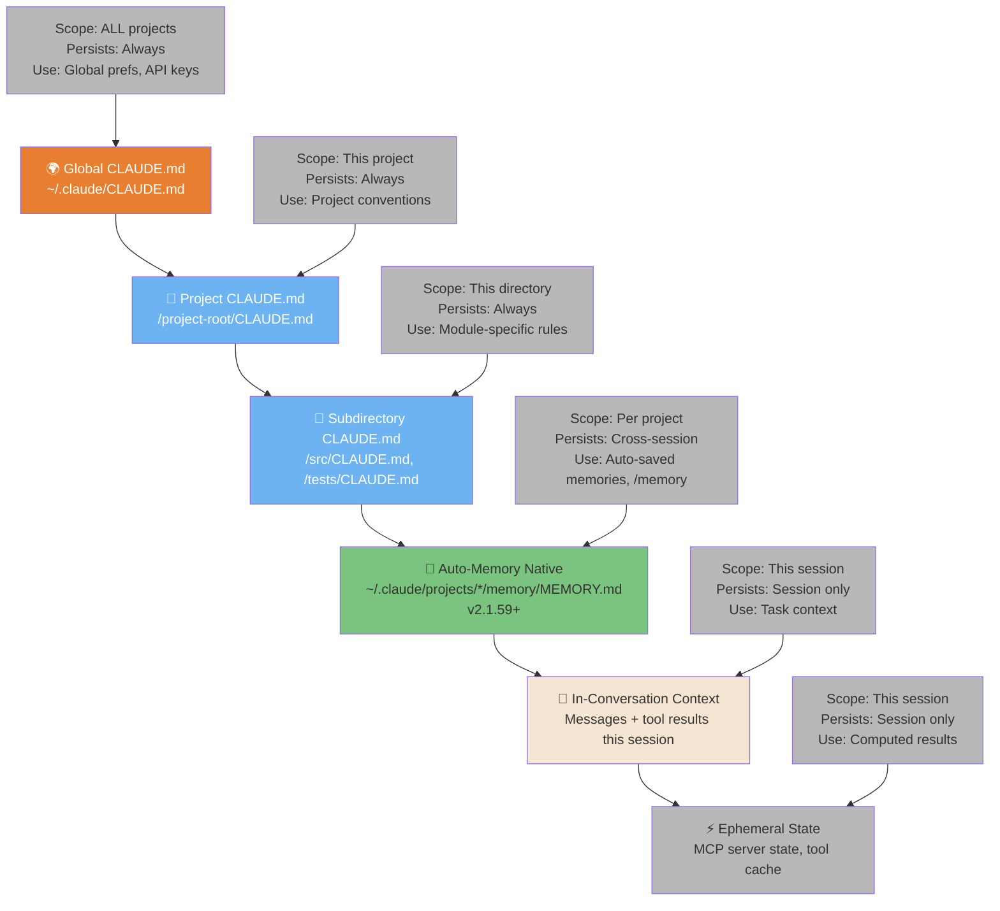
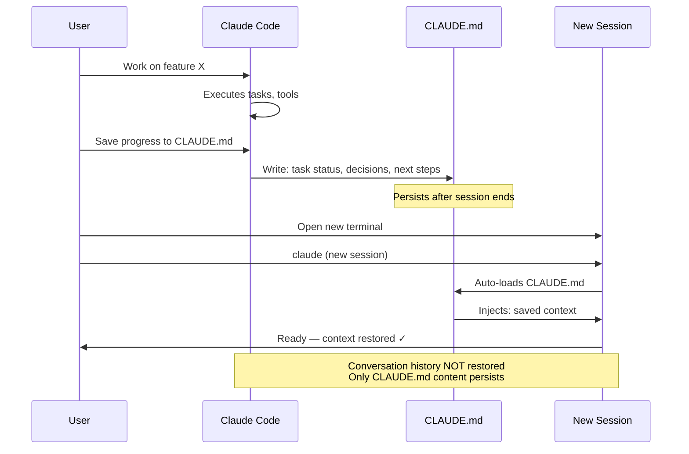

# 上下文与会话

Claude Code 如何在你的工作中管理上下文、内存和会话。

---

### 上下文管理区域

你的上下文窗口有 4 个不同的区域，每个区域需要不同的策略。了解你所处的区域可以防止上下文膨胀，并在长时间会话中保持响应质量。

```mermaid
flowchart LR
    subgraph GREEN["🟢 0–50% — Comfortable"]
        G1(Full capabilities<br/>available)
        G2(All tools active)
        G3(Rich responses)
    end

    subgraph BLUE["🔵 50–75% — Normal"]
        B1(Monitor usage)
        B2(Consider /compact<br/>for old threads)
        B3(Normal operation)
    end

    subgraph ORANGE["🟠 75–85% — Caution"]
        O1(Suggest /compact<br/>proactively)
        O2(Reduce verbosity)
        O3(Defer non-critical<br/>operations)
    end

    subgraph RED["🔴 85–100% — Critical"]
        R1(Auto-compact<br/>triggered at 80%)
        R2(Essential ops only)
        R3(Start new session<br/>for new tasks)
    end

    GREEN --> BLUE --> ORANGE --> RED

    style G1 fill:#7BC47F,color:#333
    style G2 fill:#7BC47F,color:#333
    style G3 fill:#7BC47F,color:#333
    style B1 fill:#6DB3F2,color:#fff
    style B2 fill:#6DB3F2,color:#fff
    style B3 fill:#6DB3F2,color:#fff
    style O1 fill:#E87E2F,color:#fff
    style O2 fill:#E87E2F,color:#fff
    style O3 fill:#E87E2F,color:#fff
    style R1 fill:#E85D5D,color:#fff
    style R2 fill:#E85D5D,color:#fff
    style R3 fill:#E85D5D,color:#fff

    click G1 href "https://github.com/FlorianBruniaux/claude-code-ultimate-guide/blob/main/guide/ultimate-guide.md#22-context-management" "0-50%: Full capabilities"
    click G2 href "https://github.com/FlorianBruniaux/claude-code-ultimate-guide/blob/main/guide/ultimate-guide.md#22-context-management" "0-50%: All tools active"
    click G3 href "https://github.com/FlorianBruniaux/claude-code-ultimate-guide/blob/main/guide/ultimate-guide.md#22-context-management" "0-50%: Rich responses"
    click B1 href "https://github.com/FlorianBruniaux/claude-code-ultimate-guide/blob/main/guide/ultimate-guide.md#22-context-management" "50-75%: Monitor usage"
    click B2 href "https://github.com/FlorianBruniaux/claude-code-ultimate-guide/blob/main/guide/ultimate-guide.md#22-context-management" "50-75%: Consider /compact"
    click B3 href "https://github.com/FlorianBruniaux/claude-code-ultimate-guide/blob/main/guide/ultimate-guide.md#22-context-management" "50-75%: Normal operation"
    click O1 href "https://github.com/FlorianBruniaux/claude-code-ultimate-guide/blob/main/guide/ultimate-guide.md#22-context-management" "75-85%: Suggest /compact"
    click O2 href "https://github.com/FlorianBruniaux/claude-code-ultimate-guide/blob/main/guide/ultimate-guide.md#22-context-management" "75-85%: Reduce verbosity"
    click O3 href "https://github.com/FlorianBruniaux/claude-code-ultimate-guide/blob/main/guide/ultimate-guide.md#22-context-management" "75-85%: Defer non-critical"
    click R1 href "https://github.com/FlorianBruniaux/claude-code-ultimate-guide/blob/main/guide/ultimate-guide.md#22-context-management" "85-100%: Auto-compact"
    click R2 href "https://github.com/FlorianBruniaux/claude-code-ultimate-guide/blob/main/guide/ultimate-guide.md#22-context-management" "85-100%: Essential ops only"
    click R3 href "https://github.com/FlorianBruniaux/claude-code-ultimate-guide/blob/main/guide/ultimate-guide.md#22-context-management" "85-100%: Start new session"
```



<details>
<summary>ASCII version</summary>

```
0%──────50%──────75%──85%──100%
│  Green  │  Blue  │ Orange│ Red│
│ Full    │ Normal │Suggest│Auto│
│ access  │Monitor │compact│cmp │
│         │        │Reduce │Ess.│
│         │        │verbos.│only│
```

</details>

> **Source**: [Context Management](../ultimate-guide.md#context-management) — Line ~1335

---

### 内存层次结构 — 6 种类型

Claude Code 有 6 种不同的内存类型，各有不同的作用域和持久性。针对每条信息使用正确的内存类型是实现高效会话的关键。



<details>
<summary>ASCII version</summary>

```
PERMANENT ──────────────────────────────── SESSION ONLY

~/.claude/CLAUDE.md              In-conversation context
      │                                      │
/project/CLAUDE.md               Ephemeral MCP state
      │
/subdir/CLAUDE.md
      │
Auto-Memory (MEMORY.md)  ← cross-session, per project

Higher = broader scope, always persists
Lower = narrower scope, survives restarts
Auto-Memory = persists cross-session, scoped per project
```

</details>

> **Source**: [Memory System](../ultimate-guide.md#memory-system) — Line ~3160 & ~3986 | Auto-Memory: v2.1.59+ (v3.30.0)

---

### 会话连续性 — 保存与恢复状态

会话不会在终端之间自动持久化上下文。此图展示了如何保存状态并在新会话或终端中恢复它，从而实现异步工作流。



<details>
<summary>ASCII version</summary>

```
Session 1                    CLAUDE.md         Session 2
─────────                    ─────────         ─────────
Work on task                    │               Open terminal
     │                          │                    │
Save progress ──────────────► Write             Load CLAUDE.md
                             status,           ◄── Auto-injected
                             decisions,
                             next steps
```

</details>

> **Source**: [Session Management](../ultimate-guide.md#session-management) — Line ~9477

---

### 新上下文的反模式与最佳实践

长时间会话会积累噪声，降低响应质量。此图展示了退化模式以及推荐的"专注会话"方法，该方法能保持性能。

```mermaid
flowchart TD
    subgraph BAD["❌ Anti-Pattern: Monolith Session"]
        B1([Start big session]) --> B2(Add task A)
        B2 --> B3(Add task B)
        B3 --> B4(Add task C)
        B4 --> B5{Context bloated<br/>>75%}
        B5 --> B6(Response quality<br/>degrades)
        B6 --> B7(Force-restart<br/>loses all context)
        style B1 fill:#E85D5D,color:#fff
        style B5 fill:#E85D5D,color:#fff
        style B6 fill:#E85D5D,color:#fff
        style B7 fill:#E85D5D,color:#fff
    end

    subgraph GOOD["✅ Best Practice: Focused Sessions"]
        G1([Start focused session]) --> G2(Complete task A)
        G2 --> G3{Natural<br/>checkpoint?}
        G3 -->|Yes| G4(Save to CLAUDE.md)
        G4 --> G5([New session for task B])
        G3 -->|No| G6{Context >75%?}
        G6 -->|Yes| G7(/compact)
        G7 --> G2
        G6 -->|No| G2
        style G1 fill:#7BC47F,color:#333
        style G4 fill:#7BC47F,color:#333
        style G5 fill:#7BC47F,color:#333
        style G3 fill:#E87E2F,color:#fff
        style G6 fill:#E87E2F,color:#fff
        style G7 fill:#6DB3F2,color:#fff
    end

    click B1 href "https://github.com/FlorianBruniaux/claude-code-ultimate-guide/blob/main/guide/ultimate-guide.md#22-context-management" "Anti-Pattern: Monolith Session"
    click B2 href "https://github.com/FlorianBruniaux/claude-code-ultimate-guide/blob/main/guide/ultimate-guide.md#22-context-management" "Add task A"
    click B3 href "https://github.com/FlorianBruniaux/claude-code-ultimate-guide/blob/main/guide/ultimate-guide.md#22-context-management" "Add task B"
    click B4 href "https://github.com/FlorianBruniaux/claude-code-ultimate-guide/blob/main/guide/ultimate-guide.md#22-context-management" "Add task C"
    click B5 href "https://github.com/FlorianBruniaux/claude-code-ultimate-guide/blob/main/guide/ultimate-guide.md#22-context-management" "Context bloated >75%"
    click B6 href "https://github.com/FlorianBruniaux/claude-code-ultimate-guide/blob/main/guide/ultimate-guide.md#22-context-management" "Response quality degrades"
    click B7 href "https://github.com/FlorianBruniaux/claude-code-ultimate-guide/blob/main/guide/ultimate-guide.md#22-context-management" "Force-restart — loses context"
    click G1 href "https://github.com/FlorianBruniaux/claude-code-ultimate-guide/blob/main/guide/ultimate-guide.md#22-context-management" "Best Practice: Focused Sessions"
    click G2 href "https://github.com/FlorianBruniaux/claude-code-ultimate-guide/blob/main/guide/ultimate-guide.md#22-context-management" "Complete task A"
    click G3 href "https://github.com/FlorianBruniaux/claude-code-ultimate-guide/blob/main/guide/ultimate-guide.md#22-context-management" "Natural checkpoint?"
    click G4 href "https://github.com/FlorianBruniaux/claude-code-ultimate-guide/blob/main/guide/ultimate-guide.md#31-memory-files-claudemd" "Save to CLAUDE.md"
    click G5 href "https://github.com/FlorianBruniaux/claude-code-ultimate-guide/blob/main/guide/ultimate-guide.md#22-context-management" "New session for task B"
    click G6 href "https://github.com/FlorianBruniaux/claude-code-ultimate-guide/blob/main/guide/ultimate-guide.md#22-context-management" "Context >75%?"
    click G7 href "https://github.com/FlorianBruniaux/claude-code-ultimate-guide/blob/main/guide/ultimate-guide.md#22-context-management" "/compact"
```



<details>
<summary>ASCII version</summary>

```
BAD: One giant session
Task A → Task B → Task C → Context bloat → Quality drop → Restart → Lost!

GOOD: Focused sessions
Task A ──► Checkpoint? ──Yes──► Save CLAUDE.md ──► New session for B
           │
           No
           │
         Context >75%? ──Yes──► /compact ──► Continue
           │
           No
           │
         Continue task
```

</details>

> **Source**: [Context Best Practices](../ultimate-guide.md#context-best-practices) — Line ~1525
