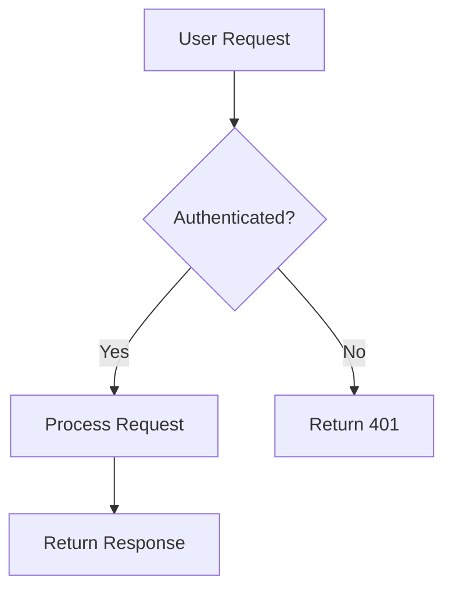
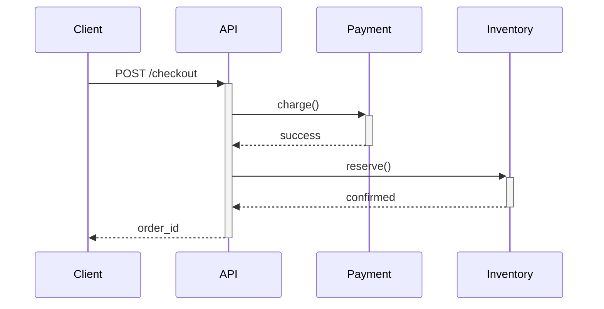
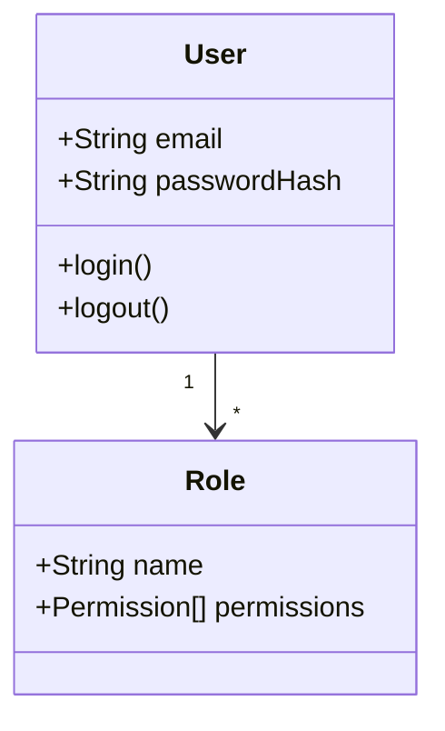

# 9. Advanced Patterns

_Quick jump:_ [The Trinity](#91-the-trinity) · [Composition Patterns](#92-composition-patterns) · [CI/CD Integration](#93-cicd-integration) · [IDE Integration](#94-ide-integration) · [Tight Feedback Loops](#95-tight-feedback-loops)

---

> **Prerequisite**: Read [4.1 What Are Agents](#41-what-are-agents) and [3.1 CLAUDE.md](#31-memory-files-claudemd) before diving into 9.17-9.20.

> **New to Claude Code?** Start with Ch.1-3 first. Chapter 9 makes most sense after 1-2 months of daily use.

## 📌 Section 9 TL;DR (3 minutes)

**What you'll learn**: Production-grade workflows that combine multiple Claude Code features.

### Pattern Categories:

**🎯 The Trinity (9.1)** — Ultimate workflow: Plan Mode → Extended Thinking → Sequential MCP
- When: Architecture decisions, complex refactoring, critical systems
- Why: Maximum reasoning power + safe exploration

**🔄 Integration Patterns (9.2-9.4)**
- Composition: Agents + Skills + Hooks working together
- CI/CD: GitHub Actions, automated reviews, quality gates
- IDE: VS Code + Claude Code = seamless flow

**⚡ Productivity Patterns (9.5-9.8)**
- Tight feedback loops: Test-driven with instant validation
- Todo as mirrors: Keep context aligned with reality
- Vibe coding: Skeleton → iterate → production

**🎨 Quality Patterns (9.9-9.11)**
- Batch operations: Process multiple files efficiently
- Continuous improvement: Refine over multiple sessions
- Common pitfalls: Learn from mistakes (Do/Don't lists)

### When to Use This Section:
- ✅ You're productive with basics and want mastery
- ✅ You're setting up team workflows or CI/CD
- ✅ You hit limits of simple "ask Claude" approach
- ❌ You're still learning basics (finish Sections 1-8 first)

---

**Reading time**: 20 minutes
**Skill level**: Month 1+
**Goal**: Master power-user techniques

---

## 🌍 Industry Context: 2026 Agentic Coding Trends

> **Source**: [Anthropic "2026 Agentic Coding Trends Report"](https://resources.anthropic.com/hubfs/2026%20Agentic%20Coding%20Trends%20Report.pdf) (Feb 2026)

Les patterns de cette section reflètent l'évolution de l'industrie documentée par Anthropic auprès de 5000+ organisations.

### 📊 Données d'Adoption Validées

| Pattern | Adoption Timeline | Productivity Gain | Business Impact |
|---------|------------------|-------------------|-----------------|
| **Agent Teams** (9.20) | 3-6 mois | 50-67% | Timeline: semaines → jours |
| **Multi-Instance** (9.17) | 1-2 mois | 2x output | Cost: $500-1K/month |
| **Sandbox Isolation** (guide/sandbox-native.md) | Immediate | Security baseline | Compliance requirement |

### 🎯 Research Insights (Anthropic Internal Study)

- **60% of work** uses AI (vs 0% en 2023)
- **0-20% "fully delegated"** → Collaboration centrale, pas remplacement
- **67% more PRs merged** per engineer per day
- **27% new work** wouldn't be done without AI (exploratory, nice-to-have)

### ⚠️ Anti-Patterns Entreprise

**Over-Delegation** (trop d'agents):
- Symptôme: Context switching cost > productivity gain
- Limite: >5 agents simultanés = coordination overhead
- Fix: Start 1-2 agents, scale progressivement

**Premature Automation**:
- Symptôme: Automatiser workflow non maîtrisé manuellement
- Fix: Manual → Semi-auto → Full-auto (progressive)

**Tool Sprawl** (MCP prolifération):
- Symptôme: >10 MCP servers, conflicts, maintenance burden
- Fix: Start core stack (Serena, Context7, Sequential), add selectively

### 📚 Case Studies Industrie

- **Fountain** (workforce mgmt): 50% faster screening via hierarchical multi-agent
- **Rakuten** (tech): 7h autonomous vLLM implementation (12.5M lines, 99.9% accuracy)
- **CRED** (fintech): 2x execution speed, quality maintained (15M users)
- **TELUS** (telecom): 500K hours saved, 13K custom solutions
- **Zapier** (automation): 89% adoption, 800+ internal agents

### 🔗 Navigation

Chaque pattern ci-dessous inclut:
- ✅ **Industry validation** (stats adoption, ROI)
- ✅ **Practical guide** (workflows step-by-step)
- ✅ **Anti-patterns** (pitfalls to avoid)

**Full evaluation**: [`docs/resource-evaluations/anthropic-2026-agentic-coding-trends.md`](../docs/resource-evaluations/anthropic-2026-agentic-coding-trends.md)

---

## 9.1 The Trinity

The most powerful Claude Code pattern combines three techniques:

```
┌─────────────────────────────────────────────────────────┐
│                      THE TRINITY                        │
├─────────────────────────────────────────────────────────┤
│                                                         │
│   ┌─────────────┐                                       │
│   │ Plan Mode   │  Safe exploration without changes     │
│   └──────┬──────┘                                       │
│          │                                              │
│          ▼                                              │
│   ┌─────────────┐                                       │
│   │ Ext.Thinking│  Deep analysis (Opus 4.5/4.6, adaptive in 4.6) │
│   └──────┬──────┘                                       │
│          │                                              │
│          ▼                                              │
│   ┌─────────────────────┐                               │
│   │ Sequential Thinking │  Structured multi-step reason │
│   └─────────────────────┘                               │
│                                                         │
│   Combined: Maximum understanding before action         │
│                                                         │
└─────────────────────────────────────────────────────────┘
```

### When to Use the Trinity

| Situation | Use Trinity? |
|-----------|--------------|
| Fixing a typo | ❌ Overkill |
| Adding a feature | Maybe |
| Debugging complex issue | ✅ Yes |
| Architectural decision | ✅ Yes |
| Legacy system modernization | ✅ Yes |

### Extended Thinking (Opus 4.5+) & Adaptive Thinking (Opus 4.6+)

> **⚠️ Breaking Change (Opus 4.6, Feb 2026)**: Opus 4.6 replaces **budget-based thinking** with **Adaptive Thinking**, which automatically decides when to use deep reasoning based on query complexity. The `budget_tokens` parameter is **deprecated** on Opus 4.6+.

#### Evolution Timeline

| Version | Thinking Approach | Control Method |
|---------|-------------------|----------------|
| **Opus 4.5** (pre-v2.0.67) | Opt-in, keyword-triggered (~4K/10K/32K tokens) | Prompt keywords |
| **Opus 4.5** (v2.0.67+) | Always-on at max budget | Alt+T toggle, `/config` |
| **Opus 4.6** (Feb 2026) | **Adaptive thinking** (dynamic depth) | `effort` parameter (API), Alt+T (CLI) |
| **Opus 4.7** (Apr 2026) | **Adaptive thinking + xhigh** (new effort level) | `effort` parameter (API), Alt+T (CLI) |

#### Adaptive Thinking (Opus 4.6 and Opus 4.7)

**How it works**: The `effort` parameter controls the model's **overall computational budget** — not just thinking tokens, but the entire response including text generation and tool calls. The model dynamically allocates this budget based on query complexity.

**Key insight**: `effort` affects everything, even when thinking is disabled. Lower effort = fewer tool calls, more concise text. Higher effort = more tool calls with explanations, detailed analysis.

**Effort levels** (API only, official descriptions):
- **`max`**: Maximum capability, no constraints. **Opus 4.7+ only** (returns error on other models). Cross-system reasoning, irreversible decisions.
  > Example: `"Analyze the microservices event pipeline for race conditions across order-service, inventory-service, and notification-service"`
- **`xhigh`** _(Opus 4.7+, v2.1.114+)_: Extra-high effort, between `high` and `max`. **Default in Claude Code (all plans) with Opus 4.7.** Use when you want more reasoning depth without full `max` latency.
  > Example: `"Debug the race condition in the distributed job queue with concurrent writes"`
- **`high`** (default for API): Complex reasoning, coding, agentic tasks. Best for production workflows requiring deep analysis.
  > Example: `"Redesign error handling in the payment module: add retry logic, partial failure recovery, and idempotency guarantees"`
- **`medium`**: Balance between speed, cost, and performance. Good for agentic tasks with moderate complexity.
  > Example: `"Convert fetchUser() in api/users.ts from callbacks to async/await"`
- **`low`**: Most efficient. Ideal for classification, lookups, sub-agents, or tasks where speed matters more than depth.
  > Example: `"Rename getUserById to findUserById across src/"`

> See [Section 2.5 Model Selection & Thinking Guide](#25-model-selection--thinking-guide) for a complete decision table with effort, model, and cost estimates.

**API syntax**:
```python
response = client.messages.create(
    model="claude-opus-4-7",
    max_tokens=16000,
    output_config={"effort": "xhigh"},  # low|medium|high|xhigh|max
    messages=[{"role": "user", "content": "Analyze..."}]
)
```

**Effort and Tool Use**:

The `effort` parameter significantly impacts how Claude uses tools:

- **`low` effort**: Combines operations to minimize tool calls. No explanatory preamble before actions. Faster, more efficient for simple tasks.
- **`high` effort**: More tool calls with detailed explanations. Describes the plan before executing. Provides comprehensive summaries after operations. Better for complex workflows requiring transparency.

**Example**: With `low` effort, Claude might read 3 files and edit them in one flow. With `high` effort, Claude explains why it's reading those files, what it's looking for, then provides a detailed summary of changes made.

**Relationship between `effort` and thinking**:

- **Opus 4.6**: `effort` is the **recommended control** for thinking depth. The `budget_tokens` parameter is **deprecated** on 4.6 (though still functional for backward compatibility).
- **Opus 4.5**: `effort` works **in parallel** with `budget_tokens`. Both parameters are supported and affect different aspects of the response.
- **Without thinking enabled**: `effort` still controls text generation and tool calls. It's not a thinking-only parameter.

**CLI usage**: Three methods to control effort level in Claude Code:
1. **`/model` command** with left/right arrow keys to adjust the effort slider (`low`, `medium`, `high`)
2. **`CLAUDE_CODE_EFFORT_LEVEL`** environment variable (set before launching Claude)
3. **`effortLevel`** field in settings.json (persistent across sessions)

Alt+T toggles thinking on/off globally (separate from effort level).

#### Controlling Thinking Mode

| Method | Opus 4.5 | Opus 4.6 | Persistence |
|--------|----------|----------|-------------|
| **Alt+T** (Option+T on macOS) | Toggle on/off | Toggle on/off | Current session |
| **/config** → Thinking mode | Enable/disable globally | Enable/disable globally | Across sessions |
| **`/model` slider** (left/right arrows) | `low\|medium\|high` | `low\|medium\|high` | Current session |
| **`CLAUDE_CODE_EFFORT_LEVEL`** env var | `low\|medium\|high` | `low\|medium\|high` | Shell session |
| **`effortLevel`** in settings.json | `low\|medium\|high` | `low\|medium\|high` | Permanent |
| **Ctrl+O** | View thinking blocks | View thinking blocks | Display only |

#### Cost Implications

Thinking tokens are billed. With adaptive thinking:
- **Opus 4.6**: Thinking usage varies dynamically (less predictable than fixed budget)
- **Simple tasks**: Consider Alt+T to disable → faster responses, lower cost
- **Complex tasks**: Leave enabled → better reasoning, adaptive depth
- **Sonnet/Haiku**: No extended thinking available (Opus 4.5/4.6 only)

#### Migration for Existing Users

**Before** (no longer needed):
```bash
claude -p "Ultrathink. Analyze this architecture."
```

**After** (thinking is already max by default):
```bash
claude -p "Analyze this architecture."
```

**To disable thinking for simple tasks**: Press Alt+T before sending, or use Sonnet.

#### Legacy Keywords Reference

> These keywords were functional before v2.0.67. They are now recognized visually but have **no behavioral effect**.

| Keyword | Previous Effect | Current Effect |
|---------|-----------------|----------------|
| "Think" | ~4K tokens | Cosmetic only |
| "Think hard" | ~10K tokens | Cosmetic only |
| "Ultrathink" | ~32K tokens | Cosmetic only |

#### API Breaking Changes (Opus 4.6)

**Removed features**:
- **`assistant-prefill`**: Deprecated on Opus 4.6. Previously allowed pre-filling Claude's response to guide output format. Now unsupported — use system prompts or examples instead.

**New features**:
- **Fast mode API**: Add `speed: "fast"` + beta header `fast-mode-2026-02-01` for 2.5x faster responses (6x cost)
  ```python
  response = client.messages.create(
      model="claude-opus-4-6",
      speed="fast",  # 2.5x faster, 6x price
      headers={"anthropic-beta": "fast-mode-2026-02-01"},
      messages=[...]
  )
  ```

**Migration**:
- If using `assistant-prefill`: Replace with explicit instructions in system prompt
- For speed: Use fast mode API or `/fast` command in CLI

### Example: Using the Trinity

```
You: /plan

Let's analyze this legacy authentication system before we touch anything.
[Thinking mode is enabled by default with Opus 4.5 - no keyword needed]

[Claude enters Plan Mode and does deep analysis]

Claude: I've analyzed the auth system. Here's what I found:
- 47 files depend on the current auth module
- 3 critical security issues
- Migration path needs 4 phases

Ready to implement?

You: /execute
Let's start with phase 1
```

## 9.2 Composition Patterns

### Multi-Agent Delegation

Launch multiple agents for different aspects:

```
You: For this feature, I need:
1. Backend architect to design the API
2. Security reviewer to audit the design
3. Test engineer to plan the tests

Run these in parallel.
```

Claude will coordinate:
- Backend architect designs API
- Security reviewer audits (in parallel)
- Test engineer plans tests (in parallel)

### Skill Stacking

Combine multiple skills for complex tasks:

```yaml
# code-reviewer.md
skills:
  - security-guardian
  - performance-patterns
  - accessibility-checker
```

The reviewer now has all three knowledge domains.

### The "Rev the Engine" Pattern

For quality work, use multiple rounds of critique:

```
You: Write the function, then critique it, then improve it.
Do this 3 times.

Round 1: [Initial implementation]
Critique: [What's wrong]
Improvement: [Better version]

Round 2: [Improved implementation]
Critique: [What's still wrong]
Improvement: [Even better version]

Round 3: [Final implementation]
Final check: [Verification]
```

### The "Stack Maximum" Pattern

For critical work, combine everything:

```
1. Plan Mode + Extended Thinking → Deep exploration
2. Multiple Agents → Specialized analysis
3. Sequential Thinking → Structured reasoning
4. Rev the Engine → Iterative improvement
5. Code Review Agent → Final validation
```

## 9.3 CI/CD Integration

> **📖 Complete Workflow Guide**: See [GitHub Actions Workflows](./workflows/github-actions.md) for 5 production-ready patterns using the official `anthropics/claude-code-action` (PR review, triage, security, scheduled maintenance).

> **Code Review (Teams/Enterprise)**: For automated PR review without manual prompting, see [Code Review](./workflows/code-review.md) — Anthropic's multi-agent review feature that posts inline GitHub comments on every PR.

> **Billing (June 15, 2026):** All workflows in this section — headless mode (`claude -p`), GitHub Actions, Agent SDK — fall into the new **programmatic billing bucket** and consume from a monthly credit equal to your subscription price ($20/$100/$200). Once exhausted, usage is billed at API token rates. Audit your CI/CD usage with `ccusage` before the change takes effect. See [§9.13 — The Interactive/Programmatic Billing Split](#the-interactiveprogrammatic-billing-split-effective-june-15-2026) for details and a decision framework.

### Headless Mode

Run Claude Code without interactive prompts:

```bash
# Basic headless execution
claude -p "Run the tests and report results"

# With timeout
claude -p --timeout 300 "Build the project"

# With specific model
claude -p --model sonnet "Analyze code quality"
```

### Unix Piping Workflows

Claude Code supports **Unix pipe operations**, enabling powerful shell integration for automated code analysis and transformation.

**How piping works**:

```bash
# Pipe content to Claude with a prompt
cat file.txt | claude -p 'analyze this code'

# Pipe command output for analysis
git diff | claude -p 'explain these changes'

# Chain commands with Claude
npm test 2>&1 | claude -p 'summarize test failures and suggest fixes'
```

**Common patterns**:

1. **Code review automation**:
   ```bash
   git diff main...feature-branch | claude -p 'Review this diff for security issues'
   ```

2. **Log analysis**:
   ```bash
   tail -n 100 /var/log/app.log | claude -p 'Find the root cause of errors'
   ```

3. **Test output parsing**:
   ```bash
   npm test 2>&1 | claude -p 'Create a summary of failing tests with priority order'
   ```

4. **Documentation generation**:
   ```bash
   cat src/api/*.ts | claude -p 'Generate API documentation in Markdown'
   ```

5. **Batch file analysis**:
   ```bash
   find . -name "*.js" -exec cat {} \; | claude -p 'Identify unused dependencies'
   ```

**Using with `--output-format`**:

```bash
# Get structured JSON output
git status --short | claude -p 'Categorize changes' --output-format json

# Stream JSON for real-time processing
cat large-file.txt | claude -p 'Analyze line by line' --output-format stream-json
```

**Best practices**:

- **Be specific**: Clear prompts yield better results
  ```bash
  # Good: Specific task
  git diff | claude -p 'List all function signature changes'

  # Less effective: Vague request
  git diff | claude -p 'analyze this'
  ```

- **Limit input size**: Pipe only relevant content to avoid context overload
  ```bash
  # Good: Filtered scope
  git diff --name-only | head -n 10 | xargs cat | claude -p 'review'

  # Risky: Could exceed context
  cat entire-codebase/* | claude -p 'review'
  ```

- **Use non-interactive mode**: Add `-p` for automation
  ```bash
  cat file.txt | claude -p -p 'fix linting errors' > output.txt
  ```

- **Combine with jq for JSON**: Parse Claude's JSON output
  ```bash
  echo "const x = 1" | claude -p 'analyze' --output-format json | jq '.suggestions[]'
  ```

**Output format control**:

The `--output-format` flag controls Claude's response format:

| Format | Use Case | Example |
|--------|----------|---------|
| `text` | Human-readable output (default) | `claude -p 'explain' --output-format text` |
| `json` | Machine-parseable structured data | `claude -p 'analyze' --output-format json` |
| `stream-json` | Real-time streaming for large outputs | `claude -p 'transform' --output-format stream-json` |

**Example JSON workflow**:

```bash
# Get structured analysis
git log --oneline -10 | claude -p 'Categorize commits by type' --output-format json

# Output:
# {
#   "categories": {
#     "features": ["add user auth", "new dashboard"],
#     "fixes": ["fix login bug", "resolve crash"],
#     "chores": ["update deps", "refactor tests"]
#   },
#   "summary": "10 commits: 2 features, 2 fixes, 6 chores"
# }
```

**Integration with build scripts** (`package.json`):

```json
{
  "scripts": {
    "claude-review": "git diff main | claude -p 'Review for security issues' --output-format json > review.json",
    "claude-test-summary": "npm test 2>&1 | claude -p -p 'Summarize failures and suggest fixes'",
    "claude-docs": "cat src/**/*.ts | claude -p 'Generate API documentation' > API.md",
    "precommit-check": "git diff --cached | claude -p -p 'Check for secrets or anti-patterns' && git diff --cached | prettier --check"
  }
}
```

**CI/CD integration example**:

```yaml
# .github/workflows/claude-review.yml
name: AI Code Review
on: [pull_request]

jobs:
  claude-review:
    runs-on: ubuntu-latest
    steps:
      - uses: actions/checkout@v4
        with:
          fetch-depth: 0

      - name: Install Claude Code
        run: npm install -g @anthropic-ai/claude-code

      - name: Run Claude Review
        env:
          ANTHROPIC_API_KEY: ${{ secrets.ANTHROPIC_API_KEY }}
        run: |
          git diff origin/main...HEAD | \
            claude -p -p 'Review this PR diff for security issues, performance problems, and code quality. Format as JSON.' \
            --output-format json > review.json

      - name: Comment on PR
        uses: actions/github-script@v7
        with:
          script: |
            const fs = require('fs');
            const review = JSON.parse(fs.readFileSync('review.json', 'utf8'));
            github.rest.issues.createComment({
              issue_number: context.issue.number,
              owner: context.repo.owner,
              repo: context.repo.repo,
              body: `## 🤖 Claude Code Review\n\n${review.summary}`
            });
```

**Limitations**:

- **Context size**: Large pipes may exceed token limits (monitor with `/status`)
- **Interactive prompts**: Use `-p` for automation to avoid blocking
- **Error handling**: Pipe failures don't always propagate; add `set -e` for strict mode
- **API costs**: Automated pipes consume API credits; monitor usage with `ccusage`

> **💡 Pro tip**: Combine piping with aliases for frequently used patterns:
> ```bash
> # Add to ~/.bashrc or ~/.zshrc
> alias claude-review='git diff | claude -p "Review for bugs and suggest improvements"'
> alias claude-logs='tail -f /var/log/app.log | claude -p "Monitor for errors and alert on critical issues"'
> ```

> **Source**: [DeepTo Claude Code Guide - Unix Piping](https://cc.deeptoai.com/docs/en/best-practices/claude-code-comprehensive-guide)

### Git Hooks Integration

> **Windows Note**: Git hooks run in Git Bash on Windows, so the bash syntax below works. Alternatively, you can create `.cmd` or `.ps1` versions and reference them from a wrapper script.

**Pre-commit hook**:

```bash
#!/bin/bash
# .git/hooks/pre-commit

# Run Claude Code for commit message validation
COMMIT_MSG=$(cat "$1")
claude -p "Is this commit message good? '$COMMIT_MSG'. Reply YES or NO with reason."
```

**Pre-push hook**:

```bash
#!/bin/bash
# .git/hooks/pre-push

# Security check before push
claude -p "Scan staged files for secrets and security issues. Exit 1 if found."
EXIT_CODE=$?

if [ $EXIT_CODE -ne 0 ]; then
    echo "Security issues found. Push blocked."
    exit 1
fi
```

### GitHub Actions Integration

```yaml
# .github/workflows/claude-review.yml
name: Claude Code Review

on:
  pull_request:
    types: [opened, synchronize]

jobs:
  review:
    runs-on: ubuntu-latest
    steps:
      - uses: actions/checkout@v4

      - name: Install Claude Code
        run: npm install -g @anthropic-ai/claude-code

      - name: Run Review
        env:
          ANTHROPIC_API_KEY: ${{ secrets.ANTHROPIC_API_KEY }}
        run: |
          claude -p "Review the changes in this PR. \
            Focus on security, performance, and code quality. \
            Output as markdown." --bare
```

> **`--bare` flag for CI scripting (v2.1.81+)**: Add `--bare` to any `claude -p` call to get a deterministic, hermetic execution environment. It disables hooks, LSP, plugin sync, and skill directory scanning — ensuring local developer config never bleaks into CI. Requires `ANTHROPIC_API_KEY` (no OAuth/keychain). Also disables auto-memory.
>
> ```bash
> # Without --bare: picks up local hooks, plugins, skills — non-deterministic in CI
> claude -p "run tests"
>
> # With --bare: clean slate, API key only
> ANTHROPIC_API_KEY=$SECRET claude -p "run tests" --bare
> ```

#### Debugging Failed CI Runs

When GitHub Actions fails, use the `gh` CLI to investigate without leaving your terminal:

**Quick investigation workflow**:

```bash
# List recent workflow runs
gh run list --limit 10

# View specific run details
gh run view <run-id>

# View logs for failed run
gh run view <run-id> --log-failed

# Download logs for detailed analysis
gh run download <run-id>
```

**Common debugging commands**:

| Command | Purpose |
|---------|---------|
| `gh run list --workflow=test.yml` | Filter by workflow file |
| `gh run view --job=<job-id>` | View specific job details |
| `gh run watch` | Watch the current run in real-time |
| `gh run rerun <run-id>` | Retry a failed run |
| `gh run rerun <run-id> --failed` | Retry only failed jobs |

**Example: Investigate test failures**:

```bash
# Get the latest failed run
FAILED_RUN=$(gh run list --status failure --limit 1 --json databaseId --jq '.[0].databaseId')

# View the failure
gh run view $FAILED_RUN --log-failed

# Ask Claude to analyze
gh run view $FAILED_RUN --log-failed | claude -p "Analyze this CI failure and suggest fixes"
```

**Pro tip**: Combine with Claude Code for automated debugging:

```bash
# Fetch failures and auto-fix
gh run view --log-failed | claude -p "
  Analyze these test failures.
  Identify the root cause.
  Propose fixes for each failing test.
  Output as actionable steps.
"
```

This workflow saves time compared to navigating GitHub's web UI and enables faster iteration on CI failures.

### Verify Gate Pattern

Before creating a PR, ensure all local checks pass. This prevents wasted CI cycles and review time.

**The pattern**:

```
Build ✓ → Lint ✓ → Test ✓ → Type-check ✓ → THEN create PR
```

**Implementation as a command** (`.claude/commands/complete-task.md`):

```markdown
# Complete Task

Run the full verification gate before creating a PR:

1. **Build**: Run `pnpm build` - must succeed
2. **Lint**: Run `pnpm lint` - must have zero errors
3. **Test**: Run `pnpm test` - all tests must pass
4. **Type-check**: Run `pnpm typecheck` - no type errors

If ANY step fails:
- Stop immediately
- Report what failed and why
- Suggest fixes
- Do NOT proceed to PR creation

If ALL steps pass:
- Create the PR with `gh pr create`
- Wait for CI with `gh pr checks --watch`
- If CI fails, fetch feedback and auto-fix
- Loop until mergeable or blocked
```

**Autonomous retry loop**:

```
┌─────────────────────────────────────────┐
│         VERIFY GATE + AUTO-FIX          │
├─────────────────────────────────────────┤
│                                         │
│   Local checks (build/lint/test)        │
│        │                                │
│        ▼ FAIL?                          │
│   ┌─────────┐                           │
│   │ Auto-fix│ ──► Re-run checks         │
│   └─────────┘                           │
│        │                                │
│        ▼ PASS                           │
│   Create PR                             │
│        │                                │
│        ▼                                │
│   Wait for CI (gh pr checks --watch)    │
│        │                                │
│        ▼ FAIL?                          │
│   ┌─────────────────────┐               │
│   │ Fetch CI feedback   │               │
│   │ (CodeRabbit, etc.)  │               │
│   └─────────────────────┘               │
│        │                                │
│        ▼                                │
│   Auto-fix + push + loop                │
│        │                                │
│        ▼                                │
│   PR mergeable OR blocked (ask human)   │
│                                         │
└─────────────────────────────────────────┘
```

**Fetching CI feedback** (GitHub GraphQL):

```bash
# Get PR review status and comments
gh api graphql -f query='
  query($pr: Int!) {
    repository(owner: "OWNER", name: "REPO") {
      pullRequest(number: $pr) {
        reviewDecision
        reviewThreads(first: 100) {
          nodes {
            isResolved
            comments(first: 1) {
              nodes { body }
            }
          }
        }
      }
    }
  }' -F pr=$PR_NUMBER
```

> Inspired by [Nick Tune's Coding Agent Development Workflows](https://medium.com/nick-tune-tech-strategy-blog/coding-agent-development-workflows-af52e6f912aa)

### Release Notes Generation

Automate release notes and changelog generation using Claude Code.

**Why automate release notes?**
- Consistent format across releases
- Captures technical details from commits
- Translates technical changes to user-facing language
- Saves 30-60 minutes per release

**Pattern**: Git commits → Claude analysis → User-friendly release notes

#### Approach 1: Command-Based

Create `.claude/commands/release-notes.md`:

```markdown
# Generate Release Notes

Analyze git commits since last release and generate release notes.

## Process

1. **Get commits since last tag**:
   ```bash
   git log $(git describe --tags --abbrev=0)..HEAD --oneline
   ```

2. **Read full commit details**:
   - Include commit messages
   - Include file changes
   - Include PR numbers if present

3. **Categorize changes**:
   - **✨ Features** - New functionality
   - **🐛 Bug Fixes** - Issue resolutions
   - **⚡ Performance** - Speed/efficiency improvements
   - **🔒 Security** - Security patches
   - **📝 Documentation** - Doc updates
   - **🔧 Maintenance** - Refactoring, dependencies
   - **⚠️ Breaking Changes** - API changes (highlight prominently)

4. **Generate three versions**:

   **A. CHANGELOG.md format** (technical, for developers):
   ```markdown
   ## [Version] - YYYY-MM-DD

   ### Added
   - Feature description with PR reference

   ### Fixed
   - Bug fix description

   ### Changed
   - Breaking change with migration guide
   ```

   **B. GitHub Release Notes** (balanced, technical + context):
   ```markdown
   ## What's New

   Brief summary of the release

   ### ✨ New Features
   - User-facing feature description

   ### 🐛 Bug Fixes
   - Issue resolution description

   ### ⚠️ Breaking Changes
   - Migration instructions

   **Full Changelog**: v1.0.0...v1.1.0
   ```

   **C. User Announcement** (non-technical, benefits-focused):
   ```markdown
   We're excited to announce [Version]!

   **Highlights**:
   - What users can now do
   - How it helps them
   - When to use it

   [Link to full release notes]
   ```

5. **Output files**:
   - Prepend to `CHANGELOG.md`
   - Save to `release-notes-[version].md`
   - Copy "User Announcement" to clipboard for Slack/blog

## Verification

- Check for missed breaking changes
- Verify all PR references are valid
- Ensure migration guides are clear
```

#### Approach 2: CI/CD Automation

Add to `.github/workflows/release.yml`:

```yaml
name: Release

on:
  push:
    tags:
      - 'v*'

jobs:
  release:
    runs-on: ubuntu-latest
    steps:
      - uses: actions/checkout@v4
        with:
          fetch-depth: 0  # Full history for changelog

      - name: Generate Release Notes
        env:
          ANTHROPIC_API_KEY: ${{ secrets.ANTHROPIC_API_KEY }}
          GITHUB_TOKEN: ${{ secrets.GITHUB_TOKEN }}
        run: |
          # Get version from tag
          VERSION=${GITHUB_REF#refs/tags/}

          # Generate with Claude
          claude -p "Generate release notes for $VERSION. \
            Analyze commits since last tag. \
            Output in GitHub Release format. \
            Save to release-notes.md"

          # Create GitHub Release
          gh release create $VERSION \
            --title "Release $VERSION" \
            --notes-file release-notes.md

      - name: Update CHANGELOG.md
        run: |
          # Prepend to CHANGELOG
          cat release-notes.md CHANGELOG.md > CHANGELOG.tmp
          mv CHANGELOG.tmp CHANGELOG.md

          # Commit back
          git config user.name "github-actions[bot]"
          git config user.email "github-actions[bot]@users.noreply.github.com"
          git add CHANGELOG.md
          git commit -m "docs: update changelog for $VERSION"
          git push
```

#### Approach 3: Interactive Workflow

For more control, use an interactive session:

```bash
# 1. Start Claude Code
claude

# 2. Request release notes
You: "Generate release notes for v2.0.0"

# 3. Claude will:
# - Run git log to get commits
# - Ask clarifying questions:
#   - "Is this a major/minor/patch release?"
#   - "Any breaking changes users should know?"
#   - "Target audience for announcement?"

# 4. Review and refine
You: "Add more detail to the authentication feature"

# 5. Finalize
You: "Save these notes and update CHANGELOG.md"
```

#### Best Practices

**Before generation:**
- ✅ Ensure commits follow conventional commits format
- ✅ All PRs have been merged
- ✅ Version number decided (semver)

**During generation:**
- ✅ Review for accuracy (Claude might miss context)
- ✅ Add migration guides for breaking changes
- ✅ Include upgrade instructions if needed

**After generation:**
- ✅ Cross-reference with closed issues/PRs
- ✅ Test upgrade path on a staging project
- ✅ Share draft with team before publishing

#### Example Output

Given these commits:
```
feat: add user avatar upload (PR #123)
fix: resolve login timeout issue (PR #124)
perf: optimize database queries by 40% (PR #125)
BREAKING: change API endpoint from /api/v1 to /v2 (PR #126)
```

Claude generates:

**CHANGELOG.md** (technical):
```markdown
## [2.0.0] - 2025-01-10

### Added
- User avatar upload functionality (#123)

### Fixed
- Login timeout issue affecting mobile users (#124)

### Performance
- Optimized database queries, reducing load time by 40% (#125)

### Breaking Changes
- **API Endpoints**: Migrated from `/api/v1/*` to `/v2/*`
  - Update client code: replace `/api/v1/` with `/v2/`
  - Old endpoints will return 410 Gone after 2025-02-01
  - Migration guide: docs/migration-v2.md (#126)
```

**GitHub Release** (balanced):
```markdown
## What's New in v2.0.0

This release brings performance improvements, bug fixes, and a new avatar feature.

### ✨ New Features
- **Avatar Upload**: Users can now upload custom profile pictures

### 🐛 Bug Fixes
- Fixed login timeout issue that affected some mobile users

### ⚡ Performance
- Database queries are now 40% faster

### ⚠️ Breaking Changes
- **API Endpoint Migration**: All endpoints have moved from `/api/v1` to `/v2`
  - **Action Required**: Update your API client code
  - **Timeline**: Old endpoints will stop working on February 1, 2025
  - **Migration Guide**: [See docs/migration-v2.md](./docs/migration-v2.md)

**Full Changelog**: v1.9.0...v2.0.0
```

**User Announcement** (non-technical):
```markdown
📢 Version 2.0 is here!

We've made your experience faster and more personal:

✨ **Customize Your Profile** - Upload your own avatar
⚡ **Lightning Fast** - Pages load 40% faster
🐛 **More Reliable** - Fixed the login timeout issue

**For Developers**: This is a breaking release. See our migration guide for API changes.

[Read full release notes →]
```

#### Common Issues

**"Release notes are too technical"**
- Solution: Specify audience in prompt: "Generate for non-technical users"

**"Claude missed a breaking change"**
- Solution: Explicitly list breaking changes in prompt
- Better: Use "BREAKING:" prefix in commit messages

**"Generated notes are generic"**
- Solution: Provide more context: "This release focuses on mobile performance"

**"Commits are messy/unclear"**
- Solution: Clean up commit history before generation (interactive rebase)
- Better: Enforce commit message format with git hooks

### Changelog Fragments: Per-PR Enforcement Pattern

An alternative to generating release notes from commits is to capture the context _while implementing_, not at release time. The "changelog fragments" pattern replaces a shared `CHANGELOG.md` with one YAML file per PR, accumulated in `changelog/fragments/`, assembled automatically at release.

**The core problem with commit-based approaches**: by the time you run `git log` to generate release notes, context is gone. The developer who fixed a race condition three weeks ago is the only one who understood the impact. The commit message says `fix SSE handling`.

The fragments pattern solves this with 3 enforcement layers:

**Layer 1 — CLAUDE.md rule**: Load a `git-workflow.md` rule that encodes the full fragment workflow. When a developer asks Claude Code to "create the PR," it reads the diff, infers type/scope/title, generates the YAML, validates it, and commits it as part of the branch. Claude handles it autonomously.

```yaml
# changelog/fragments/886-fix-visiochat-sse-race-condition.yml
pr: 886
type: fix
scope: "visiochat"
title: "Fix empty chat after starting activity due to SSE race condition"
description: |
  SSE workplan fires before AI stream completes, causing ChatWrapper to mount
  with 0 messages. Added isStartingActivityRef guard and await response.text().
breaking: false
migration: false
```

**Layer 2 — `UserPromptSubmit` hook**: Detects PR creation intent and checks whether the fragment was already mentioned.

```bash
# Tier 0 enforcement in smart-suggest.sh
if echo "$PROMPT_LC" | grep -qE '(create.*pr|make.*pr|pull.?request)'; then
    if ! echo "$PROMPT_LC" | grep -qE '(changelog|fragment|skip-changelog)'; then
        suggest "pnpm changelog:add" "REQUIRED before merge — fragment missing"
    else
        suggest "/pr" "PR creation with structured description"
    fi
fi
```

The hook is non-blocking and shows one suggestion inline, before Claude processes the prompt. If the fragment is already mentioned, the hook stays silent and suggests the normal PR command.

**Layer 3 — CI gate**: Two independent GitHub Actions jobs. The first validates fragment existence and structure. The second checks that `migration: true` is set if the PR adds SQL migration files — this job runs regardless of bypass labels, because a "skip-changelog" PR can still add a migration that the deployment team needs to know about.

**Assembly at release:**

```bash
pnpm changelog:assemble --version 1.8.0 [--dry-run]
```

Reads all fragments, groups by type, inserts a versioned section into `CHANGELOG.md` replacing a `## [Next Release]` placeholder, archives fragments to `changelog/fragments/released/{version}/`.

**Benefits over commit-based generation:**
- Zero merge conflicts (each fragment is a unique file per PR)
- Context written at implementation time, not reconstructed later
- DB migrations surfaced explicitly in every fragment
- Bypass is auditable (closed label list visible in PR history)

Full workflow documentation: [Changelog Fragments](./workflows/changelog-fragments.md)
Hook reference implementation: [`examples/hooks/bash/smart-suggest.sh`](../examples/hooks/bash/smart-suggest.sh)

### Deployment Automation

Claude Code can automate deployments to Vercel, GCP, and other platforms using stored credentials. The key is assembling three components: secret management, a deploy skill, and mandatory guardrails.

#### Required secrets

Store credentials in the OS keychain rather than `.env` files:

```bash
# Vercel deployment (3 required variables)
security add-generic-password -a claude -s VERCEL_TOKEN -w "your_token"
security add-generic-password -a claude -s VERCEL_ORG_ID -w "your_org_id"
security add-generic-password -a claude -s VERCEL_PROJECT_ID -w "your_project_id"

# Retrieve in scripts
VERCEL_TOKEN=$(security find-generic-password -s VERCEL_TOKEN -w)
```

For multi-platform secrets (GitHub, Vercel, AWS simultaneously), **Infisical** provides centralized management with versioning and point-in-time recovery — a useful open-source alternative to HashiCorp Vault:

```bash
# Install Infisical CLI
brew install infisical/get-cli/infisical

# Inject secrets into Claude Code session
infisical run -- claude
# Infisical automatically sets all project secrets as env vars
```

#### Deployment skill

Create a skill that encapsulates the full deploy workflow:

```yaml
---
name: deploy-to-vercel
description: Deploy to Vercel staging then production with smoke tests
allowed-tools: Bash
---

## Deploy Workflow

1. Run tests: `pnpm test` — stop if any fail
2. Build: `pnpm build` — stop if build fails
3. Deploy to staging: `vercel deploy`
4. Run smoke tests against staging URL
5. **PAUSE** — output staging URL and ask for human confirmation before production
6. On approval: `vercel deploy --prod`
7. Verify production URL responds with HTTP 200
```

#### Non-negotiable guardrails

These guardrails are not optional. Production deployments without them create incidents:

| Guardrail | Implementation | Why |
|-----------|---------------|-----|
| **Staging-first** | Always deploy to staging before prod | Catch environment-specific failures |
| **Human confirmation** | Stop and ask before `--prod` flag | No autonomous production deploys |
| **Smoke test** | Verify HTTP 200 on key endpoints after deploy | Catch silent deployment failures |
| **Rollback ready** | Keep previous deployment ID before promoting | `vercel rollback <deployment-id>` |

**Hook for confirmation** (prevent accidental production deploys):

```json
// .claude/settings.json
{
  "hooks": {
    "PreToolUse": [{
      "matcher": "Bash",
      "hooks": [{
        "type": "command",
        "command": "scripts/check-prod-deploy.sh"
      }]
    }]
  }
}
```

```bash
#!/bin/bash
# check-prod-deploy.sh — exit 2 to block, exit 0 to allow
INPUT=$(cat)
if echo "$INPUT" | grep -q "vercel deploy --prod\|gcloud deploy.*production"; then
  echo "BLOCKED: Production deploy requires manual confirmation. Run the command directly from your terminal."
  exit 2
fi
exit 0
```

> **Sources**: Vercel deploy skill pattern documented by the community (lobehub.com, haniakrim21); Infisical multi-platform secrets management at [infisical.com](https://infisical.com). No end-to-end automated deploy workflow exists in the community as of March 2026 — the building blocks are available but the staging-to-production promotion pattern is something each team assembles themselves.

## 9.4 IDE Integration

### VS Code Integration

Claude Code integrates with VS Code:

1. **Install Extension**: Search "Claude Code" in Extensions
2. **Configure**: Set API key in settings
3. **Use**:
   - `Ctrl+Shift+P` → "Claude Code: Start Session"
   - Select text → Right-click → "Ask Claude"

### JetBrains Integration

Works with IntelliJ, WebStorm, PyCharm:

1. **Install Plugin**: Settings → Plugins → "Claude Code"
2. **Configure**: Tools → Claude Code → Set API key
3. **Use**:
   - `Ctrl+Shift+A` → "Claude Code"
   - Tool window for persistent session

### Xcode Integration (Feb 2026)

**New**: Xcode 26.3 RC+ includes native Claude Agent SDK support, using the same harness as Claude Code:

1. **Requirements**: Xcode 26.3 RC or later (macOS)
2. **Setup**: Configure API key in Xcode → Preferences → Claude
3. **Use**:
   - Built-in code assistant powered by Claude
   - Same capabilities as Claude Code CLI
   - Native integration with Xcode workflows

**Claude Agent SDK**: Separate product from Claude Code, but shares the same agent execution framework. Enables Claude-powered development tools in IDEs beyond VS Code.

> **Note**: Claude Agent SDK is not Claude Code — it's Anthropic's framework for building agent-powered developer tools. Claude Code CLI and Xcode integration both use this SDK.

### Terminal Integration

For terminal-native workflow:

#### macOS/Linux (Bash/Zsh)

```bash
# Add to .bashrc or .zshrc
alias cc='claude'
alias ccp='claude --plan'
alias cce='claude --execute'

# Quick code question
cq() {
    claude -p "$*"
}
```

Usage:
```bash
cq "What does this regex do: ^[a-z]+$"
```

#### Windows (PowerShell)

```powershell
# Add to $PROFILE (run: notepad $PROFILE to edit)
function cc { claude $args }
function ccp { claude --plan $args }
function cce { claude --execute $args }

function cq {
    param([Parameter(ValueFromRemainingArguments)]$question)
    claude -p ($question -join ' ')
}
```

To find your profile location: `echo $PROFILE`

Common locations:
- `C:\Users\YourName\Documents\PowerShell\Microsoft.PowerShell_profile.ps1`
- `C:\Users\YourName\Documents\WindowsPowerShell\Microsoft.PowerShell_profile.ps1`

If the file doesn't exist, create it:
```powershell
New-Item -Path $PROFILE -Type File -Force
```

## 9.5 Tight Feedback Loops

**Reading time**: 5 minutes
**Skill level**: Week 1+

Tight feedback loops accelerate learning and catch issues early. Design your workflow to validate changes immediately.

### The Feedback Loop Pyramid

```
                    ┌─────────────┐
                    │   Deploy    │  ← Hours/Days
                    │   Tests     │
                    ├─────────────┤
                    │    CI/CD    │  ← Minutes
                    │   Pipeline  │
                    ├─────────────┤
                    │   Local     │  ← Seconds
                    │   Tests     │
                    ├─────────────┤
                    │  TypeCheck  │  ← Immediate
                    │    Lint     │
                    └─────────────┘
```

### Implementing Tight Loops

#### Level 1: Immediate (IDE/Editor)
```bash
# Watch mode for instant feedback
pnpm tsc --watch
pnpm lint --watch
```

#### Level 2: On-Save (Git Hooks)
```bash
# Pre-commit hook
#!/bin/bash
pnpm lint-staged && pnpm tsc --noEmit
```

#### Level 3: On-Commit (CI)
```yaml
# GitHub Action for PR checks
- run: pnpm lint && pnpm tsc && pnpm test
```

### Claude Code Integration

Use hooks for automatic validation:

```json
// settings.json
{
  "hooks": {
    "PostToolUse": [{
      "matcher": "Edit|Write",
      "hooks": ["./scripts/validate.sh"]
    }]
  }
}
```

**validate.sh:**
```bash
#!/bin/bash
# Run after every file change
FILE=$(echo "$TOOL_INPUT" | jq -r '.file_path // .file')
if [[ "$FILE" == *.ts || "$FILE" == *.tsx ]]; then
    npx tsc --noEmit "$FILE" 2>&1 | head -5
fi
```

### Feedback Loop Checklist

| Loop | Trigger | Response Time | What It Catches |
|------|---------|---------------|-----------------|
| Lint | On type | <1s | Style, imports |
| TypeCheck | On save | 1-3s | Type errors |
| Unit tests | On save | 5-15s | Logic errors |
| Integration | On commit | 1-5min | API contracts |
| E2E | On PR | 5-15min | User flows |

💡 **Tip**: Faster loops catch more bugs. Invest in making your test suite fast.

### Background Tasks for Fullstack Development

**Problem**: Fullstack development often requires long-running processes (dev servers, watchers) that block the main Claude session, preventing iterative frontend work.

**Solution**: Use `Ctrl+B` to background tasks and maintain tight feedback loops across the stack.

#### When to Background Tasks

| Scenario | Background Command | Why |
|----------|-------------------|-----|
| **Dev server running** | `pnpm dev` → `Ctrl+B` | Keeps server alive while iterating on frontend |
| **Test watcher** | `pnpm test --watch` → `Ctrl+B` | Monitor test results while coding |
| **Build watcher** | `pnpm build --watch` → `Ctrl+B` | Detect build errors without blocking session |
| **Database migration** | `pnpm migrate` → `Ctrl+B` | Long-running migration, work on other features |
| **Docker compose** | `docker compose up` → `Ctrl+B` | Infrastructure running, develop application |

#### Fullstack Workflow Pattern

```bash
# 1. Start backend dev server
pnpm dev:backend
# Press Ctrl+B to background

# 2. Now Claude can iterate on frontend
"Update the login form UI to match Figma designs"
# Claude can read files, make changes, all while backend runs

# 3. Check server logs when needed
/tasks  # View background task status

# 4. Bring server back to foreground if needed
# (Currently: no built-in foreground command, restart if needed)
```

#### Real-World Example: API + Frontend Iteration

**Traditional (blocked) flow:**
```bash
$ pnpm dev:backend
# Server starts... Claude waits... session blocked
# Cannot iterate on frontend until server stops
# Kill server → work on frontend → restart server → repeat
```

**Background task flow:**
```bash
$ pnpm dev:backend
# Server starts...
$ Ctrl+B  # Background the server
# Claude is now free to work

"Add loading state to the API calls"
# Claude iterates on frontend
# Backend still running, can test immediately
# Tight feedback loop maintained
```

#### Context Rot Prevention

**Problem**: Long-running background tasks can cause context rot—Claude loses awareness of what's running.

**Solution**: Check task status periodically:

```bash
# Before major changes
/tasks

# Output example:
# Task 1 (background): pnpm dev:backend
#   Status: Running (35 minutes)
#   Last output: Server listening on :3000
```

**Best practices:**
- Background tasks at session start (setup phase)
- Check `/tasks` before major architecture changes
- Restart backgrounded tasks if context is lost
- Use descriptive commands (`pnpm dev:backend` not just `npm run dev`)

#### Limitations

- **No foreground command**: Cannot bring tasks back to foreground (yet)
- **Context loss**: Long-running tasks may lose relevance to current work
- **Output not streamed**: Background task output not visible unless checked
- **Session-scoped**: Background tasks tied to Claude session, killed on exit

**Workaround for foreground**: If you need to interact with a backgrounded task, restart it in foreground:
```bash
# Can't foreground task directly
# Instead: check status, then restart if needed
/tasks  # See what's running
# Ctrl+C to stop current session interaction
# Restart the command you need in foreground
```

#### Integration with Teleportation

When using session teleportation (web → local), background tasks are **not** transferred:
- Web sessions cannot background tasks
- Teleported sessions start with clean slate
- Restart required dev servers after teleportation

**Teleport workflow:**
```bash
# 1. Teleport session from web to local
claude --teleport

# 2. Restart dev environment
pnpm dev:backend
Ctrl+B  # Background

# 3. Continue work locally with full feedback loops
```

#### Monitoring Background Tasks

```bash
/tasks  # View all background tasks

# Output includes:
# - Task ID
# - Command run
# - Runtime duration
# - Recent output (last few lines)
# - Status (running, completed, failed)
```

**Use `/tasks` when:**
- Starting new feature work (verify infrastructure running)
- Debugging (check for error output in background tasks)
- Before committing (ensure tests passed in background)
- Session feels slow (check if background tasks consuming resources)

#### Disabling Background Tasks

```bash
# Environment variable (v2.1.4+)
export CLAUDE_CODE_DISABLE_BACKGROUND_TASKS=true
claude

# Useful when:
# - Debugging Claude Code itself
# - Running in resource-constrained environments
# - Avoiding accidental backgrounding
```

💡 **Key insight**: Background tasks optimize fullstack workflows by decoupling infrastructure (servers, watchers) from iterative development. Use them strategically to maintain tight feedback loops across the entire stack.

### Claude in Chrome: The Visual Feedback Loop

All the loops above validate code. None of them tell Claude whether the UI actually looks correct, whether a form works, or whether the page renders without errors. Without a browser connection, Claude can only infer — it writes code and assumes the result matches intent.

Claude in Chrome closes that gap. It's a Chrome browser extension that gives Claude Code direct control over your browser: navigate to URLs, click elements, read the console, fill forms, take screenshots, and observe the rendered result of what it just built.

**Setup:**
1. Install the Claude in Chrome extension from the Chrome Web Store
2. Enable it for your session:

```bash
claude --chrome          # start with Chrome integration enabled
claude --no-chrome       # disable for this session
/chrome                  # check connection status / manage permissions
```

**What Claude can do with Chrome access:**

| Capability | Practical use |
|-----------|--------------|
| Navigate to localhost | Verify the page renders after a change |
| Read console errors | No copy-paste; Claude sees errors directly |
| Click through flows | Test that a form submission actually works |
| Screenshot + compare | Check visual output against expectations |
| Fill inputs | Test validation, edge cases, empty states |

**The key insight from Boris Cherny (Claude Code creator)**: "If Claude can't see the result, it can't improve it." Code feedback loops catch syntax and logic errors. Browser feedback loops catch the rest — layout, interactions, runtime errors.

**When `/chrome` is hidden**: Claude Code hides the `/chrome` command when no Chrome integration is available for your current auth setup (v2.1.87+). Verify the extension is installed and Chrome is running if it doesn't appear.

> Introduced in v2.0.72 as "Claude in Chrome Beta". The `--chrome`/`--no-chrome` flags and `/chrome` command control the browser integration. This is separate from the `claude-in-chrome` MCP server, which is a different browser automation mechanism.

## 9.6 Todo as Instruction Mirrors

**Reading time**: 5 minutes
**Skill level**: Week 1+

TodoWrite isn't just tracking—it's an instruction mechanism. Well-crafted todos guide Claude's execution.

### The Mirror Principle

What you write as a todo becomes Claude's instruction:

```
❌ Vague Todo → Vague Execution
"Fix the bug"

✅ Specific Todo → Precise Execution
"Fix null pointer in getUserById when user not found - return null instead of throwing"
```

### Todo as Specification

```markdown
## Effective Todo Pattern

- [ ] **What**: Create user validation function
- [ ] **Where**: src/lib/validation.ts
- [ ] **How**: Use Zod schema with email, password rules
- [ ] **Verify**: Test with edge cases (empty, invalid format)
```

### Todo Granularity Guide

| Task Complexity | Todo Granularity | Example |
|-----------------|------------------|---------|
| Simple fix | 1-2 todos | "Fix typo in header component" |
| Feature | 3-5 todos | Auth flow steps |
| Epic | 10+ todos | Full feature with tests |

### Instruction Embedding

Embed constraints directly in todos:

```markdown
## Bad
- [ ] Add error handling

## Good
- [ ] Add error handling: try/catch around API calls,
      log errors with context, return user-friendly messages,
      use existing ErrorBoundary component
```

### Todo Templates

**Bug Fix:**
```markdown
- [ ] Reproduce: [steps to reproduce]
- [ ] Root cause: [investigation findings]
- [ ] Fix: [specific change needed]
- [ ] Verify: [test command or manual check]
```

**Feature:**
```markdown
- [ ] Design: [what components/functions needed]
- [ ] Implement: [core logic]
- [ ] Tests: [test coverage expectations]
- [ ] Docs: [if public API]
```

## 9.7 Output Styles

**Reading time**: 5 minutes
**Skill level**: Week 1+

Control how Claude responds to match your workflow and learning preferences. Output styles are a built-in product feature — not a prompt trick — and apply at the session level.

### Built-in Styles

Activate via `/config` → "Preferred output style", or set `outputStyle` in `settings.json`.

| Style | What Claude does | Best for |
|-------|-----------------|----------|
| **Default** | Completes tasks efficiently, concise responses | Experienced devs, speed-focused work |
| **Explanatory** | Adds "Insights" blocks explaining design choices, trade-offs, and codebase patterns | Exploring unfamiliar code, architecture review, onboarding |
| **Learning** | Pauses at key steps, adds `TODO(human)` markers, asks you to write the meaningful pieces | Junior devs, skill-building, pair programming |

**To activate:**

```
/config
→ "Preferred output style"
→ Select Default / Explanatory / Learning
```

Or persistent via `settings.json`:

```json
{
  "outputStyle": "Explanatory"
}
```

The setting persists across sessions. If you have a status line configured, your current output style displays at the bottom of the input field.

### Token impact

Explanatory and Learning produce longer responses by design, increasing output tokens. Prompt caching reduces this cost after the first request in a session.

### Custom Styles

Since December 2025, you can define your own styles in `.claude/styles/`. Create a Markdown file and reference it by filename (without extension) as the `outputStyle` value.

```
.claude/styles/
└── strict-reviewer.md    # Custom style definition
```

```json
{
  "outputStyle": "strict-reviewer"
}
```

See `examples/styles/` for a ready-to-use custom style template.

### Manual approach (CLAUDE.md directives)

For per-task control without changing the global style, add output directives to your CLAUDE.md:

**Minimal (Expert Mode):**
```markdown
Output code only. No explanations unless asked.
Assume I understand the codebase.
```

**Balanced:**
```markdown
Explain significant decisions. Comment complex logic.
Skip obvious explanations.
```

**Context-aware by task type:**
```markdown
## Output Preferences
- **Code reviews**: Detailed, cite specific lines
- **Bug fixes**: Minimal, show diff only
- **New features**: Balanced, explain architecture decisions
- **Refactoring**: Minimal, trust my review
```

### Output Templates

**Bug Fix Output:**
```markdown
**Root Cause**: [one line]
**Fix**: [code block]
**Test**: [verification command]
```

**Feature Output:**
```markdown
**Files Changed**: [list]
**Key Decisions**: [bullet points]
**Next Steps**: [if any]
```

### Mermaid Diagram Generation

Claude Code can generate Mermaid diagrams for visual documentation. This is useful for architecture documentation, flow visualization, and system understanding.

#### Supported Diagram Types

| Type | Use Case | Syntax Start |
|------|----------|--------------|
| **Flowchart** | Process flows, decision trees | `flowchart TD` |
| **Sequence** | API calls, interactions | `sequenceDiagram` |
| **Class** | OOP structure, relationships | `classDiagram` |
| **ER** | Database schema | `erDiagram` |
| **State** | State machines | `stateDiagram-v2` |
| **Gantt** | Project timelines | `gantt` |

#### Request Patterns

**Architecture diagram:**
```markdown
Generate a Mermaid flowchart showing the authentication flow:
1. User submits credentials
2. Server validates
3. JWT issued or error returned
```

**Database schema:**
```markdown
Create an ER diagram for our user management system
showing User, Role, and Permission relationships.
```

**Sequence diagram:**
```markdown
Show me a Mermaid sequence diagram of how our
checkout process calls payment API → inventory → notification services.
```

#### Example Outputs

**Flowchart:**


**Sequence:**


**Class:**


#### Where to Visualize

| Platform | Support |
|----------|---------|
| **GitHub** | Native rendering in README, issues, PRs |
| **VS Code** | Mermaid Preview extension |
| **GitLab** | Native rendering |
| **Notion** | Code block with mermaid language |
| **mermaid.live** | Online editor with export |

#### Integration Tips

1. **In CLAUDE.md**: Ask Claude to document architecture decisions with diagrams
2. **In PRs**: Include sequence diagrams for complex flows
3. **In docs/**: Generate architecture.md with embedded diagrams
4. **Export**: Use mermaid.live to export as PNG/SVG for presentations

## 9.8 Vibe Coding & Skeleton Projects

**Reading time**: 5 minutes
**Skill level**: Month 1

### Vibe Coding

"Vibe Coding" is rapid prototyping through natural conversation—exploring ideas before committing to implementation.

#### When to Vibe Code

- **Early exploration**: Testing if an approach works
- **Proof of concept**: Quick validation before full implementation
- **Learning**: Understanding a new library or pattern

#### Vibe Coding Session

```markdown
User: Let's explore how we could add real-time updates to the dashboard.
      Don't write code yet, just brainstorm approaches.

Claude: Here are three approaches we could consider:

1. **WebSockets**: Full duplex, lowest latency
   - Pro: Real-time push
   - Con: Connection management complexity

2. **Server-Sent Events (SSE)**: One-way server push
   - Pro: Simple, native browser support
   - Con: One direction only

3. **Polling**: Periodic HTTP requests
   - Pro: Simplest implementation
   - Con: Not truly real-time, more server load

User: Let's vibe on option 2. Show me a minimal SSE setup.

Claude: [Provides minimal example for exploration]
```

#### Vibe Coding Rules

1. **No production code**: This is exploration only
2. **Throw away freely**: No attachment to vibe code
3. **Focus on learning**: Understand the approach
4. **Signal clearly**: "This is vibe code, not for production"

#### Anti-Pattern: Context Overload

[Jens Rusitschka](https://kickboost.substack.com/p/are-you-still-vibe-coding-or-are) identifies "context overload" as the primary failure mode of vibe coding: dumping entire codebases into context, hoping Claude will figure it out.

**Symptoms:**
- Pasting 5K+ lines of code in first prompt
- "Read the entire repo and implement X"
- Expecting Claude to maintain context across 20+ file changes
- Performance degradation after context pollution (see §2.2 Fresh Context Pattern)

**Why it fails:**
- Attention dilution across too many files and concerns
- Lost architectural reasoning in noise
- Failed attempts accumulate, further degrading quality
- Context bleeding between unrelated tasks

**The Phased Context Strategy:**

Instead of big-bang context dump, use a **staged approach** that leverages Claude Code's native features:

| Phase | Tool | Purpose | Context Size |
|-------|------|---------|--------------|
| 1. Exploration | `/plan` mode | Read-only analysis, safe investigation | Controlled (plan writes findings) |
| 2. Implementation | Normal mode | Execute planned changes | Focused (plan guides scope) |
| 3. Fresh Start | Session handoff | Reset when context >75% | Minimal (handoff doc only) |

**Practical workflow:**

```bash
# Phase 1: Exploration (read-only, safe)
/plan
You: "How should I refactor the auth system for OAuth?"
Claude: [explores codebase, writes plan to .claude/plans/oauth-refactor.md]
/execute  # exit plan mode

# Phase 2: Implementation (focused context)
You: "Execute the plan from .claude/plans/oauth-refactor.md"
Claude: [reads plan, implements in focused scope]

# Phase 3: Fresh start if needed (context >75%)
You: "Create session handoff document"
Claude: [writes handoff to claudedocs/handoffs/oauth-implementation.md]
# New session: cat claudedocs/handoffs/oauth-implementation.md | claude -p
```

**Cross-references:**
- Full `/plan` workflow: See [§2.3 Plan Mode](#23-plan-mode) (line 2100)
- Fresh context pattern: See [§2.2 Fresh Context Pattern](#22-fresh-context-pattern) (line 1525)
- Session handoffs: See [Session Handoffs](#session-handoffs) (line 2278)

**The insight:** Rusitschka's "Vibe Coding, Level 2" is Claude Code's native workflow — it just needed explicit framing as an anti-pattern antidote. Plan mode prevents context pollution during exploration, fresh context prevents accumulation during implementation, and handoffs enable clean phase transitions.

### Fighting Vibe Code Degradation

Vibe coding gets things built fast. The codebases it produces tend to rot in ways that are hard to see: abstractions drift, naming becomes inconsistent, error handling gets done three different ways. The code still works, but working in it gets progressively worse.

"Slop" — a term [coined by Simon Willison](https://simonwillison.net/2024/May/8/slop/) in 2024 for unwanted, unreviewed AI-generated content — is the quality problem that vibe coding at scale inevitably produces.

**Desloppify** ([github.com/peteromallet/desloppify](https://github.com/peteromallet/desloppify)) is a community tool that directly addresses this. It installs a workflow guide into Claude Code as a skill, then runs a prioritized fix loop: scan → get next issue → fix → resolve → repeat until a quality score target is hit. The scoring is designed to resist gaming — improving the number requires actually improving the code.

```bash
pip install --upgrade "desloppify[full]"
desloppify update-skill claude   # installs workflow as a Claude Code skill

# Before scanning: exclude generated files, build output, vendored code
desloppify exclude node_modules
desloppify exclude .next

desloppify scan --path .
desloppify next                  # get first prioritized fix
# fix it, then:
desloppify resolve <issue-id>
desloppify next                  # repeat
```

The loop handles both mechanical issues (dead code, duplication, complexity) and structural ones (naming clarity, abstraction design, module boundaries). A score above 98 is meant to correlate with what a senior engineer would call a clean codebase.

> **Status**: Early-stage (released February 2026, ~2K GitHub stars). Promising native Claude Code integration but not yet battle-tested at scale. Evaluate token cost before running on large codebases — multi-pass LLM review across a full codebase can be substantial.

---

### Skeleton Projects

Skeleton projects are minimal, working templates that establish patterns before full implementation.

#### Skeleton Structure

```
project/
├── src/
│   ├── index.ts           # Entry point (working)
│   ├── config.ts          # Config structure (minimal)
│   ├── types.ts           # Core types (defined)
│   └── features/
│       └── example/       # One working example
│           ├── route.ts
│           ├── service.ts
│           └── repo.ts
├── tests/
│   └── example.test.ts    # One working test
└── package.json           # Dependencies defined
```

#### Skeleton Principles

1. **It must run**: `pnpm dev` works from day 1
2. **One complete vertical**: Full stack for one feature
3. **Patterns, not features**: Shows HOW, not WHAT
4. **Minimal dependencies**: Only what's needed

#### Creating a Skeleton

```markdown
User: Create a skeleton for our new microservice. Include:
      - Express setup
      - One complete route (health check)
      - Database connection pattern
      - Test setup
      - Docker configuration

Claude: [Creates minimal, working skeleton with these elements]
```

#### Skeleton Expansion

```
Skeleton (Day 1)     →    MVP (Week 1)    →    Full (Month 1)
────────────────────────────────────────────────────────────
1 route              →    5 routes        →    20 routes
1 test               →    20 tests        →    100+ tests
Basic config         →    Env-based       →    Full config
Local DB             →    Docker DB       →    Production DB
```

## 9.9 Batch Operations Pattern

**Reading time**: 5 minutes
**Skill level**: Week 1+

Batch operations improve efficiency and reduce context usage when making similar changes across files.

### When to Batch

| Scenario | Batch? | Why |
|----------|--------|-----|
| Same change in 5+ files | ✅ Yes | Efficiency |
| Related changes in 3 files | ✅ Yes | Coherence |
| Unrelated fixes | ❌ No | Risk of errors |
| Complex refactoring | ⚠️ Maybe | Depends on pattern |

### Batch Patterns

#### 1. Import Updates
```markdown
User: Update all files in src/components to use the new Button import:
      - Old: import { Button } from "~/ui/button"
      - New: import { Button } from "~/components/ui/button"
```

#### 2. API Migration
```markdown
User: Migrate all API calls from v1 to v2:
      - Change: /api/v1/* → /api/v2/*
      - Update response handling for new format
      - Files: src/services/*.ts
```

#### 3. Pattern Application
```markdown
User: Add error boundaries to all page components:
      - Wrap each page export with ErrorBoundary
      - Use consistent error fallback
      - Files: src/pages/**/*.tsx
```

### Batch Execution Strategy

```
1. Identify scope   → List all affected files
2. Define pattern   → Exact change needed
3. Create template  → One example implementation
4. Batch apply      → Apply to all files
5. Verify all       → Run tests, typecheck
```

### Batch with Claude

```markdown
## Effective Batch Request

"Apply this change pattern to all matching files:

**Pattern**: Add 'use client' directive to components using hooks
**Scope**: src/components/**/*.tsx
**Rule**: If file contains useState, useEffect, or useContext
**Change**: Add 'use client' as first line

List affected files first, then make changes."
```

### macOS Batch Automation: Shell + AppleScript

Batch operations extend beyond code changes. The same pattern applies to file conversion pipelines using native macOS tooling, with no external dependencies.

**Use case**: Convert a folder of PPTX presentations to PDF using Keynote.

```bash
# Requirements: macOS + Keynote installed. No LibreOffice, no Python.
./pptx-to-pdf.sh ~/Downloads/Prose   # recursive, processes all subdirectories
```

The script ([`examples/scripts/pptx-to-pdf.sh`](../examples/scripts/pptx-to-pdf.sh)):
- Finds all `.pptx` files recursively under the target folder
- Skips files where a `.pdf` already exists (idempotent, safe to re-run)
- Opens each file via shell, exports to PDF via AppleScript, then closes Keynote
- Prints a summary of all generated PDFs at the end

**Critical gotcha — open via shell, not AppleScript**:

The intuitive approach fails:
```applescript
-- This triggers error -1719 "Index non valable" on ~12% of files
tell application "Keynote" to open pptx_file
-- document 1 is sometimes empty, AppleScript throws on access
```

The fix: use `open -a "Keynote" "$pptx"` from the shell *before* the AppleScript block, with an 8-second sleep to let Keynote fully register the document. When Keynote opens a file via its own `open` command, it doesn't always add it to the `documents` list. When the shell hands it a file path via `open -a`, it does.

```bash
# Correct pattern
open -a "Keynote" "$pptx"   # shell open
sleep 8                      # wait for Keynote to register the document

osascript << EOF
tell application "Keynote"
  if (count of documents) > 0 then
    export document 1 to (POSIX file "$pdf") as PDF
    close document 1 saving no
  end if
end tell
EOF
```

This same shell-open-then-AppleScript pattern generalizes to any macOS app that supports scripting but has unreliable document registration via its own `open` command.

## 9.10 Continuous Improvement Mindset

The goal isn't just to use AI for coding — it's to **continuously improve the workflow** so AI produces better results with less intervention.

### The Key Question

After every manual intervention, ask yourself:

> "How can I improve the process so this error or manual fix can be avoided next time?"

### Improvement Pipeline

```
Error or manual intervention detected
        │
        ▼
Can a linting rule catch it?
        │
    YES ─┴─ NO
     │      │
     ▼      ▼
Add lint   Can it go in conventions/docs?
rule            │
            YES ─┴─ NO
             │      │
             ▼      ▼
        Add to    Accept as
      CLAUDE.md   edge case
       or ADRs
```

### Practical Examples

| Problem | Solution | Where to Add |
|---------|----------|--------------|
| Agent forgets to run tests | Add to workflow command | `.claude/commands/complete-task.md` |
| Code review catches style issue | Add ESLint rule | `.eslintrc.js` |
| Same architecture mistake repeated | Document decision | `docs/conventions/architecture.md` |
| Agent uses wrong import pattern | Add example | `CLAUDE.md` |

### The Mindset Shift

Traditional: *"I write code, AI helps"*

AI-native: *"I improve the workflow and context so AI writes better code"*

> "Software engineering might be more workflow + context engineering."
> — Nick Tune

This is the meta-skill: instead of fixing code, **fix the system that produces the code**.

> Inspired by [Nick Tune's Coding Agent Development Workflows](https://medium.com/nick-tune-tech-strategy-blog/coding-agent-development-workflows-af52e6f912aa)

> **See also**: [§2.5 From Chatbot to Context System](#from-chatbot-to-context-system) — the four-layer framework (CLAUDE.md, skills, hooks, memory) that makes this mindset operational.

## 9.11 Common Pitfalls & Best Practices

Learn from common mistakes to avoid frustration and maximize productivity.

### Security Pitfalls

**❌ Don't:**

- Use `--dangerously-skip-permissions` on production systems or sensitive codebases
- Hard-code secrets in commands, config files, or CLAUDE.md
- Grant overly broad permissions like `Bash(*)` without restrictions
- Run Claude Code with elevated privileges (sudo/Administrator) unnecessarily
- Commit `.claude/settings.local.json` to version control (contains API keys)
- Share session IDs or logs that may contain sensitive information
- Disable security hooks during normal development

**✅ Do:**

- Store secrets in environment variables or secure vaults
- Start from minimal permissions and expand gradually as needed
- Audit regularly with `claude config list` to review active permissions
- Isolate risky operations in containers, VMs, or separate environments
- Use `.gitignore` to exclude sensitive configuration files
- Review all diffs before accepting changes, especially in security-critical code
- Implement PreToolUse hooks to catch accidental secret exposure
- Use Plan Mode for exploring unfamiliar or sensitive codebases

**Example Security Hook:**

```bash
#!/bin/bash
# .claude/hooks/PreToolUse.sh - Block secrets in commits

INPUT=$(cat)
TOOL_NAME=$(echo "$INPUT" | jq -r '.tool.name')

if [[ "$TOOL_NAME" == "Bash" ]]; then
    COMMAND=$(echo "$INPUT" | jq -r '.tool.input.command')

    # Block git commits with potential secrets
    if [[ "$COMMAND" == *"git commit"* ]] || [[ "$COMMAND" == *"git add"* ]]; then
        # Check for common secret patterns
        if git diff --cached | grep -E "(password|secret|api_key|token).*=.*['\"]"; then
            echo "❌ Potential secret detected in staged files" >&2
            exit 2  # Block the operation
        fi
    fi
fi

exit 0  # Allow
```

### Performance Pitfalls

**❌ Don't:**

- Load entire monorepo when you only need one package
- Max out thinking/turn budgets for simple tasks (wastes time and money)
- Ignore session cleanup - old sessions accumulate and slow down Claude Code
- Use deep thinking prompts for trivial edits like typo fixes
- Keep context at 90%+ for extended periods
- Load large binary files or generated code into context
- Run expensive MCP operations in tight loops

**✅ Do:**

- Use `--add-dir` to allow tool access to directories outside the current working directory
- Manage thinking mode for cost efficiency:
  - Simple tasks: Alt+T to disable thinking → faster, cheaper
  - Complex tasks: Leave thinking enabled (default in Opus 4.6)
  - `ultrathink` keyword forces high effort for the next turn specifically (re-introduced in v2.1.68)
- Set `cleanupPeriodDays` in config to prune old sessions automatically
- Re-enable thinking summaries if needed: add `"showThinkingSummaries": true` to settings.json (off by default in interactive sessions since v2.1.89)
- Use `/compact` proactively when context reaches 70%
- Block sensitive files with `permissions.deny` in settings.json
- Monitor cost with `/status` and adjust model/thinking levels accordingly
- Cache expensive computations in memory with Serena MCP

**Context Management Strategy:**

| Context Level | Action | Why |
|--------------|--------|-----|
| 0-50% | Work freely | Optimal performance |
| 50-70% | Be selective | Start monitoring |
| 70-85% | `/compact` now | Prevent degradation |
| 85-95% | `/compact` or `/clear` | Significant slowdown |
| 95%+ | `/clear` required | Risk of errors |

### Workflow Pitfalls

**❌ Don't:**

- Skip project context (`CLAUDE.md`) - leads to repeated corrections
- Use vague prompts like "fix this" or "check my code"
- Ignore errors in logs or dismiss warnings
- Automate workflows without testing in safe environments first
- Accept changes blindly without reviewing diffs
- Work without version control or backups
- Mix multiple unrelated tasks in one session
- Forget to commit after completing tasks

**✅ Do:**

- Maintain and update `CLAUDE.md` regularly with:
  - Tech stack and versions
  - Coding conventions and patterns
  - Architecture decisions
  - Common gotchas specific to your project
- Be specific and goal-oriented in prompts using WHAT/WHERE/HOW/VERIFY format
- Monitor via logs or OpenTelemetry when appropriate
- Test automation in dev/staging environments first
- Always review agent outputs before accepting — especially polished ones (see Artifact Paradox below)
- Use git branches for experimental changes
- Break complex tasks into focused sessions
- Commit frequently with descriptive messages

> **⚠️ The Artifact Paradox — Anthropic AI Fluency Index (Feb 2026)**
>
> Anthropic research on 9,830 Claude conversations reveals a critical counter-intuitive finding: **when Claude produces a polished artifact (code, files, configs), users become measurably less critical**, not more.
>
> Compared to sessions without artifact production:
> - **−5.2pp** likelihood of identifying missing context
> - **−3.7pp** likelihood of fact-checking the output
> - **−3.1pp** likelihood of questioning the reasoning
>
> Users *do* become more directive (+14.7pp clarifying goals, +14.5pp specifying format) — but their **critical evaluation drops precisely when the output looks finished**.
>
> **For Claude Code, this is the nominal case.** Every generated file, every written test, every created config is an artifact. The polished compile-and-run output is exactly when you should apply the most scrutiny — not the least.
>
> **Counter-measures:**
> - Run tests *before* accepting generated code, not after
> - Explicitly ask: "What edge cases or requirements did you not address?"
> - Use the [`output-validator` hook](../examples/hooks/bash/output-validator.sh) for automated checks
> - Apply the VERIFY step of the WHAT/WHERE/HOW/VERIFY format even when output looks complete
> - In Plan Mode: challenge the plan *before* executing, not after seeing the result
>
> *Source: Swanson et al., "The AI Fluency Index", Anthropic (2026-02-23) — [anthropic.com/research/AI-fluency-index](https://www.anthropic.com/research/AI-fluency-index)*
>
> 📊 Visual: [AI Fluency — High vs Low Fluency Paths](../guide/diagrams/06-development-workflows.md#ai-fluency--high-vs-low-fluency-paths)

**Effective Prompt Format:**

```markdown
## Task Template

**WHAT**: [Concrete deliverable - e.g., "Add email validation to signup form"]
**WHERE**: [File paths - e.g., "src/components/SignupForm.tsx"]
**HOW**: [Constraints/approach - e.g., "Use Zod schema, show inline errors"]
**VERIFY**: [Success criteria - e.g., "Empty email shows error, invalid format shows error, valid email allows submit"]

## Example

WHAT: Add input validation to the login form
WHERE: src/components/LoginForm.tsx, src/schemas/auth.ts
HOW: Use Zod schema validation, display errors inline below inputs
VERIFY:
- Empty email shows "Email required"
- Invalid email format shows "Invalid email"
- Empty password shows "Password required"
- Valid inputs clear errors and allow submission
```

### Collaboration Pitfalls

**❌ Don't:**

- Commit personal API keys or local settings to shared repos
- Override team conventions in personal `.claude/` without discussion
- Use non-standard agents/skills without team alignment
- Modify shared hooks without testing across team
- Skip documentation for custom commands/agents
- Use different Claude Code versions across team without coordinating

**✅ Do:**

- Use `.gitignore` for `.claude/settings.local.json` and personal configs
- Document team-wide conventions in project `CLAUDE.md` (committed)
- Share useful agents/skills via team repository or wiki
- Test hooks in isolation before committing
- Maintain README for `.claude/agents/` and `.claude/commands/`
- Coordinate Claude Code updates and test compatibility
- Use consistent naming conventions for custom components
- Share useful prompts and patterns in team knowledge base

**Recommended .gitignore:**

```gitignore
# Claude Code - Personal
.claude/settings.local.json
.claude/CLAUDE.md
.claude/.serena/

# Claude Code - Team (committed)
# .claude/agents/
# .claude/commands/
# .claude/hooks/
# .claude/settings.json

# Environment
.env.local
.env.*.local
```

### Codebase Structure Pitfalls

**❌ Don't:**

- Use abbreviated variable/function names (`usr`, `evt`, `calcDur`) - agents can't find them
- Write obvious comments that waste tokens (`// Import React`)
- Keep large monolithic files (>500 lines) that agents must read in chunks
- Hide business logic in tribal knowledge - agents need explicit documentation
- Assume agents know your custom patterns without documentation (ADRs)
- Delegate test writing to agents - they'll write tests that match their (potentially flawed) implementation

**✅ Do:**

- Use complete, searchable terms (`user`, `event`, `calculateDuration`)
- Add synonyms in comments for discoverability ("member, subscriber, customer")
- Split large files by concern (validation, sync, business logic)
- Embed domain knowledge in CLAUDE.md, ADRs, and code comments
- Document custom architectures with Architecture Decision Records (ADRs)
- Write tests manually first (TDD), then have agents implement to pass tests
- Use standard design patterns (Singleton, Factory, Repository) that agents know from training
- Add cross-references between related modules

**Agent-hostile example**:

```typescript
// usr-mgr.ts
class UsrMgr {
  async getUsr(id: string) { /* ... */ }
}
```

**Agent-friendly example**:

```typescript
// user-manager.ts
/**
 * User account management service.
 * Also known as: member manager, subscriber service
 *
 * Related: user-repository.ts, auth-service.ts
 */
class UserManager {
  /**
   * Fetch user by ID. Returns null if not found.
   * Common use: authentication, profile rendering
   */
  async getUser(userId: string): Promise<User | null> { /* ... */ }
}
```

> **Comprehensive guide**: For complete codebase optimization strategies including token efficiency, testing approaches, and guardrails, see [Section 9.18: Codebase Design for Agent Productivity](#918-codebase-design-for-agent-productivity).

### Cost Optimization Pitfalls

**❌ Don't:**

- Use Opus for simple tasks that Sonnet can handle
- Use deep thinking prompts for every task by default
- Ignore the cost metrics in `/status`
- Use MCP servers that make external API calls excessively
- Load entire codebase for focused tasks
- Re-analyze unchanged code repeatedly

**✅ Do:**

- Use OpusPlan mode: Opus for planning, Sonnet for execution
- Match model to task complexity:
  - Haiku: Code review, simple fixes
  - Sonnet: Most development tasks
  - Opus: Architecture, complex debugging
- Monitor cost with `/status` regularly
- Set budget alerts if using API directly
- Use Serena memory to avoid re-analyzing code
- Leverage context caching with `/compact`
- Batch similar operations together

**Cost-Effective Model Selection:**

> See [Section 2.5 Model Selection & Thinking Guide](#25-model-selection--thinking-guide) for the canonical decision table with effort levels and cost estimates.

### Learning & Adoption Pitfalls

**❌ Don't:**

- Try to learn everything at once - overwhelming and inefficient
- Skip the basics and jump to advanced features
- Expect perfection from AI - it's a tool, not magic
- Blame Claude for errors without reviewing your prompts
- Work in isolation without checking community resources
- Give up after first frustration
- **Trust AI output without proportional verification** - AI code has 1.75× more logic errors than human-written code ([source](https://dl.acm.org/doi/10.1145/3716848)). Match verification effort to risk level (see [Section 1.7](#17-trust-calibration-when-and-how-much-to-verify))

**✅ Do:**

- Follow progressive learning path:
  1. Week 1: Basic commands, context management
  2. Week 2: CLAUDE.md, permissions
  3. Week 3: Agents and commands
  4. Month 2+: MCP servers, advanced patterns
- Start with simple, low-risk tasks
- Iterate on prompts based on results
- Review this guide and community resources regularly
- Join Claude Code communities (Discord, GitHub discussions)
- Share learnings and ask questions
- Celebrate small wins and track productivity gains

**Learning Checklist:**

```
□ Week 1: Installation & Basic Usage
  □ Install Claude Code successfully
  □ Complete first task (simple edit)
  □ Understand context management (use /compact)
  □ Learn permission modes (try Plan Mode)

□ Week 2: Configuration & Memory
  □ Create project CLAUDE.md
  □ Set up .gitignore correctly
  □ Configure permissions in settings.local.json
  □ Use @file references effectively

□ Week 3-4: Customization
  □ Create first custom agent
  □ Create first custom command
  □ Set up at least one hook
  □ Explore one MCP server (suggest: Context7)

□ Month 2+: Advanced Patterns
  □ Implement Trinity pattern (Git + TodoWrite + Agent)
  □ Set up CI/CD integration
  □ Configure OpusPlan mode
  □ Build team workflow patterns
```

### Enterprise Anti-Patterns (2026 Industry Data)

> **Source**: [Anthropic 2026 Agentic Coding Trends Report](https://resources.anthropic.com/hubfs/2026%20Agentic%20Coding%20Trends%20Report.pdf)

Based on Anthropic research across 5000+ organizations, these anti-patterns emerged as the most costly mistakes in agentic coding adoption.

#### ❌ Over-Delegation (>5 Agents)

**Symptom**: Context switching cost exceeds productivity gain

**Example**:
```
Team spawns 10 agents simultaneously:
- 6 agents blocked waiting for each other
- 3 agents working on conflicting changes
- 1 agent actually productive
→ Net result: Slower than 2 well-coordinated agents
```

**Why it fails**: Coordination overhead grows quadratically (N agents = N² potential conflicts)

**✅ Fix**:
- Start with 2-3 agents maximum
- Measure productivity gain before scaling
- Anthropic data: Sweet spot = 3-5 agents for most teams
- Boris Cherny (creator): 5-15 agents, but with **ideal architecture + resources**

#### ❌ Premature Automation

**Symptom**: Automating workflow not mastered manually first

**Example**:
```
Team automates PR review before:
- Understanding what good reviews look like
- Having manual review checklist
- Testing on 10+ PRs manually
→ Automated garbage (agent reproduces poor manual practices)
```

**Why it fails**: AI amplifies existing patterns (garbage in = garbage out)

**✅ Fix**:
- Manual → Semi-auto → Full-auto (progressive)
- Document manual process first (becomes CLAUDE.md rules)
- Test automation on 20+ examples before full rollout
- Anthropic finding: **60% use AI, but only 0-20% fully delegate** (collaboration ≠ replacement)

#### ❌ Tool Sprawl (>10 MCP Servers)

**Symptom**: Maintenance burden, version conflicts, debugging hell

**Example**:
```
Project has 15 MCP servers:
- 8 unused (installed for one-off task)
- 4 duplicative (3 different doc lookup servers)
- 2 conflicting (competing file search implementations)
- 1 actually needed daily
→ Startup time: 45 seconds, frequent crashes
```

**Why it fails**: Each MCP server = additional failure point, dependency, configuration

**✅ Fix**:
- Start core stack: Serena (symbols), Context7 (docs), Sequential (reasoning)
- Add selectively: One MCP server at a time, measure value
- Audit quarterly: Remove unused servers (`/mcp list` → usage stats)
- Anthropic team pattern: **CLI/scripts over MCP** unless bidirectional communication needed

#### ❌ Ignoring Collaboration Paradox

**Symptom**: Expecting 100% delegation, frustrated by constant supervision needed

**Example**:
```
Engineer assumes "AI writes code, I review":
- Reality: Constant clarification questions
- Reality: Edge cases require human judgment
- Reality: Architecture decisions still need human input
→ Burnout from micromanaging instead of collaborating
```

**Why it fails**: Current AI state = **collaboration tool**, not autonomous replacement

**✅ Fix**:
- Accept **60% AI usage, 0-20% full delegation** as normal (Anthropic data)
- Design workflows for collaboration, not delegation
- Use AI for: Easily verifiable, well-defined, repetitive tasks
- Keep human: High-level design, organizational context, "taste" decisions

#### ❌ No ROI Measurement

**Symptom**: Scaling spend without tracking productivity gain

**Example**:
```
Team increases from 3 to 10 Claude instances:
- Monthly cost: $500 → $2,000
- Measured output: ??? (no tracking)
- Actual gain: Unclear if positive ROI
→ CFO asks "Why $2K/month?" → No answer → Budget cut
```

**Why it fails**: Can't optimize what you don't measure

**✅ Fix**:
- Track baseline: PRs/week, features shipped/month, bugs fixed/sprint
- Measure after scaling: Same metrics
- Calculate ROI: (Productivity gain × engineer hourly rate) - Claude cost
- Anthropic validation: **67% more PRs merged/day** = measurable productivity
- Share metrics with leadership (justify budget, demonstrate value)

#### Quick Reference: Avoiding Anti-Patterns

| Anti-Pattern | Limit | Measurement | Fix Trigger |
|-------------|-------|-------------|-------------|
| **Over-delegation** | >5 agents | Coordination overhead | Reduce to 2-3, measure |
| **Tool sprawl** | >10 MCP servers | Startup time, crashes | Quarterly audit, remove unused |
| **Premature automation** | - | Manual process unclear | Document → Test → Automate |
| **No ROI tracking** | - | Can't answer "What gain?" | Baseline → Measure → Optimize |

**Industry benchmark** (Anthropic 2026):
- **3-6 months** adoption timeline for Agent Teams
- **$500-1K/month** cost for Multi-Instance (positive ROI at >3 instances)
- **27% new work** (wouldn't be done without AI) = harder to measure but valuable

---

## 9.12 Git Best Practices & Workflows

Effective git workflows with Claude Code for professional development.

### Commit Message Best Practices

Claude Code generates commit messages automatically. Guide it with clear context.

**Default behavior:**
```bash
# After changes, Claude creates commits like:
git commit -m "feat: add user authentication middleware

- Implement JWT validation
- Add session management
- Create auth error handling

Co-Authored-By: Claude Sonnet 4.5 <noreply@anthropic.com>"
```

#### AI Attribution Standards

For comprehensive AI code attribution beyond Co-Authored-By, including:
- LLVM's `Assisted-by:` trailer standard
- git-ai checkpoint tracking
- Team and enterprise compliance patterns

See: [AI Traceability Guide](./ops/ai-traceability.md)

**Customize commit style in CLAUDE.md:**

```markdown
## Git Commit Conventions

Follow Conventional Commits format:
- feat: New features
- fix: Bug fixes
- docs: Documentation changes
- refactor: Code restructuring
- test: Test additions/changes
- chore: Maintenance tasks

Keep first line under 72 characters.
Include ticket number: [PROJ-123]
```

**Example with guidance:**

```markdown
You: "Implement login endpoint"

Claude: Creates commit:
git commit -m "feat: implement user login endpoint [AUTH-42]

- Add POST /api/auth/login route
- Validate credentials with bcrypt
- Generate JWT tokens
- Return user profile on success

Co-Authored-By: Claude Sonnet 4.5 <noreply@anthropic.com>"
```

### Git Amend Workflow

**When to amend:**
- Fix typos in recent commit
- Add forgotten files to last commit
- Improve commit message
- **Only for unpushed commits**

**Safe amend pattern:**

```bash
# Check if commit is unpushed
git status
# Output: "Your branch is ahead of 'origin/main' by 1 commit"

# Amend the commit
You: "Add the missing test file to the last commit"

Claude:
git add tests/auth.test.ts
git commit --amend --no-edit
```

**❌ Never amend pushed commits** (requires force push, breaks team history)

**✅ For pushed commits, create new commit:**

```bash
You: "Fix typo in authentication function"

Claude:
# Creates new commit instead of amending
git commit -m "fix: correct typo in authenticateUser function"
```

### Branch Management

**Feature branch pattern:**

```markdown
## CLAUDE.md Git Workflow

Always work on feature branches:
1. Create branch from main: git checkout -b feature/name
2. Make changes and commit regularly
3. Push to remote: git push -u origin feature/name
4. Create pull request when ready
5. Never commit directly to main/master
```

**Branch naming conventions:**

```
feature/user-authentication
fix/login-validation-bug
refactor/api-endpoints
docs/update-readme
chore/dependency-updates
```

**Claude Code with branches:**

```bash
# Start new feature
You: "Create a new branch for adding search functionality"

Claude:
git checkout -b feature/search-functionality

# Work on feature...
# ...

# When complete
You: "Create pull request for search feature"

Claude:
git push -u origin feature/search-functionality
# Opens PR creation in browser
```

### Rewind vs Revert

**`/rewind` (local undo):**
- Undoes Claude's recent changes in current session
- Does NOT create git commits
- Works only for uncommitted changes
- Use when: Claude made a mistake, you want to try different approach

**Example:**

```bash
You: "Add email validation to login form"
Claude: [Makes changes]
You: [Reviews diff] "This breaks the existing flow"
/rewind
# Changes are undone, back to previous state
You: "Add email validation but preserve existing flow"
```

**`git revert` (committed changes):**
- Creates new commit that undoes previous commit
- Safe for pushed commits (preserves history)
- Use when: Need to undo committed changes

**Example:**

```bash
You: "Revert the authentication changes from the last commit"

Claude:
git revert HEAD
# Creates new commit: "Revert 'feat: add authentication'"
```

**Decision tree:**

```
Changes not committed yet? → Use /rewind
Changes committed but not pushed? → Use git reset (careful!)
Changes committed and pushed? → Use git revert
```

### Git Worktrees for Parallel Development

**What are worktrees?**

Git worktrees (available since Git 2.5.0, July 2015) create multiple working directories from the same repository, each checked out to a different branch.

**Traditional workflow problem:**

```bash
# Working on feature A
git checkout feature-a
# 2 hours of work...

# Urgent hotfix needed
git stash              # Save current work
git checkout main
git checkout -b hotfix
# Fix the bug...
git checkout feature-a
git stash pop          # Resume work
```

**Worktree solution:**

```bash
# One-time setup
git worktree add ../myproject-hotfix hotfix
git worktree add ../myproject-feature-a feature-a

# Now work in parallel
cd ../myproject-hotfix    # Terminal 1
claude                    # Fix the bug

cd ../myproject-feature-a # Terminal 2
claude                    # Continue feature work
```

**When to use worktrees:**

✅ **Use worktrees when:**
- Working on multiple features simultaneously
- Need to test different approaches in parallel
- Reviewing code while developing
- Running long CI/CD builds while coding
- Maintaining multiple versions (v1 support + v2 development)

❌ **Don't use worktrees when:**
- Simple branch switching is sufficient
- Disk space is limited (each worktree = full working directory)
- Team is unfamiliar with worktrees (adds complexity)

**Worktree lifecycle commands:**

The full worktree lifecycle is covered by 4 companion commands:

| Command | Purpose |
|---------|---------|
| `/git-worktree` | Create worktree with branch validation, symlinked deps, background checks |
| `/git-worktree-status` | Check background verification tasks (type check, tests, build) |
| `/git-worktree-remove` | Safely remove single worktree with merge checks and DB cleanup |
| `/git-worktree-clean` | Batch cleanup of stale worktrees with disk usage report |

```bash
# Create with auto-prefix and symlinked node_modules
You: "/git-worktree auth"
# → Creates feat/auth branch, symlinks node_modules, runs checks in background

# Check background verification status
You: "/git-worktree-status"
# → Type check: PASS, Tests: PASS (142 tests)

# Remove after merge
You: "/git-worktree-remove feat/auth"
# → Removes worktree + branch (local + remote) + DB cleanup reminder

# Batch cleanup of all merged worktrees
You: "/git-worktree-clean --dry-run"
# → Preview: 3 merged (4.2 MB), 1 unmerged (kept)
```

> **💡 Tip — Symlink node_modules**: The `/git-worktree` command symlinks `node_modules` from the main worktree by default, saving ~30s per worktree creation and significant disk space. Use `--isolated` when you need fresh dependencies (e.g., testing upgrades).

**Worktree management:**

```bash
# List all worktrees
git worktree list

# Remove worktree (after merging feature)
git worktree remove .worktrees/feature/new-api

# Cleanup stale worktree references
git worktree prune
```

> **💡 Team tip — Shell aliases for fast worktree navigation**: The Claude Code team uses single-letter aliases to hop between worktrees instantly:
>
> ```bash
> # ~/.zshrc or ~/.bashrc
> alias za="cd .worktrees/feature-a"
> alias zb="cd .worktrees/feature-b"
> alias zc="cd .worktrees/feature-c"
> alias zlog="cd .worktrees/analysis"  # Dedicated worktree for logs & queries
> ```
>
> The dedicated "analysis" worktree is used for reviewing logs and running database queries without polluting active feature branches.
>
> **Source**: [10 Tips from Inside the Claude Code Team](https://paddo.dev/blog/claude-code-team-tips/)

**Claude Code context in worktrees:**

Each worktree maintains **independent Claude Code context**:

```bash
# Terminal 1 - Worktree A
cd .worktrees/feature-a
claude
You: "Implement user authentication"
# Claude indexes feature-a worktree

# Terminal 2 - Worktree B (simultaneous)
cd .worktrees/feature-b
claude
You: "Add payment integration"
# Claude indexes feature-b worktree (separate context)
```

**Memory files with worktrees:**

- **Global memory** (`~/.claude/CLAUDE.md`): Shared across all worktrees
- **Project memory** (repo root `CLAUDE.md`): Committed, shared
- **Worktree-local memory** (`.claude/CLAUDE.md` in worktree): Specific to that worktree

**Recommended structure:**

```
~/projects/
├── myproject/              # Main worktree (main branch)
│   ├── CLAUDE.md          # Project conventions (committed)
│   └── .claude/
├── myproject-develop/      # develop branch worktree
│   └── .claude/           # Develop-specific config
├── myproject-feature-a/    # feature-a branch worktree
│   └── .claude/           # Feature A context
└── myproject-hotfix/       # hotfix branch worktree
    └── .claude/           # Hotfix context
```

**Best practices:**

1. **Name worktrees clearly:**
   ```bash
   # Bad
   git worktree add ../temp feature-x

   # Good
   git worktree add ../myproject-feature-x feature-x
   ```

2. **Add to .gitignore:**
   ```gitignore
   # Worktree directories
   .worktrees/
   worktrees/
   ```

3. **Clean up merged branches:**
   ```bash
   git worktree remove myproject-feature-x
   git branch -d feature-x  # Delete local branch after merge
   git push origin --delete feature-x  # Delete remote branch
   ```

4. **Use consistent location:**
   - `.worktrees/` (hidden, in project root)
   - `worktrees/` (visible, in project root)
   - `../myproject-*` (sibling directories)

5. **Don't commit worktree contents:**
   - Always ensure worktree directories are in `.gitignore`
   - The `/git-worktree` command verifies this automatically

**Advanced: Parallel testing pattern:**

```bash
# Test feature A while working on feature B
cd .worktrees/feature-a
npm test -- --watch &      # Run tests in background

cd .worktrees/feature-b
claude                      # Continue development
You: "Add new API endpoint"
# Tests for feature A still running in parallel
```

**Worktree troubleshooting:**

**Problem:** Worktree creation fails with "already checked out"

```bash
# Solution: You can't check out the same branch in multiple worktrees
git worktree list  # See which branches are checked out
# Use a different branch or remove the existing worktree first
```

**Problem:** Disk space issues

```bash
# Each worktree is a full working directory
# Solution: Clean up unused worktrees regularly
git worktree prune
```

**Problem:** Can't delete worktree directory

```bash
# Solution: Use git worktree remove, not rm -rf
git worktree remove --force .worktrees/old-feature
```

**Resources:**
- [Git Worktree Documentation](https://git-scm.com/docs/git-worktree)
- Worktree lifecycle commands:
  - [`examples/commands/git-worktree.md`](../examples/commands/git-worktree.md) — Create
  - [`examples/commands/git-worktree-status.md`](../examples/commands/git-worktree-status.md) — Status
  - [`examples/commands/git-worktree-remove.md`](../examples/commands/git-worktree-remove.md) — Remove
  - [`examples/commands/git-worktree-clean.md`](../examples/commands/git-worktree-clean.md) — Clean

### Claude Code Native Worktree Features (v2.1.49–v2.1.50)

Claude Code has built-in worktree integration beyond the manual `git worktree` workflow above.

#### Start Claude in an isolated worktree

```bash
# --worktree / -w flag: creates a temporary worktree based on HEAD
claude --worktree
claude -w
```

The worktree is created automatically, Claude runs inside it, and it is cleaned up on exit (if no changes were made).

> **Breaking change (v2.1.133)**: `worktree.baseRef` now defaults to `fresh`, reverting the v2.1.128 behavior where `EnterWorktree` branched from local HEAD. If you have unpushed commits you need in the worktree branch, set `worktree.baseRef: "head"` explicitly.

**`worktree.baseRef`** (`fresh` | `head`, default: `fresh`): Controls the base commit for worktrees created via `--worktree`, `EnterWorktree`, and agent-isolation worktrees.

| Value | Behavior |
|-------|----------|
| `fresh` | Branch from `origin/<default-branch>` — always a clean remote base |
| `head` | Branch from local HEAD — includes unpushed commits |

```json
// .claude/settings.json (or .claude/settings.local.json)
{
  "worktree": {
    "baseRef": "head"
  }
}
```

Use `head` when you're iterating on a feature branch and want the worktree to include your in-progress commits.

#### Declarative isolation in agent definitions

Set `isolation: "worktree"` in an agent's frontmatter to automatically spawn it in a fresh worktree every time (v2.1.50+):

```yaml
---
name: refactoring-agent
description: Large-scale refactors that must not pollute the main working tree
model: opus
isolation: "worktree"   # Each invocation gets its own isolated checkout
---

Perform the requested refactoring. Commit your changes inside the worktree.
```

This replaces the earlier pattern of manually passing `isolation: "worktree"` to each Task tool call.

#### Custom VCS setup with hook events (v2.1.50+)

Two new hook events fire around agent worktree lifecycle:

| Event | Fires | Use case |
|-------|-------|----------|
| `WorktreeCreate` | When an agent worktree is created | Set up DB branch, copy .env, install deps |
| `WorktreeRemove` | When an agent worktree is torn down | Clean up DB branch, delete temp credentials |

```json
// .claude/settings.json
{
  "hooks": {
    "WorktreeCreate": [
      {
        "matcher": "",
        "hooks": [
          {
            "type": "command",
            "command": "scripts/worktree-setup.sh $CLAUDE_WORKTREE_PATH"
          }
        ]
      }
    ],
    "WorktreeRemove": [
      {
        "matcher": "",
        "hooks": [
          {
            "type": "command",
            "command": "scripts/worktree-teardown.sh $CLAUDE_WORKTREE_PATH"
          }
        ]
      }
    ]
  }
}
```

Typical `worktree-setup.sh`: create a Neon/PlanetScale DB branch, copy `.env.local`, run `npm install`.

#### Enterprise config auditing with ConfigChange (v2.1.49+)

The `ConfigChange` hook fires whenever a configuration file changes during a session. Use it to audit or block unauthorized live configuration modifications — particularly useful in enterprise environments with managed policy hooks.

```json
// .claude/settings.json
{
  "hooks": {
    "ConfigChange": [
      {
        "matcher": "",
        "hooks": [
          {
            "type": "command",
            "command": "scripts/audit-config-change.sh"
          }
        ]
      }
    ]
  }
}
```

Example `audit-config-change.sh` (log + optionally block):

```bash
#!/bin/bash
# Receives JSON on stdin with changed config path
CONFIG=$(cat | jq -r '.config_path // "unknown"')
echo "[ConfigChange] $(date -u +%Y-%m-%dT%H:%M:%SZ) $CONFIG" >> ~/.claude/logs/config-audit.log
# Exit 2 to block the change, exit 0 to allow it
exit 0
```

> **Enterprise note**: `disableAllHooks` (v2.1.49+) can no longer bypass *managed* hooks — hooks set via organizational policy always run regardless of this setting. Only non-managed hooks are affected.

#### Policy fragment deployment with `managed-settings.d/` (v2.1.83+)

In multi-team organizations, editing a single `managed-settings.json` creates merge conflicts and coordination overhead. The `managed-settings.d/` drop-in directory solves this: each file is an independent policy fragment that Claude Code merges alphabetically at startup.

```
/etc/claude-code/managed-settings.d/
├── 00-security-baseline.json     # From security team
├── 10-allowed-tools.json         # From platform team
└── 50-team-hooks.json            # From individual team
```

Each fragment follows the same schema as `managed-settings.json`. Conflicts are resolved by merge order (alphabetical). This lets security provide a global baseline without blocking teams from deploying their own fragments independently.

#### Sandbox fail-safe: `sandbox.failIfUnavailable` (v2.1.83+)

By default, if Claude Code cannot start the sandbox (macOS Seatbelt / Linux seccomp unavailable), it silently falls back to running unsandboxed. In security-sensitive environments this silent fallback is a compliance risk.

Set `sandbox.failIfUnavailable: true` in `managed-settings.json` to fail hard instead:

```json
{
  "sandbox": {
    "failIfUnavailable": true
  }
}
```

**Recommended for**: regulated environments (SOC 2, HIPAA), CI runners where sandbox availability is guaranteed, any context where an unsandboxed fallback is not acceptable.

#### Subprocess credential isolation: `CLAUDE_CODE_SUBPROCESS_ENV_SCRUB` (v2.1.83+)

By default, subprocesses spawned by Claude Code (Bash tool, hooks, MCP stdio) inherit the full shell environment, including Anthropic API keys and cloud provider credentials. Set `CLAUDE_CODE_SUBPROCESS_ENV_SCRUB=1` to strip those credentials before subprocess execution:

```bash
export CLAUDE_CODE_SUBPROCESS_ENV_SCRUB=1
```

This scrubs `ANTHROPIC_API_KEY`, `AWS_*`, `GOOGLE_*`, `AZURE_*`, and similar cloud provider variables from the subprocess environment. Claude Code's own API calls are unaffected — only the child processes are restricted.

**When to enable**: any hook or MCP script that makes outbound network calls and should not have access to your API credentials.

### Database Branch Isolation with Worktrees

**Modern pattern (2024+):** Combine git worktrees with database branches for true feature isolation.

**The Problem:**

```
Traditional workflow:
Git branch → Shared dev database → Schema conflicts → Migration hell
```

**The Solution:**

```
Modern workflow:
Git worktree + DB branch → Isolated environments → Safe experimentation
```

**How it works:**

```bash
# 1. Create worktree (standard)
/git-worktree feature/auth

# 2. Claude detects your database and suggests:
🔍 Detected Neon database
💡 DB Isolation: neonctl branches create --name feature-auth --parent main
   Then update .env with new DATABASE_URL

# 3. You run the commands (or skip if not needed)
# 4. Work in isolated environment
```

**Provider detection:**

The `/git-worktree` command automatically detects:
- **Neon** → Suggests `neonctl branches create`
- **PlanetScale** → Suggests `pscale branch create`
- **Supabase** → Notes lack of branching support
- **Local Postgres** → Suggests schema-based isolation
- **Other** → Reminds about isolation options

**When to create DB branch:**

| Scenario | Create Branch? |
|----------|---------------|
| Adding database migrations | ✅ Yes |
| Refactoring data model | ✅ Yes |
| Bug fix (no schema change) | ❌ No |
| Performance experiments | ✅ Yes |

**Prerequisites:**

```bash
# For Neon:
npm install -g neonctl
neonctl auth

# For PlanetScale:
brew install pscale
pscale auth login

# For all providers:
# Ensure .worktreeinclude contains .env
echo ".env" >> .worktreeinclude
echo ".env.local" >> .worktreeinclude
```

**Complete workflow:**

```bash
# 1. Create worktree
/git-worktree feature/payments

# 2. Follow suggestion to create DB branch
cd .worktrees/feature-payments
neonctl branches create --name feature-payments --parent main

# 3. Update .env with new DATABASE_URL
# (Get connection string from neonctl output)

# 4. Work in isolation
npx prisma migrate dev
pnpm test

# 5. After PR merge, cleanup
git worktree remove .worktrees/feature-payments
neonctl branches delete feature-payments
```

**See also:**
- [Database Branch Setup Guide](../examples/workflows/database-branch-setup.md) - Complete provider-specific workflows
- [Neon Branching](https://neon.com/docs/introduction/branching) - Official Neon documentation
- [PlanetScale Branching](https://planetscale.com/docs/concepts/branching) - Official PlanetScale guide

### Coordinating Parallel Worktrees: Task Dependencies

When running multiple agents in parallel worktrees, the hardest problem isn't setup — it's coordination. There is no built-in automatic dependency detection between worktree agents. You manage it explicitly.

**The pattern: analyze files touched, then set `blockedBy` manually**

Before spawning parallel agents, identify which tasks share files:

```bash
# Quick dependency check: list files each task will touch
echo "Task A (auth feature):"
grep -r "UserService\|auth/" src/ --include="*.ts" -l

echo "Task B (payment feature):"
grep -r "PaymentService\|billing/" src/ --include="*.ts" -l

# No overlap? Safe to parallelize.
# Overlap detected? Sequence them.
```

In the Tasks API, set `blockedBy` for tasks that depend on others completing first:

```json
// Task B cannot start until Task A merges
TaskCreate("Implement payment service", { blockedBy: ["task-a-id"] })
```

**Decision matrix**:

| Scenario | Strategy |
|----------|----------|
| Tasks touch different files, different modules | Parallelize freely |
| Tasks touch same module, different files | Parallelize with explicit conflict resolution step |
| Tasks touch same files | Sequence them |
| Task B needs Task A's API contract | Block Task B until Task A's interface is defined |

**Practical rule**: A 5-minute analysis to find file overlaps before spawning agents saves hours of merge conflict resolution.

**Tooling**: [coderabbitai/git-worktree-runner](https://github.com/coderabbitai/git-worktree-runner) provides a bash-based worktree manager with basic AI tool integration. It handles the worktree lifecycle but not dependency detection — that stays manual.

> **Note**: Fully automatic dependency detection (where the system infers which tasks conflict) doesn't exist in Claude Code or the broader ecosystem as of March 2026. The approaches above are the practical state of the art.

---

## 9.13 Cost Optimization Strategies

Practical techniques to minimize API costs while maximizing productivity.

### Model Selection Matrix

Choose the right model for each task to balance cost and capability.

> See [Section 2.5 Model Selection & Thinking Guide](#25-model-selection--thinking-guide) for the canonical decision table with effort levels and cost estimates.

**OpusPlan mode (recommended):**
- **Planning**: Opus for high-level thinking
- **Execution**: Sonnet for implementation
- **Best of both worlds**: Strategic thinking + cost-effective execution

```bash
# Activate OpusPlan mode
/model opusplan

# Enter Plan Mode (Opus for planning)
Shift+Tab × 2

You: "Design a caching layer for the API"
# Opus creates detailed architectural plan

# Exit Plan Mode (Sonnet for execution)
Shift+Tab

You: "Implement the caching layer following the plan"
# Sonnet executes the plan at lower cost
```

### Token-Saving Techniques

> **Important**: Claude Code uses lazy loading - it doesn't "load" your entire codebase at startup. Files are read on-demand when you ask Claude to analyze them. The main context consumers at startup are your CLAUDE.md files and auto-loaded rules.

**CLAUDE.md Token Cost Estimation:**

| File Size | Approximate Tokens | Impact |
|-----------|-------------------|--------|
| 50 lines | 500-1,000 tokens | Minimal (recommended) |
| 100 lines | 1,000-2,000 tokens | Acceptable |
| 200 lines | 2,000-3,500 tokens | Upper limit |
| 500+ lines | 5,000+ tokens | Consider splitting |

Note: These are loaded **once at session start**, not per request. A 200-line CLAUDE.md costs ~2K tokens upfront but doesn't grow during the session. The concern is the cumulative effect when combined with multiple `@includes` and all files in `.claude/rules/`.

> **Important**: Beyond file size, context files containing non-essential information (style guides, architecture descriptions, general conventions) add **+20-23% inference cost per session** regardless of line count — because agents process and act on every instruction. The same research confirms that LLM-generated context files reduce task success by ~3%, while developer-written files improve it by ~4%. ([Gloaguen et al., 2026](https://arxiv.org/abs/2602.11988))

> **See also**: [Memory Loading Comparison](#memory-loading-comparison) for when each method loads.

**1. Keep CLAUDE.md files concise:**

```markdown
# ❌ Bloated CLAUDE.md (wastes tokens on every session)
- 500+ lines of instructions
- Multiple @includes importing other files
- Rarely-used guidelines

# ✅ Lean CLAUDE.md
- Essential project context only (<200 lines)
- Move specialized rules to .claude/rules/ (auto-loaded at session start)
- Split by concern: team rules in project CLAUDE.md, personal prefs in ~/.claude/CLAUDE.md
```

> **Research note** (Gloaguen et al., ETH Zürich, Feb 2026 — 138 benchmarks, 12 repos): The first empirical study on context files shows developer-written CLAUDE.md improves agent success rate by **+4%**, but LLM-generated files reduce it by **-3%**. Cause: agents faithfully follow all instructions, even those irrelevant to the task, leading to broader file exploration and longer reasoning chains. **Recommendation: include only build/test commands and project-specific tooling.** Style guides and architecture descriptions belong in separate docs. ([Full evaluation](../docs/resource-evaluations/agents-md-empirical-study-2602-11988.md))

**2. Use targeted file references:**

```bash
# ❌ Vague request (Claude reads many files to find context)
"Fix the authentication bug"

# ✅ Specific request (Claude reads only what's needed)
"Fix the JWT validation in @src/auth/middleware.ts line 45"
```

**3. Compact proactively:**

```bash
# ❌ Wait until 90% context
/status  # Context: 92% - Too late, degraded performance

# ✅ Compact at 70%
/status  # Context: 72%
/compact  # Frees up context, maintains performance
```

**4. Agent specialization:**

```markdown
---
name: test-writer
description: Generate unit tests (use for test generation only)
model: haiku
---

Generate comprehensive unit tests with edge cases.
```

**Benefits:**
- Haiku costs less than Sonnet
- Focused context (tests only)
- Faster execution

**5. Batch similar operations:**

```bash
# ❌ Individual sessions for each fix
claude -p "Fix typo in auth.ts"
claude -p "Fix typo in user.ts"
claude -p "Fix typo in api.ts"

# ✅ Batch in single session
claude
You: "Fix typos in auth.ts, user.ts, and api.ts"
# Single context load, multiple fixes
```

**6. Pre-structural indexing:**

Instead of letting Claude read files on demand throughout a session, pre-build a structural index of your codebase before starting. Claude queries the index (1 call) rather than reading files sequentially (5-10 reads per task).

```bash
# With CodeXRay (npx setup, SQLite-backed, 15 languages):
npx codexray        # Interactive setup + first index build
cxr watch &         # Background sync on file changes

# Claude Code then queries the graph instead of reading files:
# "find the payment module" → 1 graph query vs 5-10 file reads
```

Tools built on this pattern replace 5-10 file reads with 1 structured query — roughly 75% fewer tool calls for discovery tasks.

**Dead code and circular dependency detection:**

A structural index also enables analysis that file-by-file reading cannot surface efficiently:

- **Dead code**: Functions defined but never called — safe to delete, reducing future context noise
- **Circular dependencies**: Module A imports B imports A — architectural debt that silently inflates Claude's reasoning overhead
- **Hotspots**: Files with the highest dependency count — prioritize for documentation or refactoring first

```bash
# With grepai (zero callers = dead code candidate):
grepai trace callers "MyFunction"  # Empty result → safe to investigate for deletion

# With a structural MCP tool (if available):
# Tools like CodeXRay expose: codexray_deadcode, codexray_circular, codexray_hotspots
```

> **Community tools**: [CodeXRay](https://github.com/NeuralRays/codexray) (Tree-sitter + SQLite, 16 MCP tools, 15 languages) and [Claudette](https://github.com/nicmarti/Claudette) (Go binary, 4 languages) are early implementations of this approach. Both are alpha-stage as of March 2026 — use grepai for production workflows.

---

### Caveman (Compressed AI Responses)

**GitHub**: [juliusbrussee/caveman](https://github.com/juliusbrussee/caveman) | **Stars**: 53K | **License**: MIT

Caveman is a Claude Code skill (also available for Cursor, Windsurf, Codex, Gemini CLI, and 26 other agents) that rewrites the assistant's output style into compressed, telegraphic fragments. Articles, pleasantries, transitional summaries, and verbose explanations are stripped. Code blocks, file paths, URLs, commands, headings, and version numbers are preserved verbatim.

**Install for Claude Code**:

```bash
claude plugin marketplace add JuliusBrussee/caveman
claude plugin install caveman@caveman
```

Universal installer (auto-detects your agent):

```bash
curl -fsSL https://raw.githubusercontent.com/JuliusBrussee/caveman/main/install.sh | bash
```

**Activation at runtime**:

```
/caveman           # activate (full mode — default)
/caveman lite      # grammar intact, only filler removed
/caveman ultra     # maximum telegraphic compression
stop caveman       # return to normal
```

Also auto-triggers on phrases like "be brief" or "less tokens please." Auto-disables for security-critical messages and destructive operations.

**Four compression modes**:

| Mode | Style |
|------|-------|
| Lite | Full grammar, pleasantries stripped |
| Full (default) | Fragmented sentences, articles dropped |
| Ultra | Maximum telegraphic compression |
| Wenyan (文言文) | Classical Chinese literary mode — experimental |

**How it saves tokens** — two mechanisms:

1. **Output compression**: Prose responses run 65% shorter on average (22–87% range depending on task type). Most effective on explanation-heavy back-and-forth: architecture discussions, debugging narratives, Q&A.

2. **Input compression via `/caveman-compress`**: Rewrites your CLAUDE.md and project memory files into compressed form in-place — claimed ~46% reduction in session startup token cost. Code blocks, URLs, and paths are untouched.

**Companion tools included**:

- `/caveman-commit` — conventional commit messages under 50 chars, focused on "why"
- `/caveman-review` — one-line PR comments with emoji severity markers
- `/caveman-stats` — session token usage and lifetime savings (Claude Code only)
- `caveman-shrink` — MCP wrapper that compresses tool/prompt description fields before they load into context

**Honest numbers**: The headline "75% fewer output tokens" applies to individual prose responses. In a typical session, prose represents a small fraction of total token budget — whole-session savings are closer to 4–10%. Caveman pays off most on sessions heavy in conversational back-and-forth, and least on sessions dominated by file reads, tool calls, or code generation.

**When NOT to use it**:

- Documentation generation — output is meant to be read by humans
- Code review comments shared with non-technical stakeholders
- Debugging sessions where reasoning transparency matters
- Multi-agent chains where downstream agents parse prior responses to reconstruct state

**Stats**: 53K GitHub stars | Created 2026-04-04 | MIT | Benchmark harness (`evals/`) is still maturing — treat specific percentages as directional

> **Source**: [juliusbrussee/caveman](https://github.com/juliusbrussee/caveman)

### Command Output Optimization with RTK

**RTK (Rust Token Killer)** filters bash command outputs **before** they reach Claude's context, achieving 60-90% token reduction across git, testing, and development workflows. 446 stars, 38 forks, 700+ upvotes on r/ClaudeAI.

**Repository:** [rtk-ai/rtk](https://github.com/rtk-ai/rtk) | **Website:** [rtk-ai.app](https://www.rtk-ai.app/)

**Installation:**

```bash
# Option 1: Homebrew (macOS/Linux)
brew install rtk-ai/tap/rtk

# Option 2: Cargo (all platforms)
cargo install rtk

# Option 3: Install script
curl -fsSL https://raw.githubusercontent.com/rtk-ai/rtk/main/install.sh | bash

# Verify installation
rtk --version  # v0.28.0+
```

**Proven Token Savings (Benchmarked on real output):**

| Command | Baseline | RTK | Reduction |
|---------|----------|-----|-----------|
| `rtk git log` | 13,994 chars | 1,076 chars | **92.3%** |
| `rtk git status` | 100 chars | 24 chars | **76.0%** |
| `rtk git diff` | 15,815 chars | 6,982 chars | **55.9%** |
| `rtk vitest run` | ~50,000 chars | ~5,000 chars | **90.0%** |
| `rtk pnpm list` | ~8,000 chars | ~2,400 chars | **70.0%** |
| `rtk cat CHANGELOG.md` | 163,587 chars | 61,339 chars | **62.5%** |

**Average: 60-90% token reduction depending on commands**

**Key Features (v0.28.0):**

```bash
# Git operations
rtk git log
rtk git status
rtk git diff HEAD~1

# JS/TS Stack
rtk vitest run           # Test results condensed
rtk pnpm list            # Dependency tree optimized
rtk prisma migrate status # Migration status filtered

# Python
rtk python pytest        # Python test output condensed
rtk mypy                 # Type errors grouped by file

# Go
rtk go test              # Go test results filtered

# Rust
rtk cargo test           # Cargo test output condensed
rtk cargo nextest        # cargo-nextest failures-only output
rtk cargo build          # Build output filtered
rtk cargo clippy         # Lints grouped by severity

# Cloud & Database
rtk aws                  # AWS CLI output filtered
rtk psql                 # psql query results condensed
rtk docker               # Docker output condensed
rtk docker compose       # docker compose support

# Version control (extra)
rtk gt                   # Graphite CLI support

# File & Text Utilities
rtk tree                 # Project structure condensed
rtk wc                   # Compact word/line/byte counts
rtk read file.ts         # File contents condensed

# Project Setup & Learning
rtk init                 # Initialize RTK with hook auto-install
rtk init --global        # Install hook globally (settings.json auto-patch)
rtk learn                # Interactive RTK learning

# Analytics
rtk gain                 # Token savings dashboard (SQLite tracking)
rtk gain -p              # Per-project token savings breakdown
rtk discover             # Find missed optimization opportunities

# Hook & Config Management
rtk rewrite <cmd>        # Single source of truth for hook rewrites
rtk verify               # Validate TOML filter rules
```

**Real-World Impact:**

```
30-minute Claude Code session:
- Without RTK: ~150K tokens (10-15 git commands @ ~10K tokens each)
- With RTK: ~41K tokens (10-15 git commands @ ~2.7K tokens each)
- Savings: 109K tokens (72.6% reduction)
```

**TOML Filter DSL (v0.28.0 — add filters without writing Rust):**

RTK now supports a declarative filter engine via TOML config. You can add custom output filters for any command without touching Rust code.

```toml
# .rtk/filters.toml (project-local) or ~/.config/rtk/filters.toml (user-global)

[[filters]]
match_command = "my-build-tool"
strip_lines_matching = "^(DEBUG|TRACE|INFO):"
max_lines = 50
```

Lookup chain: `.rtk/filters.toml` (project) → `~/.config/rtk/filters.toml` (global) → 33 built-in filters (brew, poetry, dotnet, swift, uv, tofu, ansible, helm, etc.)

Available primitives: `strip_ansi`, `replace`, `match_output`, `strip/keep_lines_matching`, `truncate_lines_at`, `head/tail_lines`, `max_lines`, `on_empty`

Debug: `RTK_NO_TOML=1` bypasses all TOML filters. `RTK_TOML_DEBUG=1` shows which filter fires.

**Integration Strategies:**

1. **Hook-first install** (recommended):
   ```bash
   rtk init --global  # Sets up PreToolUse hook + patches settings.json automatically
   ```

2. **CLAUDE.md instruction** (manual wrapper):
   ```markdown
   ## Token Optimization

   Use RTK for all supported commands:
   - `rtk git log` (92.3% reduction)
   - `rtk git status` (76.0% reduction)
   - `rtk git diff` (55.9% reduction)
   ```

3. **Skill** (auto-suggestion):
   - Template: `examples/skills/rtk-optimizer/SKILL.md`
   - Detects high-verbosity commands
   - Suggests RTK wrapper automatically

4. **Hook** (automatic wrapper):
   - Template: `examples/hooks/bash/rtk-auto-wrapper.sh`
   - PreToolUse hook intercepts bash commands
   - Applies RTK wrapper when beneficial

**Configuration Options:**

```toml
# ~/.config/rtk/config.toml
exclude_commands = ["my-interactive-tool", "fzf"]  # Never rewrite these
```

**Migration Note (v0.25.0+):**

After upgrading from v0.24.0 or earlier, run `rtk init --global` to install the new thin-delegator hook. The old hook still works, but won't pick up new command mappings automatically.

```bash
cargo install rtk          # Upgrade binary
rtk init --global          # Replace hook with thin delegator
```

**Recommendation:**

- ✅ **Use RTK**: Full-stack projects (JS/TS, Rust, Python, Go), testing workflows, analytics
- ❌ **Skip RTK**: Small outputs (<100 chars), quick exploration, interactive commands

**See also:**

- Evaluation: `docs/resource-evaluations/rtk-evaluation.md`
- Templates: `examples/{claude-md,skills,hooks}/rtk-*`
- GitHub: https://github.com/rtk-ai/rtk
- Website: https://www.rtk-ai.app/
- Third-party tools comparison: `guide/third-party-tools.md#rtk-rust-token-killer`

### Progressive Code Exploration (Smart Explore)

RTK handles **command outputs** (what you run). Smart explore handles **code reading** (what you read). Together they cover both major token sinks in a Claude Code session.

**The problem**: When Claude explores a codebase, it reads files completely — 400 lines when it needed 3 function signatures. A typical 10-file module exploration costs 35,000 tokens. With progressive exploration, the same task costs 3,500.

**The pattern (3 steps, 86-92% reduction):**

```
Step 1 — Structure (~200 tokens per file)
  Get function signatures, types, fields only
  Claude answers "what exists?" without reading any body

Step 2 — Target (~350 tokens per function)
  Read one specific function by line offset
  Not the whole file — just lines 45-90

Step 3 — Cross-reference (~150 tokens)
  Find callers of a function
  rg "function_name" --type rust -n
```

This is the same pattern Aider uses for its repo map (40k+ stars) — validated at scale since 2023.

**Approach A: No setup — CLAUDE.md discipline**

The fastest path. Add to your project's `CLAUDE.md`:

```markdown
## Code Exploration Protocol

When exploring a codebase or understanding a module:

1. **Structure first** — run the appropriate command for the language:

   Rust: `rg "^\s*(pub\s+)?(async\s+)?fn |^\s*(pub\s+)?(struct|enum|trait|impl)\s" src/ --no-heading -n`
   Python/TS/JS: `rg "^\s*(async\s+)?(def |function |class |export (function|class|const))" src/ --no-heading -n`

   Use `^\s*` not `^` — Rust methods inside impl blocks are indented. The `^` pattern misses ~70% of them.

2. Identify 2-3 relevant functions from the signatures
3. Read only those functions with line offset (not the whole file)
4. Cross-reference callers with Grep if needed

Never read a file end-to-end when exploring. Structure first, drill second.
```

**Approach B: tree-sitter CLI + script (50-150 tokens per file)**

```bash
# Install tree-sitter
brew install tree-sitter

# Use the extract-signatures script
# → Template: examples/skills/smart-explore.md (Approach B section)
python3 ~/.claude/scripts/extract-signatures.py src/

# Sample output for a 500-line Rust file:
# src/auth.rs:
#   fn  pub async fn login(username: &str, password: &str) -> Result<Session>  (line 28)
#   fn  pub async fn logout(session_id: Uuid) -> Result<()>  (line 67)
#   struct  pub struct AuthConfig  (line 110)
```

50-150 tokens per file vs 2,000-5,000 for full reads.

**Approach C: MCP servers (large codebases, >50 files)**

| Use case | Tool | Install |
|---|---|---|
| General exploration | mcp-server-tree-sitter | `pip install mcp-server-tree-sitter` |
| PR code reviews | code-review-graph (MIT, 10k+ stars) | `pip install code-review-graph` |
| Symbol lookup | jCodeMunch (free non-commercial) | `claude mcp add jcodemunch uvx jcodemunch-mcp` |

**code-review-graph** is the strongest standalone option: MIT, 10k+ stars, 8.2x average token reduction across real codebases (gin: 16x, flask: 9x, FastAPI: 8x, Next.js: 8x). Builds a Tree-sitter AST of your repo, tracks blast radius per change, and exposes 28 MCP tools so Claude reads only the files that matter. Supports 23 languages + Jupyter notebooks, auto-updates on every git commit (< 2s re-index), and ships a multi-repo daemon for editor-agnostic setups.

```bash
pip install code-review-graph
code-review-graph install   # auto-detects Claude Code, Cursor, Windsurf, Zed, Continue, Kiro...
code-review-graph build     # first-time parse (~10s for 500 files)
```

**Honest benchmarks:**

| Task | Without smart-explore | With smart-explore | Savings |
|---|---|---|---|
| Understand 5-file module | ~18,000 tokens | ~2,500 tokens | **86%** |
| Find where to add a feature | ~8,000 tokens | ~800 tokens | **90%** |
| PR review (10 changed files) | ~25,000 tokens | ~3,500 tokens | **86%** |
| Single function lookup | ~3,000 tokens | ~350 tokens | **88%** |

**RTK vs Smart Explore — complete picture:**

| | RTK | Smart Explore |
|---|---|---|
| **What it saves** | Command output tokens | Code reading tokens |
| **When** | After running git, cargo, npm | Before reading source files |
| **How** | Regex + text filtering | AST parsing (signatures only) |
| **Typical savings** | 60-90% on CLI outputs | 86-92% on code exploration |
| **Setup** | `rtk init --global` (2 min) | CLAUDE.md rule (0 min) or script (5 min) |

Use both. A 30-minute session with RTK + smart explore: ~15-20k tokens instead of ~150-200k.

**See also:**

- Skill template: `examples/skills/smart-explore.md`
- Evaluation: `docs/resource-evaluations/tree-sitter-progressive-code-exploration.md`
- Reference implementation: https://aider.chat/docs/repomap.html

### Cost Tracking

**Monitor cost with `/status`:**

```bash
/status

# Output:
Model: Sonnet | Ctx: 45.2k | Cost: $1.23 | Ctx(u): 42.0%
```

**Set budget alerts (API usage):**

```python
# If using Anthropic API directly
import anthropic

client = anthropic.Anthropic()

# Track spending
response = client.messages.create(
    model="claude-sonnet-4-5",
    max_tokens=1024,
    messages=[...],
    metadata={
        "user_id": "user_123",
        "project": "api_development"
    }
)

# Log cost per request
cost = calculate_cost(response.usage)
if cost > BUDGET_THRESHOLD:
    alert_team(f"Budget threshold exceeded: ${cost}")
```

**Session cost limits:**

```markdown
## CLAUDE.md - Cost Awareness

**Budget-conscious mode:**
- Use Haiku for reviews and simple tasks
- Reserve Sonnet for feature work
- Use Opus only for critical decisions
- Compact context at 70% to avoid waste
- Close sessions after task completion
```

### Economic Workflows

**Pattern 1: Haiku for tests, Sonnet for implementation**

```bash
# Terminal 1: Test generation (Haiku)
claude --model haiku
You: "Generate tests for the authentication module"

# Terminal 2: Implementation (Sonnet)
claude --model sonnet
You: "Implement the authentication module"
```

**Pattern 2: Progressive model escalation**

```bash
# Start with Haiku
claude --model haiku
You: "Review this code for obvious issues"

# If complex issues found, escalate to Sonnet
/model sonnet
You: "Deep analysis of the race condition"

# If architectural issue, escalate to Opus
/model opus
You: "Redesign the concurrency model"
```

**Pattern 3: Context reuse**

```bash
# Build context once, reuse for multiple tasks
claude
You: "Analyze the authentication flow"
# Context built: ~20k tokens

# Same session - context already loaded
You: "Now add 2FA to the authentication flow"
# No context rebuild needed

You: "Generate tests for the 2FA feature"
# Still same context

# Commit when done
You: "Create commit for 2FA implementation"
```

### Token Calculation Reference

**Input tokens:**
- Source code loaded into context
- Conversation history
- Memory files (CLAUDE.md)
- Agent/skill instructions

**Output tokens:**
- Claude's responses
- Generated code
- Explanations

**Rough estimates:**
- 1 token ≈ 0.75 words (English)
- 1 token ≈ 4 characters
- Average function: 50-200 tokens
- Average file (500 LOC): 2,000-5,000 tokens

**Example calculation:**

```
Context loaded:
- 10 files × 500 LOC × 4 tokens/LOC = 20,000 tokens
- Conversation history: 5,000 tokens
- CLAUDE.md: 1,000 tokens
Total input: 26,000 tokens

Claude response:
- Generated code: 500 LOC × 4 = 2,000 tokens
- Explanation: 500 tokens
Total output: 2,500 tokens

Total cost per request: (26,000 + 2,500) tokens × model price
```

**Sonnet pricing (approximate):**
- Input: $3 per million tokens
- Output: $15 per million tokens

**Session cost:**
```
Input: 26,000 × $3 / 1,000,000 = $0.078
Output: 2,500 × $15 / 1,000,000 = $0.0375
Total: ~$0.12 per interaction
```

### Cost Optimization Checklist

```markdown
Daily practices:
□ Use /status to monitor context and cost
□ Compact at 70% context usage
□ Close sessions after task completion
□ Use `permissions.deny` to block sensitive files

Model selection:
□ Default to Sonnet for most work
□ Use Haiku for reviews and simple fixes
□ Reserve Opus for architecture and critical debugging
□ Try OpusPlan mode for strategic work

Context management:
□ Use specific file references (@path/to/file.ts)
□ Batch similar tasks in single session
□ Reuse context for multiple related tasks
□ Create specialized agents with focused context

Team practices:
□ Share cost-effective patterns in team wiki
□ Track spending per project
□ Set budget alerts for high-cost operations
□ Review cost metrics in retrospectives
```

### Alternative: Flat-Rate via Copilot Pro

For heavy usage, consider **cc-copilot-bridge** to route requests through GitHub Copilot Pro ($10/month) instead of per-token billing.

```bash
# Switch to Copilot mode (flat rate)
ccc  # Uses Copilot Pro subscription

# Back to direct Anthropic (per-token)
ccd  # Uses ANTHROPIC_API_KEY
```

**When this makes sense:**
- You're hitting rate limits frequently
- Monthly costs exceed $50-100
- You already have a Copilot Pro subscription

See [Section 11.2: Multi-Provider Setup](#multi-provider-setup-cc-copilot-bridge) for full details.

### Advanced: Cost-Aware CI/CD

```yaml
# .github/workflows/claude-review.yml
name: Claude Code Review

on: [pull_request]

jobs:
  review:
    runs-on: ubuntu-latest
    steps:
      - uses: actions/checkout@v3

      # Use Haiku for cost-effective reviews
      - name: Run Claude review
        run: |
          claude --model haiku \
                 -p "Review changes for security and style issues" \
                 --add-dir src/ \
                 --output-format json > review.json

      # Only escalate to Sonnet if issues found
      - name: Deep analysis (if needed)
        if: ${{ contains(steps.*.outputs.*, 'CRITICAL') }}
        run: |
          claude --model sonnet \
                 -p "Detailed analysis of critical issues found" \
                 --add-dir src/
```

**Cost comparison:**

```
Haiku review (per PR): ~$0.02
Sonnet review (per PR): ~$0.10
Opus review (per PR): ~$0.50

With 100 PRs/month:
- Haiku: $2/month
- Sonnet: $10/month
- Opus: $50/month

Smart escalation (Haiku → Sonnet for 10% of PRs):
- Base cost: $2 (Haiku for all)
- Escalation: $1 (Sonnet for 10%)
- Total: $3/month (vs $10 or $50)
```

### Cost vs Productivity Trade-offs

**Don't be penny-wise, pound-foolish:**

❌ **False economy:**
- Spending 2 hours manually debugging to save $1 in API costs
- Using Haiku for complex tasks, generating incorrect code
- Over-compacting context, losing valuable history

✅ **Smart optimization:**
- Use right model for the task (time saved >> cost)
- Invest in good prompts and memory files (reduce iterations)
- Automate with agents (consistent, efficient)

**Perspective on ROI:**

Time savings from effective Claude Code usage typically far outweigh API costs for most development tasks. Rather than calculating precise ROI (which depends heavily on your specific context, hourly rate, and task complexity), focus on whether the tool is genuinely helping you ship faster. For team-level measurement, see [Contribution Metrics](#contribution-metrics-january-2026) — Anthropic's GitHub-integrated dashboard for tracking PR and code attribution (Team/Enterprise plans, public beta).

**When to optimize aggressively:**
- High-volume operations (>1000 requests/day)
- Automated pipelines running 24/7
- Large teams (cost scales with users)
- Budget-constrained projects

**When productivity matters more:**
- Critical bug fixes
- Time-sensitive features
- Learning and experimentation
- Complex architectural decisions

### The Interactive/Programmatic Billing Split (Effective June 15, 2026)

> **Note:** This section documents the billing change announced by Anthropic on May 13, 2026, effective June 15, 2026. If you use `claude -p`, the Agent SDK, GitHub Actions, or any third-party automation harness, read this before that date.

#### What changed

Anthropic split subscription usage into two distinct buckets. The first, called interactive usage, covers the Claude Code terminal and IDE, plus the web, desktop, and mobile chat interfaces. Nothing changes for these workflows — existing subscription limits remain as-is.

The second bucket, programmatic usage, is new and capped. It covers `claude -p` (headless mode), the Agent SDK (Python and TypeScript), GitHub Actions with Claude, and third-party harnesses including OpenClaw, Hermes, Conductor, and any custom orchestration pipeline that invokes Claude outside of Anthropic's own interfaces. Each subscription plan receives a monthly credit equal to the subscription price. After that credit is exhausted, usage is billed at standard API token rates with no rollover.

The split is not "human interaction vs automation." The operative distinction is **Anthropic's interface vs your interface**. Running Claude Code interactively in the terminal uses Anthropic's interface — unlimited, unchanged. Running your own harness or orchestrator uses your interface — capped. This reflects where Anthropic is capturing value as LLM models commoditize: at the harness and UX layer, not the model layer.

#### Credit amounts and overage rates

| Plan | Monthly price | Programmatic credit | After credit exhaustion |
|------|--------------|---------------------|------------------------|
| Pro | $20 | $20/month | API rates (no rollover) |
| Max 5x | $100 | $100/month | API rates (no rollover) |
| Max 20x | $200 | $200/month | API rates (no rollover) |

**Overage rates once credit is exhausted (Sonnet 4.6):**
- Input: $3.00 per million tokens
- Output: $15.00 per million tokens

Credits do not carry over to the following month. They are also **not activated automatically** — Anthropic sends an email approximately two weeks before June 15 with activation instructions. If you do not claim your credits before the deadline, limits may apply immediately on June 15. Watch your inbox.

#### What is and is not affected

| Affected (programmatic bucket) | Not affected (interactive bucket) |
|-------------------------------|----------------------------------|
| `claude -p` / `claude --print` | Claude Code terminal (interactive sessions) |
| Agent SDK — Python and TypeScript | Claude Code IDE integrations (VS Code, JetBrains, Xcode) |
| GitHub Actions using `anthropics/claude-code-action` | Claude.ai web chat |
| Scheduled automation and cron-triggered jobs | Claude desktop app |
| Background agent loops | Claude mobile apps |
| OpenClaw, Hermes, Conductor, custom harnesses | Any workflow with a human reading responses in real time |
| CI/CD pipelines invoking Claude | `/loop` scheduled tasks triggered interactively |
| Recursive multi-agent workflows | Routines triggered by GitHub events (counted as interactive) |

> **Note:** Routines (cloud-based scheduled tasks via `claude.ai/code/routines`) run on Anthropic's infrastructure using Anthropic's agent system. Their billing classification was not explicitly confirmed in the May 13 announcement — verify with Anthropic support if your Routines usage is substantial.

#### The ANTHROPIC_API_KEY billing trap

> **Warning:** If `ANTHROPIC_API_KEY` is set in your shell environment or a `.env` file, Claude Code bypasses the subscription entirely and bills every request at API token rates — including your interactive sessions. This is independent of the June 15 change but compounds it. Users have received API bills of $400 or more on top of an active $200 Max plan because of this.
>
> **Diagnose:**
> ```bash
> echo $ANTHROPIC_API_KEY   # Any output means you are on API billing, not subscription
> claude /cost              # Shows real-time spend in the current session
> ```
>
> **Fix:** Unset the variable in your shell profile (`~/.zshrc`, `~/.bashrc`) if you want to route usage through your subscription. Only set `ANTHROPIC_API_KEY` when you explicitly intend to use direct API billing.

#### Audit your usage before June 15

Run this audit now to understand where you stand before the change takes effect.

**Step 1 — Check session spend:**
```bash
claude /cost    # or /usage since v2.1.118
```

**Step 2 — Review cross-session history with ccusage:**
```bash
npx ccusage     # Breakdown by model and session type
```

Look for sessions initiated by scripts, CI jobs, or automation — these are your programmatic sessions. Estimate total monthly token spend for those sessions and compare against your plan's credit amount.

**Step 3 — Identify programmatic workflows in your setup:**
```bash
# Find all places you invoke claude -p or use headless flags
grep -r "claude -p\|claude --print\|claude --headless" ~/.claude/ .github/ scripts/ Makefile
```

**Step 4 — Check your `.env` files for API key presence:**
```bash
grep -r "ANTHROPIC_API_KEY" ~/.zshrc ~/.bashrc ~/.env .env* 2>/dev/null
```

#### Decision framework

Once you have your audit results, apply this framework:

**If your programmatic usage stays within the monthly credit:** No action needed. Continue as-is and monitor with `/cost` or `ccusage`.

**If your programmatic usage exceeds or will exceed the monthly credit**, choose one or more of the following paths:

**Path A — Reduce scope or frequency:**
- Increase the interval on scheduled jobs
- Gate CI/CD Claude invocations to run only on PRs that touch specific paths
- Replace multi-step agentic loops with single focused invocations

**Path B — Migrate to direct API billing with a budget cap:**
```yaml
# .github/workflows/claude-review.yml — with spend awareness
- name: Run Claude analysis
  env:
    ANTHROPIC_API_KEY: ${{ secrets.ANTHROPIC_API_KEY }}
  run: |
    # Set ANTHROPIC_API_KEY explicitly to use API billing
    # Add a monthly budget alert in the Anthropic Console
    claude -p "Review changes for security issues" ...
```
Direct API billing gives you predictable per-call costs and Console budget alerts. For low-volume CI/CD (occasional PR reviews), per-token API cost is typically lower than dedicating monthly credit to it.

**Path C — Diversify orchestrators:**

| Use case | Alternative | Rationale |
|----------|-------------|-----------|
| Unattended background work | OpenAI Codex | Designed for async, unattended execution |
| Large-document retrieval and search | Gemini 2.0/2.5 | 2M context at lower per-token cost |
| Synthesis and summarization at volume | Local models (Ollama + Llama/Qwen) | Zero marginal cost if hardware is available |
| Writing, planning, interactive review | Claude (keep) | Still the strongest model for these tasks |

These are not mutually exclusive. A common pattern: keep Claude for interactive work and writing-quality tasks, route high-volume automated pipelines to whichever provider offers the best cost-performance for that specific workload. See [Section 11 — AI Ecosystem](#11-ai-ecosystem-complementary-tools) for a full tool matrix.

#### Strategic context

The economic driver behind this change is straightforward. Before June 15, a heavy power user running continuous agent automation could extract roughly $2,000 per month in API-equivalent compute for a $200 subscription. Extreme cases reached approximately $5,000 per month. At that ratio, Anthropic was losing around $300 per month on each extreme profile. The massive adoption of agent automation in late 2025 made this unsustainable.

The timeline matters: on May 6, Anthropic doubled interactive rate limits (announced alongside the SpaceX partnership). On May 13, the programmatic billing split was announced. On June 15, it takes effect. On July 13, the temporary +50% interactive bonus ends. These are all parts of the same capacity rebalancing, not isolated changes.

For the majority of Claude Code users who use it interactively in the terminal, the impact is zero. For teams that have built significant automation on top of `claude -p` or the Agent SDK, this is a material change worth planning for before June 15.

---

## 9.14 Development Methodologies

> **Full reference**: [methodologies.md](./core/methodologies.md) | **Hands-on workflows**: [workflows/](./workflows/)

15 structured development methodologies have emerged for AI-assisted development (2025-2026). This section provides quick navigation; detailed workflows are in dedicated files.

### Quick Decision Tree

```
┌─ "I want quality code" ────────────→ workflows/tdd-with-claude.md
├─ "I want to spec before code" ─────→ workflows/spec-first.md
├─ "I need to plan architecture" ────→ workflows/plan-driven.md
├─ "I'm iterating on something" ─────→ workflows/iterative-refinement.md
├─ "Feasibility is unknown" ─────────→ workflows/rpi.md
└─ "I need methodology theory" ──────→ methodologies.md
```

### The 4 Core Workflows for Claude Code

| Workflow | When to Use | Key Prompt Pattern |
|----------|-------------|-------------------|
| **TDD** | Quality-critical code | "Write FAILING tests first, then implement" |
| **Spec-First** | New features, APIs | Define in CLAUDE.md before asking |
| **Plan-Driven** | Multi-file changes | Use `/plan` mode |
| **Iterative** | Refinement | Specific feedback: "Change X because Y" |

### The 15 Methodologies (Reference)

| Tier | Methodologies | Claude Fit |
|------|--------------|------------|
| Orchestration | BMAD | ⭐⭐ High-complexity governance |
| Specification | SDD, Doc-Driven, Req-Driven, DDD | ⭐⭐⭐ Core patterns |
| Behavior | BDD, ATDD, CDD | ⭐⭐⭐ Testing focus |
| Delivery | FDD, Context Engineering | ⭐⭐ Process |
| Implementation | TDD, Eval-Driven, Multi-Agent | ⭐⭐⭐ Core workflows |
| Optimization | Iterative Loops, Prompt Engineering | ⭐⭐⭐ Foundation |

→ Full descriptions with examples: [methodologies.md](./core/methodologies.md)

### SDD Tools (External)

| Tool | Use Case | Integration |
|------|----------|-------------|
| **Spec Kit** | Greenfield projects | `/speckit.*` slash commands |
| **OpenSpec** | Brownfield/existing | `/openspec:*` slash commands |
| **Specmatic** | API contract testing | MCP agent available |

→ See official documentation for installation and detailed usage.

### Combination Patterns

| Situation | Recommended Stack |
|-----------|-------------------|
| Solo MVP | SDD + TDD |
| Team 5-10, greenfield | Spec Kit + TDD + BDD |
| Microservices | CDD + Specmatic |
| Existing SaaS | OpenSpec + BDD |
| High-complexity / compliance | BMAD + Spec Kit |
| LLM-native product | Eval-Driven + Multi-Agent |

---

## 9.15 Named Prompting Patterns

**Reading time**: 5 minutes
**Skill level**: Week 2+

Memorable named patterns for effective Claude Code interaction. These patterns have emerged from community best practices and help you communicate more effectively.

### The "As If" Pattern

Set quality expectations by establishing context and standards.

**Pattern**: "Implement as if you were a [role] at [high-standard company/context]"

**Examples:**
```markdown
# High quality code
Implement this authentication system as if you were a senior security engineer at a major bank.

# Production readiness
Review this code as if preparing for a SOC2 audit.

# Performance focus
Optimize this function as if it will handle 10,000 requests per second.
```

**Why it works**: Activates relevant knowledge patterns and raises output quality to match the stated context.

### The Constraint Pattern

Force creative solutions by adding explicit limitations.

**Pattern**: "Solve this [with constraint X] [without using Y]"

**Examples:**
```markdown
# Dependency constraint
Implement this feature without adding any new dependencies.

# Size constraint
Solve this in under 50 lines of code.

# Time constraint (execution)
This must complete in under 100ms.

# Simplicity constraint
Use only standard library functions.
```

**Why it works**: Constraints prevent over-engineering and force focus on the essential solution.

### The "Explain First" Pattern

Force planning before implementation.

**Pattern**: "Before implementing, explain your approach in [N] sentences"

**Examples:**
```markdown
# Simple planning
Before writing code, explain in 2-3 sentences how you'll approach this.

# Detailed planning
Before implementing, outline:
1. What components you'll modify
2. What edge cases you've considered
3. What could go wrong

# Trade-off analysis
Before choosing an approach, explain 2-3 alternatives and why you'd pick one.
```

**Why it works**: Prevents premature coding and catches misunderstandings early. Especially useful for complex tasks.

### The "Rubber Duck" Pattern

Debug collaboratively by having Claude ask questions.

**Pattern**: "I'm stuck on [X]. Ask me questions to help me figure it out."

**Examples:**
```markdown
# Debugging
I'm stuck on why this test is failing. Ask me questions to help diagnose the issue.

# Design
I can't decide on the right architecture. Ask me questions about my requirements.

# Problem understanding
I don't fully understand what I need to build. Ask clarifying questions.
```

**Why it works**: Often the problem is unclear requirements or assumptions. Questions surface hidden constraints.

### The "Incremental" Pattern

Build complex features step by step with validation.

**Pattern**: "Let's build this incrementally. Start with [minimal version], then we'll add [features]."

**Examples:**
```markdown
# Feature development
Build the user registration incrementally:
1. First: Basic form that saves to database
2. Then: Email validation
3. Then: Password strength requirements
4. Finally: Email verification flow

Show me step 1 first.

# Refactoring
Refactor this incrementally. First extract the validation logic,
run tests, then we'll continue.
```

**Why it works**: Reduces risk, enables validation at each step, maintains working code throughout.

### The "Boundary" Pattern

Define explicit scope to prevent over-engineering.

**Pattern**: "Only modify [X]. Don't touch [Y]."

**Examples:**
```markdown
# File scope
Only modify auth.ts. Don't change any other files.

# Function scope
Fix just the calculateTotal function. Don't refactor surrounding code.

# Feature scope
Add the logout button only. Don't add session management or remember-me features.
```

**Why it works**: Prevents scope creep and keeps changes focused and reviewable.

### Pattern Combinations

| Situation | Pattern Combination |
|-----------|---------------------|
| Critical feature | As If + Explain First + Incremental |
| Quick fix | Constraint + Boundary |
| Debugging session | Rubber Duck + Incremental |
| Architecture decision | Explain First + As If |
| Refactoring | Boundary + Incremental + Constraint |

### Anti-Patterns to Avoid

| Anti-Pattern | Problem | Better Approach |
|--------------|---------|-----------------|
| "Make it perfect" | Undefined standard | Use "As If" with specific context |
| "Fix everything" | Scope explosion | Use "Boundary" pattern |
| "Just do it" | No validation | Use "Explain First" |
| "Make it fast" | Vague constraint | Specify: "under 100ms" |
| Overwhelming detail | Context pollution | Focus on relevant constraints only |

---

## 9.16 Session Teleportation

**Reading time**: 5 minutes
**Skill level**: Week 2+
**Status**: Research Preview (as of January 2026)

Session teleportation allows migrating coding sessions between cloud (claude.ai/code) and local (CLI) environments. This enables workflows where you start work on mobile/web and continue locally with full filesystem access.

> **Related**: [Ultraplan](#ultraplan) uses the same web ↔ terminal handoff specifically for the planning phase — plan in the cloud with browser-based review, then teleport the approved plan back to your terminal for execution. If your primary goal is collaborative plan review before implementation, see Ultraplan first.

### Evolution Timeline

| Version | Feature |
|---------|---------|
| **2.0.24** | Initial Web → CLI teleport capability |
| **2.0.41** | Teleporting auto-sets upstream branch |
| **2.0.45** | `&` prefix for background tasks to web |
| **2.1.0** | `/teleport` and `/remote-env` commands |

### Commands Reference

| Command | Usage |
|---------|-------|
| `%` or `&` prefix | Send task to cloud (e.g., `% Fix the auth bug`) |
| `claude --teleport` | Interactive picker for available sessions |
| `claude --teleport <id>` | Teleport specific session by ID |
| `/teleport` | In-REPL command to teleport current session |
| `/tasks` | Monitor background tasks status |
| `/remote-env` | Configure cloud environment settings |
| `Ctrl+B` | Background all running tasks (unified in 2.1.0) |

### Prerequisites

**Required for teleportation:**
- GitHub account connected + Claude GitHub App installed
- Clean git state (0 uncommitted changes)
- Same repository (not a fork)
- Branch exists on remote
- Same Claude.ai account on both environments
- CLI version 2.1.0+

### Workflow Example

```bash
# 1. Start task on web (claude.ai/code)
#    "Refactor the authentication middleware"

# 2. Session works in cloud sandbox

# 3. Later, on local machine:
claude --teleport
# → Interactive picker shows available sessions

# 4. Select session, Claude syncs:
#    - Conversation context
#    - File changes (via git)
#    - Task state

# 5. Continue work locally with full filesystem access
```

### Environment Support

| Environment | Teleport Support |
|-------------|------------------|
| CLI/Terminal | Full bidirectional |
| VS Code | Via terminal (not Chat view) |
| Cursor | Via terminal |
| Web (claude.ai/code) | Outbound only (web → local) |
| iOS app | Monitoring only |

### Current Limitations (Research Preview)

> **⚠️ Important**: Session teleportation is in research preview. Expect rough edges.

- **Unidirectional**: Web → local only (cannot teleport local → web)
- **GitHub only**: No GitLab or Bitbucket support yet
- **Subscription required**: Pro, Max, Team Premium, or Enterprise Premium
- **Rate limits**: Parallel sessions consume proportional rate limits
- **Git dependency**: Requires clean git state for sync

### Troubleshooting

| Issue | Solution |
|-------|----------|
| "Uncommitted changes" | Commit or stash changes before teleporting |
| "Branch not found" | Push local branch to remote first |
| "Session not found" | Verify same Claude.ai account on both |
| "Teleport failed" | Check internet connectivity, try again |
| Connection timeout | Use `claude --teleport <id>` with explicit ID |

### Best Practices

1. **Commit frequently** — Clean git state is required
2. **Use meaningful branch names** — Helps identify sessions
3. **Check `/tasks`** — Verify background task status before teleporting
4. **Same account** — Ensure CLI and web use same Claude.ai login
5. **Push branches** — Remote must have the branch for sync

### Environment Variables

| Variable | Purpose |
|----------|---------|
| `CLAUDE_CODE_DISABLE_BACKGROUND_TASKS` | Disable background task functionality (v2.1.4+) |

---

## 9.17 Scaling Patterns: Multi-Instance Workflows

**Reading time**: 10 minutes

**TL;DR**: Multi-instance orchestration = advanced pattern for teams managing 10+ concurrent features. Requires modular architecture + budget + monitoring. **95% of users don't need this** — sequential workflows with 1-2 instances are more efficient for most contexts.

---

### Agent View: Native Session Management (v2.1.139+)

> **Research Preview** — Available on Pro, Max, Team, Enterprise, and Claude API plans. Opt-in: `claude agents`.

Before setting up tmux grids or third-party orchestrators, try Agent View — Claude Code's built-in session manager.

**How to access**:
- `claude agents` from any terminal
- Left arrow `←` from within any active session

**What you see**: each row shows session name, status (working / waiting on you / done), last response preview, and time since last interaction.

**Key commands**:

| Action | How |
|--------|-----|
| Open agent view | `claude agents` or `←` from any session |
| Background current session | `/bg` |
| Launch new background session | `claude --bg [task]` |
| Peek at last turn | Select session |
| Reply inline (waiting session) | Select → type reply → session resumes |
| Attach to full transcript | Enter on any session |

**Workflow patterns** (from early users):

- **Dispatch and return**: Send multiple tasks with `claude --bg`, return to a list of PRs ready for review
- **Long-running agents**: PR babysitters and looping jobs show next run time in the list
- **Quick context switch**: Left arrow, start a related task or quick question, peek for the answer, right arrow back
- **Status scan**: Status indicators tell you which sessions produced a PR without entering each one

**Relation to third-party tools**: Before Agent View, parallel session management required tmux, multiclaude, or apps like Conductor. Agent View covers the core "what's running and what needs me" use case natively. Conductor and similar tools remain relevant for GitHub CI integration, PR workflows, and multi-repo management beyond what Agent View provides.

### /goal — Autonomous Completion Mode (v2.1.139)

`/goal <condition>` sets a completion contract for the current session. Claude keeps working across turns until a separate evaluator model verifies the condition is met — no need to send "continue" after each step.

```bash
/goal all unit tests pass and no TypeScript errors
/goal the PR description is written and the branch is pushed
/goal migrate all legacy API calls to v2 while preserving existing coverage
```

**How it works**: After each turn, a small fast model (Haiku by default) reads the conversation and judges: "Is the condition met, based only on evidence already in this conversation?" If not, it generates a concise reason explaining the gap, which drives the next turn. If yes, the loop ends. The evaluator cannot independently run commands — it judges solely against what Claude has already surfaced in the conversation.

A live overlay tracks elapsed time, turn count, and token consumption throughout execution.

**Manage an active goal**:

| Command | Effect |
|---------|--------|
| `/goal <condition>` | Set or replace the current goal |
| `/goal clear` | Cancel the active goal |
| `/goal status` | Show condition and evaluator's last reason |

**Three elements of an effective condition**:

1. **Measurable end state** — a specific output, test result, or file state. "All tests in `test/auth` pass" beats "improve the auth system."
2. **Verification mechanism** — how success is demonstrated. "verified by `npm test auth` exit 0."
3. **Constraints** — what must stay intact throughout. "no files outside `src/services/auth` modified."

Full example: `/goal all tests in test/auth pass, verified by npm test auth exit 0, no files outside src/services/auth modified`

**`/goal` vs `/loop`**:

| | `/goal` | `/loop` |
|--|---------|---------|
| Terminates when | Condition verified by evaluator | Time interval elapses |
| Evaluator | Separate model (Haiku default) | Primary model self-assesses |
| Best for | Task with a clear, measurable finish line | Ongoing monitoring without a defined end |
| Example | "Migrate all API calls, tests pass" | "Check the deploy every 5 minutes" |

**Anti-patterns** — skip `/goal` when:
- The objective is vague or qualitative ("make the code cleaner")
- Completion requires human judgment the AI cannot verify
- Production data is involved and every step needs direct oversight
- There is no concrete, checkable end state

**Permissions**: `/goal` does not expand the session's permission boundary. If the session requires confirmation before executing shell commands, those confirmations still fire inside a goal loop. Configure permission mode deliberately before activating a goal.

**Context rot on long tasks**: Accuracy can degrade after roughly 20 turns as context fills. For tasks requiring many iterations, the "Orchestrator + `claude -p`" pattern keeps each iteration in a clean context:

```bash
# Each call runs in a fresh session — no context accumulation
claude -p "Step N of migration: [specific sub-task with explicit context]"
```

> Introduced in v2.1.139 (May 12, 2026). Evaluator edge-case fixes (background process detection, `disableAllHooks` handling) in v2.1.143 (May 16, 2026). Official docs: [code.claude.com/docs/en/goal](https://code.claude.com/docs/en/goal)

---

### When Multi-Instance Makes Sense

Don't scale prematurely. Multi-instance workflows introduce coordination overhead that outweighs benefits for most teams.

| Context | Recommendation | Monthly Cost | Reasoning |
|---------|----------------|--------------|-----------|
| **Solo dev** | ❌ Don't | - | Overhead > benefit, use Cursor instead |
| **Startup <10 devs** | ⚠️ Maybe | $400-750 | Only if modular architecture + tests |
| **Scale-up 10-50 devs** | ✅ Consider | $1,000-2,000 | Headless PM framework + monitoring justified |
| **Enterprise 50+** | ✅ Yes | $2,000-5,000 | Clear ROI, budget available |

**Red flags (don't use multi-instance if true)**:
- Architecture: Legacy monolith, no tests, tight coupling
- Budget: <$500/month available for API costs
- Expertise: Team unfamiliar with Claude Code basics
- Context: Solo dev or <3 people

---

### 📊 Industry Validation: Multi-Instance ROI (Anthropic 2026)

> **Source**: [2026 Agentic Coding Trends Report](https://resources.anthropic.com/hubfs/2026%20Agentic%20Coding%20Trends%20Report.pdf)

**Timeline Compression** (weeks → days):

| Pattern | Before AI | With Multi-Instance | Gain |
|---------|-----------|-------------------|------|
| **Feature implementation** | 2-3 weeks | 3-5 days | 4-6x faster |
| **Onboarding new codebase** | 2-4 weeks | 4-8 hours | 10-50x faster |
| **Legacy refactoring** | Months (backlog) | 1-2 weeks | Finally viable |

**Productivity Economics** (Anthropic research):

| Metric | Finding | Implications |
|--------|---------|--------------|
| **Output volume** | +67% PRs merged/engineer/day | Gain via **more output**, not just speed |
| **New work** | 27% wouldn't be done without AI | Experimental, nice-to-have, exploratory |
| **Full delegation** | 0-20% tasks | **Collaboration** > replacement |
| **Cost multiplier** | 3x (capabilities × orchestration × experience) | Compounds over time |

**Enterprise Case Studies**:

- **TELUS** (telecom, 50K+ employees): 500K hours saved, 13K custom solutions, 30% faster shipping
- **Fountain** (workforce platform): 50% faster screening, 40% faster onboarding via hierarchical multi-agent
- **Rakuten** (tech): 7h autonomous vLLM implementation (12.5M lines code, 99.9% accuracy)

**The Boris pattern validation**: Boris's $500-1K/month cost and 259 PRs/month aligns with Anthropic's enterprise data showing positive ROI at >3 parallel instances.

**Anti-pattern alert** (Anthropic findings):
- **Over-delegation** (>5 agents): Coordination overhead > productivity gain
- **Premature scaling**: Start 1-2 instances, measure ROI, scale progressively
- **Tool sprawl**: >10 MCP servers = maintenance burden (stick to core stack)

---

### Real-World Case: Boris Cherny (Interval)

Boris Cherny, creator of Claude Code, shared his workflow orchestrating 5-15 Claude instances in parallel.

**Setup**:
- **5 instances** in local terminal (iTerm2 tabs, numbered 1-5)
- **5-10 instances** on claude.ai/code (`--teleport` to sync with local)
- **Git worktrees** for isolation (each instance = separate checkout)
- **CLAUDE.md**: 2.5k tokens, team-shared and versioned in git
- **Model**: Opus 4.6 or Opus 4.7 (slower but fewer corrections needed, adaptive thinking)
- **Slash commands**: `/commit-push-pr` used "dozens of times per day"

**Results** (30 days, January 2026):
- **259 PRs** merged
- **497 commits**
- **40k lines** added, **38k lines** deleted (refactor-heavy)

**Cost**: ~$500-1,000/month API (Opus pricing)

**Critical context**: Boris is the creator of Claude Code, working with perfect architecture, Anthropic resources, and ideal conditions. **This is not representative of average teams.**

**Key insights from Boris**:

> **On multi-clauding**: "I use Cowork as a 'doer,' not a chat: it touches files, browsers, and tools directly. I think about productivity as parallelism: multiple tasks running while I steer outcomes."

> **On CLAUDE.md**: "I treat Claude.md as compounding memory: every mistake becomes a durable rule for the team."

> **On plan-first workflow**: "I run plan-first workflows: once the plan is solid, execution gets dramatically cleaner."

> **On verification loops**: "I give Claude a way to verify output (browser/tests): verification drives quality."

**Why Opus 4.6 or Opus 4.7 with Adaptive Thinking**: Although more expensive per token ($5/1M input vs $3/1M for Sonnet), Opus requires fewer correction iterations thanks to adaptive thinking. Net result: faster delivery and lower total cost despite higher unit price.

**The supervision model**: Boris describes his role as "tending to multiple agents" rather than "doing every click yourself." The workflow becomes about **steering outcomes** across 5-10 parallel sessions, unblocking when needed, rather than sequential execution.

**Source**: [InfoQ - Claude Code Creator Workflow (Jan 2026)](https://www.infoq.com/news/2026/01/claude-code-creator-workflow/) | [Interview: I got a private lesson on Claude Cowork & Claude Code](https://www.youtube.com/watch?v=DW4a1Cm8nG4)

**Team patterns** (broader Claude Code team, Feb 2026):

The broader team extends Boris's individual workflow with institutional patterns:

- **Skills as institutional knowledge**: Anything done more than once daily becomes a skill checked into version control. Examples:
  - `/techdebt` — run at end of session to eliminate duplicate code
  - Context dump skills — sync 7 days of Slack, Google Drive, Asana, and GitHub into a single context
  - Analytics agents — dbt-powered skills that query BigQuery; one engineer reports not writing SQL manually for 6+ months
- **CLI and scripts over MCP**: The team prefers shell scripts and CLI integrations over MCP servers for external tool connections. Rationale: less magic, easier to debug, and more predictable behavior. MCP is reserved for cases where bidirectional communication is genuinely needed.
- **Re-plan when stuck**: Rather than pushing through a stalled implementation, the team switches back to Plan Mode. One engineer uses a secondary Claude instance to review plans "as a staff engineer" before resuming execution.
- **Claude writes its own rules**: After each correction, the team instructs Claude to update CLAUDE.md with the lesson learned. Over time, this compounds into a team-specific ruleset that prevents recurring mistakes.

> **Source**: [10 Tips from Inside the Claude Code Team](https://paddo.dev/blog/claude-code-team-tips/) (Boris Cherny thread, Feb 2026)

---

### Alternative Pattern: Dual-Instance Planning (Vertical Separation)

While Boris's workflow demonstrates **horizontal scaling** (5-15 instances in parallel), an alternative pattern focuses on **vertical separation**: using two Claude instances with distinct roles for quality-focused workflows.

**Pattern source**: Jon Williams (Product Designer, UK), transition from Cursor to Claude Code after 6 months. [LinkedIn post, Feb 3, 2026](https://www.linkedin.com/posts/thatjonwilliams_ive-been-using-cursor-for-six-months-now-activity-7424481861802033153-k8bu)

#### When to Use Dual-Instance Pattern

This pattern is **orthogonal** to Boris's approach: instead of scaling breadth (more features in parallel), it scales depth (separation of planning and execution phases).

| Your Context | Use Dual-Instance? | Monthly Cost |
|--------------|-------------------|--------------|
| **Solo dev, spec-heavy work** | ✅ Yes | $100-200 |
| **Small team, complex requirements** | ✅ Yes | $150-300 |
| **Product designers coding** | ✅ Yes | $100-200 |
| **High-volume parallel features** | ❌ No, use Boris pattern | $500-1K+ |

**Use when**:
- You need plan verification before execution
- Specs are complex or ambiguous (interview-based clarification helps)
- Lower budget than Boris pattern ($100-200/month vs $500-1K+)
- Quality > speed (willing to sacrifice parallelism for better plans)

**Don't use when**:
- You need to ship 10+ features simultaneously (use Boris pattern)
- Plans are straightforward (single instance with `/plan` is enough)
- Budget is very limited (<$100/month)

#### Setup: Two Instances, Two Roles

```
┌─────────────────────────────────────────────────────┐
│         DUAL-INSTANCE ARCHITECTURE                  │
├─────────────────────────────────────────────────────┤
│                                                     │
│  ┌──────────────────┐                               │
│  │  Claude Zero     │  Planning & Review            │
│  │  (Planner)       │  - Explores codebase          │
│  └────────┬─────────┘  - Writes plans               │
│           │            - Reviews implementations    │
│           │            - NEVER touches code         │
│           ▼                                          │
│  ┌─────────────────┐                                │
│  │  Plans/Review/  │  Human review checkpoint       │
│  │  Plans/Active/  │                                │
│  └────────┬────────┘                                │
│           │                                          │
│           ▼                                          │
│  ┌──────────────────┐                               │
│  │  Claude One      │  Implementation                │
│  │  (Implementer)   │  - Reads approved plans       │
│  └──────────────────┘  - Writes code                │
│                        - Commits changes            │
│                        - Reports completion         │
│                                                     │
│  Key: Separation of concerns = fewer mistakes      │
│                                                     │
└─────────────────────────────────────────────────────┘
```

**Setup steps**:

1. **Create directory structure**:
```bash
mkdir -p .claude/plans/{Review,Active,Completed}
```

2. **Launch Claude Zero** (Terminal 1):
```bash
cd ~/projects/your-project
claude
# Set role in first message:
# "You are Claude Zero. Your role: explore codebase, write plans,
#  review implementations. NEVER edit code. Save all plans to
#  .claude/plans/Review/"
```

3. **Launch Claude One** (Terminal 2):
```bash
cd ~/projects/your-project
claude
# Set role in first message:
# "You are Claude One. Your role: read plans from .claude/plans/Active/,
#  implement them, commit changes, report back."
```

#### Workflow: 5 Steps

**Step 1: Planning (Claude Zero)**

```
You (to Claude Zero): /plan

Implement JWT authentication for the API.
- Support access tokens (15min expiry)
- Support refresh tokens (7 day expiry)
- Middleware to validate tokens on protected routes
```

Claude Zero explores codebase, interviews you about requirements:
- "Should we support multiple sessions per user?"
- "Do you want token revocation (logout) capability?"
- "Which routes should be protected vs public?"

Claude Zero writes plan to `.claude/plans/Review/auth-jwt.md`:

```markdown
# Plan: JWT Authentication

## Summary
Add JWT-based authentication with access/refresh tokens.
Support token revocation for logout.

## Files to Create
- src/auth/jwt.ts (line 1-120)
  - generateAccessToken(userId)
  - generateRefreshToken(userId)
  - verifyToken(token)

- src/middleware/auth.ts (line 1-45)
  - requireAuth middleware
  - Token validation logic

## Files to Modify
- src/routes/api.ts (line 23)
  - Add auth middleware to protected routes

- src/config/env.ts (line 15)
  - Add JWT_SECRET, JWT_REFRESH_SECRET env vars

## Implementation Steps
1. Install jsonwebtoken library
2. Create JWT utility functions
3. Create auth middleware
4. Add JWT secrets to .env
5. Protect existing routes
6. Write tests for auth flow

## Success Criteria
- POST /auth/login returns access + refresh token
- Protected routes reject without valid token
- POST /auth/refresh exchanges refresh token for new access token
- POST /auth/logout revokes refresh token

## Risks
- Token secrets must be in .env (never committed)
- Refresh token storage needs database table
```

**Step 2: Human Review**

You review `.claude/plans/Review/auth-jwt.md`:
- Is the approach correct?
- Are all requirements covered?
- Any security issues?

If approved, move to Active:
```bash
mv .claude/plans/Review/auth-jwt.md .claude/plans/Active/
```

**Step 3: Implementation (Claude One)**

```
You (to Claude One): Implement .claude/plans/Active/auth-jwt.md
```

Claude One reads the plan file, implements all steps, commits.

**Step 4: Verification (Claude Zero)**

```
You (to Claude Zero): Review the JWT implementation Claude One just completed.
```

Claude Zero reviews:
- Code matches plan?
- Security best practices followed?
- Tests cover success criteria?

**Step 5: Archive**

If approved:
```bash
mv .claude/plans/Active/auth-jwt.md .claude/plans/Completed/
```

#### Comparison: Boris (Horizontal) vs Jon (Vertical)

| Dimension | Boris Pattern | Jon Pattern (Dual-Instance) |
|-----------|---------------|----------------------------|
| **Scaling axis** | Horizontal (5-15 instances, parallel features) | Vertical (2 instances, separated phases) |
| **Primary goal** | Speed via parallelism | Quality via separation of concerns |
| **Monthly cost** | $500-1,000 (Opus × 5-15) | $100-200 (Opus × 2 sequential) |
| **Entry barrier** | High (worktrees, CLAUDE.md 2.5K, orchestration) | Low (2 terminals, Plans/ directory) |
| **Audience** | Teams, high-volume, 10+ devs | Solo devs, product designers, spec-heavy |
| **Context pollution** | Isolated by worktrees (git branches) | Isolated by role separation (planner vs implementer) |
| **Accountability** | Git history (commits per instance) | Human-in-the-loop (review plans before execution) |
| **Tooling required** | Worktrees, teleport, `/commit-push-pr` | Plans/ directory structure |
| **Coordination** | Self-orchestrated (Boris steers 10 sessions) | Human gatekeeper (approve plans) |
| **Best for** | Shipping 10+ features/day, experienced teams | Complex specs, quality-critical, budget-conscious |

**Key insight**: These patterns are **not mutually exclusive**. You can use dual-instance for complex features (planning rigor) and Boris pattern for high-volume simple features (speed).

#### Cost Analysis: 2 Instances vs Correction Loops

**Question**: Is it cheaper to use 2 instances (planner + implementer) or 1 instance with correction loops?

| Scenario | 1 Instance (Corrections) | 2 Instances (Dual) | Winner |
|----------|-------------------------|-------------------|--------|
| **Simple feature** (login form) | 1 session × $5 = $5 | 2 sessions × $3 each = $6 | 1 instance |
| **Complex spec** (auth system) | 1 session × $15 + 2 correction loops × $10 = $35 | 2 sessions × $12 each = $24 | 2 instances |
| **Ambiguous requirements** | 1 session × $20 + 3 correction loops × $15 = $65 | 2 sessions × $18 each = $36 | 2 instances |

**Breakeven point**: For features requiring ≥2 correction loops, dual-instance is cheaper and faster.

**Hidden cost savings**:
- **Context pollution**: Planner doesn't see implementation details → cleaner reasoning
- **Fewer hallucinations**: Plans have file paths + line numbers → implementer is grounded
- **Learning**: Review step catches mistakes before they compound

#### Agent-Ready Plans: Best Practices

The key to dual-instance efficiency is **plan structure**. Jon Williams emphasizes "agent-ready plans with specific file references and line numbers."

**Bad plan** (vague):
```markdown
## Implementation
Add authentication to the API.
Update the routes.
Create middleware.
```

**Good plan** (agent-ready):
```markdown
## Implementation

### Step 1: Create JWT utilities
**File**: src/auth/jwt.ts (new file, ~120 lines)
**Functions**:
- Line 10-30: generateAccessToken(userId: string): string
- Line 35-55: generateRefreshToken(userId: string): string
- Line 60-85: verifyToken(token: string): { userId: string } | null

**Dependencies**: jsonwebtoken (npm install)

### Step 2: Create auth middleware
**File**: src/middleware/auth.ts (new file, ~45 lines)
**Export**:
- Line 15-40: requireAuth middleware (checks Authorization header)

**Imports**: jwt.ts (Step 1)

### Step 3: Protect routes
**File**: src/routes/api.ts
**Location**: Line 23 (after imports, before route definitions)
**Change**: Import requireAuth, apply to /api/protected routes

**Example**:
router.get('/profile', requireAuth, profileController)
```

**Why agent-ready plans work**:
- File paths → Claude One knows exactly where to work
- Line numbers → Reduces guessing, fewer file reads
- Dependencies explicit → No surprises during implementation
- Examples included → Claude One understands expected structure

**Template**: See [guide/workflows/dual-instance-planning.md](workflows/dual-instance-planning.md) for full plan template.

#### Tips for Success

**1. Role enforcement**:
Set roles in **first message** of each session:
- Claude Zero: "NEVER edit code, only write plans to .claude/plans/Review/"
- Claude One: "ONLY implement plans from .claude/plans/Active/, never plan"

**2. Plans directory in .gitignore**:
```bash
# .gitignore
.claude/plans/Review/    # Work in progress
.claude/plans/Active/    # Under implementation
# Don't ignore Completed/ (optional: archive for team learning)
```

**3. Use /plan mode**:
Claude Zero should start with `/plan` for safe exploration:
```
/plan

[Your feature request]
```

**4. Interview prompts**:
Encourage Claude Zero to ask clarifying questions:
```
"Interview me about requirements before drafting the plan.
Ask about edge cases, success criteria, and constraints."
```

**5. Review checklist**:
When Claude Zero reviews Claude One's implementation:
- [ ] Code matches plan structure?
- [ ] All files from plan created/modified?
- [ ] Tests cover success criteria?
- [ ] Security best practices followed?
- [ ] No TODO comments for core functionality?

#### Limitations

**When dual-instance doesn't help**:
- **Trivial changes**: Typo fixes, simple refactors → 1 instance faster
- **Exploratory coding**: Unknown problem space → planning overhead not justified
- **Tight deadlines**: Speed > quality → use 1 instance, accept corrections
- **Very limited budget**: <$100/month → use Sonnet, 1 instance

**Overhead**:
- **Manual coordination**: You move plans between directories (no automation)
- **Context switching**: Managing 2 terminal sessions
- **Slower iteration**: Plan → approve → implement (vs immediate execution)

**Partial adoption**: You can use this pattern selectively:
- Dual-instance for complex features
- Single instance for simple tasks
- No need to commit to one pattern exclusively

#### See Also

- **Workflow guide**: [dual-instance-planning.md](workflows/dual-instance-planning.md) — Full workflow with templates
- **Plan Mode**: Section 9.1 "The Trinity" — Foundation for planning
- **Multi-Instance (Boris)**: Section 9.17 — Horizontal scaling alternative
- **Cost optimization**: Section 8.10 — Budget management strategies

**External resource**: [Jon Williams LinkedIn post](https://www.linkedin.com/posts/thatjonwilliams_ive-been-using-cursor-for-six-months-now-activity-7424481861802033153-k8bu) (Feb 3, 2026)

---

### Foundation: Git Worktrees (Non-Negotiable)

Multi-instance workflows **REQUIRE** git worktrees to avoid conflicts. Without worktrees, parallel instances create merge hell.

**Why worktrees are critical**:
- Each instance operates in **isolated git checkout**
- No branch switching = no context loss
- No merge conflicts during development
- Instant creation (~1s vs minutes for full clone)

**Quick setup**:
```bash
# Create worktree with new branch
/git-worktree feature/auth

# Result: .worktrees/feature-auth/
# - Separate checkout
# - Shared .git history
# - Zero duplication overhead
```

**See also**:
- Command: [/git-worktree](../examples/commands/git-worktree.md)
- Workflow: [Database Branch Setup](../examples/workflows/database-branch-setup.md)

---

### Advanced Tooling for Worktree Management (Optional)

While git worktrees are foundational, **daily productivity** improves with automation wrappers. Multiple professional teams have independently created worktree management tools—a validated pattern.

#### Pattern Validation: 3 Independent Implementations

| Team | Solution | Key Features |
|------|----------|--------------|
| **incident.io** | Custom bash wrapper `w` | Auto-completion, organized in `~/projects/worktrees/`, Claude auto-launch |
| **GitHub #1052** | Fish shell functions (8 commands) | LLM commits, rebase automation, worktree lifecycle |
| **Worktrunk** | Rust CLI (1.6K stars, 64 releases) | Project hooks, CI status, PR links, multi-platform |

**Conclusion**: The worktree wrapper pattern is reinvented by power users. Vanilla git is sufficient but verbose for 5-10+ daily worktree operations.

#### Do I Need Worktrunk? (Self-Assessment)

**Answer these 3 questions honestly:**

1. **Volume**: How many worktrees do you create per week?
   - ❌ <5/week → Vanilla git sufficient
   - ⚠️ 5-15/week → Consider lightweight alias
   - ✅ 15+/week → Worktrunk or DIY wrapper justified

2. **Multi-instance workflow**: Are you running 5+ parallel Claude instances regularly?
   - ❌ No, 1-2 instances → Vanilla git sufficient
   - ⚠️ Sometimes 3-5 instances → Alias or lightweight wrapper
   - ✅ Yes, 5-10+ instances daily → Worktrunk features valuable (CI status, hooks)

3. **Team context**: Who else uses your worktree workflow?
   - ❌ Solo dev → Alias (zero dependency)
   - ⚠️ Small team, same OS/shell → DIY wrapper (shared script)
   - ✅ Multi-platform team → Worktrunk (Homebrew/Cargo/Winget)

**Decision matrix:**

| Profile | Weekly Worktrees | Instances | Team | Recommendation |
|---------|------------------|-----------|------|----------------|
| **Beginner** | <5 | 1-2 | Solo | ✅ **Vanilla git** - Learn fundamentals first |
| **Casual user** | 5-15 | 2-3 | Solo/Small | ⚠️ **Alias** (2 min setup, example below) |
| **Power user** | 15-30 | 5-10 | Multi-platform | ✅ **Worktrunk** - ROI justified |
| **Boris scale** | 30+ | 10-15 | Team | ✅ **Worktrunk + orchestrator** |

**Quick alias alternative (for "Casual user" profile):**

If you scored ⚠️ (5-15 worktrees/week), try this first before installing Worktrunk:

```bash
# Add to ~/.zshrc or ~/.bashrc (2 minutes setup)
wtc() {
    local branch=$1
    local path="../${PWD##*/}.${branch//\//-}"
    git worktree add -b "$branch" "$path" && cd "$path"
}
alias wtl='git worktree list'
alias wtd='git worktree remove'
```

**Usage**: `wtc feature/auth` (18 chars vs 88 chars vanilla git, -79% typing)

**When to upgrade to Worktrunk:**
- Alias feels limiting (want CI status, LLM commits, project hooks)
- Volume increases to 15+ worktrees/week
- Team adopts multi-instance workflows (need consistent tooling)

**Bottom line**: Most readers (80%) should start with vanilla git or alias. Worktrunk is for power users managing 5-10+ instances daily where typing friction and CI visibility matter.

#### Benchmark: Wrapper vs Vanilla Git

| Operation | Vanilla Git | Worktrunk | Custom Wrapper |
|-----------|-------------|-----------|----------------|
| Create + switch | `git worktree add -b feat ../repo.feat && cd ../repo.feat` | `wt switch -c feat` | `w myproject feat` |
| List worktrees | `git worktree list` | `wt list` (with CI status) | `w list` |
| Remove + cleanup | `git worktree remove ../repo.feat && git worktree prune` | `wt remove feat` | `w finish feat` |
| LLM commit msg | Manual or custom script | Built-in via `llm` tool | Custom via LLM API |
| Setup time | 0 (git installed) | 2 min (Homebrew/Cargo) | 10-30 min (copy-paste script) |
| Maintenance | Git updates only | Active (64 releases) | Manual (custom code) |

**Trade-off**: Wrappers reduce typing ~60% but add dependency. Learn git fundamentals first, add wrapper for speed later.

#### Option 1: Worktrunk (Recommended for Scale)

**What**: Rust CLI simplifying worktree management (1.6K stars, active development since 2023)

**Unique features not in git**:
- **Project-level hooks**: Automate post-create, pre-remove actions
- **LLM integration**: `wt commit` generates messages via `llm` tool
- **CI status tracking**: See build status inline with `wt list`
- **PR link generation**: Quick links to open PRs per worktree
- **Path templates**: Configure worktree location pattern once

**Installation**:
```bash
# macOS/Linux
brew install worktrunk

# Or via Rust
cargo install worktrunk

# Windows
winget install worktrunk
```

**Typical workflow**:
```bash
# Create worktree + switch
wt switch -c feature/auth

# Work with Claude...
claude

# LLM-powered commit
wt commit  # Generates message from diff

# List all worktrees with status
wt list

# Remove when done
wt remove feature/auth
```

**When to use**: Managing 5+ worktrees daily, want CI integration, multi-platform team (macOS/Linux/Windows).

**Source**: [github.com/max-sixty/worktrunk](https://github.com/max-sixty/worktrunk)

#### Option 2: DIY Custom Wrapper (Lightweight Alternative)

**What**: 10-50 lines of bash/fish/PowerShell tailored to your workflow.

**Examples from production teams**:

1. **incident.io approach** (bash wrapper):
   ```bash
   # Function: w myproject feature-name claude
   # - Creates worktree in ~/projects/worktrees/myproject.feature-name
   # - Auto-completion for projects and branches
   # - Launches Claude automatically
   ```
   - **ROI**: 18% improvement (30s) on API generation time
   - **Source**: [incident.io blog post](https://incident.io/blog/shipping-faster-with-claude-code-and-git-worktrees)

2. **GitHub #1052 approach** (Fish shell, 8 functions):
   ```fish
   git worktree-llm feature-name    # Create + start Claude
   git worktree-merge                # Finish, commit, rebase, merge
   git commit-llm                    # LLM-generated commit messages
   ```
   - **Author quote**: *"I now use it for basically all my development where I can use claude code"*
   - **Source**: [Claude Code issue #1052](https://github.com/anthropics/claude-code/issues/1052)

**When to use**: Want full control, small team (same shell), already have shell functions for git.

**Trade-off**: Custom scripts lack maintenance, cross-platform support, but are zero-dependency and infinitely customizable.

#### Recommendation: Learn → Wrapper → Scale

```
Phase 1 (Weeks 1-2): Master vanilla git worktree via /git-worktree command
  └─ Understand fundamentals, safety checks, database branching

Phase 2 (Week 3+): Add wrapper for productivity
  ├─ Worktrunk (if multi-platform, want CI status, LLM commits)
  └─ DIY bash/fish (if lightweight, team uses same shell)

Phase 3 (Multi-instance scale): Combine with orchestration
  └─ Worktrunk/wrapper + Headless PM for 5-10 instances
```

**Philosophy**: Tools amplify knowledge. Master git patterns (this guide) before adding convenience layers. Wrappers save 5-10 minutes/day but don't replace understanding.

**Anthropic stance**: Official best practices recommend git worktrees (vanilla) but remain agnostic on wrappers. Choose what fits your team.

---

### Anthropic Internal Study (August 2025)

Anthropic studied how their own engineers use Claude Code, providing empirical data on productivity and limitations.

**Study scope**:
- **132 engineers and researchers** surveyed
- **53 qualitative interviews** conducted
- **200,000 session transcripts** analyzed (Feb-Aug 2025)

**Productivity gains**:
- **+50%** productivity (self-reported, vs +20% 12 months prior)
- **2-3x increase** year-over-year in usage and output
- **59%** of work involves Claude (vs 28% a year ago)
- **27%** of work "wouldn't have been done otherwise" (scope expansion, not velocity)

**Autonomous actions**:
- **21.2 consecutive tool calls** without human intervention (vs 9.8 six months prior)
- **+116%** increase in autonomous action chains
- **33% reduction** in human interventions required
- Average task complexity: **3.8/5** (vs 3.2 six months before)

**Critical concerns (verbatim quotes from engineers)**:
> "When producing is so easy and fast, it's hard to really learn"

> "It's difficult to say what roles will be in a few years"

> "I feel like I come to work each day to automate myself"

**Implications**: Even at Anthropic (perfect conditions: created the tool, ideal architecture, unlimited budget), engineers express uncertainty about long-term skill development and role evolution.

**Source**: [Anthropic Research - How AI is Transforming Work at Anthropic (Aug 2025)](https://www.anthropic.com/research/how-ai-is-transforming-work-at-anthropic)

---

### Contribution Metrics (January 2026)

Five months after the internal study, Anthropic published updated productivity data alongside a new analytics feature for Team and Enterprise customers.

**Updated metrics (Anthropic internal)**:
- **+67%** PRs merged per engineer per day (vs Aug 2025 self-reported +50%)
- **70-90%** of code now written with Claude Code assistance across teams

**Methodological note**: These figures are PR/commit-based (measured via GitHub integration), not self-reported surveys as in the Aug 2025 study. However, Anthropic discloses no baseline period, no team breakdown, and defines measurement only as "conservative — only code where we have high confidence in Claude Code's involvement." Treat as directional indicators, not rigorous benchmarks.

**Product feature — Contribution Metrics dashboard**:
- **Status**: Public beta (January 2026)
- **Availability**: Claude Team and Enterprise plans (exact add-on requirements unconfirmed)
- **Tracks**: PRs merged and lines of code committed, with/without Claude Code attribution
- **Access**: Workspace admins and owners only
- **Setup**: Install Claude GitHub App → Enable GitHub Analytics in Admin settings → Authenticate GitHub organization
- **Positioning**: Complement to existing engineering KPIs (DORA metrics, sprint velocity), not a replacement

**Source**: [Anthropic — Contribution Metrics (Jan 2026)](https://claude.com/blog/contribution-metrics)

---

### Cost-Benefit Analysis

Multi-instance workflows have hard costs and soft overhead (coordination, supervision, merge conflicts).

#### Direct API Costs

| Scale | Model | Monthly Cost | Break-Even Productivity Gain |
|-------|-------|--------------|------------------------------|
| **5 devs, 2 instances each** | Sonnet | $390-750 | 3-5% |
| **10 devs, 2-3 instances** | Sonnet | $1,080-1,650 | 1.3-2% |
| **Boris scale (15 instances)** | Opus | $500-1,000 | Justified if 259 PRs/month |

**Calculation basis** (Sonnet 4.5):
- Input: $3/million tokens
- Output: $15/million tokens
- Estimate: 30k tokens/instance/day × 20 days
- 5 devs × 2 instances × 600k tokens/month = ~$540/month

**OpusPlan optimization**: Use Opus for planning (10-20% of work), Sonnet for execution (80-90%). Reduces cost while maintaining quality.

#### Hidden Costs (Not in API Bill)

| Cost Type | Impact | Mitigation |
|-----------|--------|------------|
| **Coordination overhead** | 10-20% time managing instances | Headless PM framework |
| **Merge conflicts** | 5-15% time resolving conflicts | Git worktrees + modular architecture |
| **Context switching** | Cognitive load × number of instances | Limit to 2-3 instances per developer |
| **Supervision** | Must review all autonomous output | Automated tests + code review |

**ROI monitoring**:
1. **Baseline**: Track PRs/month before multi-instance (3 months)
2. **Implement**: Scale to multi-instance with monitoring
3. **Measure**: PRs/month after 3 months
4. **Decision**: If gain <3%, rollback to sequential

---

### Orchestration Frameworks

Coordinating multiple Claude instances without chaos requires tooling.

#### Headless PM (Open Source)

**Project**: [madviking/headless-pm](https://github.com/madviking/headless-pm) (158 stars)

**Architecture**:
- **REST API** for centralized coordination
- **Task locking**: Prevents parallel work on same file
- **Role-based agents**: PM, Architect, Backend, Frontend, QA
- **Document-based communication**: Agents @mention each other
- **Git workflow guidance**: Automatic PR/commit suggestions

**Workflow**:
```
Epic → Features → Tasks (major=PR, minor=commit)
  ↓
Agents register, lock tasks, update status
  ↓
Architect reviews (approve/reject)
  ↓
Communication via docs with @mention
```

**Use case**: Teams managing 5-10 instances without manual coordination overhead.

#### Alternatives

| Tool | Best For | Cost | Key Feature |
|------|----------|------|-------------|
| **Cursor Parallel Agents** | Solo/small teams | $20-40/month | UI integrated, git worktrees built-in |
| **Windsurf Cascade** | Large codebases | $20/month | 10x faster context (Codemaps) |
| **Sequential Claude** | Most teams | $20/month | 1-2 instances with better prompting |

---

### Implementation Guide (Progressive Scaling)

Don't jump to 10 instances. Scale progressively with validation gates.

#### Phase 1: Single Instance Mastery (2-4 weeks)

**Goal**: Achieve >80% success rate with 1 instance before scaling.

```bash
# 1. Create CLAUDE.md (2-3k tokens)
# - Conventions (naming, imports)
# - Workflows (git, testing)
# - Patterns (state management)

# 2. Implement feedback loops
# - Automated tests (run after every change)
# - Pre-commit hooks (validation gates)
# - /validate command (quality checks)

# 3. Measure baseline
# - PRs/month
# - Test pass rate
# - Time to merge
```

**Success criteria**: 80%+ PRs merged without major revisions.

#### Phase 2: Dual Instance Testing (1 month)

**Goal**: Validate that 2 instances increase throughput without chaos.

```bash
# 1. Setup git worktrees
/git-worktree feature/backend
/git-worktree feature/frontend

# 2. Parallel development
# - Instance 1: Backend API
# - Instance 2: Frontend UI
# - Ensure decoupled work (no file overlap)

# 3. Monitor conflicts
# - Track merge conflicts per week
# - If >2% conflict rate, pause and fix architecture
```

**Success criteria**: <2% merge conflicts, >5% productivity gain vs single instance.

#### Phase 3: Multi-Instance (if Phase 2 successful)

**Goal**: Scale to 3-5 instances with orchestration framework.

```bash
# 1. Deploy orchestration framework (choose based on needs)
# - Headless PM (manual coordination)
# - Gas Town (parallel task execution)
# - multiclaude (self-hosted, tmux-based)
# - Entire CLI (governance + sequential handoffs)

# 2. Define roles
# - Architect (reviews PRs)
# - Backend (API development)
# - Frontend (UI development)
# - QA (test automation)

# 3. Weekly retrospectives
# - Review conflict rate
# - Measure ROI (cost vs output)
# - Adjust instance count
```

**Orchestration framework options:**

| Tool | Paradigm | Best For |
|------|----------|----------|
| **Manual (worktrees)** | No framework | 2-3 instances, full control |
| **Gas Town** | Parallel coordination | 5+ instances, complex parallel tasks |
| **multiclaude** | Self-hosted spawner | Teams needing on-prem/airgap |
| **Entire CLI** | Governance + handoffs | Sequential workflows with compliance |

> **Entire CLI** (Feb 2026): Alternative to parallel orchestration, focuses on **sequential agent handoffs** with governance layer (approval gates, audit trails). Useful for compliance-critical workflows (SOC2, HIPAA) or multi-agent handoffs (Claude → Gemini). See [AI Ecosystem Guide](./ecosystem/ai-ecosystem.md#entire-cli-governance-first-orchestration) for details.

**Success criteria**: Sustained 3-5% productivity gain over 3 months.

---

### Monitoring & Observability

Track multi-instance workflows with metrics to validate ROI.

#### Essential Metrics

| Metric | Tool | Target | Red Flag |
|--------|------|--------|----------|
| **Merge conflicts** | `git log --grep="Merge conflict"` | <2% | >5% |
| **PRs/month** | GitHub Insights | +3-5% vs baseline | Flat or declining |
| **Test pass rate** | CI/CD | >95% | <90% |
| **API cost** | Session stats script | Within budget | >20% over |

**Session stats script** (from this guide):
```bash
# Track API usage across all instances
./examples/scripts/session-stats.sh --range 7d --json

# Monitor per-instance cost
./examples/scripts/session-stats.sh --project backend --range 30d
```

**See also**: [Session Observability Guide](./ops/observability.md)

#### Proxy-level session tracking with `X-Claude-Code-Session-Id` (v2.1.86+)

Every API request Claude Code makes now includes an `X-Claude-Code-Session-Id` header. Reverse proxies and API gateways can use it to aggregate costs, latency, and quota usage by session without inspecting the request body.

**nginx example:**
```nginx
map $http_x_claude_code_session_id $session_id {
  default $http_x_claude_code_session_id;
}
log_format claude '$remote_addr - $session_id - $request_time - $status';
access_log /var/log/nginx/claude.log claude;
```

**Envoy / structured logging example:**
```yaml
access_log:
  - name: envoy.access_loggers.file
    typed_config:
      "@type": type.googleapis.com/envoy.extensions.access_loggers.file.v3.FileAccessLog
      path: "/var/log/envoy/claude.json"
      json_format:
        session_id: "%REQ(X-Claude-Code-Session-Id)%"
        duration_ms: "%DURATION%"
        status: "%RESPONSE_CODE%"
```

This lets you build per-session dashboards, enforce session-level rate limits, or attribute API costs to individual developers or CI jobs — all without modifying Claude Code's configuration.

#### Warning Signs (Rollback Triggers)

Stop multi-instance and return to sequential if you see:

- **Merge conflicts** >5% of PRs
- **CLAUDE.md** grows >5k tokens (sign of chaos)
- **Test quality** degrades (coverage drops, flaky tests increase)
- **Supervision overhead** >30% developer time
- **Team reports** skill atrophy or frustration

---

### When NOT to Use Multi-Instance

Be honest about your context. Most teams should stay sequential.

#### Architecture Red Flags

❌ **Legacy monolith** (tight coupling):
- Claude struggles with implicit dependencies
- Context pollution across instances
- Merge conflicts frequent

❌ **Event-driven systems** (complex interactions):
- Hard to decompose into parallel tasks
- Integration testing becomes nightmare

❌ **No automated tests**:
- Can't validate autonomous output
- "Death spirals" where broken tests stay broken

#### Team Red Flags

❌ **Solo developer**:
- Coordination overhead unjustified
- Cursor parallel agents simpler (UI integrated)

❌ **Team <3 people**:
- Not enough concurrent work to parallelize
- Better ROI from optimizing single-instance workflow

❌ **Junior team**:
- Requires expertise in Claude Code, git worktrees, prompt engineering
- Start with single instance, scale later

#### Budget Red Flags

❌ **<$500/month available**:
- Multi-instance costs $400-1,000/month minimum
- Better investment: training, better prompts, Cursor

---

### Decision Matrix

Use this flowchart to decide if multi-instance is right for you:

```
New feature request
├─ Solo dev?
│  └─ Use Cursor ($20/month)
│
├─ Startup <10 devs?
│  ├─ Legacy code without tests?
│  │  └─ Fix architecture first (1-2 months)
│  └─ Modular + tested?
│     └─ Try 2 instances (1 month pilot)
│
├─ Scale-up 10-50 devs?
│  ├─ Budget >$1k/month?
│  │  └─ Deploy Headless PM framework
│  └─ Budget <$1k/month?
│     └─ Sequential optimized (better prompts)
│
└─ Enterprise 50+ devs?
   └─ Windsurf + custom orchestration
```

---

### Resources

**Primary sources**:
- [Boris Cherny workflow (InfoQ, Jan 2026)](https://www.infoq.com/news/2026/01/claude-code-creator-workflow/)
- [Anthropic internal study (Aug 2025)](https://www.anthropic.com/research/how-ai-is-transforming-work-at-anthropic)
- [Headless PM framework (GitHub)](https://github.com/madviking/headless-pm)

**Related guides**:
- [Git worktrees command](../examples/commands/git-worktree.md)
- [Database branch setup workflow](../examples/workflows/database-branch-setup.md)
- [Session observability](./ops/observability.md)
- [Cost optimization](#913-cost-optimization-strategies)

**Community discussions**:
- [Boris Cherny on Twitter/X: Setup walkthrough](https://twitter.com/bcherny)
- [r/ClaudeAI: Multi-instance patterns](https://reddit.com/r/ClaudeAI)

---

## 9.18 Codebase Design for Agent Productivity

> **Source**: [Agent Experience Best Practices for Coding Agent Productivity](https://marmelab.com/blog/2026/01/21/agent-experience.html)
> François Zaninotto, Marmelab (January 21, 2026)
> Additional validation: Netlify AX framework (2025), Speakeasy implementation guide, ArXiv papers on agent context engineering

### 📌 Section 9.18 TL;DR (2 minutes)

**The paradigm shift**: Traditional codebases are optimized for human developers. AI agents have different needs—they excel at pattern matching but struggle with implicit knowledge and scattered context.

**Key principles**:
- **Domain Knowledge Embedding**: Put business logic and design decisions directly in code (CLAUDE.md, ADRs, comments)
- **Code Discoverability**: Make code "searchable" like SEO—use synonyms, tags, complete terms
- **Documentation Formats**: Use llms.txt for AI-optimized documentation indexing (complements MCP servers)
- **Token Efficiency**: Split large files, remove obvious comments, use verbose flags for debug output
- **Testing for Autonomy**: TDD is more critical for agents than humans—tests guide behavior
- **Guardrails**: Hooks, CI checks, and PR reviews catch agent mistakes early

**When to optimize for agents**: High-impact files (core business logic, frequently modified modules) and greenfield projects. Don't refactor stable code just for agents.

**Cross-references**: [CLAUDE.md patterns (3.1)](#31-claudemd-project-context) · [Hooks (6.2)](#62-hooks) · [Pitfalls (9.11)](#911-common-pitfalls--best-practices) · [Methodologies (9.14)](#914-development-methodologies)

---

### 9.18.1 The Paradigm Shift: Designing for Agents

#### Traditional vs AI-Native Codebase Design

| Aspect | Human-Optimized | Agent-Optimized |
|--------|-----------------|-----------------|
| **Comments** | Sparse, assume context | Explicit "why" + synonyms |
| **File size** | 1000+ lines OK | Split at 500 lines |
| **Architecture docs** | Separate wiki/Confluence | Embedded in CLAUDE.md + ADRs |
| **Conventions** | Oral tradition, tribal knowledge | Written, discoverable, tagged |
| **Testing** | Optional for prototypes | Critical—agents follow tests |
| **Error messages** | Generic | Specific with recovery hints |

**Why this matters**: Agents read code sequentially and lack the "mental model" humans build over time. What's obvious to you (e.g., "this service handles auth") must be made explicit.

#### The Agent Experience (AX) Framework

Netlify coined "Agent Experience" as the agent equivalent of Developer Experience (DX). Key questions:

1. **Can the agent find what it needs?** (Discoverability)
2. **Can it understand design decisions?** (Domain Knowledge)
3. **Can it validate its work?** (Testing + Guardrails)
4. **Can it work efficiently?** (Token budget)

> "Agent Experience is about reducing cognitive friction for AI, just as DX reduces friction for humans."
> — Netlify AX Research Team

**Real-world impact**:
- **Marmelab**: Refactored Atomic CRM codebase with AX principles → 40% faster feature delivery
- **Speakeasy**: Agent-friendly API docs → 3x higher API adoption rates
- **Anthropic internal**: Codebase restructuring → 60% reduction in agent hallucinations

**When to invest in AX**:
- ✅ Greenfield projects (design agent-friendly from start)
- ✅ High-churn files (business logic, API routes)
- ✅ Teams using agents extensively (>50% of commits)
- ❌ Stable legacy code (don't refactor just for agents)
- ❌ Small scripts (<100 lines, agents handle fine)

#### Convention-Over-Configuration for AI Agents

**Problem**: Every configuration decision adds cognitive load for agents. Custom architectures require extensive CLAUDE.md documentation to prevent hallucinations.

**Solution**: Choose opinionated frameworks that reduce decision space through enforced conventions.

**Why opinionated frameworks help agents:**

| Aspect | Custom Architecture | Opinionated Framework |
|--------|---------------------|----------------------|
| **File organization** | Agent must learn your structure | Standard conventions (e.g., Next.js `app/`, Rails MVC) |
| **Routing** | Custom logic, must be documented | Convention-based (file = route) |
| **Data access** | Multiple patterns possible | Single pattern enforced (e.g., Rails Active Record) |
| **Testing setup** | Agent must discover your approach | Framework provides defaults |
| **CLAUDE.md size** | Large (must document everything) | Smaller (conventions already known) |

**Examples of opinionated frameworks:**

- **Next.js**: `app/` directory structure, file-based routing, server components conventions
- **Rails**: MVC structure, Active Record patterns, generator conventions
- **Phoenix (Elixir)**: Context boundaries, schema conventions, LiveView patterns
- **Django**: Apps structure, settings conventions, admin interface patterns

**Real-world impact:**

When agents work with opinionated frameworks, they:
- Make fewer mistakes (fewer choices = fewer wrong choices)
- Generate boilerplate faster (know the patterns)
- Require less CLAUDE.md documentation (conventions replace custom instructions)
- Produce more consistent code (follow framework idioms)

**Trade-offs:**

| Benefit | Cost |
|---------|------|
| Faster agent onboarding | Less architectural flexibility |
| Smaller CLAUDE.md files | Framework lock-in |
| Fewer hallucinations | Must accept framework opinions |
| Consistent patterns | Learning curve for team |

**Connection to CLAUDE.md sizing:**

Convention-over-configuration directly reduces CLAUDE.md token requirements:

```markdown
# Custom Architecture (500+ lines CLAUDE.md)
## File Organization
- API routes in `src/endpoints/`
- Business logic in `src/domain/`
- Data access in `src/repositories/`
- Validation in `src/validators/`
... (extensive documentation of custom patterns)

# Next.js (50 lines CLAUDE.md)
## Project Context
We use Next.js 14 with App Router.
... (minimal context, rest is framework conventions)
```

**Recommendation**: For greenfield projects with AI-assisted development, prefer opinionated frameworks unless architectural constraints require custom design. The reduction in agent cognitive load often outweighs loss of flexibility.

**See also**: [CLAUDE.md sizing guidelines (Section 3.2)](#32-claudemd-best-practices) for token optimization patterns.

---

### 9.18.2 Domain Knowledge Embedding

**Problem**: Agents lack context about your business domain, design decisions, and project history. They can read code syntax but miss the "why" behind decisions.

**Solution**: Embed domain knowledge directly in discoverable locations.

#### CLAUDE.md: Advanced Patterns

Beyond basic project setup, use CLAUDE.md to encode deep domain knowledge:

**Personas and roles**:

```markdown
# CLAUDE.md

## Domain Context

**Product**: SaaS platform for event management (B2B, enterprise clients)
**Business model**: Subscription-based, tiered pricing
**Core value prop**: Seamless integration with 20+ calendar providers

## Design Principles

1. **Idempotency First**: All API mutations must be idempotent (event industry = duplicate requests common)
2. **Eventual Consistency**: Calendar sync uses queue-based reconciliation (not real-time)
3. **Graceful Degradation**: If external calendar API fails, store locally + retry (never block user)

## Domain Terms

- **Event**: User-created calendar entry (our domain model)
- **Appointment**: External calendar system's term (Google/Outlook)
- **Sync Job**: Background process reconciling our DB with external calendars
- **Conflict Resolution**: Algorithm handling overlapping events (see `src/services/conflict-resolver.ts`)

## Gotchas

- Google Calendar API has 10 req/sec rate limit per user → batch operations in `syncEvents()`
- Outlook timezone handling is non-standard → use `normalizeTimezone()` helper
- Event deletion = soft delete (set `deletedAt`) to maintain audit trail for compliance
```

**Why this works**: When the agent encounters `syncEvents()`, it understands the rate limiting constraint. When it sees `deletedAt`, it knows not to use hard deletes.

**See also**: [CLAUDE.md Best Practices (3.1)](#31-claudemd-project-context) for foundational setup.

#### Code Comments: What vs How

**❌ Don't** write obvious comments:

```typescript
// Get user by ID
function getUserById(id: string) {
  return db.users.findOne({ id });
}
```

**✅ Do** explain the "why" and business context:

```typescript
// Fetch user with calendar permissions. Returns null if user exists but
// lacks calendar access (common after OAuth token expiration).
// Callers should handle null by redirecting to re-auth flow.
function getUserById(id: string) {
  return db.users.findOne({ id });
}
```

**Even better**: Add domain knowledge + edge cases:

```typescript
// Fetch user with calendar permissions for event sync operations.
//
// Returns null in two cases:
// 1. User doesn't exist (rare, DB inconsistency)
// 2. User exists but calendar OAuth token expired (common, ~5% of calls)
//
// Callers MUST handle null by:
// - Redirecting to /auth/calendar/reauth (UI flows)
// - Logging + skipping sync (background jobs)
//
// Related: See `refreshCalendarToken()` for automatic token refresh strategy.
// Rate limits: Google Calendar = 10 req/sec, Outlook = 20 req/sec
function getUserById(id: string): Promise<User | null> {
  return db.users.findOne({ id });
}
```

**What the agent gains**:
- Knows null is expected, not an error condition
- Understands business context (OAuth expiration)
- Has concrete recovery strategies
- Can navigate to related code (`refreshCalendarToken`)
- Knows external API constraints

#### Architecture Decision Records (ADRs)

Store ADRs in `docs/decisions/` and reference from code:

```markdown
# ADR-007: Event Deletion Strategy

**Status**: Accepted
**Date**: 2025-11-15
**Authors**: Engineering team

## Context

Event deletion is complex because:
1. Legal requirement to retain audit trail (GDPR Article 30)
2. External calendar APIs handle deletes differently (Google = permanent, Outlook = recoverable)
3. Users expect "undo" within 30-day window

## Decision

Use soft deletes with `deletedAt` timestamp:
- Events marked deleted remain in DB for 90 days
- UI hides deleted events immediately
- Background job purges after 90 days
- External calendars notified via webhook (eventual consistency)

## Consequences

**Benefits**:
- Compliance with GDPR audit requirements
- Consistent "undo" experience regardless of calendar provider
- Simpler conflict resolution (deleted events participate in sync)

**Drawbacks**:
- DB grows ~10% larger (deleted events retained)
- Complex query patterns (always filter `deletedAt IS NULL`)

## Related Code

- `src/models/event.ts` (Event model with deletedAt field)
- `src/services/event-deleter.ts` (soft delete logic)
- `src/jobs/purge-deleted-events.ts` (90-day cleanup)
```

**In code, reference ADRs**:

```typescript
// Soft delete per ADR-007. Never use db.events.delete() due to
// compliance requirements (GDPR audit trail).
async function deleteEvent(eventId: string) {
  await db.events.update(
    { id: eventId },
    { deletedAt: new Date() }
  );
}
```

**Agent benefit**: When agent sees `deletedAt`, it can read ADR-007 to understand full context and constraints.

---

### 9.18.3 Code Discoverability (SEO for Agents)

**Problem**: Agents search for code using keyword matching. If your variable is named `usr`, the agent won't find it when searching for "user".

**Solution**: Treat code discoverability like SEO—use complete terms, synonyms, and tags.

#### Use Complete Terms, Not Abbreviations

**❌ Agent-hostile**:

```typescript
function calcEvtDur(evt: Evt): number {
  const st = evt.stTm;
  const et = evt.etTm;
  return et - st;
}
```

**✅ Agent-friendly**:

```typescript
// Calculate event duration in milliseconds.
// Also known as: event length, time span, appointment duration
function calculateEventDuration(event: Event): number {
  const startTime = event.startTime;
  const endTime = event.endTime;
  return endTime - startTime;
}
```

**What changed**:
- `calcEvtDur` → `calculateEventDuration` (full term)
- Comment includes synonyms ("event length", "time span") so agent finds this when searching for those terms
- Type `Evt` → `Event` (no abbreviation)

#### Add Synonyms in Comments

Your domain may use multiple terms for the same concept. Make them all searchable:

```typescript
// User account record. Also called: member, subscriber, customer, client.
// Note: In external calendar APIs, this maps to their "principal" or "identity" concepts.
interface User {
  id: string;
  email: string;
  calendarToken: string;  // OAuth token for calendar access, aka "access token", "auth credential"
}
```

**Why this works**: When agent searches for "subscriber" or "principal", it finds this code despite those terms not being in the type name.

#### Tags and Faceting

Use JSDoc-style tags for categorization:

```typescript
/**
 * Process incoming webhook from Google Calendar.
 *
 * @domain calendar-sync
 * @external google-calendar-api
 * @rate-limit 100/min (Google's limit, not ours)
 * @failure-mode Queues failed webhooks for retry (see retry-queue.ts)
 * @related syncEvents, refreshCalendarToken
 */
async function handleGoogleWebhook(payload: WebhookPayload) {
  // implementation
}
```

**Agent queries enabled**:
- "What code touches the google calendar api?" → Finds via `@external` tag
- "Which functions have rate limits?" → Finds via `@rate-limit` tag
- "What's related to syncEvents?" → Finds via `@related` tag

#### Directory README Pattern

Place a `README.md` in each major directory explaining its purpose:

```
src/
├── services/
│   ├── README.md          ← "Service layer: business logic, no HTTP concerns"
│   ├── event-service.ts
│   └── user-service.ts
├── controllers/
│   ├── README.md          ← "HTTP controllers: request/response handling only"
│   ├── event-controller.ts
│   └── user-controller.ts
```

**src/services/README.md**:

```markdown
# Services Layer

**Purpose**: Business logic and domain operations. Services are framework-agnostic (no Express/HTTP concerns).

**Conventions**:
- One service per domain entity (EventService, UserService)
- Services interact with repositories (data layer) and other services
- All service methods return domain objects, never HTTP responses
- Error handling: Throw domain errors (EventNotFoundError), not HTTP errors

**Dependencies**:
- Services may call other services
- Services may call repositories (`src/repositories/`)
- Services must NOT import from `controllers/` (layering violation)

**Testing**: Unit test services with mocked repositories. See `tests/services/` for examples.

**Related**: See ADR-003 for layered architecture rationale.
```

**Agent benefit**: When working in `services/`, agent reads README and understands constraints (no HTTP concerns, layer boundaries).

#### Example: Before vs After Discoverability

**❌ Before (Agent-hostile)**:

```typescript
// usr-mgr.ts
class UsrMgr {
  async getUsr(id: string) {
    return db.query('SELECT * FROM usr WHERE id = ?', [id]);
  }

  async updUsr(id: string, data: any) {
    return db.query('UPDATE usr SET ? WHERE id = ?', [data, id]);
  }
}
```

**Agent challenges**:
- Abbreviated names (`UsrMgr`, `getUsr`) → hard to find
- No comments → no context
- `any` type → agent doesn't know data shape
- No domain knowledge → what is "usr"?

**✅ After (Agent-friendly)**:

```typescript
// user-manager.ts
/**
 * User account management service.
 * Also known as: member manager, subscriber service, customer service
 *
 * @domain user-management
 * @layer service
 * @related user-repository, auth-service
 */
class UserManager {
  /**
   * Fetch user account by ID. Returns null if not found.
   * Also called: get member, fetch subscriber, load customer
   *
   * Common use cases:
   * - Authentication flows (verifying user exists)
   * - Profile page rendering (loading user details)
   * - Admin operations (fetching user for support)
   */
  async getUser(userId: string): Promise<User | null> {
    return db.query('SELECT * FROM users WHERE id = ?', [userId]);
  }

  /**
   * Update user account fields. Performs partial update (only provided fields).
   * Also known as: modify user, edit member, change subscriber details
   *
   * @param userId - Unique user identifier (UUID v4)
   * @param updates - Partial user data (email, name, etc.)
   * @throws {UserNotFoundError} If user doesn't exist
   * @throws {ValidationError} If updates fail schema validation
   *
   * Example:
   *   await userManager.updateUser('user-123', { email: 'new@example.com' });
   */
  async updateUser(userId: string, updates: Partial<User>): Promise<User> {
    return db.query('UPDATE users SET ? WHERE id = ?', [updates, userId]);
  }
}
```

**Improvements**:
- Full names (`UserManager`, `getUser`)
- Synonyms in comments (member, subscriber, customer)
- Tags for faceting (`@domain`, `@layer`, `@related`)
- Typed parameters and return values
- Use case examples
- Error documentation

**Agent search results**:

| Query | Finds Before? | Finds After? |
|-------|---------------|--------------|
| "user management" | ❌ | ✅ (class comment) |
| "member service" | ❌ | ✅ (synonym) |
| "fetch subscriber" | ❌ | ✅ (synonym) |
| "service layer" | ❌ | ✅ (@layer tag) |
| "authentication" | ❌ | ✅ (use case) |

---

### 9.18.4 Documentation Formats for Agents (llms.txt)

**Problem**: Agents need to discover and consume project documentation efficiently. Traditional documentation (wikis, Confluence) is hard to find and parse. MCP doc servers require installation and configuration.

**Solution**: Use the llms.txt standard for AI-optimized documentation indexing.

#### What is llms.txt?

llms.txt is a lightweight standard for making documentation discoverable to LLMs. It's like `robots.txt` for AI agents—a simple index file that tells agents where to find relevant documentation.

**Specification**: https://llmstxt.org/

**Format**: Plain text file at `/llms.txt` or `/machine-readable/llms.txt` containing:
- Markdown content directly (inline docs)
- Links to external documentation files
- Structured sections for different topics

**Example from this repo** (`machine-readable/llms.txt`):

```
# Claude Code Ultimate Guide

Complete guide for Anthropic's Claude Code CLI (19,000+ lines, 120 templates)

## Quick Start
- Installation: guide/ultimate-guide.md#installation (line 450)
- First Session: guide/cheatsheet.md#first-session
- CLAUDE.md Setup: guide/ultimate-guide.md#31-claudemd-project-context (line 1850)

## Core Concepts
- Agents: guide/ultimate-guide.md#4-agents (line 4100)
- Skills: guide/ultimate-guide.md#5-skills (line 5400)
- Hooks: guide/ultimate-guide.md#62-hooks (line 7200)

## Templates
- Custom agents: examples/agents/
- Slash commands: examples/commands/
- Event hooks: examples/hooks/
```

#### Why llms.txt Complements MCP Servers

llms.txt and MCP doc servers solve **different problems**:

| Aspect | llms.txt | Context7 MCP |
|--------|----------|--------------|
| **Purpose** | Static documentation index | Runtime library lookup |
| **Setup** | Zero config (just a file) | Requires MCP server install |
| **Content** | Project-specific docs | Official library docs |
| **Token cost** | Low (index only, ~500 tokens) | Medium (full doc fetching) |
| **Use case** | Project README, architecture | React API, Next.js patterns |
| **Update frequency** | Manual (on doc changes) | Automatic (tracks library versions) |

**Best practice**: Use **both**:
- llms.txt for project-specific documentation (architecture, conventions, getting started)
- Context7 MCP for official library documentation (React hooks, Express API)

#### Creating llms.txt for Your Project

**Minimal example**:

```
# MyProject

Enterprise SaaS platform for event management

## Getting Started
- Setup: docs/setup.md
- Architecture: docs/architecture.md
- API Reference: docs/api.md

## Development
- Testing: docs/testing.md
- Deployment: docs/deployment.md
- Troubleshooting: docs/troubleshooting.md
```

**Advanced example with line numbers**:

```
# MyProject

## Architecture Decisions
- Why microservices: docs/decisions/ADR-001.md (line 15)
- Event-driven design: docs/architecture.md#event-bus (line 230)
- Database strategy: docs/decisions/ADR-005.md (line 42)

## Common Patterns
- Authentication flow: src/services/auth-service.ts (line 78-125)
- Error handling: CLAUDE.md#error-patterns (line 150)
- Rate limiting: src/middleware/rate-limiter.ts (line 45)

## Domain Knowledge
- Event lifecycle: docs/domain/events.md
- Payment processing: docs/domain/payments.md
- Webhook handling: docs/domain/webhooks.md
```

**Line numbers** help agents jump directly to relevant sections without reading entire files.

#### When to Update llms.txt

Update llms.txt when:
- Adding new major documentation files
- Restructuring docs directory
- Documenting new architectural patterns
- Adding ADRs (Architecture Decision Records)
- Creating domain-specific guides

**Don't** update for:
- Code changes (unless architecture shifts)
- Minor doc tweaks
- Dependency updates

#### Integration with CLAUDE.md

llms.txt and CLAUDE.md serve different purposes:

| File | Purpose | Audience |
|------|---------|----------|
| **CLAUDE.md** | Active instructions, project context | Claude during this session |
| **llms.txt** | Documentation index | Claude discovering resources |

**Pattern**: Reference llms.txt from CLAUDE.md:

```markdown
# CLAUDE.md

## Project Documentation

Complete documentation is indexed in `machine-readable/llms.txt`.

Key resources:
- Architecture overview: docs/architecture.md
- API reference: docs/api.md
- Testing guide: docs/testing.md

For domain-specific knowledge, consult llms.txt index.
```

#### Real-World Example: This Guide

This guide uses both llms.txt and CLAUDE.md:

**llms.txt** (`machine-readable/llms.txt`):
- Indexes all major sections with line numbers
- Points to templates in `examples/`
- References workflows in `guide/workflows/`

**CLAUDE.md** (`CLAUDE.md`):
- Active project context (repo structure, conventions)
- Current focus (guide version, changelog)
- Working instructions (version sync, landing sync)

**Result**: Agents can discover content via llms.txt, then consult CLAUDE.md for active context.

#### Real-World: Anthropic's Official llms.txt

Anthropic publie deux variantes LLM-optimized pour Claude Code :

| Fichier | URL | Taille | Tokens (approx) | Use case |
|---------|-----|--------|-----------------|----------|
| `llms.txt` | `code.claude.com/docs/llms.txt` | ~65 pages | ~15-20K | Index rapide, découverte de sections |
| `llms-full.txt` | `code.claude.com/docs/llms-full.txt` | ~98 KB | ~25-30K | Fact-checking, doc complète, source de vérité |

**Pattern recommandé** : fetch `llms.txt` d'abord pour identifier la section pertinente, puis fetch la page spécifique (ou `llms-full.txt`) pour les détails. Évite de charger 98 KB quand seules 2 pages sont nécessaires.

Ces URLs sont la source officielle à consulter en priorité quand un claim sur Claude Code semble incertain ou potentiellement obsolète.

#### Specification Resources

- **Official spec**: https://llmstxt.org/
- **Community examples**: https://github.com/topics/llms-txt
- **This guide's implementation**: `machine-readable/llms.txt`

**Not recommended source**: Framework-specific blog posts (often present llms.txt in opposition to MCP servers, when they're complementary).

---

### 9.18.5 Token-Efficient Codebase

**Problem**: Agents have token limits. Large files consume context budget quickly, forcing agents to read in chunks and lose coherence.

**Solution**: Structure code to minimize token usage while maximizing agent comprehension.

#### Split Large Files (Agents Read in Chunks)

**Guideline**: Keep files under 500 lines. Agents typically read 200-300 lines at a time (depending on model context).

**❌ Monolithic file (1200 lines)**:

```
src/services/event-service.ts
```

**✅ Split by concern**:

```
src/services/event/
├── event-service.ts         (200 lines: public API + orchestration)
├── event-validator.ts       (150 lines: validation logic)
├── event-calendar-sync.ts   (300 lines: external calendar sync)
├── event-conflict-resolver.ts (250 lines: overlap detection)
└── README.md                (explains module structure)
```

**Why this works**:
- Agent can load just what it needs (`event-validator.ts` for validation work)
- Each file has clear responsibility
- Easier to navigate via imports

**When to split**:
- File >500 lines and growing
- File has multiple unrelated concerns (validation + sync + conflict resolution)
- Agent frequently reads only part of the file

**When NOT to split**:
- File is cohesive (one class with related methods)
- Splitting would create artificial boundaries
- File size <300 lines

**See also**: [Context Management (2.1)](#21-core-concepts) for token optimization strategies.

#### Remove Obvious Comments (Reduce Noise)

**❌ Wasteful tokens**:

```typescript
// Import React
import React from 'react';

// Import useState hook
import { useState } from 'react';

// Define Props interface
interface Props {
  // User name
  name: string;
  // User age
  age: number;
}

// User component
function User(props: Props) {
  // Render user info
  return <div>{props.name}</div>;
}
```

**✅ Remove noise, keep value**:

```typescript
import React, { useState } from 'react';

interface Props {
  name: string;
  age: number;
}

// Displays user name. Age is required for future age-gating feature (see ADR-012).
function User(props: Props) {
  return <div>{props.name}</div>;
}
```

**Savings**: Reduced from ~150 tokens to ~80 tokens (47% reduction) without losing critical info.

**Keep comments that provide**:
- Business context ("age for future age-gating")
- Non-obvious decisions ("why age is required now but unused")
- References (ADR-012)

**Remove comments that are**:
- Obvious from code ("Import React")
- Redundant with types ("User name" when field is `name: string`)

#### Verbose Flags for Debug Output

**Problem**: Debug logging consumes tokens but is sometimes necessary.

**Solution**: Use verbose flags to conditionally include detailed output.

```typescript
// config.ts
export const DEBUG = process.env.DEBUG === 'true';

// event-service.ts
class EventService {
  async syncEvent(eventId: string) {
    if (DEBUG) {
      console.log(`[EventService.syncEvent] Starting sync for event ${eventId}`);
      console.log(`[EventService.syncEvent] Fetching external calendar data`);
    }

    const event = await this.getEvent(eventId);

    if (DEBUG) {
      console.log(`[EventService.syncEvent] Event data:`, event);
    }

    // sync logic
  }
}
```

**CLAUDE.md configuration**:

```markdown
## Debug Mode

To enable verbose logging:

\`\`\`bash
DEBUG=true npm run dev
\`\`\`

This adds detailed logs to help trace execution flow. Disable in production (default).
```

**Agent behavior**:
- In normal mode: Reads clean code without log noise
- In debug mode: Sees detailed execution trace when troubleshooting

**Alternative: Use logger with levels**:

```typescript
import { logger } from './logger';

class EventService {
  async syncEvent(eventId: string) {
    logger.debug(`Starting sync for event ${eventId}`);
    const event = await this.getEvent(eventId);
    logger.debug(`Event data:`, event);
    // sync logic
  }
}
```

Configure logger in CLAUDE.md:

```markdown
## Logging

- `logger.debug()`: Verbose details (disabled in production)
- `logger.info()`: Important milestones (always enabled)
- `logger.warn()`: Recoverable issues
- `logger.error()`: Failures requiring attention
```

---

### 9.18.6 Testing for Autonomy

**Problem**: Agents follow tests more reliably than documentation. Incomplete tests lead to incorrect implementations.

**Solution**: Use Test-Driven Development (TDD) with manually-written tests. Tests become the specification.

#### Why TDD is More Critical for Agents

**Humans**: Can infer intent from vague requirements and course-correct during implementation.

**Agents**: Implement exactly what tests specify. Missing test = missing feature.

**Example: Human vs Agent Behavior**

**Requirement**: "Add email validation to signup form"

**Human developer**:
- Infers "validation" includes format check AND duplicate check
- Adds both even if tests only cover format
- Asks clarifying questions if uncertain

**Agent**:
- Implements only what tests specify
- If tests only cover format → agent only implements format
- If tests don't cover edge cases → agent doesn't handle them

**Lesson**: For agents, tests ARE the spec. Write comprehensive tests manually.

#### Tests Written Manually, Not Delegated

**❌ Don't** ask the agent to write tests:

```
User: "Implement email validation and write tests for it"
```

**Why this fails**:
- Agent may write incomplete tests (missing edge cases)
- Agent tests match its implementation (circular validation)
- No independent verification

**✅ Do** write tests first yourself:

```typescript
// tests/validation/email.test.ts
describe('Email validation', () => {
  it('accepts valid email formats', () => {
    expect(validateEmail('user@example.com')).toBe(true);
    expect(validateEmail('user+tag@example.co.uk')).toBe(true);
  });

  it('rejects invalid formats', () => {
    expect(validateEmail('invalid')).toBe(false);
    expect(validateEmail('user@')).toBe(false);
    expect(validateEmail('@example.com')).toBe(false);
  });

  it('rejects disposable email domains', () => {
    // Business requirement: Block temporary email services
    expect(validateEmail('user@tempmail.com')).toBe(false);
    expect(validateEmail('user@10minutemail.com')).toBe(false);
  });

  it('handles international characters', () => {
    // Business requirement: Support international domains
    expect(validateEmail('user@münchen.de')).toBe(true);
  });

  it('checks for duplicate emails in database', async () => {
    // Business requirement: Email must be unique
    await db.users.create({ email: 'existing@example.com' });
    await expect(validateEmail('existing@example.com')).rejects.toThrow('Email already registered');
  });
});
```

**Then give agent the tests**:

```
User: "Implement the email validation function to pass all tests in tests/validation/email.test.ts. Requirements:
- Use validator.js for format checking
- Disposable domain list at src/data/disposable-domains.json
- Database check via userRepository.findByEmail()"
```

**Agent outcome**: Implements exactly what tests specify, including:
- Format validation
- Disposable domain blocking
- International character support
- Duplicate database check

**Without manual tests**: Agent might skip disposable domain blocking (not obvious from "email validation") or miss international character support.

#### TDD Workflow for Agents

**Step 1: Write failing test** (you, the human)

```typescript
// tests/services/event-service.test.ts
describe('EventService.createEvent', () => {
  it('prevents double-booking for same user + time', async () => {
    const userId = 'user-123';
    await eventService.createEvent({
      userId,
      startTime: '2026-01-21T10:00:00Z',
      endTime: '2026-01-21T11:00:00Z'
    });

    // Attempt overlapping event
    await expect(
      eventService.createEvent({
        userId,
        startTime: '2026-01-21T10:30:00Z',  // overlaps by 30 min
        endTime: '2026-01-21T11:30:00Z'
      })
    ).rejects.toThrow('Scheduling conflict detected');
  });
});
```

**Step 2: Give agent the test** with implementation constraints

```
User: "Implement EventService.createEvent() to pass the double-booking test. Requirements:
- Check for conflicts using conflictResolver.detectOverlap()
- Throw SchedulingConflictError with list of conflicting event IDs
- See ADR-009 for conflict resolution algorithm"
```

**Step 3: Agent implements** to pass the test

**Step 4: Verify** with test run

```bash
npm test tests/services/event-service.test.ts
```

**Step 5: Iterate** if test fails (agent fixes implementation)

**Cross-reference**: [TDD Methodology (9.14)](#914-development-methodologies) for full TDD workflow patterns.

#### Browser Automation for Validation

For UI features, use browser automation to validate agent output:

```typescript
// tests/e2e/signup-form.spec.ts
import { test, expect } from '@playwright/test';

test('signup form validates email', async ({ page }) => {
  await page.goto('/signup');

  // Test invalid format
  await page.fill('[name="email"]', 'invalid-email');
  await page.click('button[type="submit"]');
  await expect(page.locator('.error')).toHaveText('Invalid email format');

  // Test disposable domain
  await page.fill('[name="email"]', 'user@tempmail.com');
  await page.click('button[type="submit"]');
  await expect(page.locator('.error')).toHaveText('Temporary email addresses not allowed');

  // Test valid email
  await page.fill('[name="email"]', 'user@example.com');
  await page.click('button[type="submit"]');
  await expect(page.locator('.error')).not.toBeVisible();
});
```

**Why browser tests matter for agents**:
- Validates actual user experience (not just unit logic)
- Catches CSS/accessibility issues agents might miss
- Provides visual proof of correctness

**Give agent the E2E test**:

```
User: "Implement signup form email validation to pass tests/e2e/signup-form.spec.ts. Use React Hook Form + Zod schema."
```

**Agent knows**:
- Error messages must match test expectations
- Error display must use `.error` class
- Form must prevent submission on invalid input

#### Test Coverage as Guardrail

**Post-implementation check**:

```bash
npm test -- --coverage
```

**Coverage thresholds in CI**:

```json
// package.json
{
  "jest": {
    "coverageThreshold": {
      "global": {
        "statements": 80,
        "branches": 80,
        "functions": 80,
        "lines": 80
      }
    }
  }
}
```

**CLAUDE.md instruction**:

```markdown
## Testing Requirements

All features must have:
- Unit tests (>80% coverage)
- Integration tests for API endpoints
- E2E tests for user-facing features

Run before committing:
\`\`\`bash
npm test -- --coverage
\`\`\`

CI will reject PRs below 80% coverage.
```

---

### 9.18.7 Conventions & Patterns

**Problem**: Agents hallucinate less when using familiar patterns from their training data.

**Solution**: Use well-known design patterns and mainstream technologies. Document custom patterns explicitly.

#### Design Patterns Agents Know

Agents are trained on massive codebases using standard design patterns. Leverage this:

**✅ Use standard patterns**:

```typescript
// Singleton pattern (widely known)
class DatabaseConnection {
  private static instance: DatabaseConnection;

  private constructor() { /* ... */ }

  public static getInstance(): DatabaseConnection {
    if (!DatabaseConnection.instance) {
      DatabaseConnection.instance = new DatabaseConnection();
    }
    return DatabaseConnection.instance;
  }
}
```

**Agent recognizes**: "This is Singleton pattern" → understands `getInstance()` returns same instance.

**❌ Custom pattern without documentation**:

```typescript
// Undocumented custom pattern
class DatabaseConnection {
  private static conn: DatabaseConnection;

  static make() {
    return this.conn ?? (this.conn = new DatabaseConnection());
  }
}
```

**Agent confusion**: "What's `make()`? Is it factory? Builder? Why `conn` instead of `instance`?"

**If you must use custom patterns, document heavily**:

```typescript
/**
 * Database connection using Lazy Singleton pattern.
 *
 * Pattern: Singleton with lazy initialization (no eager instantiation).
 * Why custom naming: "make()" aligns with our framework's naming convention (Laravel-inspired).
 * Standard Singleton uses "getInstance()" but we use "make()" for consistency across all singletons.
 *
 * Related: See ADR-004 for singleton usage policy.
 */
class DatabaseConnection {
  private static conn: DatabaseConnection;

  static make() {
    return this.conn ?? (this.conn = new DatabaseConnection());
  }
}
```

#### The "Boring Tech" Advantage

**Principle**: Popular frameworks and libraries have more training data → agents perform better.

**Framework training data volume (approximate)**:

| Framework/Library | GitHub repos | Agent performance |
|------------------|--------------|-------------------|
| React | 10M+ | Excellent |
| Express | 5M+ | Excellent |
| Vue | 3M+ | Good |
| Angular | 2M+ | Good |
| Svelte | 500K | Fair |
| Custom framework | <1K | Poor |

**Recommendation**: Use mainstream tech unless you have strong reasons otherwise.

**Example: React vs Custom Framework**

**React** (agent-friendly):

```typescript
// Agent knows React patterns from training data
function UserProfile({ userId }: { userId: string }) {
  const [user, setUser] = useState<User | null>(null);

  useEffect(() => {
    fetchUser(userId).then(setUser);
  }, [userId]);

  if (!user) return <div>Loading...</div>;
  return <div>{user.name}</div>;
}
```

**Custom framework** (agent-hostile without docs):

```typescript
// Agent has no training data for "Fluxor" framework
@Component({
  state: ['user'],
  effects: ['loadUser']
})
class UserProfile {
  onMount() {
    this.loadUser(this.props.userId);
  }

  render() {
    return this.state.user ? `<div>${this.state.user.name}</div>` : '<div>Loading...</div>';
  }
}
```

**Without Fluxor documentation**: Agent doesn't know `@Component` decorator, `state`, `effects`, or lifecycle hooks.

**With Fluxor documentation**:

```markdown
# Fluxor Framework

## Component Lifecycle

Fluxor components use decorators (similar to Angular):

- `@Component({ state, effects })` - Define component with reactive state
- `onMount()` - Equivalent to React's `useEffect` with empty deps
- `render()` - Returns HTML string (not JSX)

## State Management

- `this.state.user` - Access reactive state (equivalent to React `useState`)
- `this.loadUser()` - Dispatch effect (equivalent to Redux action)

## Example

\`\`\`typescript
@Component({ state: ['user'] })
class UserProfile {
  onMount() {
    // Runs once on component mount (like React useEffect)
    this.loadUser(this.props.userId);
  }

  render() {
    // Reactive: re-runs when this.state.user changes
    return this.state.user ? `<div>${this.state.user.name}</div>` : '<div>Loading...</div>';
  }
}
\`\`\`
```

**Agent with docs**: Understands Fluxor by mapping to familiar React concepts.

#### Document Architectural Decisions (ADRs)

**Problem**: Custom architectures lack training data.

**Solution**: Document decisions in Architecture Decision Records.

**ADR example**:

```markdown
# ADR-011: Service Layer Architecture

**Status**: Accepted
**Date**: 2025-12-10

## Context

We need clear separation between HTTP handling and business logic.

## Decision

Adopt 3-layer architecture:

1. **Controllers** (`src/controllers/`): HTTP request/response, no business logic
2. **Services** (`src/services/`): Business logic, framework-agnostic
3. **Repositories** (`src/repositories/`): Data access, abstracts database

**Rules**:
- Controllers call services, never repositories directly
- Services call repositories, never touch HTTP (no `req`, `res` objects)
- Repositories encapsulate all database queries

**Similar to**: NestJS architecture, Spring Boot layers, Clean Architecture use cases

## Example

\`\`\`typescript
// ✅ Correct: Controller → Service → Repository
// src/controllers/user-controller.ts
class UserController {
  async getUser(req: Request, res: Response) {
    const user = await userService.getUser(req.params.id);  // Calls service
    res.json(user);
  }
}

// src/services/user-service.ts
class UserService {
  async getUser(userId: string) {
    return userRepository.findById(userId);  // Calls repository
  }
}

// src/repositories/user-repository.ts
class UserRepository {
  async findById(userId: string) {
    return db.query('SELECT * FROM users WHERE id = ?', [userId]);
  }
}
\`\`\`

\`\`\`typescript
// ❌ Incorrect: Controller calls repository directly
class UserController {
  async getUser(req: Request, res: Response) {
    const user = await userRepository.findById(req.params.id);  // Layering violation!
    res.json(user);
  }
}
\`\`\`
```

**Agent benefit**: When working in controllers, agent reads ADR-011 and knows to call services (not repositories).

---

### 9.18.8 Guardrails & Validation

**Problem**: Agents make mistakes—hallucinations, incorrect assumptions, security oversights.

**Solution**: Multi-layer guardrails to catch errors before they reach production.

#### Hooks as Anti-Pattern Validators

**Beyond secrets**: Use hooks to enforce codebase conventions.

**Example: Prevent layering violations**:

```bash
#!/bin/bash
# .claude/hooks/PreToolUse.sh

INPUT=$(cat)
TOOL_NAME=$(echo "$INPUT" | jq -r '.tool.name')

if [[ "$TOOL_NAME" == "Edit" ]] || [[ "$TOOL_NAME" == "Write" ]]; then
  FILE_PATH=$(echo "$INPUT" | jq -r '.tool.input.file_path')

  # Block controllers calling repositories directly (layering violation)
  if [[ "$FILE_PATH" == *"/controllers/"* ]]; then
    CONTENT=$(echo "$INPUT" | jq -r '.tool.input.new_string // .tool.input.content')

    if echo "$CONTENT" | grep -q "Repository\\."; then
      echo "❌ Layering violation: Controllers must call Services, not Repositories directly" >&2
      echo "See ADR-011 for architecture rules" >&2
      exit 2  # Block
    fi
  fi
fi

exit 0  # Allow
```

**Catches**:

```typescript
// ❌ This edit will be BLOCKED by hook
class UserController {
  async getUser(req: Request, res: Response) {
    const user = await userRepository.findById(req.params.id);  // BLOCKED!
  }
}
```

**Agent sees**: "❌ Layering violation: Controllers must call Services..." → revises to call service.

**See**: [Hooks (6.2)](#62-hooks) for comprehensive hook examples.

#### "Tainted Code" Philosophy

**Principle**: Treat all agent-generated code as "tainted" until validated by CI.

**CI checks**:

```yaml
# .github/workflows/agent-validation.yml
name: Agent Code Validation

on: [pull_request]

jobs:
  validate:
    runs-on: ubuntu-latest
    steps:
      - uses: actions/checkout@v3

      - name: Run linter
        run: npm run lint

      - name: Run type checker
        run: npm run type-check

      - name: Run tests
        run: npm test -- --coverage

      - name: Check test coverage
        run: |
          COVERAGE=$(npm test -- --coverage --json | jq '.coverage')
          if (( $(echo "$COVERAGE < 80" | bc -l) )); then
            echo "Coverage below 80%: $COVERAGE"
            exit 1
          fi

      - name: Check for TODO comments
        run: |
          if grep -r "TODO" src/; then
            echo "TODO comments found. Agent must implement fully, no placeholders."
            exit 1
          fi

      - name: Architecture compliance
        run: |
          # Check for layering violations
          if grep -r "Repository" src/controllers/; then
            echo "Controllers calling repositories directly (ADR-011 violation)"
            exit 1
          fi
```

**What CI catches**:
- Syntax errors (linting)
- Type mismatches (type checking)
- Broken logic (tests)
- Incomplete implementations (TODO comments)
- Architecture violations (custom checks)

**CLAUDE.md instruction**:

```markdown
## CI/CD Validation

All PRs run automated validation:
- Linting (ESLint)
- Type checking (TypeScript)
- Unit tests (Jest, >80% coverage)
- Architecture compliance (layering rules)

Agents must pass CI before PR approval. Never disable CI checks.
```

#### PR Reviews: Human-in-the-Loop

**Even with CI, require human review**:

```yaml
# .github/workflows/pr-rules.yml
name: PR Rules

on: [pull_request]

jobs:
  require-review:
    runs-on: ubuntu-latest
    steps:
      - name: Check for approval
        run: |
          APPROVALS=$(gh pr view ${{ github.event.pull_request.number }} --json reviews --jq '.reviews | length')
          if [ "$APPROVALS" -lt 1 ]; then
            echo "PR requires at least 1 human review"
            exit 1
          fi
```

**Why human review matters**:
- Agents miss context (business requirements not in code)
- Agents may implement correct code for wrong problem
- Security vulnerabilities AI doesn't recognize (novel attack vectors)

**Review checklist for agent PRs**:

```markdown
## Agent PR Review Checklist

- [ ] **Intent**: Does the code solve the actual problem (not just pass tests)?
- [ ] **Edge cases**: Are unusual inputs handled (null, empty, negative, extreme values)?
- [ ] **Security**: Any potential injection, XSS, or authorization bypasses?
- [ ] **Performance**: Will this scale (N+1 queries, memory leaks, inefficient algorithms)?
- [ ] **Maintainability**: Is code readable and well-documented for future humans?
- [ ] **Tests**: Do tests cover meaningful scenarios (not just happy path)?
```

**See also**: [CI/CD Integration (9.3)](#93-cicd-integration) for complete CI setup patterns.

#### Validation Layers Summary

| Layer | Catches | Speed | Automation |
|-------|---------|-------|-----------|
| **Hooks** | Pre-execution (secrets, anti-patterns) | Instant | 100% |
| **Linter** | Syntax, style violations | <10s | 100% |
| **Type checker** | Type mismatches | <30s | 100% |
| **Tests** | Logic errors, broken functionality | <2min | 100% |
| **CI checks** | Coverage, TODOs, architecture | <5min | 100% |
| **Human review** | Intent, security, context | Hours | Manual |

**Defense in depth**: Each layer catches different error classes. All layers together minimize risk.

---

### 9.18.9 Serendipity & Cross-References

**Problem**: Agents work on isolated files and miss related code elsewhere in the codebase.

**Solution**: Add cross-references so agents discover related modules.

#### Module Cross-References

**In each module, reference related code**:

```typescript
// src/services/event-service.ts
/**
 * Event management service.
 *
 * Related modules:
 * - src/services/calendar-sync-service.ts (external calendar integration)
 * - src/services/conflict-resolver.ts (overlap detection)
 * - src/repositories/event-repository.ts (data access)
 * - src/jobs/reminder-sender.ts (sends event reminders via queue)
 *
 * See also: ADR-007 (event deletion strategy), ADR-009 (conflict resolution)
 */
class EventService {
  // implementation
}
```

**Agent behavior**:
- Working on event service → reads cross-references
- Discovers `conflict-resolver.ts` exists → uses it instead of re-implementing
- Knows to check ADRs for business logic context

**Pattern: "See also" chains**:

```typescript
// src/services/calendar-sync-service.ts
/**
 * Syncs events with external calendar providers (Google, Outlook).
 *
 * Related:
 * - src/services/event-service.ts (main event operations)
 * - src/integrations/google-calendar.ts (Google Calendar API client)
 * - src/integrations/outlook-calendar.ts (Outlook API client)
 */

// src/integrations/google-calendar.ts
/**
 * Google Calendar API integration.
 *
 * Related:
 * - src/services/calendar-sync-service.ts (orchestrates sync)
 * - src/models/calendar-event.ts (domain model)
 *
 * Rate limits: 10 req/sec per user (enforced in sync service)
 * See ADR-014 for rate limiting strategy.
 */
```

**Result**: Agent navigates from `event-service` → `calendar-sync` → `google-calendar` → understands full flow.

#### Self-Documenting Commands (--help)

**CLI tools should explain themselves**:

```typescript
#!/usr/bin/env node
// src/cli/sync-calendars.ts

/**
 * CLI tool to manually trigger calendar sync for a user.
 *
 * Usage:
 *   npm run sync-calendars -- --user-id=USER_ID [--provider=google|outlook]
 *
 * Examples:
 *   npm run sync-calendars -- --user-id=user-123
 *   npm run sync-calendars -- --user-id=user-123 --provider=google
 *
 * What it does:
 *   1. Fetches user calendar credentials from database
 *   2. Connects to external calendar API (Google or Outlook)
 *   3. Syncs events bidirectionally (our DB ↔ external calendar)
 *   4. Logs sync results (events added/updated/deleted)
 *
 * Related:
 *   - src/services/calendar-sync-service.ts (sync logic)
 *   - docs/runbooks/calendar-sync-troubleshooting.md (debugging guide)
 */

if (process.argv.includes('--help')) {
  console.log(`
Calendar Sync CLI

Usage:
  npm run sync-calendars -- --user-id=USER_ID [--provider=google|outlook]

Options:
  --user-id    Required. User ID to sync calendars for
  --provider   Optional. Specific provider to sync (google or outlook). Default: all providers

Examples:
  npm run sync-calendars -- --user-id=user-123
  npm run sync-calendars -- --user-id=user-123 --provider=google

See: docs/runbooks/calendar-sync-troubleshooting.md
  `);
  process.exit(0);
}

// CLI implementation
```

**Agent discovers**:
- Reads `--help` output to understand CLI usage
- Finds related code (`calendar-sync-service.ts`)
- Knows where to look for troubleshooting (runbook)

#### Embedded Technical Docs

**Instead of separate wiki, embed docs near code**:

```
src/integrations/google-calendar/
├── google-calendar.ts
├── google-calendar.test.ts
├── README.md               ← "How to use Google Calendar integration"
├── RATE_LIMITS.md          ← "Google Calendar API rate limits + handling"
└── TROUBLESHOOTING.md      ← "Common errors + solutions"
```

**README.md**:

```markdown
# Google Calendar Integration

API client for Google Calendar API v3.

## Usage

\`\`\`typescript
import { GoogleCalendarClient } from './google-calendar';

const client = new GoogleCalendarClient(userCredentials);
const events = await client.listEvents(startDate, endDate);
\`\`\`

## Authentication

Uses OAuth 2.0 tokens stored in `users.calendar_token` field. If token expired, throws `TokenExpiredError` (caller should redirect to re-auth).

## Rate Limits

Google enforces 10 requests/second per user. Client automatically throttles using rate-limiter-flexible library. See RATE_LIMITS.md for details.

## Error Handling

Common errors:
- `TokenExpiredError`: Token expired, re-auth needed
- `RateLimitError`: Exceeded Google's rate limit (rare, automatic retry)
- `CalendarNotFoundError`: User hasn't granted calendar permission

See TROUBLESHOOTING.md for full error catalog + solutions.
```

**Agent workflow**:
1. Agent needs to integrate Google Calendar
2. Reads `google-calendar.ts` → sees `README.md` reference
3. Reads README → understands usage, auth, rate limits
4. Encounters error → reads TROUBLESHOOTING.md
5. Implements correctly without hallucinating

**Contrast with wiki**:
- Wiki: Agent doesn't know wiki exists or where to look
- Embedded docs: Agent finds docs naturally via file system

---

### 9.18.10 Usage Instructions

**Problem**: Agents guess API usage patterns and often guess wrong (argument order, error handling, return types).

**Solution**: Provide explicit usage examples in doc blocks.

#### Doc Blocks with Examples

**❌ Minimal docs (agent guesses)**:

```typescript
// Validate email address
function validateEmail(email: string): boolean {
  // implementation
}
```

**Agent must guess**:
- What does "validate" mean? Format only? Uniqueness check?
- What about `null` or empty string?
- Are there side effects (database lookups)?

**✅ Comprehensive docs with examples**:

```typescript
/**
 * Validate email address format and uniqueness.
 *
 * Checks:
 * 1. Valid email format (RFC 5322 compliant)
 * 2. Not a disposable email domain (e.g., tempmail.com)
 * 3. Not already registered in database
 *
 * @param email - Email address to validate (trimmed automatically)
 * @returns Promise resolving to true if valid, throws error otherwise
 * @throws {ValidationError} If format invalid or disposable domain
 * @throws {DuplicateEmailError} If email already registered
 *
 * @example
 * // Valid email
 * await validateEmail('user@example.com');  // Returns true
 *
 * @example
 * // Invalid format
 * await validateEmail('invalid-email');
 * // Throws ValidationError: "Invalid email format"
 *
 * @example
 * // Disposable domain
 * await validateEmail('user@tempmail.com');
 * // Throws ValidationError: "Disposable email addresses not allowed"
 *
 * @example
 * // Duplicate email
 * await validateEmail('existing@example.com');
 * // Throws DuplicateEmailError: "Email already registered"
 *
 * @example
 * // Null handling
 * await validateEmail(null);
 * // Throws ValidationError: "Email is required"
 */
async function validateEmail(email: string | null): Promise<boolean> {
  // implementation
}
```

**Agent now knows**:
- Function is async (returns Promise)
- Throws errors (doesn't return false)
- Handles null input
- Trims whitespace automatically
- Checks format, disposable domains, AND uniqueness

**Agent can implement correctly**:

```typescript
// In signup form handler
try {
  await validateEmail(formData.email);
  // Proceed with signup
} catch (error) {
  if (error instanceof DuplicateEmailError) {
    showError('This email is already registered. Try logging in instead.');
  } else if (error instanceof ValidationError) {
    showError(error.message);  // "Invalid email format" or "Disposable email not allowed"
  }
}
```

#### Context7 MCP for Official Docs

**Problem**: Agents may use outdated API patterns from training data.

**Solution**: Use Context7 MCP to fetch current documentation.

**CLAUDE.md configuration**:

```markdown
## External Dependencies

### Google Calendar API

**Version**: v3 (current as of 2026-01-21)
**Docs**: Use Context7 MCP to fetch latest: "google calendar api v3 nodejs"

**Key methods**:
- `calendar.events.list()` - List events
- `calendar.events.insert()` - Create event
- `calendar.events.update()` - Update event
- `calendar.events.delete()` - Delete event

**Rate limits**: 10 req/sec per user (enforced by our client)

### Why Context7

Agent's training data may be outdated (pre-2025). Use Context7 to fetch current docs at implementation time.

Agent instruction: "When implementing Google Calendar integration, use Context7 MCP to fetch latest API docs."
```

**Agent behavior**:
- Reads CLAUDE.md → sees Context7 instruction
- Uses Context7 MCP → fetches current docs
- Implements with correct API (not outdated training data)

**See**: [Context7 MCP (5.3)](#53-context7-technical-documentation) for setup.

#### Sensible Defaults

**Design APIs to work with minimal configuration**:

**❌ Requires all parameters**:

```typescript
const client = new GoogleCalendarClient({
  credentials: userCredentials,
  rateLimit: 10,
  rateLimitWindow: 1000,
  retryAttempts: 3,
  retryDelay: 1000,
  timeout: 30000,
  userAgent: 'MyApp/1.0'
});
```

**✅ Sensible defaults**:

```typescript
// Minimal usage (defaults applied)
const client = new GoogleCalendarClient(userCredentials);

// Override defaults if needed
const client = new GoogleCalendarClient(userCredentials, {
  timeout: 60000  // Only override timeout, other defaults remain
});
```

**Implementation with defaults**:

```typescript
interface GoogleCalendarOptions {
  rateLimit?: number;        // Default: 10 req/sec
  retryAttempts?: number;    // Default: 3
  retryDelay?: number;       // Default: 1000ms
  timeout?: number;          // Default: 30000ms
}

class GoogleCalendarClient {
  private options: Required<GoogleCalendarOptions>;

  constructor(
    private credentials: Credentials,
    options: GoogleCalendarOptions = {}
  ) {
    // Apply defaults
    this.options = {
      rateLimit: options.rateLimit ?? 10,
      retryAttempts: options.retryAttempts ?? 3,
      retryDelay: options.retryDelay ?? 1000,
      timeout: options.timeout ?? 30000
    };
  }
}
```

**Agent benefit**: Can use API immediately without researching all options.

**Document defaults in code**:

```typescript
/**
 * Google Calendar API client with automatic rate limiting and retries.
 *
 * Default configuration:
 * - Rate limit: 10 requests/second (Google's limit)
 * - Retry attempts: 3 (exponential backoff)
 * - Timeout: 30 seconds
 *
 * @example
 * // Use defaults
 * const client = new GoogleCalendarClient(credentials);
 *
 * @example
 * // Override specific options
 * const client = new GoogleCalendarClient(credentials, {
 *   timeout: 60000  // 60 second timeout for slow connections
 * });
 */
```

---

### 9.18.11 Decision Matrix & Implementation Checklist

#### When to Optimize for Agents vs Humans

Not all code needs agent optimization. Use this decision matrix:

| Factor | Optimize for Agents | Optimize for Humans |
|--------|---------------------|-------------------|
| **Code churn** | High (>5 edits/month) | Low (<2 edits/month) |
| **Team usage** | >50% commits by agents | <30% commits by agents |
| **Complexity** | Business logic, APIs | Infrastructure, DevOps |
| **Project phase** | Greenfield, active development | Stable, maintenance mode |
| **File size** | >500 lines | <300 lines |
| **Team size** | >5 developers | Solo or pair |

**✅ High ROI for agent optimization**:
- Core business logic files (e.g., `order-service.ts`, `payment-processor.ts`)
- Frequently modified features (e.g., UI components, API routes)
- Complex domains requiring context (e.g., healthcare, finance, legal)
- Greenfield projects (design agent-friendly from start)

**❌ Low ROI for agent optimization**:
- Stable infrastructure code (rarely modified)
- Small utility functions (<50 lines, self-evident)
- DevOps scripts (agents rarely touch these)
- Legacy code in maintenance mode (refactoring cost > benefit)

#### Agent-Friendly Codebase Checklist

Use this checklist to assess your codebase's agent-friendliness:

**Domain Knowledge** (Score: ___ / 5)
- [ ] CLAUDE.md exists with business context, design principles, domain terms
- [ ] Architecture Decision Records (ADRs) document key decisions
- [ ] Code comments explain "why" (not just "what")
- [ ] Cross-references link related modules
- [ ] Directory READMEs explain module purpose

**Discoverability** (Score: ___ / 6)
- [ ] Files use complete terms (not abbreviations: `user` not `usr`)
- [ ] Comments include synonyms (e.g., "member, subscriber, customer")
- [ ] Functions have JSDoc tags (`@domain`, `@related`, `@external`)
- [ ] README files in major directories
- [ ] CLI tools have `--help` with examples
- [ ] Embedded docs near code (not separate wiki)

**Token Efficiency** (Score: ___ / 4)
- [ ] Files under 500 lines (split larger files by concern)
- [ ] Obvious comments removed (keep only valuable context)
- [ ] Debug output controlled by verbose flags
- [ ] Large generated files excluded via `.claudeignore`

**Testing** (Score: ___ / 5)
- [ ] Tests written manually (not delegated to agent)
- [ ] TDD workflow for new features (test first, implement second)
- [ ] E2E tests for UI features (Playwright or similar)
- [ ] Test coverage >80% enforced in CI
- [ ] Tests cover edge cases (not just happy path)

**Conventions** (Score: ___ / 4)
- [ ] Standard design patterns used (Singleton, Factory, Repository, etc.)
- [ ] Mainstream frameworks (React, Express, etc.) preferred over custom
- [ ] ADRs document custom patterns
- [ ] "See also" comments reference similar patterns

**Guardrails** (Score: ___ / 5)
- [ ] Hooks validate code at pre-execution (layering, secrets, conventions)
- [ ] CI enforces linting, type checking, tests
- [ ] Test coverage thresholds in CI (e.g., 80%)
- [ ] Architecture compliance checks (layering violations, etc.)
- [ ] Human PR review required before merge

**Usage Instructions** (Score: ___ / 4)
- [ ] Functions have doc blocks with `@example` usage
- [ ] Error conditions documented (`@throws`)
- [ ] APIs have sensible defaults (minimal config required)
- [ ] Context7 MCP used for fetching current docs

**Total Score: ___ / 33**

**Scoring**:
- **25-33**: Excellent agent-friendliness
- **18-24**: Good, some improvements possible
- **10-17**: Fair, significant gaps exist
- **<10**: Poor, major refactoring needed

#### Quick Wins (Immediate Impact)

Start with these high-impact, low-effort improvements:

**1. Add CLAUDE.md** (30 minutes)
```markdown
# Project Context

**Tech stack**: React, Express, PostgreSQL
**Architecture**: 3-layer (controllers, services, repositories)
**Conventions**: ESLint + Prettier, 80% test coverage required

## Key Files

- `src/services/` - Business logic (framework-agnostic)
- `src/controllers/` - HTTP handlers (thin layer)
- `src/repositories/` - Database access

See ADR-011 for layering rules.
```

**2. Add directory READMEs** (15 minutes per directory)
```markdown
# Services Layer

Business logic and domain operations. Services are framework-agnostic.

**Rules**:
- Call repositories for data access
- Never import from controllers (layering violation)
- Return domain objects (not HTTP responses)
```

**3. Add cross-references to hot files** (10 minutes per file)
```typescript
/**
 * Event service - core business logic for event management.
 *
 * Related:
 * - src/services/calendar-sync-service.ts (external calendar sync)
 * - src/repositories/event-repository.ts (data access)
 *
 * See ADR-007 for event deletion strategy.
 */
```

**4. Split one large file** (30 minutes)
- Find file >500 lines
- Split by concern (e.g., validation, sync, conflict resolution)
- Add README in new directory

**5. Enable test coverage in CI** (15 minutes)
```yaml
# .github/workflows/ci.yml
- name: Run tests with coverage
  run: npm test -- --coverage

- name: Check coverage threshold
  run: |
    COVERAGE=$(npm test -- --coverage --json | jq '.coverage')
    if (( $(echo "$COVERAGE < 80" | bc -l) )); then
      exit 1
    fi
```

**Total time**: ~2 hours for foundational improvements.

#### Resources

**Primary source**:
- [Agent Experience Best Practices](https://marmelab.com/blog/2026/01/21/agent-experience.html) by François Zaninotto (Marmelab)

**Related frameworks**:
- [Netlify AX (Agent Experience) Research](https://www.netlify.com/blog/agent-experience/) (2025)
- [Speakeasy API Developer Experience Guide](https://docs.speakeasy.com/) (includes agent-friendly patterns)

**Academic research**:
- "Context Engineering for AI Agents" (ArXiv, June 2025)
- "Agent-Oriented Software Engineering" (ArXiv, March 2025)
- "Prompt Injection Prevention in Code Agents" (ArXiv, November 2024)

**Cross-references in this guide**:
- [CLAUDE.md patterns (3.1)](#31-claudemd-project-context)
- [Hooks (6.2)](#62-hooks)
- [CI/CD Integration (9.3)](#93-cicd-integration)
- [Pitfalls (9.11)](#911-common-pitfalls--best-practices)
- [Methodologies - TDD (9.14)](#914-development-methodologies)

---

## 9.19 Permutation Frameworks

**Reading time**: 10 minutes
**Skill level**: Month 1+

### The Problem: Single-Approach Thinking

Most developers pick one approach and stick with it. But Claude Code's tooling supports systematic variation—testing multiple approaches to find the optimal solution.

**Permutation Frameworks** formalize this: instead of hoping your first approach works, you systematically generate and evaluate variations.

### What Is a Permutation Framework?

A permutation framework defines **dimensions of variation** and lets Claude generate all meaningful combinations. Each dimension represents a design choice; each combination is a distinct implementation approach.

```
Dimension 1: Architecture    → [Monolith, Modular, Microservice]
Dimension 2: State Mgmt      → [Server-side, Client-side, Hybrid]
Dimension 3: Auth Strategy    → [JWT, Session, OAuth]

Total permutations: 3 × 3 × 3 = 27 approaches
Practical subset: 4-6 worth evaluating
```

### When to Use Permutation Frameworks

| Scenario | Use Permutation? | Why |
|----------|-----------------|-----|
| New project architecture | ✅ Yes | Multiple valid approaches, high impact |
| Component design with tradeoffs | ✅ Yes | Performance vs. readability vs. maintainability |
| Migration strategy | ✅ Yes | Big-bang vs. strangler vs. parallel |
| Bug fix with known root cause | ❌ No | One correct fix |
| Styling changes | ❌ No | Low impact, subjective |
| Performance optimization | ✅ Maybe | Profile first, then permute solutions |

### Implementation: CLAUDE.md-Driven Permutations

The key insight: use CLAUDE.md variations to generate consistent implementations across different approaches.

#### Step 1: Define the Base Template

```markdown
# CLAUDE.md (base)

## Project: [Project Name]
## Permutation: {{VARIANT_NAME}}

### Architecture
{{ARCHITECTURE_PATTERN}}

### State Management
{{STATE_STRATEGY}}

### Conventions
- All implementations must include tests
- Use the same data model across variants
- Each variant in its own branch: `perm/{{VARIANT_NAME}}`
```

#### Step 2: Generate Variants

```bash
# Create variant branches with Claude
claude -p "Create 4 CLAUDE.md variants for our dashboard project:
1. 'server-heavy': Server components, minimal client JS, session auth
2. 'spa-optimized': Client SPA, REST API, JWT auth
3. 'hybrid-ssr': SSR with hydration, tRPC, session + JWT
4. 'edge-first': Edge functions, client cache, token auth

For each: create branch perm/<name>, write CLAUDE.md with filled template,
scaffold the base structure. Same data model across all variants."
```

#### Step 3: Implement in Parallel

```bash
# Terminal 1
git checkout perm/server-heavy
claude "Implement the dashboard following CLAUDE.md conventions"

# Terminal 2
git checkout perm/spa-optimized
claude "Implement the dashboard following CLAUDE.md conventions"

# Terminal 3 (or sequential)
git checkout perm/hybrid-ssr
claude "Implement the dashboard following CLAUDE.md conventions"
```

#### Step 4: Evaluate with Sub-Agents

```markdown
User: Compare the 4 permutation branches. For each, evaluate:
- Bundle size and load time
- Code complexity (files, lines, dependencies)
- Test coverage achievable
- Maintenance burden estimate

Create a comparison matrix and recommend the best approach
for our team of 3 developers with moderate React experience.
```

### Practical Example: API Design Permutations

```markdown
# Permutation: REST vs GraphQL vs tRPC

## Shared constraints (all variants)
- Same database schema (PostgreSQL + Prisma)
- Same auth (JWT)
- Same business logic (services layer)

## Variant A: REST
- Express routes, OpenAPI spec
- Separate validation layer (Zod)
- Standard REST conventions (GET/POST/PUT/DELETE)

## Variant B: GraphQL
- Apollo Server, schema-first
- Resolvers calling same services
- Dataloader for N+1 prevention

## Variant C: tRPC
- Type-safe end-to-end
- Shared types between client/server
- Zod validation built-in
```

**Evaluation prompt**:
```markdown
User: I've implemented all 3 API variants. Now act as a reviewer:

1. Run tests for each: which has better coverage?
2. Count total lines of boilerplate vs business logic
3. Measure type safety (any manual type assertions?)
4. Rate developer experience for adding a new endpoint (1-5)

Give me a decision matrix, not a recommendation.
I'll decide based on our team context.
```

### Permutation Anti-Patterns

| Anti-Pattern | Problem | Fix |
|-------------|---------|-----|
| Too many dimensions | Combinatorial explosion (3⁴ = 81) | Cap at 3 dimensions, 3-4 variants each |
| No shared constraints | Variants aren't comparable | Define fixed elements first |
| Permuting the trivial | Wasting tokens on style choices | Only permute architectural decisions |
| No evaluation criteria | Can't pick a winner | Define scoring before generating variants |
| Skipping implementation | Comparing on paper only | Build at least a skeleton for each |

### Integration with Other Patterns

**Permutation + Plan Mode**:
```
1. /plan → Define dimensions and constraints
2. Generate CLAUDE.md variants
3. /execute → Implement each variant
4. /plan → Compare and decide
```

**Permutation + TDD**:
```
1. Write tests that ALL variants must pass (shared spec)
2. Implement each variant against the same test suite
3. The variant with cleanest implementation wins
```

**Permutation + Skeleton Projects**:
```
1. Start from same skeleton
2. Branch per variant
3. Each variant evolves the skeleton differently
4. Compare which skeleton evolution is most maintainable
```

**Cross-references**:
- Skeleton Projects workflow: See [Skeleton Projects Workflow](./workflows/skeleton-projects.md)
- Plan Mode: See [§2.3 Plan Mode](#23-plan-mode)
- TDD workflow: See [TDD with Claude](./workflows/tdd-with-claude.md)
- Multi-Instance parallel execution: See [§9.17 Scaling Patterns](#917-scaling-patterns-multi-instance-workflows)

---

## 9.20 Agent Teams (Multi-Agent Coordination)

**Reading time**: 5 minutes (overview) | [Quick Start →](./workflows/agent-teams-quick-start.md) (8-10 min, practical) | [Full workflow guide →](./workflows/agent-teams.md) (~30 min, theory)
**Skill level**: Month 2+ (Advanced)
**Status**: ⚠️ Experimental (v2.1.32+, Opus 4.6 or Opus 4.7 required)

### What Are Agent Teams?

**Agent teams** enable multiple Claude instances to work in parallel on a shared codebase, coordinating autonomously without human intervention. One session acts as **team lead** to break down tasks and synthesize findings from **teammate** sessions.

**Key difference from Multi-Instance** (§9.17):
- **Multi-Instance** = You manually orchestrate separate Claude sessions (independent projects, no shared state)
- **Agent Teams** = Claude manages coordination automatically (shared codebase, git-based communication)

```
Setup:
export CLAUDE_CODE_EXPERIMENTAL_AGENT_TEAMS=1
claude

OR in ~/.claude/settings.json:
{
  "experimental": {
    "agentTeams": true
  }
}
```

### When Introduced & Production Validation

**Version**: v2.1.32 (2026-02-05) as research preview
**Model requirement**: Opus 4.6 or Opus 4.7 minimum

**Production metrics** (validated cases):
- **Fountain** (workforce management): 50% faster screening, 2x conversions
- **CRED** (15M users, financial services): 2x execution speed
- **Anthropic Research**: Autonomous C compiler completion (no human intervention)

Source: [2026 Agentic Coding Trends Report](https://resources.anthropic.com/hubfs/2026%20Agentic%20Coding%20Trends%20Report.pdf), [Anthropic Engineering Blog](https://www.anthropic.com/engineering/building-c-compiler)

### Architecture Quick View

```
Team Lead (Main Session)
    ├─ Breaks tasks into subtasks
    ├─ Spawns teammate sessions (each with 1M token context)
    └─ Synthesizes findings from all agents
         │
         ├─ Teammate 1: Task A (independent context)
         └─ Teammate 2: Task B (independent context)

Coordination: Git-based (task locking, continuous merge, conflict resolution)
Navigation: Shift+Down to cycle through teammates, or tmux panes
```

### Teams vs Multi-Instance vs Dual-Instance

| Pattern | Coordination | Best For | Cost | Setup |
|---------|--------------|----------|------|-------|
| **Agent Teams** | Automatic (git-based) | Read-heavy tasks needing coordination | High (3x+) | Experimental flag |
| **Multi-Instance** ([§9.17](#917-scaling-patterns-multi-instance-workflows)) | Manual (human) | Independent parallel tasks | Medium (2x) | Multiple terminals |
| **Dual-Instance** | Manual (human) | Quality assurance (plan-execute) | Medium (2x) | 2 terminals |

### Use Cases That Work Well

**✅ Excellent fit** (read-heavy, clear boundaries):
1. **Multi-layer code review**: Security scope + API scope + Frontend scope (Fountain: 50% faster)
2. **Parallel hypothesis testing**: Debug by testing 3 theories simultaneously
3. **Large-scale refactoring**: 47+ files across layers with clear interfaces
4. **Full codebase analysis**: Architecture review, pattern detection

**❌ Poor fit** (avoid these):
- Simple tasks (<5 files affected) — coordination overhead not justified
- Write-heavy tasks (many shared file modifications) — merge conflict risks
- Sequential dependencies — no parallelization benefit
- Budget-constrained projects — 3x token cost multiplier

### Quick Example: Multi-Layer Code Review

```markdown
Prompt:
"Review this PR comprehensively using agent teams with scope-focused analysis:
- Security Scope: Check for vulnerabilities, auth issues, data exposure (context: auth, validation code)
- API Design Scope: Review endpoint design, validation, error handling (context: API routes, controllers)
- Frontend Scope: Check UI patterns, accessibility, performance (context: components, styles)

PR: https://github.com/company/repo/pull/123"

Result:
Team lead spawns 3 scope-focused agents → Each analyzes their scope in parallel →
Team lead synthesizes findings → Comprehensive review in 1/3 the time
```

### Critical Limitations

**Read-heavy > Write-heavy trade-off**:
```
✅ Good: Code review (agents read, analyze, report)
✅ Good: Bug tracing (agents read logs, trace execution)
✅ Good: Architecture analysis (agents read structure)

⚠️ Risky: Refactoring shared types (merge conflicts)
⚠️ Risky: Database schema changes (coordinated migrations)
❌ Bad: Same file modified by multiple agents (conflict hell)
```

**Mitigation**: Assign non-overlapping file sets, use interface-first approach, define contracts before parallel work.

**Token intensity**: 3x+ cost multiplier (3 agents = 3 model inferences). Only justified when time saved > cost increase.

**Experimental status**: No stability guarantee, bugs expected, feature may change. Report issues to [Anthropic GitHub](https://github.com/anthropics/claude-code/issues).

### Decision Tree: When to Use Agent Teams

```
Is task simple (<5 files)? ──YES──> Single agent
    │
    NO
    │
Tasks completely independent? ──YES──> Multi-Instance (§9.17)
    │
    NO
    │
Need quality assurance split? ──YES──> Dual-Instance
    │
    NO
    │
Read-heavy (analysis, review)? ──YES──> Agent Teams ✓
    │
    NO
    │
Write-heavy (many file mods)? ──YES──> Single agent
    │
    NO
    │
Budget-constrained? ──YES──> Single agent
    │
    NO
    │
Complex coordination needed? ──YES──> Agent Teams ✓
                            ──NO──> Single agent
```

### Swarm vs Sequential Coordination

Two distinct coordination patterns exist for multi-agent review, and the choice matters:

| Dimension | Sequential Specialists | Swarm Mode |
|-----------|----------------------|------------|
| **Structure** | Predefined lead + members | Ad-hoc, no hierarchy |
| **Coordination** | Lead assigns tasks, synthesizes | Each reviewer works independently |
| **Leadership** | Team lead orchestrates | Human synthesizes findings |
| **Task assignment** | Lead delegates to specific agents | All relevant agents get the same input |
| **Best for** | Tasks with dependencies between reviewers | Independent review, final pre-merge pass |
| **When to use** | Complex workflows, state needs sharing | PR review, unfamiliar codebase, thoroughness |

**Swarm Mode in practice** (Every.to compound-engineering pattern):

Launch all relevant specialist reviewers in parallel against the same diff or PR, with no coordination between them. Each produces independent findings. You read all findings and decide what to act on.

```bash
# Swarm: all reviewers see the same input, report independently
/workflows:review --swarm   # Every.to compound-engineering command
```

This is distinct from Agent Teams: there is no persistent team structure, no shared context between agents, no lead synthesizing in real time. It is faster to set up and appropriate when thoroughness matters more than coordination.

**Rule of thumb**: Use Agent Teams for workflows with sequential dependencies (agent A's output feeds agent B). Use Swarm when each reviewer can work from the same starting point and you want maximum coverage with minimum setup overhead.

### Pattern: Skeptical Reviewer Sub-Agent

Standard multi-agent pipelines have a systematic flaw: audit agents over-report. When you ask three sub-agents to find contradictions, duplications, or coverage gaps in a set of artifacts, they will find them everywhere, including in patterns that are intentional, complementary, or simply not conflicting.

The solution is a fourth agent whose only job is to reject false positives from the first three.

**How it works**:

```
Phase 1: Artifact inventory (orchestrator builds the inventory)
Phase 2: Pairwise analysis (3 agents in parallel, each owns one pair-type)
          ├── Agent A: standards vs skills
          ├── Agent B: standards vs commands
          └── Agent C: skills vs commands
Phase 3: Skeptical review (1 agent reviews all raw findings)
          └── Applies false-positive filter criteria
          └── Produces KEEP/REJECT log + final report
```

The skeptical reviewer agent operates with explicit anti-hallucination rules. From the Packmind [playbook-audit implementation](https://github.com/packmind/packmind):

> "Be skeptical. Audit agents tend to over-report; your job is to filter. A 50%+ rejection rate is normal and healthy."

**False positive criteria** the reviewer applies before keeping a finding:

- **Intentional scope limits**: The artifacts address different scopes (all files vs migration files only) and do not actually conflict within the narrower scope
- **Complementary content**: One artifact defines a rule, the other implements it; this is design, not duplication
- **Different contexts**: The artifacts address different situations, even if they use similar language
- **Trivial overlap**: Both mention the same concept but neither prescribes conflicting rules about it
- **Delegation pattern**: A command invoking a skill (or vice versa) is complementary, not a gap or contradiction

**Evidence requirement**: The reviewer only keeps a finding when it can point to specific passages in *both* artifacts. No evidence from both sides, no finding.

**Detection-only scope**: The skeptical reviewer produces a report. It does not modify any artifact. Fixing is a separate step triggered by a human reading the report.

**When to apply this pattern**:

| Situation | Apply? |
|-----------|--------|
| Auditing a set of N artifacts for cross-artifact consistency | Yes |
| Running a doc-vs-codebase audit across many files | Yes |
| Code review where you want coverage, not noise | Yes |
| Single-agent analysis of one file | No |

**Connection to Swarm Mode**: Swarm Mode (above) sends the same input to multiple reviewers in parallel for coverage. The Skeptical Reviewer pattern adds a synthesis layer that *filters* swarm output before surfacing it. They compose naturally: run the swarm, pipe its output through the skeptical reviewer.

> Pattern source: [Packmind playbook-audit skill](https://github.com/packmind/packmind) (Apache 2.0, Cédric Teyton). See [Credits](./core/credits.md).

---

### Practitioner Testimonial

**Paul Rayner** (CEO Virtual Genius, EventStorming Handbook author):
> "Running 3 concurrent agent team sessions across separate terminals. Pretty impressive compared to previous multi-terminal workflows without coordination."

**Workflows used** (Feb 2026):
1. Job search app: Design research + bug fixing
2. Business ops: Operating system + conference planning
3. Infrastructure: Playwright MCP + beads framework management

Source: [Paul Rayner LinkedIn](https://www.linkedin.com/posts/thepaulrayner_this-is-wild-i-just-upgraded-claude-code-activity-7425635159678414850-MNyv)

### Navigation Between Agents

**Built-in controls**:
- **Shift+Down**: Cycle through active teammates (in-process mode)
- **tmux**: Use tmux commands if in tmux session
- **Direct takeover**: Take control of any agent's work mid-execution

**Monitoring**: Each agent reports progress, team lead synthesizes when all complete.

### Full Documentation

This section is a quick overview. For complete guide:
- **[Agent Teams Workflow](./workflows/agent-teams.md)** (~30 min, 10 sections)
  - Architecture deep-dive (team lead, teammates, git coordination)
  - Setup instructions (2 methods)
  - 5 production use cases with metrics
  - Workflow impact analysis (before/after)
  - Limitations & gotchas (read/write trade-offs)
  - Decision framework (Teams vs Multi-Instance vs Beads)
  - Best practices, troubleshooting

**Related patterns**:
- [§9.17 Multi-Instance Workflows](#917-scaling-patterns-multi-instance-workflows) — Manual parallel coordination
- [§4.3 Sub-Agents](#43-sub-agents) — Single-agent task delegation
- [AI Ecosystem: Beads Framework](./ecosystem/ai-ecosystem.md) — Alternative orchestration (Gas Town)

**Official sources**:
- [Introducing Claude Opus 4.6](https://www.anthropic.com/news/claude-opus-4-6) (Anthropic, Feb 2026)
- [Building a C compiler with agent teams](https://www.anthropic.com/engineering/building-c-compiler) (Anthropic Engineering, Feb 2026)
- [2026 Agentic Coding Trends Report](https://resources.anthropic.com/hubfs/2026%20Agentic%20Coding%20Trends%20Report.pdf) (Anthropic, Jan 2026)

---

## 9.21 Legacy Codebase Modernization

> **Context**: In February 2026, Anthropic published a [COBOL modernization playbook](https://claude.com/blog/how-ai-helps-break-cost-barrier-cobol-modernization) positioning Claude Code as a direct replacement for legacy consulting teams. The same day, IBM stock dropped -13% (its worst single-day performance since October 2000). The workflow described is validated by independent research — it applies to any large legacy codebase (COBOL, Fortran, VB6, PL/I), not just COBOL.

### Why Legacy Modernization Is Hard

The real cost isn't the migration itself — it's the **discovery phase**. Original developers have retired. Documentation is absent or wrong. Code has been patched for decades by engineers who never understood the full system. Finding what talks to what requires consultants billing by the hour.

AI changes the economics by automating this exact phase.

**COBOL context** (for scale reference):
- ~220 billion lines of COBOL still in production (IBM estimate)
- ~95% of US ATM transactions run on COBOL-based systems (Reuters/industry consensus — methodology varies by source)
- Modernization previously required multi-year, multi-team projects

### The 4-Step Workflow

**Independent validation**: Academic research (WJAETS 2025) shows -25 to -30% timeline reduction on average. Best-case: Airbnb migrated 3,500 test files in 6 weeks vs. an estimated 1.5 years. COBOL→Java accuracy: 93% in controlled studies (arXiv, April 2025).

---

**Step 1 — Automated Exploration & Discovery**

```
Map the entire codebase:
- Identify all program entry points and execution paths
- Trace subroutine calls across hundreds of files
- Document implicit dependencies via shared files, databases, and global state
- Generate a dependency graph before touching a single line
```

> Prompt pattern:
> ```
> "Read the entire [COBOL/legacy] codebase. Map its structure:
>  entry points, execution paths, subroutine call chains,
>  and any implicit dependencies via shared data structures,
>  global variables, or file I/O. Output a dependency map."
> ```

---

**Step 2 — Risk Analysis & Opportunity Mapping**

```
With the dependency map in hand:
- Assess coupling levels between modules (high coupling = high risk)
- Surface isolated components as safe modernization candidates
- Identify duplicated logic and dead code
- Flag shared state as the highest-risk zones
```

> Prompt pattern:
> ```
> "Based on the dependency map: rank modules by coupling level.
>  Which components can be modernized in isolation?
>  Which share state with 3+ other modules and should be touched last?"
> ```

---

**Step 3 — Strategic Planning**

```
Human + AI collaboration:
- AI suggests prioritization based on risk/dependency analysis
- Team reviews against business priorities (what breaks = most expensive)
- Define target architecture and code standards
- Design function-level tests for validation before migration begins
```

> This phase is **not fully automatable** — business context requires human judgment.
> Hybrid human-AI workflows show 31% higher completion rates within initial time estimates
> vs. purely automated approaches (WJAETS 2025).

---

**Step 4 — Incremental Implementation**

```
Never migrate the whole system at once:
- Translate logic component by component
- Create API wrappers for legacy components still in use
- Run old and new code side-by-side in production
- Validate each component independently before proceeding to the next
```

> Prompt pattern:
> ```
> "Translate [module X] to [target language].
>  Preserve exact business logic — no optimization yet.
>  Add a compatibility wrapper so both versions can run in parallel.
>  Write tests that verify identical outputs for identical inputs."
> ```

---

### Key Principles

| Principle | Why it matters |
|-----------|----------------|
| **Map before touching** | Blind migrations fail; discovery first |
| **Isolate before migrating** | High-coupling modules = cascade failures |
| **Parallel run** | Rollback possible only if both versions coexist |
| **Test at boundary** | Test inputs/outputs, not internal logic (which will change) |
| **Human review on business logic** | AI doesn't know which edge case is regulatory vs. dead code |

### Realistic Expectations

"Years to quarters" is real — but it's the **optimistic scenario**, not the average:

| Scenario | Timeline reduction | Source |
|----------|-------------------|--------|
| Conservative estimate | -25 to -30% | WJAETS 2025 academic review |
| Automation-heavy phases | -40 to -50% | Fullstack Labs industry synthesis |
| Best-case (test migration) | -88% (6 weeks vs 1.5 yr) | Airbnb case study |
| COBOL→Java conversion accuracy | 93% | arXiv, April 2025 |

The average gains are real and significant. The headline numbers require favorable conditions: good test coverage, isolated modules, and a team that understands both the legacy system and the target stack.

### Anti-Patterns

- **❌ Big bang migration** — Rewriting everything at once. No company has survived this at scale.
- **❌ No parallel run** — Cutting over without a fallback. One undiscovered edge case = production outage.
- **❌ Skipping discovery** — Starting to translate before mapping. You will break things you didn't know existed.
- **❌ Trusting AI on business logic** — AI translates faithfully what it reads. If the original was wrong or context-dependent, the translation will be too.

### Resources

- [Anthropic COBOL Modernization Playbook](https://claude.com/blog/how-ai-helps-break-cost-barrier-cobol-modernization) (Feb 2026)
- [AI-Driven Legacy Systems Modernization: COBOL to Java](https://arxiv.org/abs/2504.11335) (arXiv, April 2025)
- [AWS EKS COBOL Modernization Case Study](https://aws.amazon.com/blogs/apn/modernize-cobol-workloads-with-amazon-eks-powered-by-generative-ai/) (July 2025)

---

## 9.22 Remote Control (Mobile Access)

**Reading time**: 7 minutes
**Skill level**: Week 2+
**Status**: Research Preview (as of February 2026)
**Availability**: Pro and Max plans only — not available on Team, Enterprise, or API keys

Remote Control lets you monitor and control a local Claude Code session from a phone, tablet, or web browser — without migrating anything to the cloud. Your terminal keeps running locally; the mobile/web interface is a remote window onto that session.

> **Key difference from Session Teleportation (§9.16)**: Teleportation *migrates* a session (web → local). Remote Control *mirrors* a local session to a remote viewer. Execution always stays on your local machine.

### How It Works

```
Local terminal (running claude)
        │
        │ HTTPS outbound only (no inbound ports)
        ▼
   Anthropic relay
        │
        ▼
Phone / tablet / browser (claude.ai/code or Claude app)
```

- **Execution**: 100% local — your terminal does all the work
- **Security**: HTTPS outbound only, zero inbound ports, short-lived scoped credentials
- **What you can do remotely**: Send messages, approve/deny tool calls, read responses

### Setup

**Requirements:**
- Claude Code v2.1.51+
- Active Pro or Max subscription (not Team/Enterprise)
- Logged in (`/login`)

### Two Ways to Start

**Option A — From the command line (start a new session):**

```bash
claude remote-control

# Optional flags:
#   --verbose    Show detailed connection logs
#   --sandbox    Restrict to sandbox mode
```

**Option B — From inside an active session:**

```
/remote-control

# or the shorter alias:
/rc
```

### Connecting from Your Device

Once started, Claude Code displays:

1. A **session URL** (open in any browser)
2. Press **spacebar** to show a **QR code** (scan with your phone)
3. Or open the **Claude app** (iOS / Android) — your active session appears automatically

To enable remote control on every session by default:

```
/config   → toggle "Remote Control: auto-enable"
```

### Download the Mobile App

```
/mobile   # Shows App Store + Google Play download links
```

### Known Limitations (Research Preview)

| Limitation | Detail |
|------------|--------|
| **1 session at a time** | Only one active remote control session |
| **Terminal must stay open** | Closing the local terminal ends the session |
| **Network timeout** | ~10 min before session expires on disconnect |
| **Slash commands don't work remotely** | `/new`, `/compact`, etc. are treated as plain text in the remote UI |
| **Pro/Max only** | Not available on Team, Enterprise, or API keys |

> **⚠️ Slash commands limitation**: When you type `/new`, `/compact`, or any slash command in the remote interface (mobile app or browser), they are treated as plain text messages — not forwarded as commands to the local CLI. Use slash commands from your local terminal instead.

### Advanced Patterns (Community-Validated)

#### Multi-Session via tmux (Workaround for 1-Session Limit)

```bash
# Start a tmux session with multiple panes
tmux new-session -s dev

# Each tmux pane can run its own claude session:
# Pane 1: claude → run /rc → share URL with your phone
# Pane 2: claude (local only)
# Pane 3: claude (local only)

# To switch which session you're controlling remotely:
# → Go to pane 2, run /rc (disconnects pane 1's remote, connects pane 2)
```

Each tmux pane hosts its own Claude session. Only one can use remote-control at a time, but you can switch between sessions by running `/rc` in different panes.

#### Persistent Server Architecture (VM/Cloud)

Remote Control works on remote machines (VMs, cloud servers) running in tmux:

```bash
# On your cloud server (e.g., Clever Cloud, AWS, etc.):
tmux new-session -s claude-server
claude remote-control
# → Scan QR code from your phone
# → Control a cloud-hosted Claude session from mobile
# → Sessions survive laptop reboots (tmux keeps them alive)
```

This gives you persistent sessions that survive closing your laptop. Combine 6-8 Claude sessions in tmux for continuous uninterrupted work while traveling.

### Alternatives (Pre-Remote Control)

| Alternative | How it worked | Status |
|-------------|---------------|--------|
| [happy.engineering](https://happy.engineering) | Open-source remote access for Claude Code | Community-declared obsolete post-RC |
| OpenClaw | Alternative Claude Code remote interface | Community-declared obsolete post-RC |
| SSH + mobile terminal | SSH into dev machine, run claude | Still valid for Team/Enterprise users |
| VS Code Remote | Remote SSH extension + Claude Code | Still valid, more complex setup |

### Security Considerations

> **Full threat model**: [Security Hardening Guide: Remote Control Security](./security/security-hardening.md#remote-control-security)

**Quick summary:**

- The session URL is a **live access key** — treat it like a password
- Anyone with the URL can send commands to your local Claude session while active
- Short-lived credentials + HTTPS outbound-only limits the exposure window
- Per-command approval prompts on mobile guard against accidental execution (not against active attackers)
- **Not recommended** on shared or untrusted workstations
- Corporate machines: verify your security policy even on personal Pro/Max accounts

### Troubleshooting

| Issue | Solution |
|-------|----------|
| Session not appearing in Claude app | Known bug (Research Preview) — use `claude.ai/code` in Safari instead (see below) |
| QR code opens app but session not visible | Known bug on iOS — scan with native camera app, open in Safari rather than Claude app |
| QR code not showing | Press spacebar after starting remote-control |
| Slash commands not working | Type them in your local terminal instead |
| Session expired | Reconnect: run `/rc` again |
| Corporate firewall blocking | HTTPS outbound (port 443) must be allowed |
| "Not available" error | Verify Pro or Max subscription (not Team/Enterprise) |

> **Known bug (Research Preview, March 2026)**: On iOS (confirmed iPhone), scanning the QR code opens the Claude app but the remote session doesn't appear in the session list. The bug also affects automatic session discovery in the Claude mobile app. MacStories confirmed this is inconsistent on non-local machines.
>
> **Most reliable workaround**: open `claude.ai/code` in Safari on your phone — your active session appears in the list there. Alternatively, copy the session URL from the terminal and paste it directly in Safari. Both paths bypass the app's sync bug entirely.

### Evolution Timeline

| Version | Feature |
|---------|---------|
| **2.1.51** | Initial Remote Control feature (Research Preview) |
| **2.1.53** | Stability improvements and bug fixes |

---

## 🎯 Section 9 Recap: Pattern Mastery Checklist

Before moving to Section 10 (Reference), verify you understand:

**Core Patterns**:
- [ ] **Trinity Pattern**: Plan Mode → Extended Thinking → Sequential MCP for critical work
- [ ] **Composition**: Agents + Skills + Hooks working together seamlessly
- [ ] **CI/CD Integration**: Automated reviews and quality gates in pipelines
- [ ] **IDE Integration**: VS Code + Claude Code = seamless development flow

**Productivity Patterns**:
- [ ] **Tight Feedback Loops**: Test-driven workflows with instant validation
- [ ] **Todo as Instruction Mirrors**: Keep context aligned with reality
- [ ] **Vibe Coding**: Skeleton → iterate → production-ready
- [ ] **Batch Operations**: Process multiple files efficiently

**Quality Awareness**:
- [ ] **Common Pitfalls**: Understand security, performance, workflow mistakes
- [ ] **Continuous Improvement**: Refine over multiple sessions with learning mindset
- [ ] **Best Practices**: Do/Don't patterns for professional work
- [ ] **Development Methodologies**: TDD, SDD, BDD, and other structured approaches
- [ ] **Codebase Design for Agents**: Optimize code for agent productivity (domain knowledge, discoverability, testing)

**Communication Patterns**:
- [ ] **Named Prompting Patterns**: As If, Constraint, Explain First, Rubber Duck, Incremental, Boundary
- [ ] **Mermaid Diagrams**: Generate visual documentation for architecture and flows

**Advanced Workflows**:
- [ ] **Session Teleportation**: Migrate sessions between cloud and local environments
- [ ] **Remote Control**: Monitor/control local sessions from mobile or browser (Research Preview, Pro/Max)
- [ ] **Background Tasks**: Run tasks in cloud while working locally (`%` prefix)
- [ ] **Multi-Instance Scaling**: Understand when/how to orchestrate parallel Claude instances (advanced teams only)
- [ ] **Agent Teams**: Multi-agent coordination for read-heavy tasks (experimental, Opus 4.7+)
- [ ] **Permutation Frameworks**: Systematically test multiple approaches before committing
- [ ] **Legacy Modernization**: 4-step workflow (Discovery → Risk → Planning → Incremental) for large legacy codebases

### What's Next?

**Section 10 is your command reference** — bookmark it for quick lookups during daily work.

You've mastered the concepts and patterns. Now Section 10 gives you the technical reference for efficient execution.

---

## 9.23 Configuration Lifecycle & The Update Loop

**Reading time**: 8 minutes
**Skill level**: Month 1+

> **See also**: [§9.10 Continuous Improvement Mindset](#910-continuous-improvement-mindset) — the conceptual foundation for this section. §9.23 is the operational layer: detecting when to act, and how.

As your Claude Code setup matures — skills, agents, rules, CLAUDE.md — a silent failure mode emerges: **your configuration drifts away from how you actually work**. Skills accumulate assumptions that no longer hold. CLAUDE.md describes a codebase that has evolved. Rules cover edge cases that became the norm. The agent keeps making the same correctable mistakes because nothing captures what you learned last week.

This section covers how to detect that drift early and close the loop — turning session observations into concrete config improvements.

---

### Why Configurations Go Stale

Staleness doesn't happen in one go. It accumulates from small gaps:

- A skill was written for a v1 API that's now v2 — the skill still "works" but generates code that needs manual fixing every time
- CLAUDE.md has context that's 6 months old — the agent reasons from a mental model of the codebase that no longer exists
- A rule was added for an edge case that's now the default pattern — it fires constantly and you've stopped reading its output
- You've corrected the same mistake across 5 sessions — but nothing ever captured that correction as a rule

The signal is always there: you keep doing the same manual fixes. The work is identifying which fixes are worth encoding.

---

### Detecting Friction from Your JSONL Logs

Your sessions are already logged (see [§Observability: Setting Up Session Logging](#setting-up-session-logging)). What's missing is reading them for **quality signals**, not just cost metrics.

Three patterns that reliably indicate a skill or rule needs updating:

| Pattern | Signal | Likely Cause |
|---------|--------|--------------|
| Same file read multiple times per session | Missing context | Content should move to CLAUDE.md or a skill |
| Tool failure followed immediately by retry | Wrong assumption | A skill has an outdated command or path |
| User correction immediately after assistant turn | Prompt gap | A skill or rule doesn't cover this case |

Run this script weekly against your session logs to surface these patterns:

```bash
#!/bin/bash
# scripts/detect-friction.sh
# Usage: ./scripts/detect-friction.sh [days-back]
# Requires: jq

DAYS=${1:-7}
LOG_DIR="${CLAUDE_LOG_DIR:-$HOME/.claude/logs}"
SINCE=$(date -v-${DAYS}d +%Y-%m-%d 2>/dev/null || date -d "-${DAYS} days" +%Y-%m-%d)

echo "=== Friction Report — last ${DAYS} days ==="
echo

# 1. Files read more than 3x in any single session
echo "## Repeated Reads (same file >3x in one session)"
for f in "$LOG_DIR"/activity-*.jsonl; do
  [[ "$(basename "$f" .jsonl | cut -d- -f2-)" < "$SINCE" ]] && continue
  jq -r 'select(.tool == "Read") | .file' "$f" 2>/dev/null
done | sort | uniq -c | sort -rn | awk '$1 > 3 {print "  " $1 "x  " $2}'

echo

# 2. Tool failures (Bash exit non-zero)
echo "## Tool Failures (potential stale commands in skills)"
for f in "$LOG_DIR"/activity-*.jsonl; do
  [[ "$(basename "$f" .jsonl | cut -d- -f2-)" < "$SINCE" ]] && continue
  jq -r 'select(.tool == "Bash" and (.exit_code // 0) != 0) | .command' "$f" 2>/dev/null
done | sort | uniq -c | sort -rn | head -10 | awk '{print "  " $0}'

echo

# 3. Most-edited files (proxy for agent missing context)
echo "## Most Edited Files (context gap candidates)"
for f in "$LOG_DIR"/activity-*.jsonl; do
  [[ "$(basename "$f" .jsonl | cut -d- -f2-)" < "$SINCE" ]] && continue
  jq -r 'select(.tool == "Edit") | .file' "$f" 2>/dev/null
done | sort | uniq -c | sort -rn | head -10 | awk '{print "  " $1 "x  " $2}'

echo
echo "→ For each friction point, ask: is there a skill, rule, or CLAUDE.md section that should cover this?"
```

---

### Skills Lifecycle Management

Skills accumulate. Without a lifecycle policy, you end up with 20+ skills where half are unused, two contradict each other, and none have version history.

**When to create a skill:**

A task is worth encoding as a skill when you've done it manually 3+ times and the steps are stable enough to write down. If you're still figuring out the right approach, don't encode it yet — premature skills crystallize bad patterns.

**When to update a skill (patch):**

- A command in the skill fails because an API or path changed
- The output needs a small clarification you keep adding manually
- You added a convention and the skill doesn't reflect it yet

**When to version a skill (minor/major):**

Add a `version` field and `updated` date to your skill frontmatter:

```yaml
---
version: 1.2.0
updated: 2026-03-02
breaking_since: null
---
```

Use a simple policy:
- **patch** (`x.x.Z`): rewording, clarification, examples added — no behavior change
- **minor** (`x.Y.z`): new instructions, extended scope, new behavior opt-in
- **major** (`X.y.z`): default behavior changes — annotate what broke and when in your CHANGELOG

**When to deprecate a skill:**

Add a `deprecated: true` flag and a note explaining what replaced it. Don't delete immediately — other skills or commands may reference it.

**CI staleness check — CLAUDE.md vs source modules:**

If your CLAUDE.md is assembled from source modules (e.g., via a `pnpm ai:configure` pipeline), add a CI job to catch divergence before it causes silent failures:

```yaml
# .github/workflows/ai-config-check.yml
name: AI Config Staleness Check
on:
  push:
    paths:
      - '.claude/rules/**'
      - '.claude/skills/**'
      - '.claude/agents/**'
      - 'CLAUDE.md.src/**'   # adjust to your source dir

jobs:
  check:
    runs-on: ubuntu-latest
    steps:
      - uses: actions/checkout@v4
      - name: Verify CLAUDE.md is up to date
        run: |
          # Regenerate and compare
          pnpm ai:configure --dry-run > /tmp/expected-claude.md
          if ! diff -q CLAUDE.md /tmp/expected-claude.md > /dev/null; then
            echo "❌ CLAUDE.md is stale. Run: pnpm ai:configure"
            diff CLAUDE.md /tmp/expected-claude.md
            exit 1
          fi
          echo "✅ CLAUDE.md is up to date"
```

---

### The Update Loop

The update loop formalizes what you already do informally: something doesn't work well → you notice → you fix it. The difference is making the "notice" step systematic rather than accidental.

```
┌──────────────────────────────────────────────┐
│              THE UPDATE LOOP                  │
│                                              │
│  Session  →  Observe friction               │
│               (repeated fixes, tool fails)   │
│                    ↓                         │
│             Analyze root cause               │
│               (which skill/rule is missing?) │
│                    ↓                         │
│             Delta update                     │
│               (targeted edit, not rewrite)   │
│                    ↓                         │
│             Canary test                      │
│               (verify the fix holds)         │
│                    ↓                         │
│           Next session → repeat              │
└──────────────────────────────────────────────┘
```

**The delta update principle:** when updating a skill or rule, make the smallest targeted edit that fixes the observed problem. Don't rewrite the whole skill — you'll lose what was working. One problem, one edit, one test.

**Integrating into `/tech:handoff`:**

If you use a handoff command to persist session context, add a mandatory retrospective step before saving:

```markdown
# Append to your handoff command prompt

Before saving context, answer:
- Which rules or skills were missing for today's work?
- Which corrections did you make more than once?
- What's the smallest edit that would prevent the most repeated friction?

Save conclusions via: write_memory("retro_[date]", your answers)
```

**Canary testing a skill after update:**

Before committing a skill change, verify it still produces the expected output on a known input:

```bash
# Example: test that typescript-aristote skill generates Zod validation
claude -p "Using the typescript-aristote skill: create a basic user tRPC router" \
  --output-format text | grep -qE "(z\.object|publicProcedure)" \
  && echo "✅ Canary passed" \
  || echo "❌ Canary failed — skill may have regressed"
```

Run canary tests before merging skill changes, especially for skills that other agents depend on.

---

### Going Further

If you want to automate prompt optimization beyond the manual update loop, two frameworks are worth knowing:

**DSPy** (Stanford, open-source) — optimizes prompts programmatically given a metric and a set of examples. Requires 20+ labeled examples per skill for reliable results. Useful when you have a well-defined task and enough session history to build a dataset. [dspy.ai](https://dspy.ai)

**TextGrad** — treats prompts as differentiable parameters and iterates using LLM-generated feedback as "gradients". Better for creative or domain-specific tasks where the evaluation is qualitative. [github.com/zou-group/textgrad](https://github.com/zou-group/textgrad)

Both require more setup than the manual loop above, and neither eliminates the need for human judgment on what to optimize. Start with the update loop and canary tests — they'll surface most of the value with a fraction of the overhead.

---

**What's Next?**

- [§9.10 Continuous Improvement Mindset](#910-continuous-improvement-mindset) — the decision framework for when to encode vs. accept as an edge case
- [§Observability: Reading for Quality](#reading-for-quality-not-just-quantity) — qualitative JSONL analysis patterns
- [§9.12 Git Best Practices](#912-git-best-practices--workflows) — version control for your config alongside your code

---

## 9.24 Instinct-Based Continuous Learning

**Reading time**: 6 minutes
**Skill level**: Month 2+

> **Relationship to §9.23**: The Update Loop handles *deliberate* config maintenance — you notice drift, you fix it. Instinct-based learning handles *incidental* capture — useful observations you'd otherwise forget by end of session.

### The Problem with Manual Learning

Standard session-end prompts ("what did you learn this session?") produce verbose summaries that rarely get acted on. The friction between "observation" and "encoded rule" is high enough that most corrections never make it back into your config.

What actually gets encoded: corrections you make twice, then a third time, until the repetition forces you to write a rule. That's too slow, and it only captures the painful patterns — not the useful ones.

### What Are Instincts?

**Instincts** are lightweight, low-commitment observations — candidate rules that haven't been validated yet. They sit below skills (stable, tested, promoted) and below memory (project context, decisions):

```
Session observation
      ↓
  Instinct (low confidence, 0.1–0.4)
      ↓  confirmed across multiple sessions
  Candidate rule (medium confidence, 0.5–0.7)
      ↓  tested explicitly
  Skill or CLAUDE.md rule (high confidence, 0.8+)
```

Each instinct tracks: **content** (the observation), **confidence** (0.0–1.0, starts low and grows with confirmation), **source** (which session/context), and **decay** (confidence drops if not confirmed over time).

### Capturing at the Right Moment

The key design choice: capture at the **Stop** hook, not at UserPromptSubmit.

**Why Stop, not UserPromptSubmit**: UserPromptSubmit runs before every message — adding extraction logic there adds latency to every interaction. Stop runs once when the session ends — zero impact on session speed, and the full session context is available for pattern extraction.

```bash
#!/bin/bash
# .claude/hooks/capture-instincts.sh
# Stop hook: extract candidate observations from the completed session

SESSION_LOG="$HOME/.claude/sessions/current.jsonl"
INSTINCTS_FILE="$HOME/.claude/instincts/pending.yaml"

# Skip short sessions — not enough signal
LINE_COUNT=$(wc -l < "$SESSION_LOG" 2>/dev/null || echo 0)
if [[ "$LINE_COUNT" -lt 5 ]]; then
  exit 0
fi

# Non-interactive extraction — no latency impact on the user
claude --print "Review the session log at $SESSION_LOG.
Extract 0-3 candidate instincts: low-confidence observations about what worked,
what approach reduced corrections, or what pattern saved time.
If nothing is worth capturing, output an empty list.

Format:
- content: \"observation text\"
  confidence: 0.3
  context: \"brief description of what triggered this\"" \
  >> "$INSTINCTS_FILE"
```

### Promoting Instincts

Instincts gain confidence through confirmation across different sessions. When one reaches high confidence, promote it to a concrete rule:

```bash
# View pending instincts
cat ~/.claude/instincts/pending.yaml

# Draft a CLAUDE.md rule from a high-confidence instinct
claude --print "Convert this instinct into a CLAUDE.md rule:
$(grep -A3 'content: "your instinct text"' ~/.claude/instincts/pending.yaml)"
```

The promotion step stays manual by design — you decide what gets encoded. The pipeline reduces the friction of *capturing* observations, not the friction of *validating* them.

### Practical Setup

1. Create `~/.claude/instincts/pending.yaml` (start empty)
2. Add `capture-instincts.sh` as a Stop hook in `settings.json`
3. Review weekly — 5 minutes maximum
4. Promote 0–2 high-confidence instincts per week; delete the rest

**What not to capture**: project-specific context (use memory), patterns you're already confident in (write the skill directly), one-off workarounds (let them go).

> **Credit**: Instinct-based learning pipeline and the Stop hook capture pattern from [Everything Claude Code v2](https://github.com/affaan-m/everything-claude-code) (Affaan Mustafa). The confidence scoring, decay model, and instinct → skill evolution pipeline are their original contribution.

> **See also**: [§9.23 Configuration Lifecycle & The Update Loop](#923-configuration-lifecycle--the-update-loop) — deliberate maintenance vs. incidental capture

---

## 9.25 Harness Engineering

**Reading time**: 10 minutes
**Skill level**: Month 2+

> **The core insight**: model capability and execution reliability are orthogonal. The same model produces fundamentally different outcomes depending on the infrastructure around it, not the model's quality. That infrastructure is the harness.

### What Is a Harness?

The harness is everything in the engineering environment around the agent: the instruction files, initialization scripts, state tracking, verification commands, and feedback loops. It is not a prompt file and not a list of guidelines. The harness is the workbench the agent operates inside.

Five subsystems make up a complete harness:

| Subsystem | Purpose | Core artifacts |
|-----------|---------|----------------|
| **Instructions** | Defines what the agent should do and how to behave | AGENTS.md, CLAUDE.md |
| **Tools** | Shell access, file editing, command execution | Native Claude Code tools |
| **Environment** | Dependencies, versions, reproducible baseline | init.sh, lockfiles, devcontainers |
| **State** | Tracks scope and progress across sessions | feature_list.json, progress.md |
| **Feedback** | Signals whether work is correct before declaring done | Tests, lint, typecheck, E2E |

The most common failure modes map directly to missing subsystems. Agents that forget context between sessions are missing State. Agents that redo completed work are missing State. Agents that declare done before tests pass are missing Feedback.

### The Verification Gap

The most dangerous failure mode in agentic workflows: the agent announces "done" while tests are still failing, types are broken, or the build doesn't compile. This is not a model quality issue; it is a harness design issue. Without an enforced verification step, the agent relies on code inspection rather than actual execution, and its confidence is uncalibrated.

The fix is to make verification non-optional. Add a three-layer check before the agent can declare completion:

```bash
# Layer 1: Static analysis
npm run lint && npm run typecheck

# Layer 2: Unit and integration tests
npm test

# Layer 3: End-to-end smoke test
npm run e2e
```

Encode this as a hard rule in CLAUDE.md:

```markdown
## Definition of Done

A feature is NOT done until all three layers pass:
1. `npm run lint && npm run typecheck` — clean
2. `npm test` — all tests pass
3. `npm run e2e` — smoke test passes

Do NOT commit or report completion before running all three.
```

The third layer matters more than most teams expect. Unit tests pass when components work in isolation. End-to-end tests catch interface mismatches, state propagation errors, and lifecycle issues that unit tests structurally cannot detect. Agents that know E2E verification is enforced also tend to write better integration code, because they know it will be tested.

### WIP=1: One Feature at a Time

When multiple features are in progress simultaneously, verification becomes ambiguous (which feature broke the tests?), progress tracking becomes noisy, and context fills faster with no clear completion signal. The agent distributes attention across the full task list instead of closing one thing.

Enforce WIP=1 in your feature list: only one feature can be in `active` state at any time. The agent picks one, finishes it through all three verification layers, then picks the next. This constraint feels restrictive and produces measurably better completion rates.

### The Session Lifecycle

A reliable session follows this sequence every time, not just at startup:

| Step | Action | Subsystem |
|------|--------|-----------|
| 1. READ | Read AGENTS.md and CLAUDE.md | Instructions |
| 2. INIT | Run `./init.sh` — verify environment is healthy | Environment |
| 3. RESUME | Read `progress.md` — what happened last session | State |
| 4. SELECT | Pick one feature with `not_started` status from `feature_list.json` | State |
| 5. EXECUTE | Implement only that feature | — |
| 6. VERIFY | Run all three verification layers | Feedback |
| 7. UPDATE | Set feature status to `passing`, record evidence | State |
| 8. LOG | Update `progress.md` with what changed and what's next | State |
| 9. CLEANUP | Remove temp files, leave repo in restartable state | Environment |
| 10. COMMIT | Commit only when verification passes and state is clean | — |

Steps 2 (INIT) and 6 (VERIFY) are where most harness failures occur. INIT that silently continues past broken dependencies produces confusing errors for the rest of the session. VERIFY that runs but doesn't block completion produces false positives that erode trust in the agent's output.

### feature_list.json: Structured Scope Tracking

A plain text task list is insufficient for reliable agent operation: no machine-readable state, no evidence field, no dependency ordering. `feature_list.json` adds structure that both the agent and your tooling can read.

Each feature needs three things: a description of the expected behavior, the verification command that proves it works, and a status field the agent updates throughout the session.

```json
{
  "features": [
    {
      "id": "feat-001",
      "name": "Document Import",
      "description": "User can import PDF and TXT files from the local filesystem",
      "dependencies": [],
      "status": "passing",
      "evidence": "npm test -- --grep 'document import' → 4 tests pass"
    },
    {
      "id": "feat-002",
      "name": "Document Chunking",
      "description": "Imported documents split into ~500-char chunks with position metadata",
      "dependencies": ["feat-001"],
      "status": "active",
      "evidence": ""
    },
    {
      "id": "feat-003",
      "name": "Search Index",
      "description": "Full-text search across all imported documents",
      "dependencies": ["feat-002"],
      "status": "not_started",
      "evidence": ""
    }
  ]
}
```

Status values follow a one-way flow: `not_started` → `active` → `passing` (or `blocked` if a dependency is unresolvable). The `evidence` field is the highest-signal part of the schema: it records what verification actually ran, not just that the code was written. An empty `evidence` field on a `passing` feature is a red flag.

### init.sh: Bootstrap Contract

Every session starts from an unknown environment state. Dependencies may have changed, build artifacts may be stale, or types may be broken from a previous incomplete session. `init.sh` establishes a known-good baseline before any work begins.

```bash
#!/bin/bash
set -e  # Fail fast on any error

echo "=== Initialization ==="
npm install
npm run build
npm run typecheck
npm test

echo "=== Environment ready ==="
echo "Next: read feature_list.json and pick one not_started feature"
```

`set -e` is non-negotiable. If install fails, the script stops. An agent that proceeds past a broken environment produces confusing errors for the rest of the session, and the root cause becomes difficult to isolate. Run it idempotently — calling it five times should produce the same result as calling it once.

### progress.md: Session Continuity

Context windows are finite. Every session that ends without a handoff note forces the next session to reconstruct context from scratch: reading git log, grepping for recent changes, inferring what was in progress. This reconstruction is expensive and imprecise, and it's where subtle errors get introduced.

`progress.md` eliminates the reconstruction cost. It's a short, structured note written at the end of every session, read at the start of the next.

```markdown
# Session Progress

## Last Updated
2026-05-04 — Session 7

## Active Feature
feat-002: Document Chunking

## Done This Session
- [x] Implemented chunk() function in src/services/chunker.ts
- [x] Added position metadata (start_char, end_char, chunk_index)
- [x] Unit tests pass (8/8)

## In Progress
- [ ] Chunker integration with DocumentService
  - Status: function exists, wiring not complete
  - Blocker: none

## Next Steps
1. Wire chunker into DocumentService.import()
2. Add integration test covering full import-to-chunk flow
3. Update feat-002 status to passing once integration test passes

## Evidence
- lint: clean
- typecheck: clean
- unit tests: 8/8 pass
- integration tests: not yet (feat-002 not complete)

## Notes for Next Session
chunk() is in src/services/chunker.ts:42. DocumentService expects a
ChunkResult[] type (defined in src/types/documents.ts:18). The wiring
point is DocumentService.import() at line 67.
```

The "Notes for Next Session" section is the highest-ROI part: concrete file paths, line numbers, and specific wiring points that save 5-10 minutes of orientation at session start. Treat it as a message to a colleague who knows the codebase but has no memory of what happened today.

### Templates

Ready-to-use starting points:

- `feature_list.json` template: [`examples/templates/feature-list.json`](../examples/templates/feature-list.json)
- `progress.md` session handoff: [`examples/claude-md/agent-progress.md`](../examples/claude-md/agent-progress.md)

### 9.25.1 AGENTS.md as TOC, Not Encyclopedia

The most common failure pattern with instruction files: they start small and accumulate. Every team adds rules, guidelines, conventions, and exceptions. After three months the file is 800 lines. The agent reads all 800 lines every session, consuming context budget before any work starts. Rules that appear 600 lines in are effectively invisible. The file cannot be linted. Contradictions accumulate silently.

The failure mode is structural, not a content quality problem. A long AGENTS.md will degrade regardless of how carefully each rule is written.

The OpenAI Codex team's approach: keep AGENTS.md to approximately 100 lines and make it a map, not a manual. The file tells the agent where to look, not everything it needs to know.

```markdown
# AGENTS.md

## Architecture
See docs/DESIGN.md for system architecture.
See docs/design-docs/core-beliefs.md for foundational decisions.
Layer boundaries: Types → Config → Repo → Service → Runtime → UI.
Cross-cutting concerns (auth, telemetry, feature flags) only via Provider interfaces.

## Product and Planning
Active exec plans: docs/exec-plans/active/
Product specs by feature: docs/product-specs/
Tech debt tracker: docs/exec-plans/tech-debt-tracker.md

## Quality and Standards
Quality score by domain: docs/QUALITY_SCORE.md
Taste invariants (enforced by linters): docs/RELIABILITY.md, docs/SECURITY.md
Frontend conventions: docs/FRONTEND.md

## External Libraries
LLM-ready docs for external dependencies: docs/references/
Example: docs/references/nixpacks-llms.txt

## Verification
Before marking done: run `make verify` (lint + typecheck + tests + e2e).
Definition of Done: all layers pass, no skips.
```

The docs/ hierarchy does the heavy lifting. The agent reads only what it needs for the current task: the product spec for the feature it is implementing, the exec plan for the task it is executing, the reliability doc when touching infrastructure. Progressive disclosure through the file system.

**CI enforcement**: the knowledge base must be maintained like code. Linters check that docs/ references in AGENTS.md resolve, that exec plans in active/ are not stale, and that QUALITY_SCORE.md reflects the last cleanup run. A broken link in AGENTS.md is a build failure, not a documentation oversight.

### 9.25.2 What the Agent Can't See Doesn't Exist

Agents have one knowledge boundary: the repository. Everything that exists outside the repository (Slack threads, video calls, Google Docs, tacit understanding between teammates) does not exist for the agent. This is not a limitation to work around. It is a design constraint that shapes how a team must operate.

A decision made in a Slack thread and not encoded as a markdown file in the repo will be violated by the agent on the next task. Not because the agent is careless, but because it genuinely does not know. The same is true of conventions discussed in a code review but not written into a linter rule or doc. The same is true of architecture decisions made six months ago that "everyone on the team knows."

The practical test: "If a new engineer joined the team today with no onboarding, would they know this from reading the repo?" If not, the agent doesn't know it either.

Three categories require particular attention:

**Decisions**: architectural choices, rejected alternatives, tradeoffs accepted. These belong in docs/design-docs/ as design records, not in someone's memory. A design record does not need to be long. A short document that states the decision, the alternatives considered, and the reason for the choice is sufficient and survives every team change.

**Conventions**: naming rules, structural patterns, file organization. These belong in linter rules (so they are enforced, not just documented) or in targeted docs that AGENTS.md links to. A convention that lives only in a README section will drift.

**Plans**: what is being built, why, and in what sequence. These belong in exec plans (see §9.25.3). A plan that exists only in a project management tool the agent cannot read is not a plan for the agent.

The corollary: when a human makes a decision during code review or changes direction mid-task, that decision must be written into the repo before the next agent session. Review comment responses that change architecture are not repo content. Writing them into a design doc or updating an exec plan is the required step, not optional cleanup.

### 9.25.3 The Knowledge Base Structure

A structured docs/ hierarchy turns the knowledge boundary from a liability into an asset. When all relevant context is in the repo and consistently organized, the agent can navigate to exactly what it needs for any task.

The structure the OpenAI Codex team converged on:

```
docs/
├── design-docs/
│   ├── index.md           # Index of all design records
│   └── core-beliefs.md    # Foundational architectural decisions
├── exec-plans/
│   ├── active/            # Plans currently in progress
│   ├── completed/         # Finished plans (historical record)
│   └── tech-debt-tracker.md
├── generated/
│   └── db-schema.md       # Auto-generated from actual schema (never edited by hand)
├── product-specs/
│   └── index.md           # One spec per feature
├── references/
│   └── nixpacks-llms.txt  # LLM-ready docs for each external library
├── DESIGN.md              # System architecture overview
├── FRONTEND.md            # Frontend conventions
├── PLANS.md               # Current planning status
├── PRODUCT_SENSE.md       # Product judgment and principles
├── QUALITY_SCORE.md       # Quality scores per domain/layer
├── RELIABILITY.md         # Reliability requirements and taste invariants
└── SECURITY.md            # Security requirements and patterns
```

**Exec plans as first-class artifacts**: for any non-trivial task, the agent creates a plan document before writing code. Simple changes get ephemeral plans: a short markdown file with the approach and expected outcome, created at the start of the task and moved to completed/ when done. Complex tasks get full exec plans with progress logs, decision records, and explicit notes on alternatives rejected. The separation of active/ and completed/ keeps the agent's attention on current work while preserving a searchable history of past decisions. The tech-debt-tracker.md is the backlog for known quality issues, populated by the background cleanup agents described in §9.25.5, addressed incrementally rather than in a disruptive periodic cleanup.

**generated/ directory**: certain documentation must track code exactly. Database schemas, API surface areas, generated type definitions. These go in generated/ and are produced by automated scripts, not written by hand. The doc-gardening agent (described below) enforces the invariant that generated/ files match the actual runtime state.

**The doc-gardening agent**: a recurring background agent that reads docs/ and compares documentation claims against actual code behavior. When it detects drift (a documented API that has changed signature, or a design record that contradicts current implementation), it opens a PR to fix the documentation. This treats the knowledge base as code: it has correctness requirements, and those requirements are enforced automatically. Without this agent, the knowledge base degrades as the codebase evolves. With it, the degradation is caught and corrected continuously rather than discovered when an agent acts on stale information.

**references/ for external libraries**: each significant external dependency gets a dedicated file in references/ (the library's official llms.txt if available, or a curated summary of the relevant API surface). The agent reads the relevant reference file when implementing against that library rather than relying on its training data, which may be outdated or incomplete.

### 9.25.4 Agent-Readable Observability

The verification stack in §9.25 (lint, typecheck, tests, e2e) covers correctness. A separate layer covers performance and runtime behavior: observability. Without it, the agent cannot answer whether a change meets performance requirements and can only inspect code and guess.

The OpenAI Codex team gave each git worktree its own ephemeral, isolated observability stack. The stack is created at task start and torn down after completion; it is never committed to the repository.

```
Data pipeline:    app logs/metrics/traces → Vector (collector/router)
                                              ↓
Storage layer:    VictoriaLogs (logs)     VictoriaMetrics (metrics)     trace store (traces)
                                              ↓
Query APIs:       LogQL                   PromQL                         TraceQL
                                              ↓
Agent access:     curl / CLI tools → structured data in agent context
```

The stack enables metric-based prompts that were previously impossible. Instead of "implement service startup," the prompt becomes "ensure service startup completes in under 800ms." Instead of "optimize the checkout flow," it becomes "no UI journey through checkout should exceed 2 seconds." The agent implements a change, restarts the application, runs the workload, queries the observability stack, reads the result, and iterates. The feedback loop is closed without human measurement.

This approach requires infrastructure that not every team has available. The pattern is worth knowing because it illustrates the direction: as harness investment increases, the agent can take on work that was previously impossible to delegate because verification required human judgment on runtime behavior. Teams without this stack can approximate it by making performance requirements explicit (run this benchmark before and after, compare output) and scripting the measurement, even if the infrastructure is not as complete.

### 9.25.5 Enforcing Architecture and Taste

At agent throughput levels, the natural tendency toward entropy accelerates. Agents replicate patterns they observe in the codebase. If an imperfect pattern exists anywhere, it will be reproduced everywhere within a few sessions. The compounding is faster than with human developers because the agent works faster and is more likely to generalize from examples. Architecture must be enforced, not documented.

**Layered domain architecture**

The OpenAI Codex team enforced a fixed layer order within each business domain:

```
Types → Config → Repo → Service → Runtime → UI
```

Each layer may depend only on layers below it. Cross-cutting concerns (auth, connectors, telemetry, feature flags) are available only through explicit Provider interfaces, not by importing directly. Violations are build failures enforced by custom linters and structural tests.

This is the kind of architecture typically deferred in early-stage products with the reasoning "we'll add this structure when we have more engineers." At agent throughput levels, the reasoning inverts: without this structure, agents will introduce cross-layer dependencies within days, and the resulting tangle is difficult to reverse. Layered architecture becomes a prerequisite rather than a future optimization.

**Taste invariants and custom linters**

Taste invariants are opinionated rules that go beyond style. Examples: "prefer shared utility packages over ad-hoc helpers," "validate at boundaries or use typed SDKs," "use structured logging in all service-layer code," "schemas and types follow the naming convention X." These rules are not written as guidelines; they are encoded as custom linters.

The linter error messages are written specifically for agent consumption, not for human developers. A conventional linter message says what is wrong. A taste-invariant linter message says what is wrong and what to do instead, written in a form the agent can act on:

```
TASTE-003: Untyped API response found in services/payment.ts:47
Prefer typed SDK responses. Use PaymentClient from @internal/payment-sdk
instead of direct fetch(). See docs/RELIABILITY.md#api-boundaries for the pattern.
```

The error message injects the fix instruction directly into the agent's context window. Once encoded, the rule applies instantly to every file in the codebase, including files the agent has never seen. This is the amplifier effect: one linter rule enforces consistent behavior across the entire project with zero additional per-file effort.

The custom linters were themselves generated by the Codex agents, not written by hand. A human describes the rule in plain language; the agent generates the linter implementation. This compounds the amplifier: taste invariants are cheap to create, so more of them get created, so more of the codebase behavior is enforced rather than documented.

**Anti-entropy via background cleanup agents**

The problem with architectural drift: it is incremental and invisible until it compounds. An agent replicates a slightly imperfect pattern. Another agent extends it. A third adds a dependency that should not exist. Three months in, the codebase has structural problems that are expensive to reverse, and no single change introduced them.

The OpenAI Codex team's approach was to treat anti-entropy like garbage collection: continuous incremental cleanup rather than periodic disruptive rewrites. A team of background agents runs on a recurring schedule:

1. Scan for deviations from taste principles and architectural layer rules
2. Update QUALITY_SCORE.md with current scores per domain and layer
3. Open targeted refactor PRs for detected violations

The PRs are scoped to be reviewable in under a minute and auto-merged when they pass verification. Each addresses one deviation, not a broad refactor. The cumulative effect is that tech debt is paid down continuously rather than in a disruptive periodic cleanup. The tech-debt-tracker.md in docs/exec-plans/ records known issues, and the background agents work through them incrementally.

QUALITY_SCORE.md tracks health over time per architectural layer and business domain. A quality score that is declining is a signal before the decline becomes a problem.

**High-throughput merge philosophy**

At 3.5 PRs per engineer per day, conventional merge gates become the bottleneck. A PR that waits two hours for a flaky CI run is a two-hour delay in a workflow that produces multiple PRs per hour. The OpenAI team's approach: minimal merge blocks, fixes applied via follow-up runs rather than blocking merges.

The reasoning: at genuine agent throughput levels, a broken test is fixed faster by a follow-up agent run than by blocking the current PR. "Fixes are cheap; waiting is expensive" inverts the usual risk calculus that is correct at human development throughput.

This philosophy only applies when throughput is genuinely high. At normal development throughput, blocking merges on failing tests is correct: the cost of a merge block is low, and the cost of merging broken code is high. The inversion happens only when the agent can produce a fix faster than a human can review and unblock the PR. Applying this philosophy prematurely, without the throughput to support it, produces a codebase with accumulated failures rather than one with efficient flow.

> **Sources**: Session lifecycle, Verification Gap, WIP=1, feature_list.json, init.sh, and progress.md patterns from [Learn Harness Engineering](https://github.com/humanlayer/learn-harness-engineering) (HumanLayer, 2026). AGENTS.md-as-TOC, knowledge boundary principle, exec plans, docs/ structure, ephemeral observability stack, taste invariants, doc-gardening agent, anti-entropy model, layered domain architecture, and high-throughput merge philosophy from "Harness engineering: exploiting Codex in the agent era," Ryan Lopopolo, OpenAI Engineering blog, Feb 11, 2026 (https://openai.com/index/harness-engineering/).

> **See also**: [§3.1 CLAUDE.md](#31-memory-files-claudemd) — instruction files, the Instructions subsystem. [§9.5 Tight Feedback Loops](#95-tight-feedback-loops) — automated feedback, the Feedback subsystem. [§9.24 Instinct-Based Continuous Learning](#924-instinct-based-continuous-learning) — capturing session observations across sessions.

---


