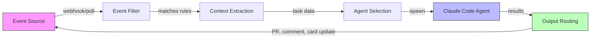
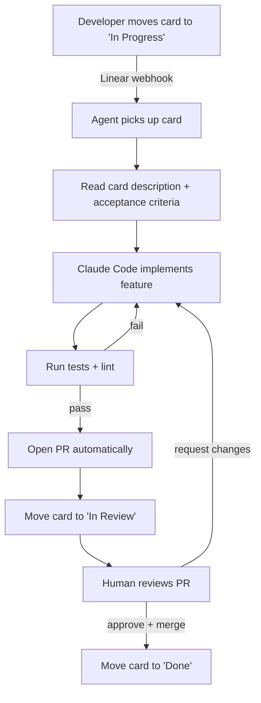

# 事件驱动智能体自动化

> **可信度**：第 3 层 — 新兴模式，早期采用者报告积极结果但工具仍在成熟中。

不要手动为每个任务调用 Claude Code，让外部事件驱动工作。卡片在 Linear 中移动到"In Progress"，Claude 自动接取。GitHub issue 被标记 `claude-fix`，智能体在几秒内开始工作。

从拉取式（"嘿 Claude，做这个"）到推送式（"事件触发智能体"）的转变。

---

## 目录

1. [核心概念](#核心概念)
2. [Linear 驱动的智能体循环](#linear-驱动的智能体循环)
3. [通用事件到智能体模式](#通用事件到智能体模式)
4. [实现示例](#实现示例)
5. [事件源兼容性](#事件源兼容性)
6. [护栏](#护栏)
7. [反模式](#反模式)
8. [工具与资源](#工具与资源)
9. [另见](#另见)

---

## 核心概念

传统 Claude Code 使用是交互式的：你打开终端，输入提示词，迭代。事件驱动自动化把人从触发步骤中移除。人仍然审查输出（PR、代码变更），但启动是通过你现有的项目管理流程。



循环是自我强化的：智能体的输出（PR、状态更新）反馈到事件源，可以触发下一步。

---

## Linear 驱动的智能体循环

最成熟的模式来自 Damian Galarza 的工作流（damiangalarza.com，2026 年 2 月）。Linear 作为需要做什么的单一真相来源，Claude Code 端到端处理实现。

### 流程



### 什么让它工作

卡片描述作为提示词。具有清晰验收标准的卡片产生好的代码。模糊的卡片产生模糊的代码，与人类开发者相同。票据质量直接决定自动化质量。

Linear 的结构化字段（描述、验收标准、标签、优先级）自然映射到 Claude Code 的需求：构建什么、如何验证、什么约束适用。

### 关键要求

- 卡片必须有清晰的验收标准（不仅仅是标题）
- 仓库需要有可靠的测试套件用于自动化验证
- 分支命名约定应该是确定性的（例如 `feat/LINEAR-123-card-title`）
- PR 模板有助于标准化智能体的输出

---

## 通用事件到智能体模式

Linear 示例是具体的，但模式泛化到任何事件源。五个组件组成管道：

### 1. 事件源

触发从哪里发起。可能是项目管理工具、CI 系统、监控警报或自定义 webhook。

### 2. 事件过滤器

不是每个事件都应该生成智能体。过滤器决定哪些事件是可操作的：

```bash
# 示例：只处理带有 "claude-auto" 标签的卡片
if [[ "$CARD_LABELS" != *"claude-auto"* ]]; then
    echo "Skipping: no claude-auto label"
    exit 0
fi
```

### 3. 上下文提取

从事件负载中拉取相关数据并格式化为 Claude Code 提示词。这是你从工具 schema 翻译到自然语言指令的地方。

### 4. 智能体选择

不同事件类型可能需要不同的智能体配置。错误报告需要的 CLAUDE.md 上下文不同于功能请求。你可能使用不同的允许工具、不同的模型或不同的安全约束。

### 5. 输出路由

结果去哪里？通常是以下组合：
- Git 分支 + PR（代码变更）
- 原始 issue/卡片的评论（状态更新）
- 卡片状态转换（移动到下一列）
- Slack 通知（人工意识）

---

## 实现示例

一个最小的 bash 循环，轮询 Linear 的"In Progress"卡片并生成 Claude Code 智能体：

```bash
#!/bin/bash
# linear-agent-loop.sh
# Polls Linear for cards in "In Progress" state and spawns Claude agents

LINEAR_API_KEY="${LINEAR_API_KEY:?Missing LINEAR_API_KEY}"
TEAM_ID="${TEAM_ID:?Missing LINEAR_TEAM_ID}"
PROCESSED_FILE="/tmp/linear-agent-processed.txt"
MAX_CONCURRENT=3

touch "$PROCESSED_FILE"

poll_linear() {
    curl -s -X POST https://api.linear.app/graphql \
        -H "Authorization: $LINEAR_API_KEY" \
        -H "Content-Type: application/json" \
        -d '{
            "query": "query { team(id: \"'"$TEAM_ID"'\") { issues(filter: { state: { name: { eq: \"In Progress\" } }, labels: { name: { eq: \"claude-auto\" } } }) { nodes { id title description } } } }"
        }' | jq -r '.data.team.issues.nodes[] | "\(.id)|\(.title)|\(.description)"'
}

spawn_agent() {
    local issue_id="$1"
    local title="$2"
    local description="$3"

    echo "[$(date)] Spawning agent for: $title ($issue_id)"

    claude --print --dangerously-skip-permissions \
        "Implement the following Linear card:
        Title: $title
        Description: $description

        Requirements:
        1. Create a feature branch named feat/$issue_id
        2. Implement the described feature
        3. Run tests and fix any failures
        4. Create a PR with the card title" \
        2>&1 | tee "/tmp/agent-$issue_id.log"

    echo "$issue_id" >> "$PROCESSED_FILE"
}

while true; do
    active_agents=$(jobs -r | wc -l)
    if [ "$active_agents" -ge "$MAX_CONCURRENT" ]; then
        echo "[$(date)] Max concurrent agents reached ($MAX_CONCURRENT), waiting..."
        sleep 30
        continue
    fi

    poll_linear | while IFS='|' read -r id title description; do
        if grep -q "$id" "$PROCESSED_FILE"; then
            continue  # Already processed
        fi
        spawn_agent "$id" "$title" "$description" &
    done

    sleep 60  # Poll interval
done
```

这是一个起点，不是生产代码。真实部署需要适当的错误处理、持久状态存储（不是文本文件）和基于 webhook 的触发而不是轮询。

---

## 事件源兼容性

| 事件源 | 触发事件 | 智能体用例 | 集成方式 |
|-------------|----------------|----------------|-------------------|
| **Linear** | 卡片状态变更、标签添加 | 功能实现、bug 修复 | GraphQL API / MCP 服务器 |
| **GitHub Issues** | Issue 创建、标签 | Bug 分类、调查、修复 PR | GitHub Actions / webhooks |
| **GitHub PR** | PR 打开、请求评审 | 代码评审、自动化修复 | GitHub Actions |
| **Jira** | 转换、Sprint 分配 | 功能工作、技术债务清理 | REST API / webhooks |
| **Slack** | 频道消息、emoji 反应 | 快速修复、调查 | Slack API / bot |
| **PagerDuty** | Incident 创建 | 诊断脚本、初始分类 | Webhooks |
| **自定义 webhook** | 任何 HTTP POST | 任何事情 | 直接 HTTP 端点 |

---

## 护栏

事件驱动的智能体设计上以更少的人工监督运行，所以护栏变得关键。

### 幂等性

智能体可能处理同一事件两次（网络重试、重复 webhook）。智能体必须在开始前检查工作是否已存在：

```bash
# 检查此卡片的分支是否已存在
if git ls-remote --heads origin "feat/$ISSUE_ID" | grep -q "feat/$ISSUE_ID"; then
    echo "Branch already exists, skipping"
    exit 0
fi
```

### 速率限制

不要让事件突发同时生成 50 个智能体。设置硬限制：

- **最大并发智能体**：大多数团队 3-5 个
- **冷却期**：智能体生成之间最少 30 秒
- **每日预算上限**：设置每天最大 token 消费

### 断路器

如果智能体在特定类型任务上持续失败，停止尝试：

```bash
FAILURE_COUNT=$(grep -c "FAILED" "/tmp/agent-failures.log" 2>/dev/null || echo 0)
if [ "$FAILURE_COUNT" -gt 5 ]; then
    echo "Circuit breaker triggered: too many failures"
    # Notify human, pause automation
    exit 1
fi
```

### 人工介入检查点

即使在完全自动化流程中，在关键点保持人工介入：

- PR 评审保持手动（智能体创建 PR，人类批准）
- 数据库迁移永远不自动应用
- 部署是单独的、人工触发的步骤
- 任何涉及 auth、计费或 PII 的卡片需要明确的人工批准

---

## 反模式

| 反模式 | 问题 | 解决方案 |
|-------------|---------|---------|
| **激进轮询** | 每 5 秒敲打 API 浪费资源，被限流 | 尽可能使用 webhook，轮询不快于每 60 秒 |
| **无断路器** | 智能体在相同任务上重复失败，无限燃烧 token | 按任务跟踪失败，3 次尝试后停止，提醒人工 |
| **无死信队列** | 失败事件消失，没人知道工作被遗漏 | 将失败事件记录到持久存储供人工审查 |
| **无界并发** | 20 张卡片同时移动，20 个智能体生成，机器熔化 | 并发硬上限（3-5 个是合理的） |
| **模糊卡片作为提示词** | "修复那个东西"产生垃圾代码 | 强制卡片质量标准，跳过没有验收标准的卡片 |
| **无状态持久化** | 脚本重启，从头重新处理一切 | 在数据库而非内存中存储已处理的事件 ID |
| **跳过 PR 评审** | 智能体直接推送到 main | 始终通过 PR 流程，人类审查输出 |

---

## 工具与资源

### MCP 服务器

- **linear-kanban-mcp**（0xikarus on GitHub）：从 Claude Code 直接暴露 Linear API 用于看板管理。能够在智能体上下文中读取卡片、更新状态和管理标签。

### 技能与平台

- **skillsllm.com**：提供一个技能，协调从 Linear 卡片开始的完整计划、验证和执行循环。处理从卡片元数据到结构化 Claude Code 提示词的转换。

### 智能体模板

- **Scrum Master Agent**（lobehub.com）：自动检测是在 Claude Desktop 还是 Claude Code 中运行，并相应地调整行为。作为上下文感知智能体设计的起点有用。

---

## 另见

- [agent-teams.md](./agent-teams.md) — 多智能体并行协调
- [iterative-refinement.md](./iterative-refinement.md) — 核心提示-观察-重新提示循环
- [plan-driven.md](./plan-driven.md) — 执行前先计划
- [../../examples/agents/](../../examples/agents/) — 可用的智能体模板